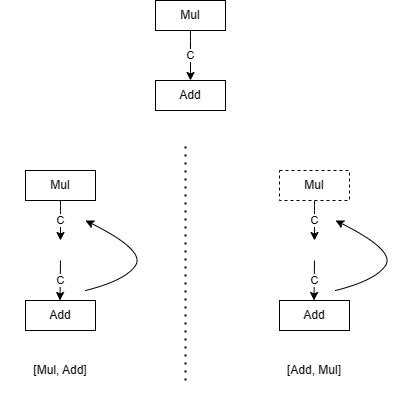
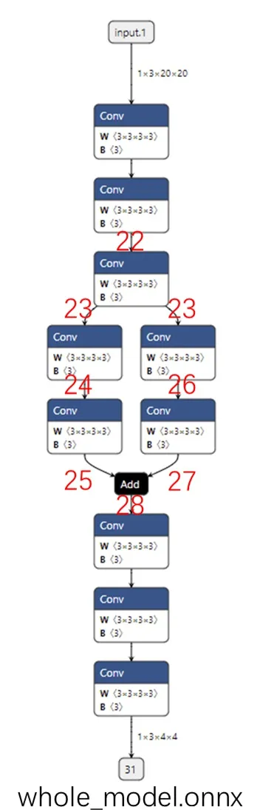
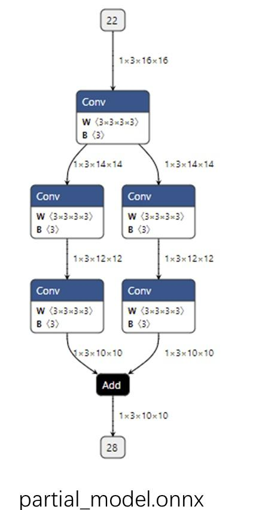
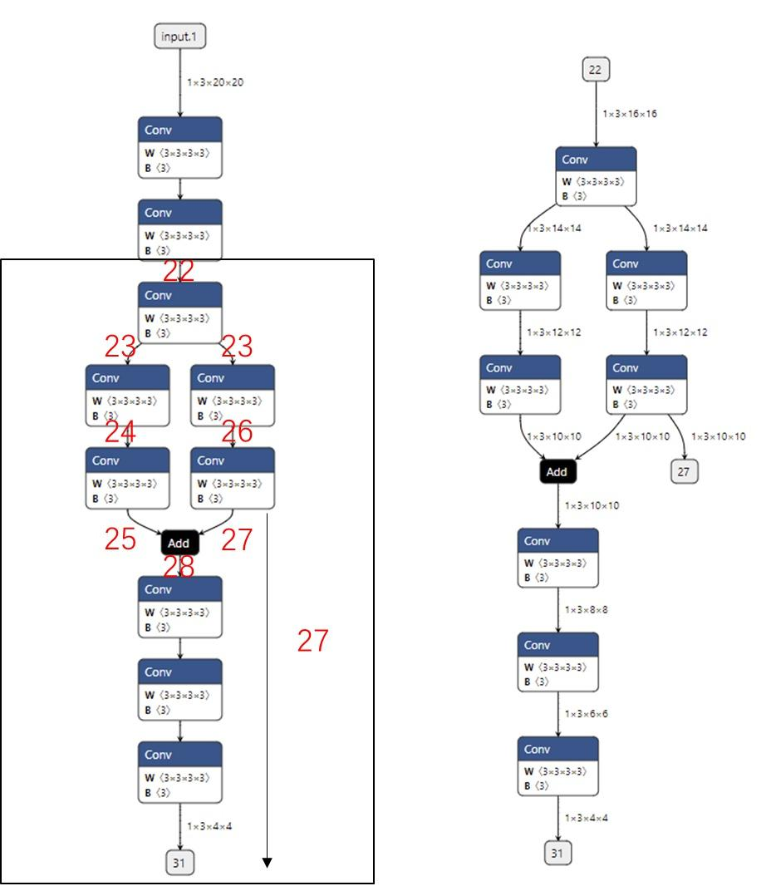
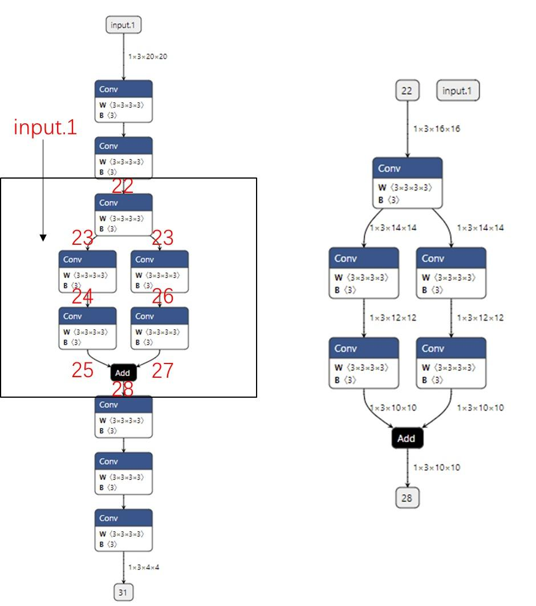
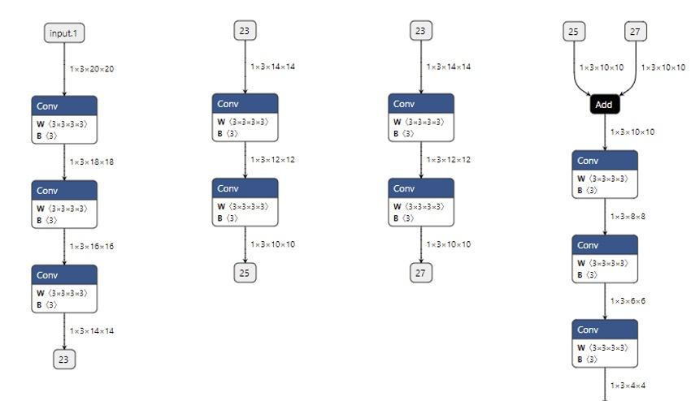

## 修改和调试 onnx 模型

### 1. onnx 底层实现原理

#### 1.1 onnx 的存储格式

ONNX 在底层是用 Protobuf 定义的。*Protobuf，全称 **Protocol Buffer**，是 Google 提出的一套表示和序列化数据的机制。使用 Protobuf 时，用户需要先写一份数据定义文件，再根据这份定义文件把数据存储进一份二进制文件。数据定义文件相当于是数据类，二进制文件相当于是数据类的实例。*

例如，有这样一个 Protobuf 数据定义文件：
```cpp
    message Person { 
    required string name = 1; 
    required int32 id = 2; 
    optional string email = 3; 
} 
```
这段定义表示在 Person 这种数据类型中，必须包含 name、id 这两个字段，选择性包含 email字段。

根据这份定义文件，用户可以选择一种编程语言，定义一个含有成员变量 name、id、email 的 Person 类，把这个类的某个实例用 Protobuf 存储成二进制文件；同时，用户也可以用二进制文件和对应的数据定义文件，读取出一个 Person 类的实例。

对于 ONNX ，Protobuf 的数据定义文件在其开源库，这些文件定义了神经网络中模型、节点、张量的数据类型规范；二进制文件就是 `.onnx`文件，每一个 onnx 文件按照数据定义规范，存储了一个神经网络的所有相关数据。

直接用 Protobuf 生成 ONNX 模型比较麻烦，ONNX 提供了很多实用 API，可以在完全不了解 Protobuf 的前提下，构造和读取 ONNX 模型。

#### 1.2 onnx 结构定义

在用 API 对 ONNX 模型进行操作之前，我们还需要先了解一下 ONNX 的结构定义规则，学习一下 ONNX 在 Protobuf 定义文件里是怎样描述一个神经网络的。
回想一下，神经网络本质上是一个计算图。计算图的节点是算子，边是参与运算的张量。而通过可视化 ONNX 模型，我们知道 ONNX 记录了所有算子节点的属性信息，并把参与运算的张量信息存储在算子节点的输入输出信息中。事实上，ONNX 模型的结构可以用类图大致表示如下：


如上图所示，一个 ONNX 模型可以用 ModelProto 类表示：
* ModelProto 包含了版本、创建者等日志信息，还包含了存储计算图结构的 graph;
* GraphProto 类则由输入张量信息、输出张量信息、节点信息组成;
* 张量信息 ValueInfoProto 类包括张量名、基本数据类型、形状;
* 节点信息 NodeProto 类包含了算子名、算子输入张量名、算子输出张量名。

假如有一个描述 output=a*x+b 的 ONNX 模型，使用 print(model) 可以输出以下内容：
```python
ir_version: 8 
graph { 
  node { 
    input: "a" 
    input: "x" 
    output: "c" 
    op_type: "Mul" 
  } 
  node { 
    input: "c" 
    input: "b" 
    output: "output" 
    op_type: "Add" 
  } 
  name: "linear_func" 
  input { 
    name: "a" 
    type { 
      tensor_type { 
        elem_type: 1 
        shape { 
          dim {dim_value: 10} 
          dim {dim_value: 10} 
        } 
      } 
    } 
  } 
  input { 
    name: "x" 
    type { 
      tensor_type { 
        elem_type: 1 
        shape { 
          dim {dim_value: 10} 
          dim {dim_value: 10} 
        } 
      } 
    } 
  } 
  input { 
    name: "b" 
    type { 
      tensor_type { 
        elem_type: 1 
        shape { 
          dim {dim_value: 10} 
          dim {dim_value: 10} 
        } 
      } 
    } 
  } 
  output { 
    name: "output" 
    type { 
      tensor_type { 
        elem_type: 1 
        shape { 
          dim { dim_value: 10} 
          dim { dim_value: 10} 
        } 
      } 
    } 
  } 
} 
opset_import {version: 15} 
```

对应上文中的类图，这里打印出来的是这个 onnx 的模型的表示。这个模型的信息由 ir_version，opset_import 等全局信息和 graph 图信息组成。graph 包含一个乘法节点、一个加法节点、三个输入张量 a, x, b 以及一个输出张量 output。


### 2 读写 onnx 模型

#### 2.1 构造 onnx 模型

根据前文的 onnx 结构图，可以了解到 onnx 模型按照这样的形式组织起来：
* ModelProto
  * GraphProto
    * NodeProto
    * ValueInfoProto

接下来尝试使用 ONNX 的 Python API 构造一个描述线性函数 output=a*x+b 的 ONNX 模型。根据上面的结构，自底向上地构造这个模型。

首先，可以使用 helper.make_tensor_value_info 构造一个描述张量信息的 ValueInfoProto 对象。如前面的类图所示，需要传入张量名、张量的基本数据类型、张量形状这三个信息。

在 ONNX 中，不管是输入张量还是输出张量，它们的表示方式都是一样的。因此，这里使用类似的方式为三个输入 a, x, b 和一个输出 output 构造 ValueInfoProto 对象：
```python
import onnx 
from onnx import helper 
from onnx import TensorProto 
 
a = helper.make_tensor_value_info('a', TensorProto.FLOAT, [10, 10]) 
x = helper.make_tensor_value_info('x', TensorProto.FLOAT, [10, 10]) 
b = helper.make_tensor_value_info('b', TensorProto.FLOAT, [10, 10]) 
output = helper.make_tensor_value_info('output', TensorProto.FLOAT, [10, 10]) 
```
之后，需要构造算子节点信息 NodeProto，这可以通过在 helper.make_node 中传入算子类型、输入算子名、输出算子名这三个信息来实现。这里，先构造了描述 c=a*x 的乘法节点，再构造了 output=c+b 的加法节点：
```python
mul = helper.make_node('Mul', ['a', 'x'], ['c']) 
add = helper.make_node('Add', ['c', 'b'], ['output']) 
```

在计算机中，图一般使用一个节点集和一个边集来表示。ONNX 巧妙地把边的信息保存在节点信息里，省去了保存边集的步骤。在 ONNX 中，如果某节点的输入名和之前某节点的输出名相同，就默认这两个节点是相连的。在上面的例子中，Mul 节点定义了输出 c，Add 节点定义了输入 c，则 Mul 节点和 Add 节点是相连的。

正是因为有这种边的隐式定义规则，所以 ONNX 对节点的输入有一定的要求：一个节点的输入，要么是整个模型的输入，要么是之前某个节点的输出。如果把 a, x, b 中的某个输入节点从计算图中拿出，或者把 Mul 的输出从 c 改成 d，则最终的 ONNX 模型都是不满足标准的。

一个不满足标准的 ONNX 模型可能无法被推理引擎正确识别。ONNX 提供了 API onnx.checker.check_model 来判断一个 ONNX 模型是否满足标准。*需要注意的是，由于 protobuf 的限制，模型总尺寸超过 2GB 的模型在调用该接口的时候，会有 protobuf 超过最大限制的报错。* 这个限制会在以后的讨论中继续讨论，这里便不再展开说明。

接下来，使用 helper.make_graph 来构造计算图 GraphProto。helper.make_graph 函数需要传入节点、图名称、输入张量信息、输出张量信息这 4 个参数。把之前构造出来的 NodeProto 对象和 ValueInfoProto 对象按照顺序传入即可：
```python
graph = helper.make_graph([mul, add], 'linear_func', [a, x, b], [output]) 
```
这里 make_graph 的节点参数有一个要求：**计算图的节点必须以拓扑序给出**。

> 拓扑序是与有向图的相关的数学概念。如果按拓扑序遍历所有节点的话，能保证每个节点的输入都能在之前节点的输出里找到（对于 ONNX模型，我们把计算图的输入张量也看成*之前的输出*）。

以刚刚构造出来的这个计算图为研究对象，通过下图展示的两个例子来直观理解拓扑序。


这里只关注 `Mul` 和 `Add` 节点以及它们之间的边 c。在左边的情况下，如果节点以`[Mul, Add]` 顺序给出，那么遍历到 Add 时，它的输入 c 可以在之前的Mul的输出中找到；但是在右边的情况下，如果节点以`[Add, Mul]` 顺序给出，那么 Add 就找不到输入边，计算图也无法成功构造出来了。这里的 `[Mul, Add]` 就是符合有向图的拓扑序的，而 `[Add, Mul]` 则不满足。

最后，使用 `helper.make_model`把计算图 GraphProto 封装进模型 ModelProto 里，一个 ONNX 模型就构造完成了。make_model 函数中还可以添加模型制作者、版本等信息。
```python
model = helper.make_model(graph) 
```

构造完模型之后，可以使用下面的代码检查模型的正确性，把模型以文本的形式输出，存储到一个 `.onnx`文件中。
> `onnx.save`可以用来存储 onnx 模型，但是`onnx.save`在存储模型的时候不会检查模型是否符合标准，需要先使用 `onnx.checker.check_model` 来检查模型是否满足 ONNX 标准。

```python
onnx.checker.check_model(model) 
print(model) 
onnx.save(model, 'linear_func.onnx') 
```

接下来，可以使用 onnx runtime 运行模型，来检查模型是否符合预期：
```python
import onnxruntime 
import numpy as np 
 
sess = onnxruntime.InferenceSession('linear_func.onnx') 
a = np.random.rand(10, 10).astype(np.float32) 
b = np.random.rand(10, 10).astype(np.float32) 
x = np.random.rand(10, 10).astype(np.float32) 
 
output = sess.run(['output'], {'a': a, 'b': b, 'x': x})[0] 
 
assert np.allclose(output, a * x + b) 
```
如果运行成功，代码不会有任何输出，这表明这里通过 onnx api 构造的模型等价于执行 `a*x+b`这个计算。


#### 2.2 读取并修改 onnx 模型

可以用下面的方法读取一个 ONNX 模型：
```python
import onnx 
model = onnx.load('linear_func.onnx') 
print(model) 
```
onnx.load 读取 ONNX 模型时，得到一个 ModelProto 的对象。

使用下面的方法可以把图 GraphProto、节点 NodeProto、张量信息 ValueInfoProto 读取出来：
```python
graph = model.graph 
node = graph.node 
input = graph.input 
output = graph.output 
print(node) 
print(input) 
print(output) 
```
这样，就可以分别访问模型的图、节点、张量信息。

`print(node)` 的输出:
```python
[input: "a" 
input: "x" 
output: "c" 
op_type: "Mul" 
, input: "c" 
input: "b" 
output: "output" 
op_type: "Add" 
] 
```
这段输出中，node 实际上是一个列表，列表中的对象有属性 input, output, op_type（这里 input 也是一个列表，它包含的两个元素都显示出来了）。可以用下面的代码来获取 node 里第一个节点 Mul 的属性：
```python
node_0 = node[0] 
node_0_inputs = node_0.input 
node_0_outputs = node_0.output 
input_0 = node_0_inputs[0] 
input_1 = node_0_inputs[1] 
output = node_0_outputs[0] 
op_type = node_0.op_type 
 
print(input_0) 
print(input_1) 
print(output) 
print(op_type) 
 
# Output 
""" 
a 
x 
c 
Mul 
""" 
```

想要修改 onnx 模型，可以使用模型构造方法，新建节点和张量信息，与原有模型组合成一个新的模型；也可以在不违反 ONNX 规范的前提下直接修改某个数据对象的属性。
直接修改 onnx 模型：
```python
import onnx 
model = onnx.load('linear_func.onnx') 
 
node = model.graph.node 
node[1].op_type = 'Sub' 
 
onnx.checker.check_model(model) 
onnx.save(model, 'linear_func_2.onnx') 
```
在读入之前的 `linear_func.onnx` 模型后，可以直接修改第二个节点的类型 `node[1].op_type`，把加法变成减法。这样，模型描述的是 `a * x - b` 这个线性函数。

### 3 调试 onnx 模型

在实际部署中，如果用深度学习框架导出的 ONNX 模型出了问题，一般要通过修改框架的代码来解决，而不会从 ONNX 入手。但是，也可以尝试对 ONNX 模型本身进行调试。

#### 3.1 子模型提取

ONNX 官方为开发者提供了子模型提取（extract）的功能。子模型提取指的是从一个给定的 ONNX 模型中，拿出一个子模型。这个子模型的节点集、边集都是原模型中对应集合的子集。
```python
import torch 
 
class Model(torch.nn.Module): 
 
    def __init__(self): 
        super().__init__() 
        self.convs1 = torch.nn.Sequential(torch.nn.Conv2d(3, 3, 3), 
                                          torch.nn.Conv2d(3, 3, 3), 
                                          torch.nn.Conv2d(3, 3, 3)) 
        self.convs2 = torch.nn.Sequential(torch.nn.Conv2d(3, 3, 3), 
                                          torch.nn.Conv2d(3, 3, 3)) 
        self.convs3 = torch.nn.Sequential(torch.nn.Conv2d(3, 3, 3), 
                                          torch.nn.Conv2d(3, 3, 3)) 
        self.convs4 = torch.nn.Sequential(torch.nn.Conv2d(3, 3, 3), 
                                          torch.nn.Conv2d(3, 3, 3), 
                                          torch.nn.Conv2d(3, 3, 3)) 
    def forward(self, x): 
        x = self.convs1(x) 
        x1 = self.convs2(x) 
        x2 = self.convs3(x) 
        x = x1 + x2 
        x = self.convs4(x) 
        return x 
 
model = Model() 
input = torch.randn(1, 3, 20, 20) 
 
torch.onnx.export(model, input, 'whole_model.onnx') 
```


> ONNX 的边用同名张量表示，这里的边序号，实际上是前一个节点的输出张量序号和后一个节点的输入张量序号。这里的张量序号都是 PyTorch 自动生成的。

接着可以使用下面的代码提取出一个子模型：
```python
import onnx  
 
onnx.utils.extract_model('whole_model.onnx', 'partial_model.onnx', ['22'], ['28']) 
```



这段代码的作用是把原计算图从边 22 到边 28 的子图提取出来，并组成一个子模型。onnx.utils.extract_model 就是完成子模型提取的函数，它的参数分别是原模型路径、输出模型路径、子模型的输入边（输入张量）、子模型的输出边（输出张量）。直观地来看，子模型提取就是把输入边到输出边之间的全部节点都取出来。


#### 3.2 添加额外输出

在提取时新设定一个输出张量：
```python
onnx.utils.extract_model('whole_model.onnx', 'submodel_1.onnx', ['22'], ['27', '31']) 
```




#### 3.3 添加额外输入

提取边 22 到边 28 之间的子模型，但是多添加了一个输入 input.1，那么提取出的子模型会有一个冗余的输入 input.1，如下面的代码所示：
```python
onnx.utils.extract_model('whole_model.onnx', 'submodel_2.onnx', ['22', 'input.1'], ['28']) 
```
从下图可以看到：无论给这个输入传入什么值，都不会影响子模型的输出。




#### 3.4 输入信息不足

尝试提取的子模型输入是边 24，输出是边 28。如下面的代码和图所示：
```python
# Error 
onnx.utils.extract_model('whole_model.onnx', 'submodel_3.onnx', ['24'], ['28']) 
```
想通过边 24 计算边 28 的结果，至少还需要输入边 26，或者更上面的边。仅凭借边 24 是无法计算出边 28 的结果的，因此这样提取子模型会报错。

子模型提取的实现原理：新建一个模型，把给定的输入和输出填入。之后把图的所有有向边反向，从输出边开始遍历节点，碰到输入边则停止，把这样遍历得到的节点做为子模型的节点。


### 4 输出中间节点的值

在使用 ONNX 模型时，最常见的一个需求是能够用推理引擎输出中间节点的值。这多见于深度学习框架模型和 ONNX 模型的精度对齐中，因为只要能够输出中间节点的值，就能定位到精度出现偏差的算子。

在原本模型中提取子模型，添加了一条原来模型中不存在的输出边。用同样的原理，可以在保持原有输入输出不变的同时，新增加一些输出，提取出一个能输出中间节点的”子模型“。例如：
```python
 onnx.utils.extract_model('whole_model.onnx', 'more_output_model.onnx', ['input.1'], ['31', '23', '25', '27'])
```


这样，用 ONNX Runtime 运行 more_output_model.onnx 这个模型时，就能得到更多的输出了。
为了方便调试，还可以把原模型拆分成多个互不相交的子模型。这样，在每次调试时，可以只对原模型的部分子模块调试。比如：
```python
onnx.utils.extract_model('whole_model.onnx', 'debug_model_1.onnx', ['input.1'], ['23']) 
onnx.utils.extract_model('whole_model.onnx', 'debug_model_2.onnx', ['23'], ['25']) 
onnx.utils.extract_model('whole_model.onnx', 'debug_model_3.onnx', ['23'], ['27']) 
onnx.utils.extract_model('whole_model.onnx', 'debug_model_4.onnx', ['25', '27'], ['31']) 
```


> 一旦 PyTorch 模型改变，ONNX 模型的边序号也会改变。
> 即使能保证 ONNX 的边序号不发生改变，也难以把 PyTorch 代码和 ONNX 节点对应起来——当模型结构变得十分复杂时，要识别 ONNX 中每个节点的含义是不可能的。

