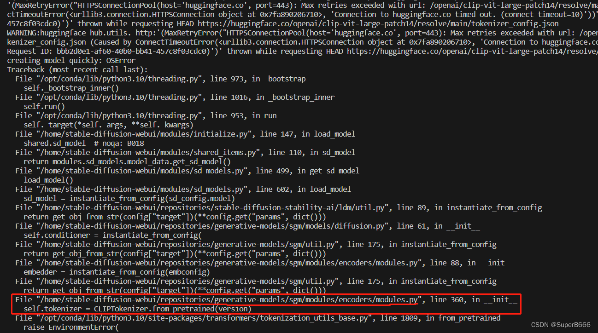
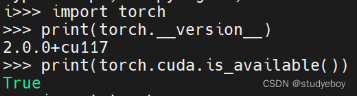
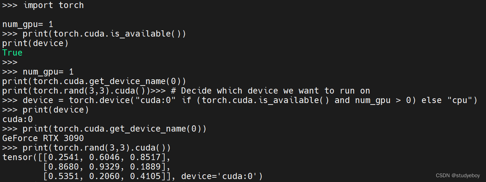
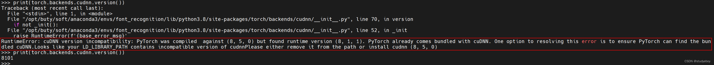

## 在 Linux 安装 stable diffusion

由于工作站安装的是 ubuntu，卡也在上面，就只能在 ubuntu 上部署安装 stable diffusion 了。另外，Linux 上使用 stable diffusion 也会方便很多。

### 1 准备工作

* NVIDIA 官网下载驱动，主要是为了规避多卡驱动不同的问题。由于本机是两张一样的卡，就可以省去这一步。如果存在不同型号的多卡驱动不兼容的问题，就需要去官网下载。
* 安装 python 3.10
* 安装 CUDA11.8（pytorch2.x，xformers），对 stable diffusion 兼容比较好
    * 支持 pytorch2.x
    * 支持 xformers，可以加速图片生成

### 2 deploy stable diffusion 
* github stable diffusion webUI
    ```bash
        git clone https://github.com/AUTOMATIC1111/stable-diffusion-webui.git
    ```
* 配置 venv python 虚拟环境，因为不同模型的 python 版本要求不同
    ```bash
        # 创建虚拟环境
        python3 -m venv venv

        # 进入虚拟环境
        source venv/bin/activate
        # 退出虚拟环境
        deactivate

    ```
    也可以使用 conda 来进行虚拟环境的创建和管理。

* Stable diffusion WebUI 启动，自动安装依赖
    ```bash
        # 启动，会自动下载依赖
        ./webui.sh --xformers
    ```

### 3 报错解决
'''
这里可能会出现一些报错
1) Cannot locate TCMalloc（improves CPU memory usage），这个报错是因为缺少 libgoogle-perftools4 和 libtcmalloc-minimal4，直接安装即可
sudo apt install libgoogle-perftools4 libtcmalloc-minimal4 -y

2) This scripts must not be launched as root, aborting...

解决方法：
bash webui.sh -f
'''

3)  OSError: Can't load tokenizer for 'openai/clip-vit-large-patch14'. If you were trying to load it from 'https://huggingface.co/models', make sure you don't have a local directory with the same name. Otherwise, make sure 'openai/clip-vit-large-patch14' is the correct path to a directory containing all relevant files for a CLIPTokenizer tokenizer.

解决方法：
运行时它需要访问huggingface.co去下载一些模型需要的文件，而大陆用户连接不上huggingface.co，导致部署失败。
下载文件并进行配置, 让 stable diffusion 访问本地数据, 放置到你所需要的目录, 开始进行配置，这些文件（clip）是模型中encoder所需要的，我们可以从报错信息中去发现是哪里调用了这个openai/clip-vit-large-patch14，去修改这个路径配置即可。



这里的配置会导致我们运行时会去huggingface.co(外网)找这个文件，只需要将这个改成我们之前下载所放置的路径即可, 一共四处


4) RuntimeError: GET was unable to find an engine to execute this computation
   
解决方法：
因为torch torchvision cuda以及python版本都是有兼容关系的, 这三者安装兼容版本就可以了.

检测torch和cuda是否能用:
```python
import torch
print(torch.__version__)
print(torch.cuda.is_available())

```


测试:
```python
import torch

print(torch.cuda.is_available())
num_gpu =1 
# Decide which device to run on
device = torch.device("cuda:0" if (torch.cuda.is_available() and num_gpu > 0) else "cpu")
print(device)
print(torch.cuda.get_device_name(0))
print(torch.rand(3,3).cuda())

```


检查cudnn是否可用:
```python
print(torch.backends.cudnn.version())

```



