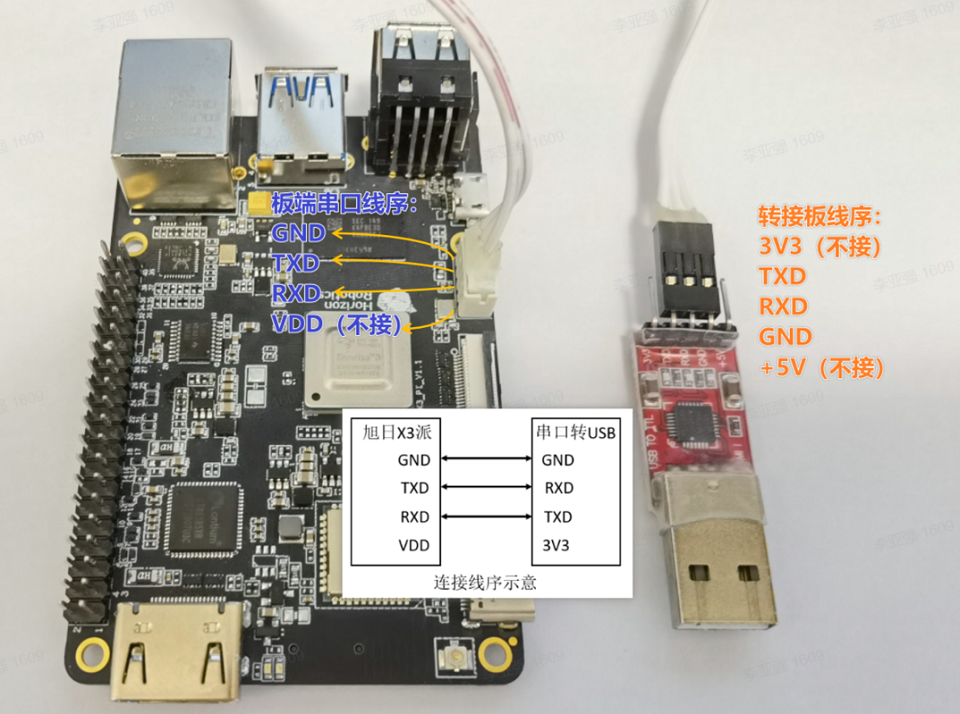
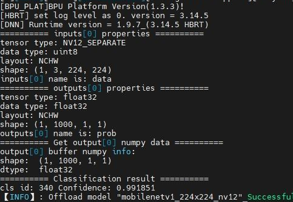

## 地平线旭日 X3 开发板上手体验

最近嫖到一块旭日X3开发板，借此熟悉地平线 AI 芯片旭日 X3 模型部署流程，以及算法工具链。这里基本是跟着[官方的用户手册](https://developer.horizon.ai/api/v1/fileData/documents_pi/index.html)进行操作，其中也遇到一些奇怪的问题。

### 1 烧写系统

#### 1.1 系统选择
旭日X3派开发板支持Ubuntu 20.04 Desktop、Server两个系统版本。初上手，为方便使用和调试，选择了地平线开发者官网[资源中心](https://developer.horizon.ai/resource)提供的Ubuntu20.04桌面版。

下载并解压Ubuntu20.04，并用[官网资源中心](https://developer.horizon.ai/resource)提供的`balenaEtcher`工具烧录到容量大于8GB的SD卡。烧录软件已规划烧录步骤，按照提示操作即可。

#### 1.2 系统烧录
在烧录Ubuntu系统镜像前，需要做如下准备：
* 准备至少8GB容量的Micro SD卡
* SD 读卡器
* 下载Ubuntu镜像压缩包，并解压出Ubuntu系统镜像文件：system_sdcard.img
* 下载镜像烧录工具balenaEtcher，
* 板卡有两个灯，分别是红色和绿色。

系统烧录流程：
* 打开balenaEtcher工具，点击Flash frome file按钮，选择解压出来的system_sdcard.img文件作为烧录镜像
* 点击Select target按钮，选择对应的Micro SD存储卡作为目标存储设备
* 点击Flash按钮开始烧录，待工具提示Flash Complete时，表示镜像烧录完成，关闭balenaEtcher工具并取出存储卡

#### 1.3 板卡上电
使用支持 5V 3A 的 USB Type C 接口电源适配器为开发板供电。

保持旭日X3派开发板断电，然后将制作好的存储卡插入开发板的Micro SD卡槽，并通过HDMI线缆连接开发板与显示器，最后给开发板上电。可通过指示灯判断开发板状态：
* 红色指示灯：点亮代表硬件上电正常
* 绿色指示灯：点亮代表系统启动中，熄灭代表系统启动完成

系统首次启动时会进行默认环境配置，整个过程持续45秒左右，配置结束后会在显示器输出Ubuntu系统桌面(Ubuntu Server显示logo图标)。
在这里我遇到了开发板上电后长时间没有显示输出的现象。我是用的是一块 4K 显示器。使用串口连接电脑后，查看串口日志，发现已经成功进入系统，但是显示器依旧没有画面输出。串口连接时的电脑串口工具的参数配置如下：
* 波特率（Baud rate）：921600
* 数据位（Data bits）：8
* 奇偶校验（Parity）：None
* 停止位（Stop bits）：1
* 流控（Flow Control）：无
串口连接示意图：


后面经过查看用户手册的 HDMI 显示器规格列表：
* 1920x1080
* 1280x720
* 1024x600
* 800x480

手头只有 4K 显示器，既然手头的显示器都不支持，只能先考虑远程桌面连接了。
##### 1.3.1 板卡连网
可以使用有线连接，也可以使用无线网连接。

##### 有线网络连接
开发板有线网络默认采用静态IP配置，初始IP地址为192.168.1.10。可以进行静态、DHCP模式的切换。

###### 修改静态IP配置
```bash
sudo vim /etc/network/interfaces
```
```bash
# interfaces(5) file used by ifup(8) and ifdown(8)
# Include files from /etc/network/interfaces.d:
source-directory /etc/network/interfaces.d
auto eth0
iface eth0 inet static
    address 192.168.1.10
    netmask 255.255.255.0
    gateway 192.168.1.1 
    metric 700
```
修改完成后，命令行输入sudo restart_network命令让配置生效。

###### 修改DHCP配置
DHCP(Dynamic Host Configuration Protocol，动态主机配置协议)通常被应用在局域网络环境中，主要作用是集中的管理、分配IP地址，使网络环境中的主机动态的获得IP地址、Gateway地址、DNS服务器地址等信息，并能够提升地址的使用率。
开发板的DHCP网络配置保存在/etc/network/interfaces文件，通过修改eth0相关配置，可完成对DHCP模式的修改：
```bash
sudo vim /etc/network/interfaces
```
```bash
source-directory /etc/network/interfaces.d
auto lo
iface lo inet loopback
auto eth0
iface eth0 inet dhcp
    metric 700
```
修改完成后，命令行输入sudo restart_network命令让配置生效。

###### 修改MAC地址配置
如需修改开发板默认MAC地址，可通过在/etc/network/interfaces文件中增加pre-up配置信息，指定用户需要的MAC地址：
```bash
sudo vim /etc/network/interfaces
```
```bash
# interfaces(5) file used by ifup(8) and ifdown(8)
# Include files from /etc/network/interfaces.d:
source-directory /etc/network/interfaces.d
auto eth0
iface eth0 inet static
    address 192.168.1.10
    netmask 255.255.255.0
    gateway 192.168.1.1 
    pre-up ifconfig eth0 hw ether 00:11:22:9f:51:27
```
修改完成后，命令行输入sudo restart_network命令让配置生效。

##### 无线网络连接

开发板集成了2.4GHz无线WiFi模块，支持Soft AP和Station两种模式，默认运行在Station模式下。
串口命令行连接无线网：
* 使用`sudo nmcli device wifi rescan`命令扫描热点
* 使用`sudo nmcli device wifi list`命令列出扫描到的热点
* 使用 `sudo wifi_connect "SSID" "PASSWD"`命令连接热点


##### 1.3.2 VNC 远程桌面连接

在板子连好网络之后先通过串口连接，`ifconfig`命令获取到设备 IP。实际上，获取到 IP 之后，直接 ssh 连接也是很方便的，毕竟这个板子桌面环境不是很丝滑。

VNC 远程桌面连接
* 输入设备ip地址
* 输入IP地址后回车，弹出链接未加密的提示，点击 Continue
* 输入密码 sunrise，勾选 Remember password, 点击 OK连接

至此，通过 VNC 远程桌面连接的方式可以进入桌面了。


### 2 环境配置

开发板用户名和密码都是sunrise，当然也可以登录 root 用户，用户名和密码都是 root。

#### 2.1 系统更新

登陆系统后，先对系统执行更新操作
```bash
sudo apt update
sudo apt full-upgrade
```

更新完成后重启设备`sudo reboot`

#### 2.2 超频
开发板采用CPU Freq驱动对CPU工作状态进行管理，默认模式为ondemand模式，此时CPU工作频率会根据负载进行动态调节，以节省功耗。可修改到performance模式，使CPU始终运行在最高频率下：
```bash
sudo bash -c 'echo performance > /sys/devices/system/cpu/cpufreq/policy0/scaling_governor'
```

将CPU最高频率从1.2GHz提升到1.5GHz:
```bash
sudo bash -c 'echo 1 > /sys/devices/system/cpu/cpufreq/boost'
```

使用以上命令配置的 CPU 频率仅在当前运行中生效，如果设备重启则恢复默认配置。

CPU超频会增加芯片的功耗和发热，如出现稳定性问题，可以关闭超频功能：
```bash
sudo bash -c 'echo 0 > /sys/devices/system/cpu/cpufreq/boost'
```

查看芯片工作频率、温度等状态：
```bash
sudo hrut_somstatus
```

#### 2.3 配置自启动任务

##### 2.3.1 设置自启动Service
* 创建启动脚本
  使用任何文本编辑器，在/etc/init.d目录下创建一个新的启动脚本 `your_script_name`
  ```bash
  #!/bin/bash

  ### BEGIN INIT INFO
  # Provides:          your_service_name
  # Required-Start:    $all
  # Required-Stop:     
  # Default-Start:     2 3 4 5
  # Default-Stop:      0 1 6
  # Short-Description: Start your_service_name at boot time
  # Description:       Enable service provided by your_service_name
  ### END INIT INFO

  /path/to/your/program &

  exit 0
  ```
  
* 设置启动脚本具有可执行权限
  ```bash
  sudo chmod +x /etc/init.d/your_script_name
  ```

* 使用update-rc.d命令将脚本添加到系统的启动项中
  ```bash
  sudo update-rc.d your_script_name defaults
  ```

* 使用systemctl命令启用自启动
  ```bash
  sudo systemctl enable your_script_name
  ```

* 重启开发板验证自启动服务程序是否运行正常
  ```bash
  root@ubuntu:~# systemctl status your_script_name.service 
  ● your_script_name.service - LSB: Start your_service_name at boot time
      Loaded: loaded (/etc/init.d/your_script_name; generated)
      Active: active (exited) since Wed 2023-04-19 15:01:12 CST; 57s ago
      Docs: man:systemd-sysv-generator(8)
      Process: 2768 ExecStart=/etc/init.d/your_script_name start (code=exited, status=0/SUCCESS)
  ```

### 3 运行默认图片分类样例
```bash
cd /app/ai_inference/01_basic_sample/
sudo ./test_mobilenetv1.py
```



#### 3.1 图片分类样例 test_mobilenetv1.py 分析

这个样例是python接口编写，地平线同时也提供C++接口。
这个样例结构简单通过OpenCV图片解码和预处理，利用地平线提供的Python库hobot_dnn完成模型执行。
整个模型部署可以模型加载、分为预处理、模型推理、后处理。

模型加载：地平线的推理架构中编译后的AI模型以.bin结尾。
```python
from hobot_dnn import pyeasy_dnn as dnn
models = dnn.load('../models/mobilenetv1_224x224_nv12.bin')
```

预处理：OpenCV完成
```python
img_file = cv2.imread('./zebra_cls.jpg')
h, w = get_hw(models[0].inputs[0].properties)
des_dim = (w, h)
resized_data = cv2.resize(img_file, des_dim, interpolation=cv2.INTER_AREA)
nv12_data = bgr2nv12_opencv(resized_data)
```

模型推理：
```python
outputs = models[0].forward(nv12_data)
```

后处理：
```python
print("=" * 10, "Classification result", "=" * 10)
assert np.argmax(outputs[0].buffer) == 340
print("cls id: %d Confidence: %f" % (np.argmax(outputs[0].buffer), outputs[0].buffer[0][np.argmax(outputs[0].buffer)]))
```

*本次只是把板子跑起来了，后续继续尝试地平线旭日3开发板关于C++推理接口、对摄像头视频推理、视频流编解码、模型转换/模型量化/模型部署调试工具链、大模型部署。*
