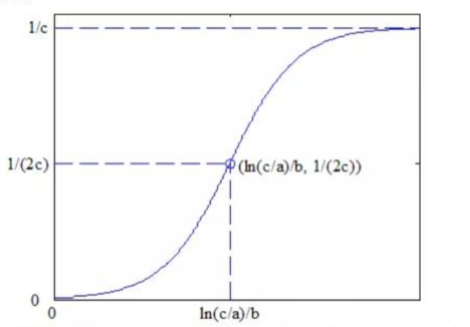

## Logistics 模型

### 1 算法介绍

logistics 方程由比利时数学家Pierre François Verhulst提出，是一个对S型曲线进行数学描述的模型。这个方程应用于一些特殊的领域建模与预测，例如单位面积内某种生物的数量、人口数量等社会经济指标、某种商品（例如手机）的普及率等。

### 2 原理

logistics 方程定义：
$$
x_t = \frac{1}{c+ae^{bt}} \tag{1}
$$

其中，t 表示时间变量，a，b，c 为模型的参数；当趋势比较完整时，$a>0, b<0, c>0$。其曲线如下图：

根据方程和图像可知：

当 $t \to -\infty，x(t) \to 1/c $。为研究 Logistics 曲线好的增长特性，对 Logistics 方程求一阶导数：
$$
\frac{dx}{dt}=\frac{-abe^{bt}}{{(c+a e^{bt})}^2} > 0
$$

#### 2.1 Yule 算法

根据方程 (1)，微分写成差分式：
$
\frac{x_{t+1}-x_t}{x_{t+1}}
$
$
= 1 - \frac{x_t}{x_{t+1}}
$
$
= 1 - \frac{c+ae^{b(t+1)}}{c+ae^{bt}}
$
$
= \frac{(ae^{bt}+c-c)(1-e^b)}{c+ae^{bt}}
$
$
= (1-e^b)-c(1-e^b)x_t
$

设 $z_t=\frac{x_{t+1}-x_t}{x_{t+1}}, \gamma=1-e^b, \beta=-c(1-e^b)$，那么上面的方程可以写成线性方程：
$$
z_t=\gamma+\beta x_t
$$
利用最小二乘法(OLS)可以得到这个方程参数的估计值，进而 b 和 c 的估计值也可以进一步得到。

为了得到 a 的估计值，Logistics 方程两边同时取对数：
$$
ln(\frac{1}{x_t}-\hat{c})=ln \hat{a}+\hat{b}t \tag{2}
$$
左右分别对 t 求和：
$$
\sum_{t=1}^{n} ln(\frac{1}{x_t}-\hat{c})=nln\hat{a}-\frac{n(n+1)}{2}\hat{b} \tag{3}
$$
可以很容易得到 a 的估计值:
$$
\hat{a}=exp \left( \frac{1}{n} \left( \sum_{t=1}^n ln(\frac{1}{x_t}-\hat{c}-\frac{n(n+1)}{2}\hat{b}) \right) \right) \tag{4}
$$

#### 2.2 Rhodes 算法

根据 Logistics 方程可以得到：
$
\frac{1}{x_{t+1}} 
$
$
= c + ae^{b(t+1)}
$
$
=c-ce^b+ce^b+ae^{b(t+1)}
$
$
=c(1-e^b)+\frac{e^b}{x_t}
$

设 $z_t=\frac{1}{x_{t+1}}、s_t=\frac{1}{x_t}、\gamma =c(1-e^b)、\beta =e^b$，那么该方程可以写成线性方程：
$$
z_t=\gamma + \beta s_t
$$

利用最小二乘法(OLS)可以得到这个方程参数的估计值，进而 b 和 c 的估计值也可以进一步得到。利用方程 (2)-(4) 可以得到 a 的估计值。

#### 2.3 Nair 算法

Yule 算法的差分式结果可以进一步写成：
$\frac{x_{t+1}-x_t}{x_{t+1}}=(1-e^b)(1-cx_t)$
$\frac{1}{1-e^b}=\frac{x_{t+1}(1-cx_t)}{x_{t+1}-x_t}$
$\frac{1+e^b}{1-e^b}=\frac{2}{1-e^b}-1$
$=\frac{\frac{1}{x_t}+\frac{1}{x_{t+1}}-2c}{\frac{1}{x_t}-\frac{1}{x_{t+1}}}$

进一步整理得到;
$$\frac{1}{x_t}-\frac{1}{x_{t+1}} = \frac{1-e^b}{1+e^b}(\frac{1}{x_t}+\frac{1}{x_{t+1}})-\frac{2c(1-e^b)}{1+e^b} \tag{5} $$

设 $z_t=\frac{1}{x_t}-\frac{1}{x_{t+1}}、s_t=\frac{1}{x_t}+\frac{1}{x_{t+1}}、\gamma =\frac{2c(1-e^b)}{1+e^b}、\beta = \frac{1-e^b}{1+e^b}$，那么方程 (5) 可以写成线性方程：
$$
z_t = \gamma + \beta s_t
$$
利用最小二乘法(OLS)可以得到这个方程的参数估计值，进而 b 和 c 的估计值也可以得到，利用方程 (2)-(4) 可以得到 a 的估计值。

### 3 Logistics 模型与 Logistics 回归理解与使用

Logistic回归又称logistic回归分析，是一种广义的线性回归分析模型，常用于数据挖掘，疾病自动诊断，经济预测等领域。Logistic回归的因变量可以是二分类的，也可以是多分类的。

#### 3.1 Logistic回归跟多元线性回归差不多，但是有区别
*  线性回归：y是一个定量的变量，这时y对于不同的自变量来说有相应的值。
*  Logistic回归：y是一个定性的变量，比如y只能等于0或1。
  
#### 3.2 模型的基本形式

$$
P(Y=1 | x_1, x_2, ..., x_n)=\frac{exp(\beta _0+\beta _1x_1 + ... + \beta _n x_n)}{1+exp(\beta _0+\beta _1x_1 + ... + \beta _n x_n)}
$$

在实际应用该模型的时候，常常不是不是直接对P进行回归，而是先 定义单调连续概率函数 $\pi$：
$$
\pi=P(Y=1 | x_1, x_2, ..., x_n), 0 < \pi < 1
$$

于是Logistic模型就可以变形为：
$$
ln\frac{\pi}{1- \pi}=\beta _0+\beta _1x_1 + ... + \beta _n x_n, 0 < \pi < 1
$$

即：
$$
ln\frac{\pi}{1- \pi}=\beta _0+\beta _1x_1 + ... + \beta _n x_n, 0 < \pi < 1 \tag{1}
$$

$$
\pi=\frac{exp(\beta _0+\beta _1x_1 + ... + \beta _n x_n)}{1+exp(\beta _0+\beta _1x_1 + ... + \beta _n x_n)} \tag{2}
$$

$$
P=\begin{cases}
    0 & \pi \le A \\
    1 & \pi \ge 1 - A
\end{cases}
\tag{3}
$$

> 通过多元线性回归解出 $\beta _0, \beta _1, ..., \beta _n$，带入求得 $\pi$，根据 $\pi$ 的值判断 P 的取值。
