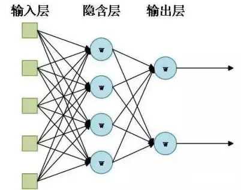

## LSTM 长短期记忆递归神经网络

### 1、神经网络简介

#### 1.1 神经网络起源

人工神经网络（Aritificial Neural Networks, ANN）是一种仿生的网络结构，起源于对人类大脑的研究。人工神经网络（Aritificial Neural Networks）也常被简称为神经网络（Neural Networks, NN），基本思想是通过大量简单的神经元之间的相互连接来构造复杂的网络结构，信号（数据）可以在这些神经元之间传递，通过激活不同的神经元和对传递的信号进行加权来使得信号被放大或衰减，经过多次的传递来改变信号的强度和表现形式。

#### 1.2 传统神经网络原理

传统神经网络结构示意图：

其中：
* 输入层：可以包含多个神经元，可以接收多维的信号输入（特征信息）；
* 输出层：可以包含多个神经元，可以输出多维信号；
* 隐含层：可以包含多个神经网络层，每一层包含多个神经元。

每层的神经元与上一层神经元和下一层神经元连接（类似生物神经元的突触），这些连接通路用于信号传递。每个神经元接收来自上一层的信号输入，使用一定的加和规则将所有的信号输入汇聚到一起，并使用激活函数将输入信号激活为输出信号，再将信号传递到下一层。

影响神经网络表现能力的主要因素有神经网络的层数、神经元的个数、神经元之间的连接方式以及神经元所采用的激活函数。神经元之间以不同的连接方式（全连接、部分连接）组合，可以构成不同神经网络，对于不同的信号处理效果也不一样。

神经网络优点很明显，给我们提供了构建模型的便利，你大可不用顾及模型本身是如何作用的，只需要按照规则构建网络，然后使用训练数据集不断调整参数，在许多问题上都能得到一个比较“能接受”的结果，然而我们对其中发生了什么是未可知的。在深度学习领域，许多问题都可以通过构建深层的神经网络模型来解决。

#### 1.3 传统神经网络结构的缺陷

从传统的神经网络结构我们可以看出，信号流从输入层到输出层依次流过，同一层级的神经元之间，信号是不会相互传递的。这样就会导致一个问题，输出信号只与输入信号有关，而与输入信号的先后顺序无关。并且神经元本身也不具有存储信息的能力，整个网络也就没有“记忆”能力，当输入信号是一个跟时间相关的信号时，如果我们想要通过这段信号的“上下文”信息来理解一段时间序列的意思，传统的神经网络结构就显得无力了。与我们人类的理解过程类似，我们听到一句话时往往需要通过这句话中词语出现的顺序以及我们之前所学的关于这些词语的意思来理解整段话的意思，而不是简单的通过其中的几个词语来理解。

> 例如，在自然语言处理领域，我们要让神经网络理解这样一句话：“地球上最高的山是珠穆朗玛峰”，按照传统的神经网络结构，它可能会将这句话拆分为几个单独的词（地球、上、最高的、山、是、珠穆朗玛峰），分别输入到模型之中，而不管这几个词之间的顺序。然而，直观上我们可以看到，这几个词出现的顺序是与最终这句话要表达的意思是密切相关的，但传统的神经网络结构无法处理这种情况。

因此，我们需要构建具有“记忆”能力的神经网络模型，用来处理需要理解上下文意思的信号，也就是时间序列数据。循环神经网络（RNN）就是用来处理这类信号的，RNN之所以能够有效的处理时间序列数据，主要是基于它比较特殊的运行原理。

### 2 循环神经网络RNN

#### 2.1 RNN 的构造过程

RNN是一种特殊的神经网路结构，其本身是包含循环的网络，允许信息在神经元之间传递：

