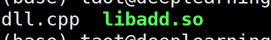

## 在 python 中调用 C/C++

Python 是一种很好用的胶水语言，利用Python的简洁和C++的高效，基本可以解决99%的问题了，剩下那 1% 的问题也就不是问题了，毕竟不是所有问题都可解。

一般的，Python和C++的交互分为这两种情况：         
* 用C++扩展Python：当一个Python项目中出现了性能瓶颈时，将瓶颈部分抽离出来，用C++封装成一个Python可以调用的模块（so库）；         
* 将Python内嵌入C++：当一个C++项目中有部分功能预期将会经常变更需求，期望获得更高的灵活性时，将这部分功能用Python实现，在C++中进行调用。

这里讨论前者，在 python 中调用 C/C++ 代码的方法很多，这里记录三种方法的使用。

### 1 C/C++ 编译成可执行文件，python 通过 subprocess 调用

C/C++ 代码正常编写，然后编译成 exe/elf 格式的可执行文件，Python 利用 subprocess 调用该可执行文件即可。好处是改动小，不好是至少需要两个进程跑代码，而且 C/C++ 和 Python 通讯比较麻烦。

这种方法简单粗暴，不太好用，没什么好说的。

### 2 ctypes

C/C++ 在编写代码的时候略微改动，然后编译成 dll/so 格式的动态库文件，Python 利用 ctypes 调用该库文件即可。好处一个进程内运行，C/C++ 侧改动小，坏处是 Python 侧需适配代码比较多。

ctypes 是 python 自带的一个库，可以用来调用 c/cpp 的动态链接库。使用 ctypes 调用 c++ 代码步骤如下：
* 编写 cpp 代码，将其编译成动态链接库（.so 或者 .dll 文件）。
* 在 python 代码文件中导入 ctypes 库，并使用 ctypes.cdll.LoadLibrary() 方法加载动态链接库。
* 使用 ctypes 定义 c++ 函数的参数类型和返回值类型，并调用 c++ 函数。

#### 2.1 编译 C++

一个简单的 demo：
*dll.cpp*

```cpp
extern "C" int add(int a, int b) {
	return a + b;
}
```

在目录 python_call_c_cpp 下，使用 g++ 编译 dll.cpp

```bash
g++ --shared -fPIC dll.cpp -o libadd.so
```

编译完成后，在目录下会生成一个 libadd.so 文件：




#### 2.2 python 调用 C/C++ 库

*main.py*
```python
import ctypes

# 加载动态链接库 
lib = ctypes.cdll.LoadLibrary("./libadd.so") 
# 定义函数参数类型和返回值类型 
lib.add.argtypes = [ctypes.c_int, ctypes.c_int] 
lib.add.restype = ctypes.c_int 

# 调用 C++ 函数 
result = lib.add(1, 2) 
print("调用C++库的结果：" + str(result))
```

执行 `python3 main.py`:


### 3 Boost.Python

Boost作为一个大宝库，提供了我们所需要的这一功能。并且，在Boost的许多库中，已经默认使用了Boost.Python，所以也算是经过了充分的测试。

#### 3.1 安装

Boost的大部分功能都是以头文件的形式提供的，无需安装；但是也有少部分功能，需要进行手动编译。Boost.Python 需要进行手动编译。

#### 3.2 一个简单的 demo

用C++实现一个模块，在Python中调用时，可以返回一个特定的字符串。

```cpp
#include <boost/python.hpp>

char const* greet()
{
	return "hello, boost";
}

BOOST_PYTHON_MODULE(hello_boostpy)
{
	using namespace boost::python;
	def("greet", greet);
}
```

将其编译成动态链接库的形式：
```bash
g++ -I /usr/include/python2.7/ -fPIC -shared -o hello_boostpy.so http://hello_boostpy.cc -lboost_python
```

这时可以使用ldd看看hello_boostpy.so可不可以找到libboost_python，找不到的话，需要手动将其路径加入环境变量LD_LIBRARY_PATH中，或者用ldconfig相关的命令也可以。

在Python中使用hello_boostpy库:
```python
# -*- coding: utf-8 -*-
import sys
sys.path.append('.')


def test():
    import hello_boostpy
    return hello_boostpy.greet()


if __name__ == "__main__":
    print test()
```

接下来，我们在C++实现的模块中，添加一个类，并且尝试向C++方向传入Python的list类型对象。
C++ 类：
```cpp
#include <boost/python.hpp>
#include <vector>
#include <string>
#include <sstream>
using namespace boost::python;

struct Person
{
	void set_name(std::string name) { this->name = name; }
	std::string print_info();
	void set_items(list& prices, list& discounts);
	
	
	std::string name;
	std::vector<double> item_prices;
	std::vector<double> item_discounts;
};
```

其中，Python方的list类型，在Boost.Python中有一个对应的实现boost::python::list（相应的，dict、tuple等类型都有对应实现）。在set_items中，我们将会用boost::python::extract对数据类型做一个转换。

```cpp
void Person::set_items(list& prices, list& discounts)
{
	for(int i = 0; i < len(prices); ++i)
	{
		double price = extract<double>(prices[i]);
		double discount = extract<double>(discounts[i]);
		item_prices.push_back(price);
		item_discounts.push_back(discount);
	}
}
```

Python模块定义部分依旧是非常直观的代码：

```python
BOOST_PYTHON_MODULE(person)
{
	class_<Person>("Person")
		.def("set_name", &Person::set_name)
		.def("print_info", &Person::print_info)
		.def("set_items", &Person::set_items)
	;	
}
```

在Python代码中，就可以像使用一个Python定义的类一样使用Person类了：

```python
# -*- coding: utf-8 -*-
import sys
sys.path.append('.')


def test():
    import person
    p = person.Person()
    p.set_name('Qie')
    p.set_items([100, 123.456, 888.8], [0.3, 0.1, 0.5])
    print p.print_info()


if __name__ == "__main__":
    test()
```
