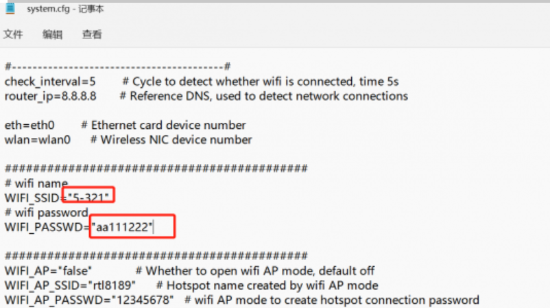
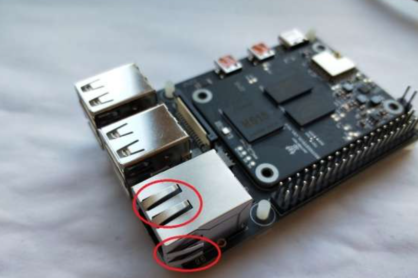
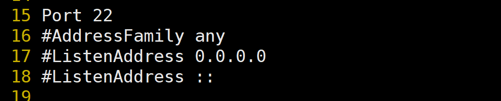
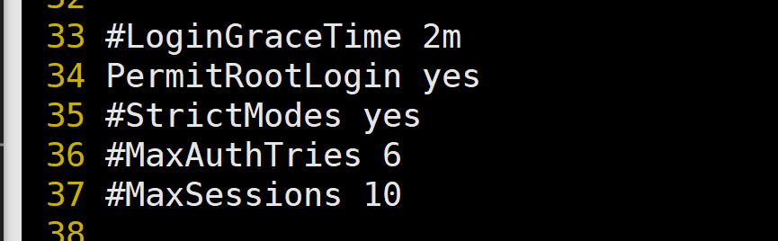
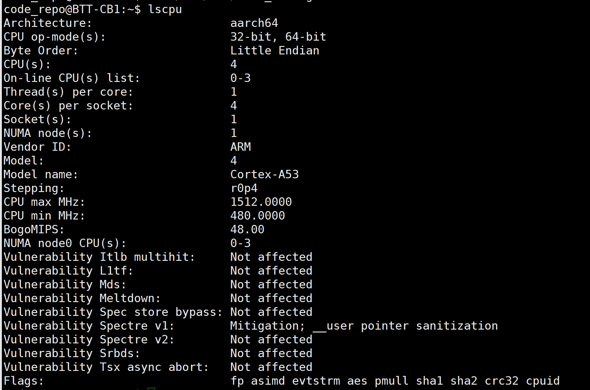

## 使用 big tree CB1 搭建代码仓库

近来 github 被 ban 了，正常无法访问了，托管在上面的代码仓库管理起来不是很方便，尤其是在开发提交比较频繁的时候。gitee 接不说了，基本没法用。在本地网络内找个板子来搭建代码仓库，是个不错的选择。

翻找出一块之前嫖来的 big tree CB1，这块板子做其他的性能比较捉急，但是十多瓦的功耗，拿来托管代码还不错。

### 1 系统安装与配置

#### 1.1 镜像下载

下载地址：[Releases · bigtreetech/CB1 (github.com)](https://github.com/bigtreetech/CB1/releases)

*注意：只能下载官方提供的镜像；有三个版本，随便下载一个版本即可。实际上，这个板子的性能所限，桌面环境显得很多余，所以建议使用第三个就可以了。另外，这个板子的桌面环境是为为 3D 打印机设计的。*

#### 1.2 制作启动SD卡

1）下载烧录软件
下载并安装烧录软件树莓派官方的 Raspberry Pi Imager：[aspberry Pi Imager](https://www.raspberrypi.com/software/)

或者使用 balenaEtcher：[balenaEtcher](https://www.balena.io/etcher/)

以上两种软件都可以使用，任选一种下载安装即可。

2）烧录系统

上面两个软件的系统烧录引导都很清楚，跟着引导走即可。

3）配置系统网络连接

由于选择的系统没有桌面，并且在首次进入系统的时候需要使用网络，因此需要在今年入系统之前，在烧录好系统的 SD 卡中配置好网络。

烧录完成后，在SD卡的system.cfg文件里面修改WiFi的名字以及密码，这样就可以配置好网络了，如图。




#### 1.3 CB1与P14B安装

安装的时候注意方向，天线是放在外面的，不然装上散热器之后通信芯片会被散热器挡住，影响 wifi 信号。另外，安装过程中注意安全，网口和 USB 接口带弹片，容易剐到手，一不小心就滴血认主了。




#### 1.4 上电进入系统

将 MicroSD 卡插到主板上，通电后等待系统启动，大概 1~2 分钟。给板子供电，之后就可以看到亮灯，说明安装成功。使用 micro hdmi 线可以连接显示器，进入系统。

使用 root 用户登录，用户名和密码都是 `root`。


#### 1.5 使用ssh连接板子

1）查询是否安装了 SSH
```bash
rpm -pa |grep ssh
```

2）安装 ssh
```bash
sudo apt-get install ssh
```

3）启动 ssh 服务
```bash
service sshd start
```

4）配置端口
```bash
vim /etc/ssh/sshd_config
```
将port 前面的#删除,也可以更改其它端口


5）允许 root 用户远程登录



在开发机器上使用 ssh 连接板子，进行系统相关配置。

6）查看ssh服务的状态
```bash
sudo service sshd status
```

7）开启 ssh 服务
```bash
sudo service sshd start
```


#### 1.6 更换系统软件源

板子使用的系统是基于 Debian 11 (bullseye) 的，因此可以使用 Debian 11 (bullseye) 的国内软件源。

将/etc/apt/sources.list文件中Debian默认的软件仓库地址和安全更新仓库地址修改为国内的镜像地址即可。选一个速度比较快的使用即可。

国内常见站点：
```bash
# 阿里云镜像站 

deb https://mirrors.aliyun.com/debian/ bullseye main non-free contrib
deb-src https://mirrors.aliyun.com/debian/ bullseye main non-free contrib
deb https://mirrors.aliyun.com/debian-security/ bullseye-security main
deb-src https://mirrors.aliyun.com/debian-security/ bullseye-security main
deb https://mirrors.aliyun.com/debian/ bullseye-updates main non-free contrib
deb-src https://mirrors.aliyun.com/debian/ bullseye-updates main non-free contrib
deb https://mirrors.aliyun.com/debian/ bullseye-backports main non-free contrib
deb-src https://mirrors.aliyun.com/debian/ bullseye-backports main non-free contrib
 

# 腾讯云镜像站

deb https://mirrors.tencent.com/debian/ bullseye main non-free contrib
deb-src https://mirrors.tencent.com/debian/ bullseye main non-free contrib
deb https://mirrors.tencent.com/debian-security/ bullseye-security main
deb-src https://mirrors.tencent.com/debian-security/ bullseye-security main
deb https://mirrors.tencent.com/debian/ bullseye-updates main non-free contrib
deb-src https://mirrors.tencent.com/debian/ bullseye-updates main non-free contrib
deb https://mirrors.tencent.com/debian/ bullseye-backports main non-free contrib
deb-src https://mirrors.tencent.com/debian/ bullseye-backports main non-free contrib
 

# 网易镜像站 

deb https://mirrors.163.com/debian/ bullseye main non-free contrib
deb-src https://mirrors.163.com/debian/ bullseye main non-free contrib
deb https://mirrors.163.com/debian-security/ bullseye-security main
deb-src https://mirrors.163.com/debian-security/ bullseye-security main
deb https://mirrors.163.com/debian/ bullseye-updates main non-free contrib
deb-src https://mirrors.163.com/debian/ bullseye-updates main non-free contrib
deb https://mirrors.163.com/debian/ bullseye-backports main non-free contrib
deb-src https://mirrors.163.com/debian/ bullseye-backports main non-free contrib
 

# 华为镜像站

deb https://mirrors.huaweicloud.com/debian/ bullseye main non-free contrib
deb-src https://mirrors.huaweicloud.com/debian/ bullseye main non-free contrib
deb https://mirrors.huaweicloud.com/debian-security/ bullseye-security main
deb-src https://mirrors.huaweicloud.com/debian-security/ bullseye-security main
deb https://mirrors.huaweicloud.com/debian/ bullseye-updates main non-free contrib
deb-src https://mirrors.huaweicloud.com/debian/ bullseye-updates main non-free contrib
deb https://mirrors.huaweicloud.com/debian/ bullseye-backports main non-free contrib
deb-src https://mirrors.huaweicloud.com/debian/ bullseye-backports main non-free contrib
 

# 清华大学镜像站

deb https://mirrors.tuna.tsinghua.edu.cn/debian/ bullseye main contrib non-free
deb-src https://mirrors.tuna.tsinghua.edu.cn/debian/ bullseye main contrib non-free
deb https://mirrors.tuna.tsinghua.edu.cn/debian/ bullseye-updates main contrib non-free
deb-src https://mirrors.tuna.tsinghua.edu.cn/debian/ bullseye-updates main contrib non-free
deb https://mirrors.tuna.tsinghua.edu.cn/debian/ bullseye-backports main contrib non-free
deb-src https://mirrors.tuna.tsinghua.edu.cn/debian/ bullseye-backports main contrib non-free
deb https://mirrors.tuna.tsinghua.edu.cn/debian-security bullseye-security main contrib non-free
deb-src https://mirrors.tuna.tsinghua.edu.cn/debian-security bullseye-security main contrib non-free
 

# 中科大镜像站

deb https://mirrors.ustc.edu.cn/debian/ bullseye main contrib non-free
deb-src https://mirrors.ustc.edu.cn/debian/ bullseye main contrib non-free
deb https://mirrors.ustc.edu.cn/debian/ bullseye-updates main contrib non-free
deb-src https://mirrors.ustc.edu.cn/debian/ bullseye-updates main contrib non-free
deb https://mirrors.ustc.edu.cn/debian/ bullseye-backports main contrib non-free
deb-src https://mirrors.ustc.edu.cn/debian/ bullseye-backports main contrib non-free
deb https://mirrors.ustc.edu.cn/debian-security/ bullseye-security main contrib non-free
deb-src https://mirrors.ustc.edu.cn/debian-security/ bullseye-security main contrib non-free
```

#### 1.7 一些测试

1）网速测试

speedtest 是一个更加知名的工具。它是用 Python 写成的，可以使用 apt 或 pip 命令来安装。可以在命令行下使用，也可以直接将其导入到 Python 项目。

```bash
sudo apt install speedtest-cli

```
使用的时候，可以直接运行 speedtest 命令即可：
```bash
speedtest
```

2）查看板子核心温度
```bash
cat /sys/class/thermal/thermal_zone0/temp | awk '{print $1/1000}'
```

3）查看 CPU 的运算速度
```bash
lscpu
```


其中可以看到H616的BogoMIPS是48，MIPS是millions of instructions per second(百万条指令每秒)的缩写，其代表CPU的运算速度，是cpu性能的重要指标。但只能用来粗略计算处理器的性能，并不十分精确。

4）Sysbench

Sysbench是一个开源的、模块化的、跨平台的多线程性能测试工具，可以用来进行CPU、内存、磁盘I/O、线程、数据
库的性能测试。

```bash
# 安装使用命令 
sudo apt-get install sysbench

# 测试CPU命令 
sysbench cpu run
```


### 2 搭建代码托管

#### 2.1 安装git、ssh等软件
```bash
sudo apt-get install git openssh-server openssh-client  python-setuptools
```

#### 2.2 新增用户（code_repo），用于运行git服务,回车后会提示输入密码
```bash
sudo adduser code_repo
```

#### 2.3 初始化git仓库
```bash
#切换到 code_repo 用户
$su code_repo
#在 code_repo 家目录新建 code 目录用于存放 git 代码仓库数据
mkdir code
cd code

#建立自己的裸仓库，用于给git客户端上传需要托管的代码
#加上--bare参数后，服务端是初始化的[裸仓库]一般服务器上的Git仓库都是以.git结尾的裸仓库。
#裸仓库没有工作区，因为服务器上的git仓库是为了共享用，不能让用户直接登录到服务器上去修改工作区中的代码，用裸仓库更加安全
$ git init --bare test.git
```

#### 2.4 测试git服务器搭建是否成功
```bash
# 在开发机器上，clone刚才创建的test.git仓库
git clone code_repo@ip_code_repo:/home/code_repo/code/test.git
```

如果在开发机器上出现了test这个文件夹，就说明搭建成功了。

接下来就可以愉快地使用这个板子作为代码仓库来做版本管理了。

在必要的时候，也可以很方便地把仓库同步到 github。
Enjoy It.
