## 神经网络基本原理

神经网络是一门重要的机器学习技术。它是目前最为火热的研究方向--深度学习的基础。

神经网络是一种模拟人脑的神经网络以期能够实现类人工智能的机器学习技术。人脑中的神经网络是一个非常复杂的组织。成人的大脑中估计有1000亿个神经元之多。

### 1 介绍

下面是一个包含三个层次的神经网络。红色的是输入层，绿色的是输出层，紫色的是中间层（也叫隐藏层）。输入层有3个输入单元，隐藏层有4个单元，输出层有2个单元。

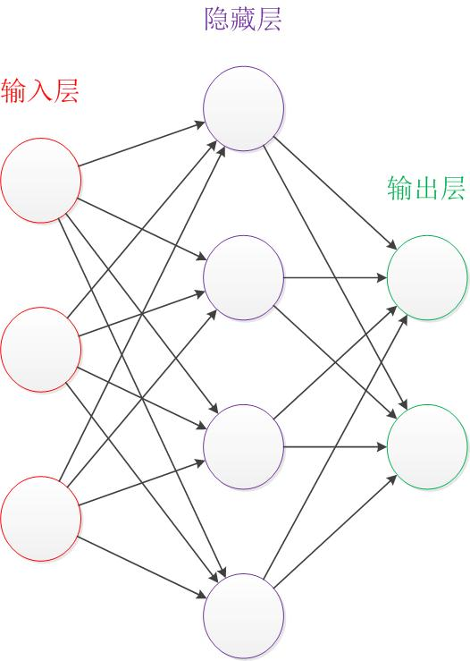

* 设计一个神经网络时，输入层与输出层的节点数往往是固定的，中间层则可以自由指定；

* 神经网络结构图中的拓扑与箭头代表着推理过程时数据的流向，跟训练时的数据流有一定的区别；

* 结构图里的关键不是圆圈（代表“神经元”），而是连接线（代表“神经元”之间的连接）。每个连接线对应一个不同的权重（其值称为权值 tensor），这是需要训练得到的。  

### 2 神经元

#### 2.1 结构

神经元模型是一个包含输入，输出与计算功能的模型。输入可以类比为神经元的树突，而输出可以类比为神经元的轴突，计算则可以类比为细胞核。

下图是一个典型的神经元模型：包含有3个输入，1个输出，以及2个计算功能。

连接是神经元中最重要的东西。每一个连接上都有一个权重。

一个神经网络的训练算法就是让权重的值调整到最佳，以使得整个网络的预测效果最好。

使用a来表示输入，用w来表示权值。一个表示连接的有向箭头可以这样理解：在初端，传递的信号大小仍然是a，端中间有加权参数w，经过这个加权后的信号会变成a*w，因此在连接的末端，信号的大小就变成了a*w。

在其他绘图模型里，有向箭头可能表示的是值的不变传递。而在神经元模型里，每个有向箭头表示的是值的加权传递。

如果将神经元图中的所有变量用符号表示，并且写出输出的计算公式的话，就是下图。

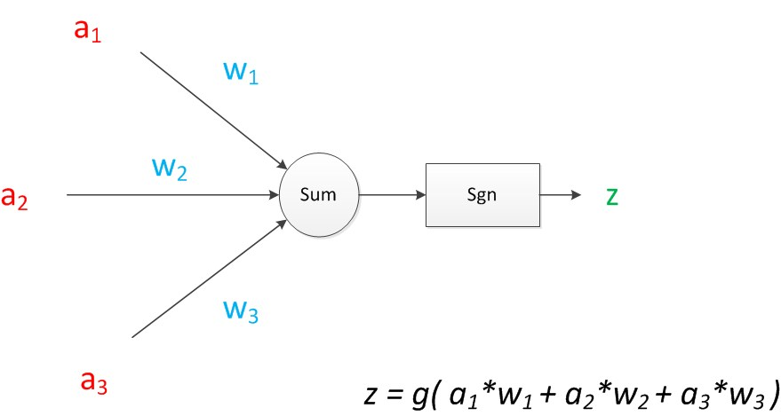

可见z是在输入和权值的线性加权和叠加了一个函数g的值。在MP模型里，函数g是sgn函数，也就是取符号函数。这个函数当输入大于0时，输出1，否则输出0。

下面对神经元模型的图进行一些扩展。首先将sum函数与sgn函数合并到一个圆圈里，代表神经元的内部计算。其次，把输入a与输出z写到连接线的左上方，便于后面画复杂的网络。最后说明，一个神经元可以引出多个代表输出的有向箭头，但值都是一样的。

神经元可以看作一个计算与存储单元。计算是神经元对其的输入进行计算功能。存储是神经元会暂存计算结果，并传递到下一层。

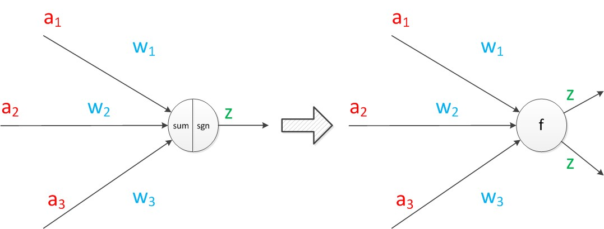

#### 2.2 效果

神经元模型的使用可以这样理解：有一个数据，称之为样本。样本有四个属性，其中三个属性已知，一个属性未知。我们需要做的就是通过三个已知属性预测未知属性。

具体办法就是使用神经元的公式进行计算。三个已知属性的值是a1，a2，a3，未知属性的值是z。z可以通过公式计算出来。

$$
a = g(a_1 * w_1 + a_2 * w_2 + a_3 * w_3)
$$

这里，已知的属性称之为特征，未知的属性称之为目标。假设特征与目标之间确实是线性关系，并且我们已经得到表示这个关系的权值w1，w2，w3。那么，我们就可以通过神经元模型预测新样本的目标。

#### 2.3 影响

1943年发布的MP模型，虽然简单，但已经建立了神经网络大厦的地基。但是，MP模型中，权重的值都是预先设置的，因此不能学习。

1949年心理学家Hebb提出了Hebb学习率，认为人脑神经细胞的突触（也就是连接）上的强度上可以变化的。于是计算科学家们开始考虑用调整权值的方法来让机器学习。这为后面的学习算法奠定了基础。

尽管神经元模型与Hebb学习律都已诞生，但限于当时的计算机能力，直到接近10年后，第一个真正意义的神经网络才诞生。

### 3 单层神经网络（感知器）

#### 3.1 背景

1958年，计算科学家Rosenblatt提出了由两层神经元组成的神经网络。他给它起了一个名字--“感知器”（Perceptron）。

感知器是当时首个可以学习的人工神经网络。Rosenblatt现场演示了其学习识别简单图像的过程，在当时的社会引起了轰动。

人们认为已经发现了智能的奥秘，许多学者和科研机构纷纷投入到神经网络的研究中。美国军方大力资助了神经网络的研究，并认为神经网络比“原子弹工程”更重要。这段时间直到1969年才结束，这个时期可以看作神经网络的第一次高潮。

#### 3.2 结构

在原来MP模型的“输入”位置添加神经元节点，标志其为“输入单元”。其余不变，于是我们就有了下图：

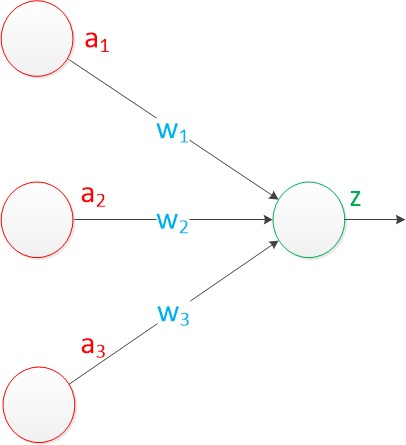

在“感知器”中，有两个层次。分别是输入层和输出层。输入层里的“输入单元”只负责传输数据，不做计算。输出层里的“输出单元”则需要对前面一层的输入进行计算。

我们把需要计算的层次称之为“计算层”，并把拥有一个计算层的网络称之为“单层神经网络”。有一些文献会按照网络拥有的层数来命名，例如把“感知器”称为两层神经网络。但在本文里，我们根据计算层的数量来命名。

假如我们要预测的目标不再是一个值，而是一个向量，例如[2,3]。那么可以在输出层再增加一个“输出单元”。

下图显示了带有两个输出单元的单层神经网络，其中输出单元z1的计算公式如下图。

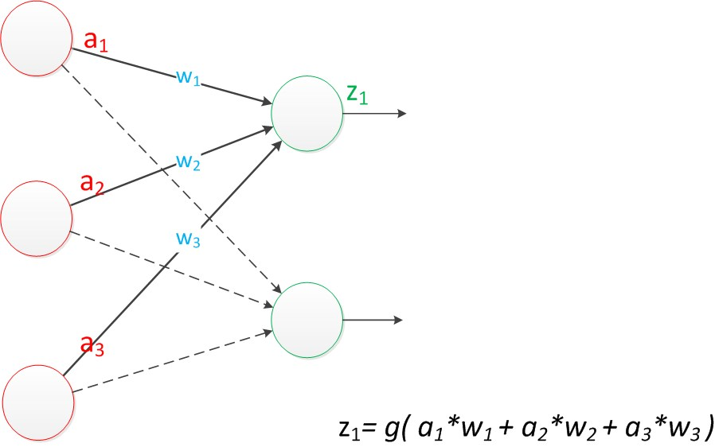

可以看到，z1的计算跟原先的z并没有区别。

已知一个神经元的输出可以向多个神经元传递，因此z2的计算公式如下图。

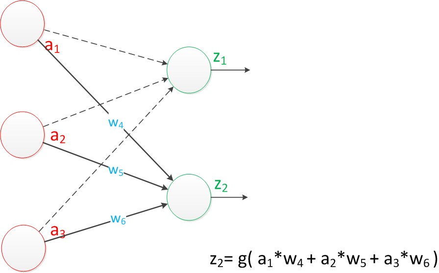

可以看到，z2的计算中除了三个新的权值：w4，w5，w6以外，其他与z1是一样的。

整个网络的输出如下图。

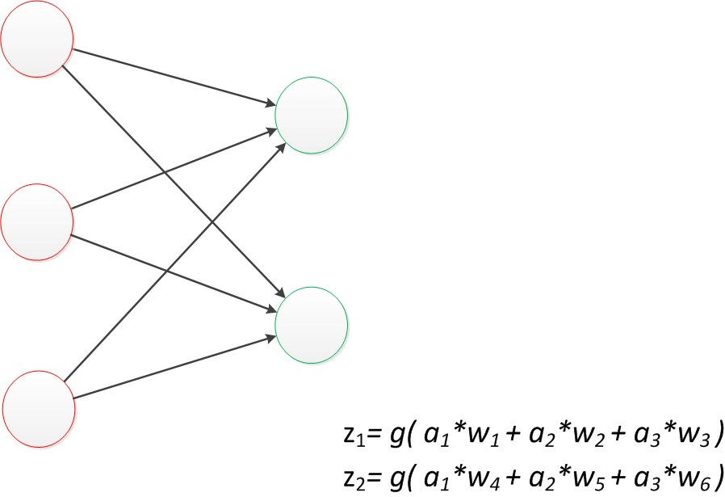

改用二维的下标，用 $w_{x, y}$ 来表达一个权值。下标中的x代表后一层神经元的序号，而y代表前一层神经元的序号（序号的顺序从上到下）。

例如， $w_{1, 2}$ 代表后一层的第1个神经元与前一层的第2个神经元的连接的权值（这种标记方式参照了Andrew Ng的课件）。根据以上方法标记，我们有了下图。

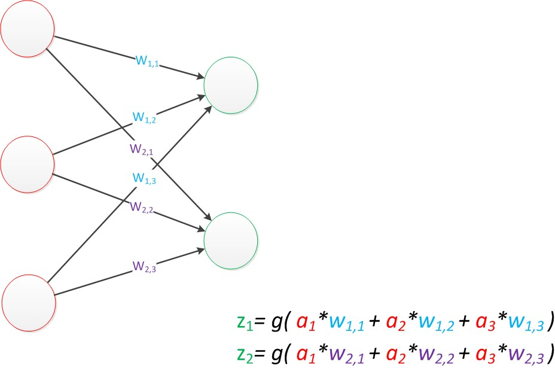

如果我们仔细看输出的计算公式，会发现这两个公式就是线性代数方程组。因此可以用矩阵乘法来表达这两个公式。

例如，输入的变量是 $[a_1，a_2，a_3]^T$（代表由 $a_1，a_2，a_3$ 组成的列向量），用向量 **a** 来表示。方程的左边是 $[z_1，z_2]^T$，用向量 **z** 来表示。

系数则是矩阵**W**（2行3列的矩阵，排列形式与公式中的一样）。

于是，输出公式可以改写成：

$$
g(W*a) = z
$$

这个公式就是神经网络中从前一层计算后一层的矩阵运算。

#### 3.3 效果

与神经元模型不同，感知器中的权值是通过训练得到的。因此，根据以前的知识我们知道，感知器类似一个逻辑回归模型，可以做线性分类任务。

可以用决策分界来形象的表达分类的效果。决策分界就是在二维的数据平面中划出一条直线，当数据的维度是3维的时候，就是划出一个平面，当数据的维度是n维时，就是划出一个n-1维的超平面。

在二维平面中划出决策分界的效果，也就是感知器的分类效果。

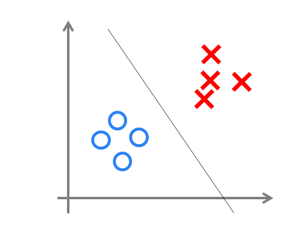

### 4 两层神经网路（多层感知器）

#### 4.1 背景

Minsky说过单层神经网络无法解决异或问题。但是当增加一个计算层以后，两层神经网络不仅可以解决异或问题，而且具有非常好的非线性分类效果。不过两层神经网络的计算是一个问题，没有一个较好的解法。

1986年，Rumelhar和Hinton等人提出了反向传播（Backpropagation，BP）算法，解决了两层神经网络所需要的复杂计算量问题，从而带动了业界使用两层神经网络研究的热潮。

#### 4.2 结构

两层神经网络除了包含一个输入层，一个输出层以外，还增加了一个中间层。此时，中间层和输出层都是计算层。

现在，权值矩阵增加到了两个，用上标来区分不同层次之间的变量。

例如 $a_x^{(y)}$ 代表第 y 层的第 x 个节点。$z_1$ ，$z_2$ 变成了 $a_1^{(2)}$ ，$a_2^{(2)}$。下图给出了 $a_1^{(2)}$ ，$a_2^{(2)}$ 的计算公式。

计算最终输出z的方式是利用了中间层的 $a_1^{(2)}$ ，$a_2^{(2)}$ 和第二个权值矩阵计算得到的，如下图。

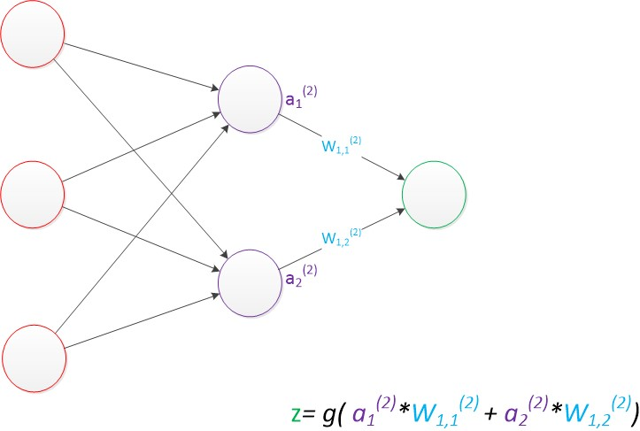

假设我们的预测目标是一个向量，那么与前面类似，只需要在“输出层”再增加节点即可。

使用向量和矩阵来表示层次中的变量。$a^{(1)}$ ，$a^{(2)}$ ，z 是网络中传输的向量数据。$W^{(1)}$ 和 $W^{(2)}$ 是网络的矩阵参数。如下图。

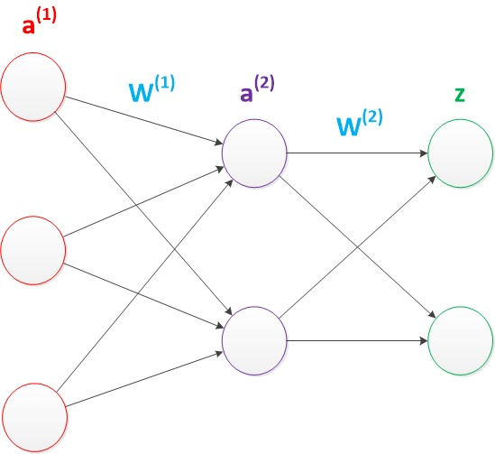

使用矩阵运算来表达整个计算公式的话如下：

$$
g(W^{(1)} * a^{(1)}) = a^{(2)} \\
g(W^{(2)} * a^{(2)}) = z
$$

由此可见，使用矩阵运算来表达是很简洁的，而且也不会受到节点数增多的影响（无论有多少节点参与运算，乘法两端都只有一个变量）。

前面的神经网络的结构图的讨论中都没有提到偏置节点（bias unit）。事实上，这些节点是默认存在的。它本质上是一个只含有存储功能，且存储值永远为1的单元。在神经网络的每个层次中，除了输出层以外，都会含有这样一个偏置单元。正如线性回归模型与逻辑回归模型中的一样。

偏置单元与后一层的所有节点都有连接，我们设这些参数值为向量b，称之为偏置。如下图。

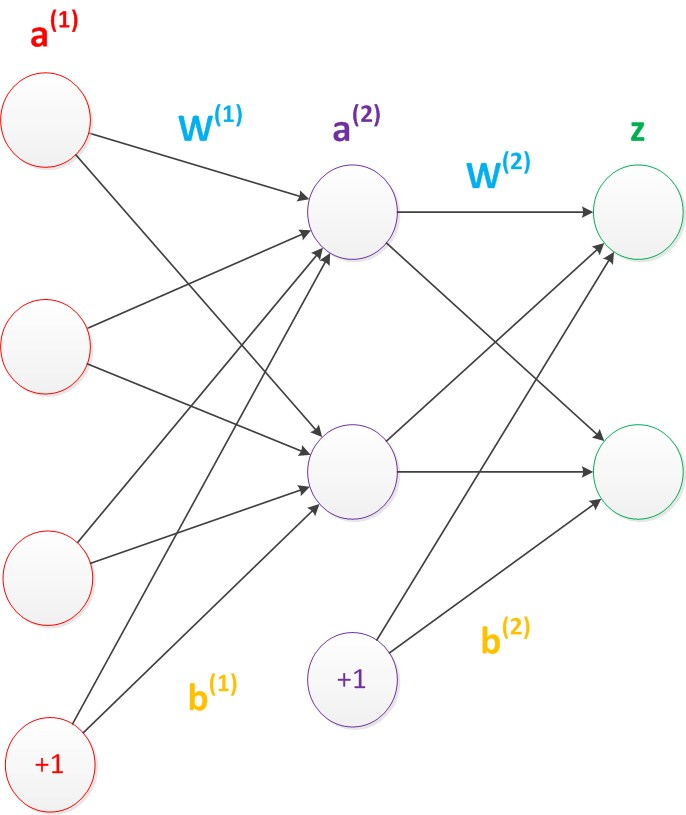

可以看出，偏置节点很好认，因为其没有输入（前一层中没有箭头指向它）。有些神经网络的结构图中会把偏置节点明显画出来，有些不会。

在考虑了偏置以后的一个神经网络的矩阵运算如下：

$$
g(W^{(1)} * a^{(1)} + b^{(1)}) = a^{(2)} \\
g(W^{(2)} * a^{(2)} + b^{(1)}) = z
$$

在两层神经网络中，不再使用sgn函数作为函数g，而是使用平滑函数 sigmoid 作为函数g。函数g也称作激活函数（active function）。

事实上，神经网络的本质就是通过参数与激活函数来拟合特征与目标之间的真实函数关系。在一个神经网络的程序中，既没有“线”这个对象，也没有“单元”这个对象。实现一个神经网络最需要的是线性代数库。

#### 4.3 效果

与单层神经网络不同。理论证明，两层神经网络可以无限逼近任意连续函数。面对复杂的非线性分类任务，两层（带一个隐藏层）神经网络可以分类的很好。

如下图，红色的线与蓝色的线代表数据。而红色区域和蓝色区域代表由神经网络划开的区域，两者的分界线就是决策分界。

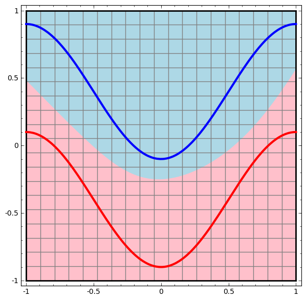

可以看到，这个两层神经网络的决策分界是非常平滑的曲线，而且分类的很好。前面已经提到过，单层网络只能做线性分类任务。而两层神经网络中的后一层也是线性分类层，应该只能做线性分类任务。为什么两个线性分类任务结合就可以做非线性分类任务？

把输出层的决策分界单独拿出来看一下。就是下图。

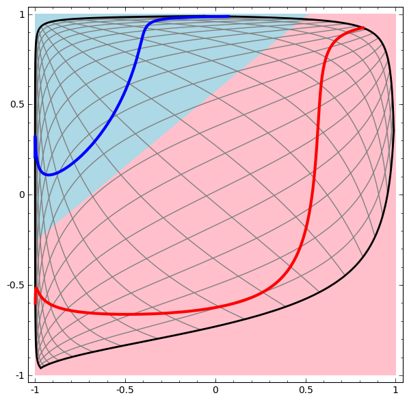

可以看到，输出层的决策分界仍然是直线。关键就是，从输入层到隐藏层时，数据发生了空间变换。也就是说，两层神经网络中，隐藏层对原始的数据进行了一个空间变换，使其可以被线性分类，然后输出层的决策分界划出了一个线性分类分界线，对其进行分类。

这样就导出了两层神经网络可以做非线性分类的关键--隐藏层。矩阵和向量相乘，本质上就是对向量的坐标空间进行一个变换。因此，隐藏层的参数矩阵的作用就是使得数据的原始坐标空间从线性不可分，转换成了线性可分。

两层神经网络通过两层的线性模型等价模拟了数据内真实的非线性函数。因此，多层的神经网络的本质就是复杂函数拟合。

在设计一个神经网络时，输入层的节点数需要与特征的维度匹配，输出层的节点数要与目标的维度匹配。而中间层的节点数，却是由设计者指定的。节点数设置的多少，会影响到整个模型的效果。目前业界没有完善的理论来指导这个决策。一般是根据经验来设置。较好的方法就是预先设定几个可选值，通过切换这几个值来看整个模型的预测效果，选择效果最好的值作为最终选择。这种方法又叫做Grid Search（网格搜索）。

#### 4.4 训练

两层神经网络的训练。

从两层神经网络开始，神经网络的研究人员开始使用机器学习相关的技术进行神经网络的训练。例如用大量的数据（1000-10000左右），使用算法进行优化等等，从而使得模型训练可以获得性能与数据利用上的双重优势。

机器学习模型训练的目的，就是使得参数尽可能的与真实的模型逼近。具体做法是这样的：
* 首先给所有参数赋上随机值。使用这些随机生成的参数值，来预测训练数据中的样本。样本的预测目标为yp，真实目标为y。那么，定义一个值loss，计算公式如下：

  $$
  loss = (y_p - y) ^2
  $$

这个值称之为损失（loss），我们的目标就是使对所有训练数据的损失和尽可能的小。

如果将先前的神经网络预测的矩阵公式带入到 $y_p$ 中，可以把损失写为关于参数（parameter）的函数，这个函数称之为损失函数（loss function）。下面的问题就是求：如何优化参数，能够让损失函数的值最小。

此时这个问题就被转化为一个优化问题。一个常用方法就是高等数学中的求导，但是这里的问题由于参数不止一个，求导后计算导数等于0的运算量很大，所以一般来说解决这个优化问题使用的是梯度下降算法。梯度下降算法每次计算参数在当前的梯度，然后让参数向着梯度的反方向前进一段距离，不断重复，直到梯度接近零时截止。一般这个时候，所有的参数恰好达到使损失函数达到一个最低值的状态。

在神经网络模型中，由于结构复杂，每次计算梯度的代价很大。因此还需要使用反向传播算法。反向传播算法是利用了神经网络的结构进行的计算。不一次计算所有参数的梯度，而是从后往前。首先计算输出层的梯度，然后是第二个参数矩阵的梯度，接着是中间层的梯度，再然后是第一个参数矩阵的梯度，最后是输入层的梯度。计算结束以后，所要的两个参数矩阵的梯度就都有了。

反向传播算法可以直观的理解为下图。梯度的计算从后往前，一层层反向传播。前缀E代表着相对导数的意思。

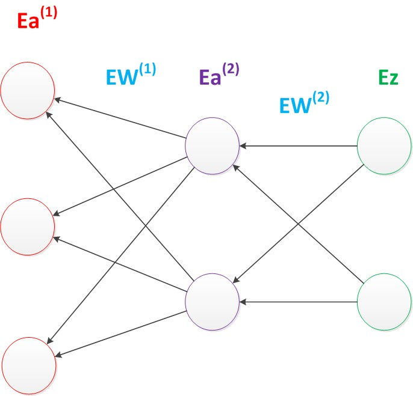

反向传播算法的启示是数学中的链式法则。在此需要说明的是，尽管早期神经网络的研究人员努力从生物学中得到启发，但从BP算法开始，研究者们更多地从数学上寻求问题的最优解。不再盲目模拟人脑网络是神经网络研究走向成熟的标志。

优化问题只是训练中的一个部分。机器学习问题之所以称为学习问题，而不是优化问题，就是因为它不仅要求数据在训练集上求得一个较小的误差，在测试集上也要表现好。因为模型最终是要部署到没有见过训练数据的真实场景。提升模型在测试集上的预测效果的主题叫做泛化（generalization），相关方法被称作正则化（regularization）。神经网络中常用的泛化技术有权重衰减等。

#### 4.5 影响

两层神经网络在多个地方的应用说明了其效用与价值。10年前困扰神经网络界的异或问题被轻松解决。神经网络在这个时候，已经可以发力于语音识别，图像识别，自动驾驶等多个领域。

但是神经网络仍然存在若干的问题：尽管使用了BP算法，一次神经网络的训练仍然耗时太久，而且困扰训练优化的一个问题就是局部最优解问题，这使得神经网络的优化较为困难。同时，隐藏层的节点数需要调参，这使得使用不太方便，工程和研究人员对此多有抱怨。
90年代中期，由Vapnik等人发明的SVM（Support Vector Machines，支持向量机）算法诞生，很快就在若干个方面体现出了对比神经网络的优势：无需调参；高效；全局最优解。基于以上种种理由，SVM迅速打败了神经网络算法成为主流。神经网络的研究再次陷入了冰河期。

### 5 多层神经网络

#### 5.1 背景

由于两层神经网络的缺点和支持向量机的优点，神经网络的研究陷入冷宫 10 多年。

2006年，Hinton在《Science》和相关期刊上发表了论文，首次提出了“深度信念网络”的概念。与传统的训练方式不同，“深度信念网络”有一个“预训练”（pre-training）的过程，这可以方便的让神经网络中的权值找到一个接近最优解的值，之后再使用“微调”(fine-tuning)技术来对整个网络进行优化训练。这两个技术的运用大幅度减少了训练多层神经网络的时间。他给多层神经网络相关的学习方法赋予了一个新名词--“深度学习”。

很快，深度学习在语音识别领域暂露头角。接着，2012年，深度学习技术又在图像识别领域大展拳脚。

#### 5.2 结构

延续两层神经网络的方式来设计一个多层神经网络。

在两层神经网络的输出层后面，继续添加层次。原来的输出层变成中间层，新加的层次成为新的输出层。所以可以得到下图。

依照这样的方式不断添加，我们可以得到更多层的多层神经网络。公式推导的话其实跟两层神经网络类似，使用矩阵运算的话就仅仅是加一个公式而已。

在已知输入 $a^{(1)}$ ，参数 $W^{(1)}, W^{(2)}, W^{(3)}$ 的情况下，输出 $z$ 的推导公式如下：

$$
\begin{cases}
  g(W^{(1)} * a^{(1)}) = a^{(2)} \\
  g(W^{(2)} * a^{(2)}) = a^{(3)} \\
  g(W^{(3)} * a^{(3)}) = z \\
\end{cases}
$$

多层神经网络中，输出也是按照一层一层的方式来计算。从最外面的层开始，算出所有单元的值以后，再继续计算更深一层。只有当前层所有单元的值都计算完毕以后，才会算下一层。有点像计算向前不断推进的感觉。所以这个过程叫做“正向传播”。

根据前面构造的网络，可以看出 $W^{(1)}$ 中有6个参数，$W^{(2)}$ 中有4个参数，$W^{(3)}$ 中有6个参数，因此整个神经网络中的参数有16个（这里不考虑偏置节点）。

假设我们将中间层的节点数做一下调整。第一个中间层改为3个单元，第二个中间层改为4个单元。经过调整以后，整个网络的参数变成了33个。

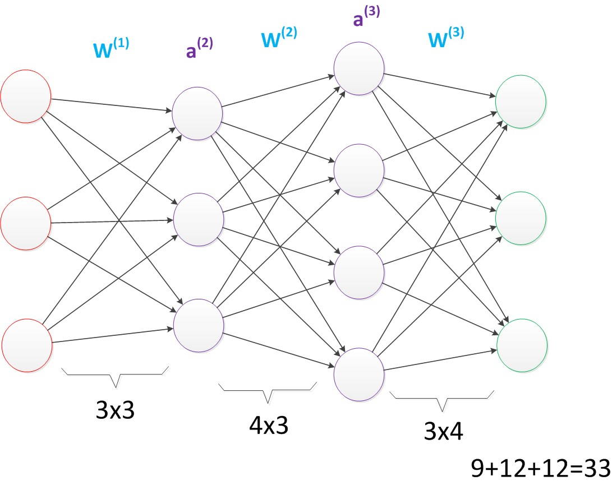

虽然层数保持不变，但是第二个神经网络的参数数量却是第一个神经网络的接近两倍之多，从而带来了更好的表示（represention）能力。表示能力是多层神经网络的一个重要性质。

在参数一致的情况下，我们也可以获得一个“更深”的网络。

上图的网络中，虽然参数数量仍然是33，但却有4个中间层，是原来层数的接近两倍。这意味着一样的参数数量，可以用更深的层次去表达。

#### 5.3 效果

与两层层神经网络不同。多层神经网络中的层数增加了很多。

增加更多的层次可以有更深入的表示特征，以及更强的函数模拟能力。

更深入的表示特征可以这样理解，随着网络的层数增加，每一层对于前一层次的抽象表示更深入。在神经网络中，每一层神经元学习到的是前一层神经元值的更抽象的表示。例如第一个隐藏层学习到的是“边缘”的特征，第二个隐藏层学习到的是由“边缘”组成的“形状”的特征，第三个隐藏层学习到的是由“形状”组成的“图案”的特征，最后的隐藏层学习到的是由“图案”组成的“目标”的特征。通过抽取更抽象的特征来对事物进行区分，从而获得更好的区分与分类能力。

更强的函数模拟能力是由于随着层数的增加，整个网络的参数就越多。而神经网络其实本质就是模拟特征与目标之间的真实关系函数的方法，更多的参数意味着其模拟的函数可以更加的复杂，可以有更多的容量（capcity）去拟合真正的关系。

在参数数量一样的情况下，更深的网络往往具有比浅层的网络更好的识别效率。

#### 5.4 训练

在单层神经网络时，使用的激活函数是sgn函数。到了两层神经网络时，使用的最多的是sigmoid函数。而到了多层神经网络时，通过一系列的研究发现，ReLU函数在训练多层神经网络时，更容易收敛，并且预测性能更好。因此，目前在深度学习中，最流行的非线性函数是ReLU函数。

ReLU函数不是传统的非线性函数，而是分段线性函数。其表达式非常简单，就是y=max(x,0)。这种函数的设计启发来自于生物神经元对于激励的线性响应，以及当低于某个阈值后就不再响应的模拟。

在多层神经网络中，训练的主题仍然是优化和泛化。当使用足够强的计算芯片（例如GPU图形加速卡）时，梯度下降算法以及反向传播算法在多层神经网络中的训练中仍然工作的很好。

在深度学习中，泛化技术变的比以往更加的重要。这主要是因为神经网络的层数增加了，参数也增加了，表示能力大幅度增强，很容易出现过拟合现象。因此正则化技术就显得十分重要。目前，Dropout技术，以及数据扩容（Data-Augmentation）技术是目前使用的最多的正则化技术。

