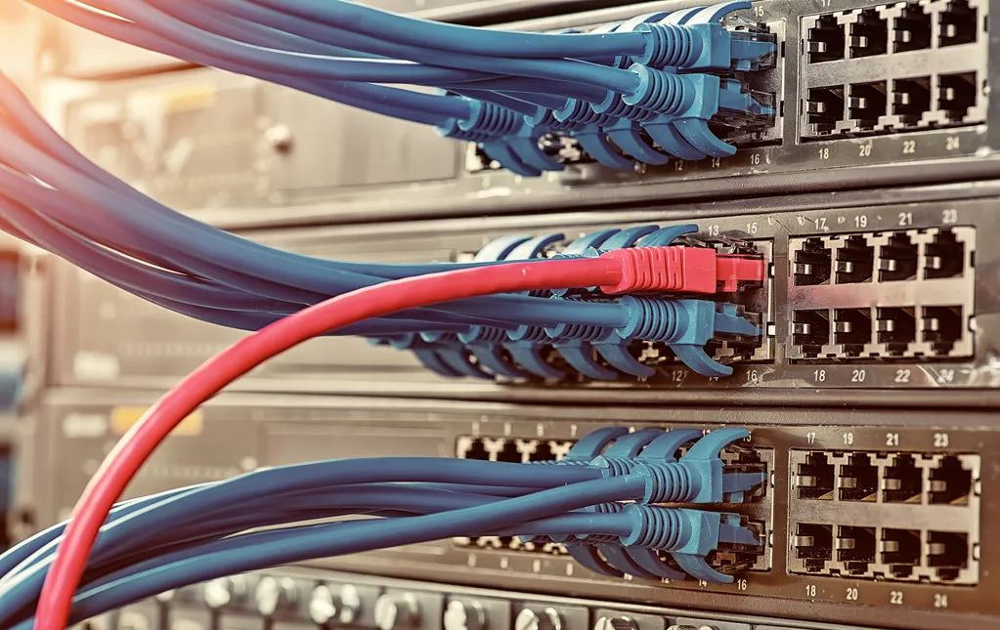
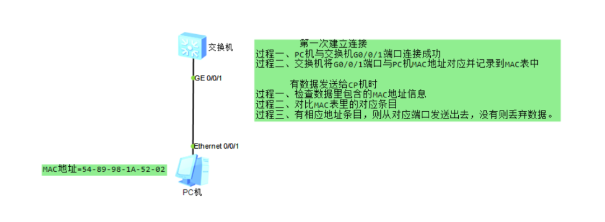

## 集线器、交换机、路由器的区别

集线器、交换机、路由器这三种设备是相似的，但是他们处理数据的方式有所不同。

###  1 集线器

集线器的目的是将内部网络上所有网络设备连接在一起。它具有多个端口，可以接受来自网络设备的以太网连接。集线器不过滤任何数据、也不知道该将数据发到什么地方。集线器唯一知道的是设备何时连接到其端口之一。

当数据包到达端口之一时，它将被复制到所有其他端口。因此，集线器上所有设备都可以看到数据包。数据包进入一个端口，然后集线器通过连接的设备将数据重新广播到每个端口。

因此，即使计算机A只想和计算机B通信。其他计算机仍将接收数据。这不仅会引起安全问题，还会造成不必要的网络流量从而浪费带宽。

### 2 交换机

交换机与集线器很类似，不过更“聪明”一点。它可以识别已连接设备的物理地址，并将这些地址（称为Mac地址）存储在路由表中。因此，当数据包发送到交换机时，它们仅路由到预期的目标端口。这是交换机与集线器的主要区别。交换机更有优势、因为它们减少了网络上任何不必要的流量。

交换机（Switch）意为“开关”，是一种用于电（光）信号转发的网络设备。它可以为接入交换机的任意两个网络节点提供独享的电信号通路。最常见的交换机是以太网交换机。其他常见的还有电话语音交换机、光纤交换机等。

#### 2.1 工作过程

每个端口成功连接时，交换机通过将MAC地址和端口对应，形成一张MAC表。在后面的接收发送数据时，发往该MAC地址的数据包将只从对应的端口发出。

终端设备成功连接交换机端口后，终端设备的物理地址/硬件地址（Mac地址），会和接入的端口形成对应的关系，并记录在MAC表内。数据包中含有Mac地址信息，传输数据包时交换机可以根据包内的地址，将数据包从对应的端口发送出去。

#### 2.2 交换机具备的功能

* 学习：将连接设备的Mac地址与端口对应起来，存入Mac表中。
  
  交换机可以“学习”MAC地址，并把其存放在内部地址表中，通过在数据帧的始发者和目标接收者之间建立临时的交换路径，使数据帧直接由源地址到达目的地址。

* 转发/过滤：根据Mac地址发送到对应端口即为发送，不发送到其他端口即为过滤。
  当一个数据帧的目的地址在MAC地址表中有映射时，它被转发到连接目的节点的端口而不是所有端口（如该数据帧为广播/组播帧则转发至所有端口）。

* 消除回路：当交换机包括一个冗余回路时，以太网交换机通过生成树协议避免回路的产生，同时允许存在后备路径。

* 交换机交换模式：交换机将数据从一个端口转发到另一个端口的处理方式称为交换模式。

交换模式类型：

1）存储转发(Store and Forward)

特点：交换机接收到数据包后，首先将数据包存储到缓冲器中，进行CRC循环冗余校验,如果这个数据包有CRC错误，则该包将被丢弃；如果数据包完整，交换机查询地址映射表将其转发至相应的端口。

优点：没有残缺数据包转发，可减少潜在的不必要的数据转发缺点：转发速率比直接转发方式慢。

适用环境：存储转发技术适用于普通链路质量或质量较为恶劣的网络环境，这种方式要对数据包进行处理，所以，延迟和帧的大小有关。

2）直通交换(Cut—Through)

特点：交换机只读出数据帧的前6个字节，即通过地址映射表中查找目标地址，将数据帧传送到相应的端口上。直通交换能够实现较少的延迟，因为在数据帧的目的地址被读出，确定了转发端口后马上开始转发这个数据帧。

优点：转发速率快、减少延时和提高整体吞吐率

缺点：会给整个交换网络带来许多垃圾通信包

适用环境：网络链路质量较好、错误数据包较少的网络环境，延迟时间跟帧的大小无关。

3）碎片丢弃（Fragmentfree）

特点：这是介于前两者之间的一种解决方案。它检查数据包的长度是否够64个字节，如果小于64字节，说明是假包，则丢弃该包；如果大于等于64字节，则发送该包。

优点：数据处理速度比存储转发方式快

缺点：比直通式慢

适用环境：一般的通讯链路

#### 2.3 交换机的分类

* 根据网络覆盖范围分局域网交换机和广域网交换机。

* 根据传输介质和传输速度划分以太网交换机、快速以太网交换机、千兆以太网交换机、10千兆以太网交换机、ATM交换机、FDDI交换机和令牌环交换机。

* 根据交换机应用网络层次划分企业级交换机、校园网交换机、部门级交换机和工作组交换机、桌机型交换机。

* 根据交换机端口结构划分固定端口交换机和模块化交换机。

* 根据工作协议层划分第二层交换机、第三层交换机和第四层交换机。

* 根据是否支持网管功能划分网管型交换机和非网管理型交换机

从广义上来看，网络交换机分为两种：广域网交换机和局域网交换机。广域网交换机主要应用于电信领域，提供通信用的基础平台。而局域网交换机则应用于局域网络，用于连接终端设备，如PC机及网络打印机等。

从规模应用上又可分为企业级交换机、部门级交换机和工作组交换机等。各厂商划分的尺度并不是完全一致的，一般来讲，企业级交换机都是机架式，部门级交换机可以是机架式（插槽数较少），也可以是固定配置式，而工作组级交换机为固定配置式（功能较为简单）。另一方面，从应用的规模来看，作为骨干交换机时，支持500个信息点以上大型企业应用的交换机为企业级交换机，支持300个信息点以下中型企业的交换机为部门级交换机，而支持100个信息点以内的交换机为工作组级交换机。

按照可管理程度，交换机分为：非网管交换机、轻网管交换机和全网管交换机：
* 非网管交换机：二层非网管交换机提供多个接入端口，即插即用，适用于监控网络接入或汇聚。

* 轻网管交换机：轻网管交换机支持iVMS-4200客户端管理，可实现监控网络拓扑管理、QoS、端口管理等功能。支持海康云管APP管理，可实现端口状态、查看拓扑图、端口重启等操作。

* 全网管交换机：全网管交换机支持Web管理、命令行管理，管理方式比较全。

按端口传输速率分：分为百兆交换机、千兆交换机、万兆交换机等。常用的基本是百兆交换机和千兆交换机，百兆交换机理论下载速度能达到12.8M/s，千兆交换机理论下载速度能达到128M/s。

交换机的传输模式有全双工，半双工，全双工/半双工自适应。交换机的全双工是指交换机在发送数据的同时也能够接收数据，两者同步进行。

### 3 路由器

集线器和交换机用于在本地网络内交换数据，比如在家庭网络或工作专用网络中。它们不用于在自己的网络之外（Internet）共享数据。为了在网络之外共享数据，设备需要能够读取IP地址、这也是路由器大显身手之处。

路由器正如其名，是根据设备IP地址、从一个网络到另一个网络路由/重定向数据的设备。当接收到一个数据包时，路由器会检查数据的IP地址，并确定该数据包是用于其自己网络还是其他网络。

如果路由器确定该数据包用于其自己网络，它将接收该数据包；如果不是，它将将数据包发送给其他网络。所以路由器是一个网络网关。

网线传输的是电信号，光纤传输的是光信号，交换机除了有RJ45口，还有接入光纤的SC口，并且连接到交换机内的PC机可以进行相互通信，组成局域网。

