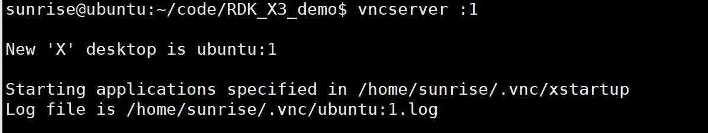
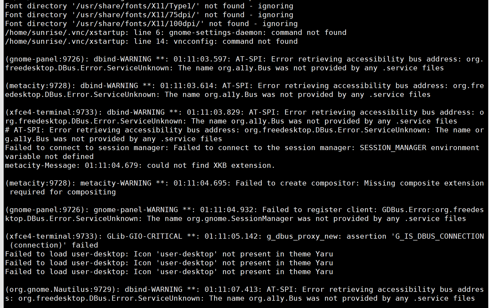

## 地平线旭日 X3 VNC 远程桌面灰屏解决

解决 windows 使用 VNC 远程连接地平线旭日 X3 开发板桌面环境灰屏的问题。

### 1 查看问题

通过启动vncserver后的log文件确认问题。

启动 vnc 服务
```bash
vncserver :1
```

通过 terminal 输出可以看到日志文件的存储位置




打开查看该文件后发现首当其冲是权限问题：说xstartup的权限不够


### 2 解决方案

给 xstartup 增加执行权限

```bash
chmod +x ~/.vnc/xstartup
```

更新一些必要软件

```bash
sudo apt-get install gnome-panel gnome-settings-daemon metacity nautilus gnome-terminal
```

修改xstartup文件为

```bash
#!/bin/bash
export XKL_XMODMAP_DISABLE=1
unset SESSION_MANAGER
unset DBUS_SESSION_BUS_ADDRESS
gnome-panel &
gnome-settings-daemon &
metacity &
nautilus &
gnome-terminal &

# [ -x /etc/vnc/xstartup ] && exec /etc/vnc/xstartup
# [ -r $HOME/.Xresources ] && xrdb $HOME/.Xresources
xsetroot -solid grey
vncconfig -iconic &
x-terminal-emulator -geometry 80x24+10+10 -ls -title "$VNCDESKTOP Desktop" &
# x-window-manager &
exec gnome-session &

```

重启vncserver的服务

```bash
vncserver -kill :1

vncserver :1
```

查看对应的log文件貌似就没什么问题了。只是报错说加载桌面的一些图标失败，字体找不到之类的，但是有终端和桌面，够用了。后面如果不够用再解决吧。



使用 VNC 重新连接即可。
