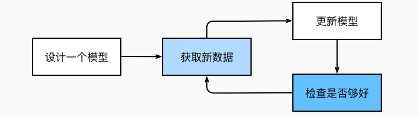
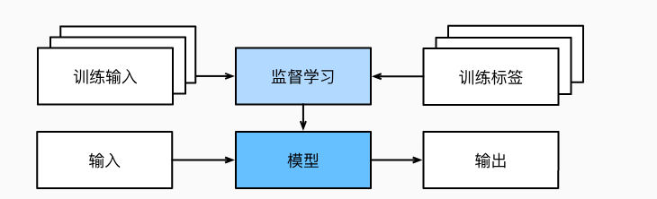
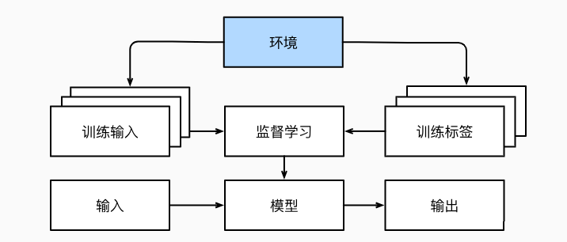
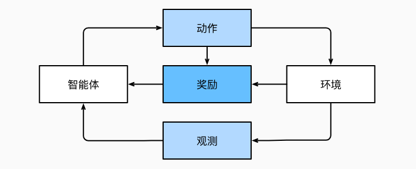

## 深度学习介绍

对于具备完善业务逻辑的任务，大多数情况下，正常的人都可以给出一个符合业务逻辑的应用程序。但是对于一些包含超过人类所能考虑到的逻辑的任务，例如面对如下任务：
* 编写一个应用程序，接受地理信息、卫星图像和一些历史天气信息，并预测明天的天气；
* 编写一个应用程序，接受自然文本表示的问题，并正确回答该问题；
* 编写一个应用程序，接受一张图像，识别出该图像所包含的人，并在每个人周围绘制轮廓；
* 编写一个应用程序，向用户推荐他们可能喜欢，但在自然浏览过程中不太可能遇到的产品。

即使是顶级程序员也无难以提出完美的解决方案， 原因可能各不相同。有时任务可能遵循一种随着时间推移而变化的模式，我们需要程序来自动调整。 有时任务内的关系可能太复杂（比如像素和抽象类别之间的关系），需要数千或数百万次的计算。 即使人类的眼睛能毫不费力地完成这些难以提出完美解决方案的任务，这其中的计算也超出了人类意识理解范畴。

机器学习（machine learning，ML）是一类强大的可以从经验中学习的技术。 通常采用观测数据或与环境交互的形式，机器学习算法会积累更多的经验，其性能也会逐步提高。 相反，对于一直执行相同的业务逻辑，无论积累多少经验，都不会自动提高，除非开发人员认识到问题并更新软件。

### 1 一个机器学习的例子

手机助手都有特定的唤醒词，假如需要我们编写程序来响应一个“唤醒词”（比如“Alexa”“小爱同学”和“Hey Siri”）。整体工作流程如下图所示：


从传统的编程手段出发，很难有解决的方法。机器学习可以通过收集一个包含大量音频样本的数据集（dataset），并对包含和不包含唤醒词的样本进行标记。 利用机器学习算法，我们不需要设计一个“明确地”识别唤醒词的系统。 相反，我们只需要定义一个灵活的程序算法，其输出由许多参数（parameter）决定，然后使用数据集来确定当下的“最佳参数集”，这些参数通过某种性能度量方式来达到完成任务的最佳性能。

任一调整参数后的程序被称为模型（model）。 通过操作参数而生成的所有不同程序（输入-输出映射）的集合称为“模型族”。 使用数据集来选择参数的元程序被称为学习算法（learning algorithm）。

在开始用机器学习算法解决问题之前，我们必须精确地定义问题，确定输入（input）和输出（output）的性质，并选择合适的模型族。

在本例中，模型接收一段音频作为输入，然后在是或否中生成一个选择作为输出。 如果一切顺利，经过一番训练，模型对于“片段是否包含唤醒词”的预测通常是正确的。

在机器学习中，学习（learning）是一个训练模型的过程。 通过这个过程，我们可以发现正确的参数集，从而使模型强制执行所需的行为。 换句话说，我们用数据训练（train）模型。

训练过程通常包含如下步骤：




* 从一个随机初始化参数的模型开始，这个模型基本没有“智能”；
* 获取一些数据样本（例如，音频片段以及对应的是或否标签）
* 调整参数，使模型在这些样本中表现得更好
* 重复第（2）步和第（3）步，直到模型在任务中的表现令人满意

在这里，我们没有编写唤醒词识别器，而是编写了一个“学习”程序。 如果我们用一个巨大的带标签的数据集，它很可能可以“学习”识别唤醒词。 这种“通过用数据集来确定程序行为”的方法可以被看作用数据编程（programming with data）。


### 2 机器学习中的关键组件

核心组件：
* 可以用来学习的数据（data）；
* 如何转换数据的模型（model）；
* 一个目标函数（objective function），用来量化模型的有效性；
* 调整模型参数以优化目标函数的算法（algorithm）。

#### 2.1 数据

每个数据集由一个个样本（example, sample）组成，大多时候，它们遵循独立同分布(independently and identically distributed, i.i.d.)。 样本有时也叫做数据点（data point）或者数据实例（data instance），通常每个样本由一组称为特征（features，或协变量（covariates））的属性组成。 机器学习模型会根据这些属性进行预测。 在上面的监督学习问题中，要预测的是一个特殊的属性，它被称为标签（label，或目标（target））。

当处理图像数据时，每一张单独的照片即为一个样本，它的特征由每个像素数值的有序列表表示。

当每个样本的特征类别数量都是相同的时候，其特征向量是固定长度的，这个长度被称为数据的维数（dimensionality）。 固定长度的特征向量是一个方便的属性，它可以用来量化学习大量样本。然而，并不是所有的数据都可以用“固定长度”的向量表示。 以图像数据为例，如果它们全部来自标准显微镜设备，那么“固定长度”是可取的； 但是如果图像数据来自互联网，它们很难具有相同的分辨率或形状。 这时，将图像裁剪成标准尺寸是一种方法，但这种办法很局限，有丢失信息的风险。 此外，文本数据更不符合“固定长度”的要求。与传统机器学习方法相比，深度学习的一个主要优势是可以处理不同长度的数据。

一般来说，拥有越多数据的时候，工作就越容易。 更多的数据可以被用来训练出更强大的模型，从而减少对预先设想假设的依赖。 数据集的由小变大为现代深度学习的成功奠定基础。 在没有大数据集的情况下，许多令人兴奋的深度学习模型黯然失色。 就算一些深度学习模型在小数据集上能够工作，但其效能并不比传统方法高。

仅仅拥有海量的数据是不够的，我们还需要正确的数据。 如果数据中充满了错误，或者如果数据的特征不能预测任务目标，那么模型很可能无效。糟糕的预测性能甚至会加倍放大事态的严重性。 一种常见的问题来自不均衡的数据集，比如在一个训练数据集中，某些类别的属性没有样本表示，当模型遇到这样的预测对象的时候，就会束手无策。

当数据不具有充分代表性，甚至包含了一些社会偏见时，模型就很有可能有偏见。

#### 2.2 模型

大多数机器学习会涉及到数据的转换。深度学习与经典方法的区别主要在于：前者关注的功能强大的模型，这些模型由神经网络错综复杂的交织在一起，包含层层数据转换，因此被称为深度学习（deep learning）。

#### 2.3 目标函数

机器学习，可以理解为从经验中学习。这里的“学习”，是指自主提高模型完成某些任务的效能。 在机器学习中，我们需要定义模型的优劣程度的度量，这个度量在大多数情况是“可优化”的，这被称之为目标函数（objective function）。 我们通常定义一个目标函数，并希望优化它到最低点。 因为越低越好，所以这些函数有时被称为损失函数（loss function，或cost function）。 但这只是一个惯例，我们也可以取一个新的函数，优化到它的最高点。 这两个函数本质上是相同的，只是翻转一下符号。

当任务在试图预测数值时，最常见的损失函数是平方误差（squared error），即预测值与实际值之差的平方。 当试图解决分类问题时，最常见的目标函数是最小化错误率，即预测与实际情况不符的样本比例。 有些目标函数（如平方误差）很容易被优化，有些目标（如错误率）由于不可微性或其他复杂性难以直接优化。 在这些情况下，通常会优化替代目标。

通常，损失函数是根据模型参数定义的，并取决于数据集。 在一个数据集上，我们可以通过最小化总损失来学习模型参数的最佳值。 该数据集由一些为训练而收集的样本组成，称为训练数据集（training dataset，或称为训练集（training set））。 然而，在训练数据上表现良好的模型，并不一定在“新数据集”上有同样的性能，这里的“新数据集”通常称为测试数据集（test dataset，或称为测试集（test set））。

训练数据集用于拟合模型参数，测试数据集用于评估拟合的模型。测试性能可能会显著偏离训练性能。 当一个模型在训练集上表现良好，但不能推广到测试集时，这个模型被称为过拟合（overfitting）的。

#### 2.4 优化算法

获得了一些数据源及其表示、一个模型和一个合适的损失函数，接下来就需要一种算法，它能够搜索出最佳参数，以最小化损失函数。 深度学习中，大多流行的优化算法通常基于一种基本方法–梯度下降（gradient descent）。 简而言之，在每个步骤中，梯度下降法都会检查每个参数，看看如果仅对该参数进行少量变动，训练集损失会朝哪个方向移动。 然后，它在可以减少损失的方向上优化参数。

### 3 机器学习分类

#### 3.1 监督学习

监督学习（supervised learning）擅长在“给定输入特征”的情况下预测标签。 每个“特征-标签”对都称为一个样本（example）。 有时，即使标签是未知的，样本也可以指代输入特征。 目标是生成一个模型，能够将任何输入特征映射到标签（即预测）。

监督学习之所以能发挥作用，是因为在训练参数时，我们为模型提供了一个数据集，其中每个样本都有真实的标签。 用概率论术语来说，我们希望预测“估计给定输入特征的标签”的条件概率。

监督学习的学习过程一般可以分为三大步骤：
* 从已知大量数据样本中随机选取一个子集，为每个样本获取真实标签。有时，这些样本已有标签；有时，这些样本可能需要被人工标记。这些输入和相应的标签一起构成了训练数据集；
* 选择有监督的学习算法，它将训练数据集作为输入，并输出一个“已完成学习的模型”；
* 将之前没有见过的样本特征放到这个“已完成学习的模型”中，使用模型的输出作为相应标签的预测。




即使使用简单的描述给定输入特征的预测标签，监督学习也可以采取多种形式的模型，并且需要大量不同的建模决策，这取决于输入和输出的类型、大小和数量。

##### 3.1.1 回归

回归（regression）是最简单的监督学习任务之一。 当标签取任意数值时，我们称之为回归问题，此时的目标是生成一个模型，使它的预测非常接近实际标签值。判断回归问题的一个很好的经验法则是，任何有关“有多少”的问题很可能就是回归问题。

##### 3.1.2 分类

“哪一个”的问题叫做分类（classification）问题。分类问题希望模型能够预测样本属于哪个类别（category，正式称为类（class））。最简单的分类问题是只有两类，这被称之为二项分类（binomial classification）。回归是训练一个回归函数来输出一个数值； 分类是训练一个分类器来输出预测的类别。

给定一个样本特征，模型为每个可能的类分配一个概率。预测类别的概率的大小传达了一种模型的不确定性。当有两个以上的类别时，我们把这个问题称为多项分类（multiclass classification）问题。与解决回归问题不同，分类问题的常见损失函数被称为交叉熵（cross-entropy）。

层次分类(hierarchical classification)。

##### 3.1.3 标记问题

学习预测不相互排斥的类别的问题称为多标签分类（multi-label classification）。

##### 3.1.4 搜索

在信息检索领域，我们希望对一组项目进行排序。 以网络搜索为例，目标不是简单的 "query-page" 分类，而是在海量搜索结果中找到用户最需要的那部分。 搜索结果的排序也十分重要，学习算法需要输出有序的元素子集。

该问题的一种可能的解决方案：首先为集合中的每个元素分配相应的相关性分数，然后检索评级最高的元素。PageRank，谷歌搜索引擎背后最初的秘密武器就是这种评分系统的早期例子，但它的奇特之处在于它不依赖于实际的查询。 在这里，他们依靠一个简单的相关性过滤来识别一组相关条目，然后根据PageRank对包含查询条件的结果进行排序。 

##### 3.1.5 推荐系统

另一类与搜索和排名相关的问题是推荐系统（recommender system），它的目标是向特定用户进行“个性化”推荐。 

推荐系统会为“给定用户和物品”的匹配性打分，这个“分数”可能是估计的评级或购买的概率。 由此，对于任何给定的用户，推荐系统都可以检索得分最高的对象集，然后将其推荐给用户。

尽管推荐系统具有巨大的应用价值，但单纯用它作为预测模型仍存在一些缺陷。 首先，我们的数据只包含“审查后的反馈”：用户更倾向于给他们感觉强烈的事物打分。 此外，推荐系统有可能形成反馈循环：推荐系统首先会优先推送一个购买量较大（可能被认为更好）的商品，然而目前用户的购买习惯往往是遵循推荐算法，但学习算法并不总是考虑到这一细节，进而更频繁地被推荐。 

##### 3.1.6 序列学习

如果输入是连续的，模型可能就需要拥有“记忆”功能。  序列学习需要摄取输入序列或预测输出序列，或两者兼而有之。 具体来说，输入和输出都是可变长度的序列。

1）标记和解析

这涉及到用属性注释文本序列，输入和输出的数量基本上是相同的。 通常，目标是基于结构和语法假设对文本进行分解和注释，以获得一些注释。 

2）自动语音识别

在语音识别中，输入序列是说话人的录音，输出序列是说话人所说内容的文本记录。 它的挑战在于，与文本相比，音频帧多得多（声音通常以8kHz或16kHz采样）。 也就是说，音频和文本之间没有1:1的对应关系，因为数千个样本可能对应于一个单独的单词。 这也是“序列到序列”的学习问题，其中输出比输入短得多。

3）文本到语音

这与自动语音识别相反。 换句话说，输入是文本，输出是音频文件。 在这种情况下，输出比输入长得多。 

4）机器翻译

在语音识别中，输入和输出的出现顺序基本相同。 而在机器翻译中，颠倒输入和输出的顺序非常重要。 换句话说，虽然我们仍将一个序列转换成另一个序列，但是输入和输出的数量以及相应序列的顺序大都不会相同。

下面这个例子，“错误的对齐”反应了德国人喜欢把动词放在句尾的特殊倾向。
```bash
德语:       Haben Sie sich schon dieses grossartige Lehrwerk angeschaut?
英语:       Did you already check out this excellent tutorial?
错误的对齐:  Did you yourself already this excellent tutorial looked-at?
```

其他学习任务也有序列学习的应用。 例如，确定“用户阅读网页的顺序”是二维布局分析问题。 再比如，对话问题对序列的学习更为复杂：确定下一轮对话，需要考虑对话历史状态以及现实世界的知识。


#### 3.2 无监督学习

监督学习需要向模型提供巨大数据集：每个样本包含特征和相应标签值。数据中不含有“目标”的机器学习问题通常被为无监督学习（unsupervised learning）。

无监督学习可以解决的问题：

* 聚类（clustering）问题，没有标签的情况下，给数据分类。
* 主成分分析（principal component analysis）问题，找到少量的参数来准确地捕捉数据的线性相关属性。
* 因果关系（causality）和概率图模型（probabilistic graphical models）问题，描述观察到的许多数据的根本原因。
* 生成对抗性网络（generative adversarial networks），提供一种合成数据的方法，甚至像图像和音频这样复杂的非结构化数据。


#### 3.3 与环境互动

预先获取大量数据，然后启动模型，不再与环境交互。 这里所有学习都是在算法与环境断开后进行的，被称为离线学习（offline learning）。 

对于监督学习，从环境中收集数据的过程可以描述为：




离线学习的特点：
*  好的一面是，我们可以孤立地进行模式识别，而不必分心于其他问题。
*  缺点是，解决的问题相当有限。

我们可能会期望人工智能不仅能够做出预测，而且能够与真实环境互动。 与预测不同，“与真实环境互动”实际上会影响环境。 这里的人工智能是“智能代理”，而不仅是“预测模型”。

当训练和测试数据不同时，会出现分布偏移（distribution shift）的问题。


#### 3.4 强化学习

在强化学习问题中，智能体（agent）在一系列的时间步骤上与环境交互。 在每个特定时间点，智能体从环境接收一些观察（observation），并且必须选择一个动作（action），然后通过某种机制（有时称为执行器）将其传输回环境，最后智能体从环境中获得奖励（reward）。 此后新一轮循环开始，智能体接收后续观察，并选择后续操作，依此类推。 

强化学习的过程如下图：



强化学习的目标是产生一个好的策略（policy）。 强化学习智能体选择的“动作”受策略控制，即一个从环境观察映射到行动的功能。

强化学习框架的通用性十分强大。可以将任何监督学习问题转化为强化学习问题。 假设我们有一个分类问题，可以创建一个强化学习智能体，每个分类对应一个“动作”。 然后，我们可以创建一个环境，该环境给予智能体的奖励。 这个奖励与原始监督学习问题的损失函数是一致的。

强化学习还可以解决许多监督学习无法解决的问题。 在强化学习中，我们并不假设环境告诉智能体每个观测的最优动作。 一般来说，智能体只是得到一些奖励。 此外，环境甚至可能不会告诉是哪些行为导致了奖励。

强化学习可能还必须处理部分可观测性问题。 也就是说，当前的观察结果可能无法阐述有关当前状态的所有信息。

在任何时间点上，强化学习智能体可能知道一个好的策略，但可能有许多更好的策略从未尝试过的。 强化学习智能体必须不断地做出选择：是应该利用当前最好的策略，还是探索新的策略空间（放弃一些短期回报来换取知识）。

一般的强化学习问题是一个非常普遍的问题。 智能体的动作会影响后续的观察，而奖励只与所选的动作相对应。 环境可以是完整观察到的，也可以是部分观察到的。

当环境可被完全观察到时，强化学习问题被称为马尔可夫决策过程（markov decision process）。 当状态不依赖于之前的操作时，我们称该问题为上下文赌博机（contextual bandit problem）。 当没有状态，只有一组最初未知回报的可用动作时，这个问题就是经典的多臂赌博机（multi-armed bandit problem）。

### 4 深度学习发展

大约2010年开始，那些在计算上看起来不可行的神经网络算法变得热门起来，实际上是以下两点导致的： 
* 其一，随着互联网的公司的出现，为数亿在线用户提供服务，大规模数据集变得触手可及； 
* 另外，廉价又高质量的传感器、廉价的数据存储（克莱德定律）以及廉价计算（摩尔定律）的普及，特别是GPU的普及，使大规模算力唾手可得。

在过去取得巨大进步的想法;
* 新的容量控制方法，如dropout (Srivastava et al., 2014)，有助于减轻过拟合的危险。这是通过在整个神经网络中应用噪声注入 (Bishop, 1995) 来实现的，出于训练目的，用随机变量来代替权重。
* 注意力机制解决了困扰统计学一个多世纪的问题：如何在不增加可学习参数的情况下增加系统的记忆和复杂性。研究人员通过使用只能被视为可学习的指针结构 (Bahdanau et al., 2014) 找到了一个优雅的解决方案。不需要记住整个文本序列（例如用于固定维度表示中的机器翻译），所有需要存储的都是指向翻译过程的中间状态的指针。这大大提高了长序列的准确性，因为模型在开始生成新序列之前不再需要记住整个序列。
* 多阶段设计。例如，存储器网络 (Sukhbaatar et al., 2015) 和神经编程器-解释器 (Reed and De Freitas, 2015)。它们允许统计建模者描述用于推理的迭代方法。这些工具允许重复修改深度神经网络的内部状态，从而执行推理链中的后续步骤，类似于处理器如何修改用于计算的存储器。
* 另一个关键的发展是生成对抗网络 (Goodfellow et al., 2014) 的发明。传统模型中，密度估计和生成模型的统计方法侧重于找到合适的概率分布（通常是近似的）和抽样算法。因此，这些算法在很大程度上受到统计模型固有灵活性的限制。生成式对抗性网络的关键创新是用具有可微参数的任意算法代替采样器。然后对这些数据进行调整，使得鉴别器（实际上是一个双样本测试）不能区分假数据和真实数据。通过使用任意算法生成数据的能力，它为各种技术打开了密度估计的大门。即使是业余的涂鸦者也可以根据描述场景布局的草图生成照片级真实图像。
* 在许多情况下，单个GPU不足以处理可用于训练的大量数据。在过去的十年中，构建并行和分布式训练算法的能力有了显著提高。
* 并行计算的能力也对强化学习的进步做出了相当关键的贡献。这导致了计算机在围棋、雅达里游戏、星际争霸和物理模拟（例如，使用MuJoCo）中实现超人性能的重大进步。如果有大量的（状态、动作、奖励）三元组可用，即只要有可能尝试很多东西来了解它们之间的关系，强化学习就会发挥最好的作用。
* 深度学习框架在传播思想方面发挥了至关重要的作用。


*机器学习既是人工智能的一个分支，也是人工智能的一种方法。深度学习是机器学习的一个子集。深度学习是“深度”的，模型学习了许多“层”的转换，每一层提供一个层次的表示。由于表示学习（representation learning）目的是寻找表示本身，因此深度学习可以称为“多级表示学习”。*
