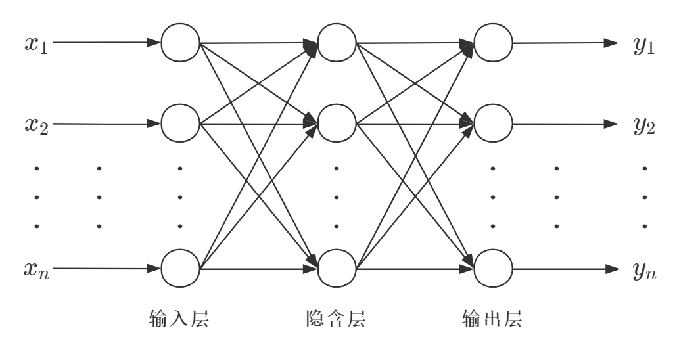
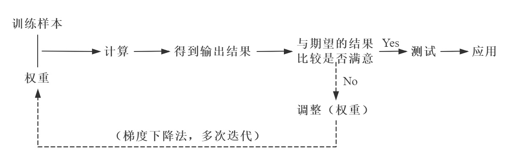
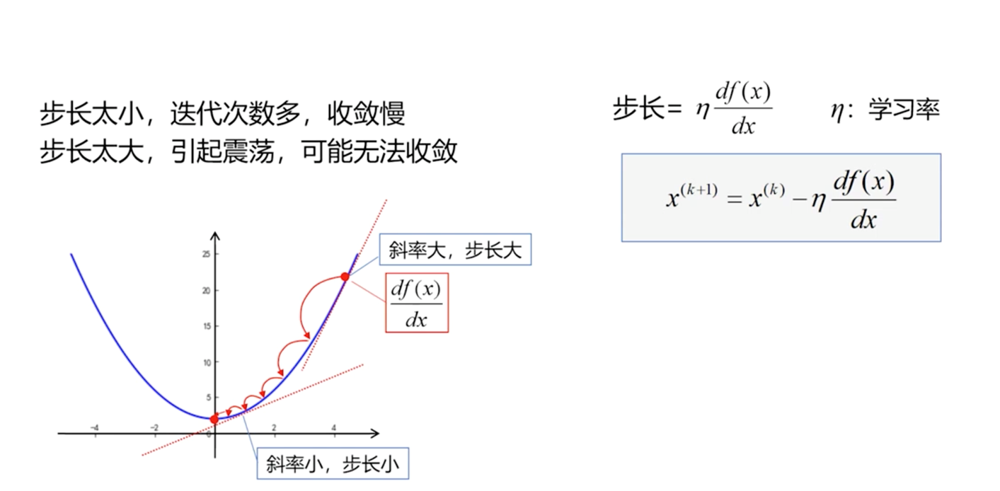
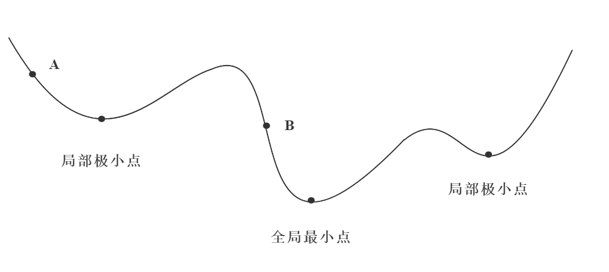

##  BP 神经网络原理

BP (Back Propagation) 神经网络是1986年由 Rumelhart 和 McClelland 为首的科学家提出的概念，是一种按照误差逆向传播算法训练的多层前馈神经网络，是应用最广泛的神经网络。

### 1 BP 神经网络的结构和传播规则

BP神经网络由 输入层、隐含层（也称中间层）和 输出层 构成 ，其中隐含层有一层或者多层。每一层可以有若干个节点。层与层之间节点的连接状态通过 权重 来体现。

BP神经网络的核心步骤如下。其中，实线代表正向传播，虚线代表反向传播。

#### 1.1 正向传播

数据（信息、信号）从输入端输入后，沿着网络的指向，乘以对应的权重后再加和，再将结果作为输入在激活函数中计算，将计算的结果作为输入传递给下一个节点。依次计算，直到得到最终结果。
通过每一层的感知器，层层计算，得到输出，每个节点的输出作为下一个节点的输入。这个过程就是正向传播。

##### 1.1.1 激活函数

必须处处可导（一般都使用S型函数）。

sigmoid 函数：

$$
\delta(x) = \frac{1}{1 + e^{-x}}
$$

sigmoid 函数的导函数：

$$
\delta ^{'} (x) = \delta(x) (1 - \delta(x))
$$

##### 1.1.2 前向传播计算

如前面的 BP 神经网络结构图所示，使用 $w_{jk}^{l}$ 表示从网络第 (l-1)层中的第 k 个神经元指向网络第 l 层中的第 j 个神经元的连接权重；$b_{j}^{l}$ 表示网络第 l 层中的第 j 个神经元的 bias；$y_{j}^{l}$ 表示网络第 l 层中的第 j 个神经元的线性输出的结果；$x_{j}^{l}$ 表示网络第 l 层中的第 j 个神经元的激活函数的输出。

那么网络第 l 层中的第 j 个神经元的激活函数的输出可以表示成：

$$
x_{j}^{l} = \delta (\sum _k w_{jk}^{l}a_k^{l-1} + b_l^l)
$$

写成矩阵形式，定义权重矩阵 $w^l$，权重矩阵的每一个元素都代表一个权重：

$$
w^l = \left[
\begin{matrix}
w_{11}^l & w_{12}^l & w_{13}^l \\
w_{21}^l & w_{22}^l & w_{23}^l \\
w_{31}^l & w_{32}^l & w_{33}^l \\
\end{matrix}
\right]
$$

同样可以写出 x、b、y 的矩阵形式：

$$
x^l = \left[
\begin{matrix}
x_1^l \\
x_2^l \\
x_3^l \\
\end{matrix}
\right]
$$

$$
b^l = \left[
\begin{matrix}
b_1^l \\
b_2^l \\
b_3^l \\
\end{matrix}
\right]
$$

$$
y^l = \delta \left( \left[
\begin{matrix}
w_{11}^l & w_{12}^l & w_{13}^l \\
w_{21}^l & w_{22}^l & w_{23}^l \\
w_{31}^l & w_{32}^l & w_{33}^l \\
\end{matrix}
\right] 
\cdot
\left[
\begin{matrix}
x_1^{l-1} \\
x_2^{l-1} \\
x_3^{l-1} \\
\end{matrix}
\right]
+
\left[
\begin{matrix}
b_1^l \\
b_2^l \\
b_3^l \\
\end{matrix}
\right] \right)
$$

即,

$$
y^l = \delta \left( \left[
\begin{matrix}
w_{11}^lx_1^{l-1} + w_{12}^lx_2^{l-1} + w_{13}^lx_3^{l-1} + b_1^l \\
w_{21}^lx_1^{l-1} + w_{22}^lx_2^{l-1} + w_{23}^lx_3^{l-1} + b_2^l \\
w_{31}^lx_1^{l-1} + w_{32}^lx_2^{l-1} + w_{33}^lx_3^{l-1} + b_3^l \\
\end{matrix}
\right] \right)
$$

前向传播的一般形式：

$$
y^l = \delta (w^l \cdot x^{l-1} + b^l)
$$

这里的输入只有一条数据，因此输入数据表现为一维列向量。多样本输入的时候是一样的，只是输入数据变成了一个二维的矩阵，矩阵的每一列都是一个输入样本数据。

多样本输入可以表示为：

$$
Y^l = \delta (w^l \cdot X^{l-1} +b^l) \\
X^l = \delta (Y^l)
$$

#### 1.2 梯度下降算法

梯度下降法是训练神经网络和线性分类器的一种普遍方法。斜率是函数的导数。梯度上的每个元素都会指明函数在该点处各个方向的斜率，梯度指向函数变化最快的方向。正梯度和负梯度指向变大最快的方向和变小最快的方向。

在正向传播的过程中，有一个 与期望的结果比较是否满意 的环节，在这个环节中实际的输出结果与期望的输出结果之间就会产生一个误差。为了减小这个误差，这个问题就转换为了一个优化问题。在这个优化问题中，目标函数就是损失函数（Loss function）。

$$
Loss = \frac{1}{2} \sum _{i=1}^{n} (y_i - \hat{y}_{i})^2 \\
= \frac{1}{2} \sum _{i=1}^{n} [y_i - (wx_i + b)]^2
$$

为了让实际的输出结果与期望的输出结果之间的误差最小，需要寻找损失函数的最小值。

##### 1.2.1 使用迭代的方式寻找最小值

解析解：通过严格的公示推倒计算，给出的方程的精确解，任意精度下满足方程。

数值解：在一定条件下，通过某种近似计算得到的解，能够在给定的精度下满足方程。

迭代的方法寻找损失最小值 就是通过 梯度下降 + 迭代 的方式寻找数值解。

在迭代过程中，每次迭代各层节点之间的权重将不断地更新。

$$
W_{(t+1)}=W_{(t)} - \eta \frac{\partial Loss}{\partial w} + \alpha [W_{(t)} - W_{(t - 1)}]
$$

* $\eta \frac{\partial Loss}{\partial w}$，每次更新权重的调整量
* $\alpha [W_{(t)} - W_{(t - 1)}]$，更新权重时的平滑项

每次迭代都会更新一次权重，之后将更新的权重与训练样本进行正向传播，如果得到的结果不满意，则进行反向传播，继续迭代。如此往复，直到得到满意的结果为止。

##### 1.2.2 局部最小值和全局最小值

梯度下降学习法，总是沿着梯度下降的方向对权重进行调整。考虑梯度存在多个极值点，那么这些极值点中只有一个时全局最小值点，其他都是局部最小值点。

当权重调整至某个局部最小值附近的时候，由于总是沿着梯度下降的方向对权重进行调整，那么最终就会将权重调整至这个局部最小值点，并把它当作是全局最小值点了。但是实际上此时权重并不是处于全局最小值点，这样的情况并不是我们期望的。

##### 1.2.3 算法改进

###### 1.2.3.1 引入动量项

$$
W_{(t+1)}=W_{(t)} - \eta  [(1 - \alpha) \frac{\partial Loss}{\partial W_{(t)}} + \alpha \frac{\partial Loss}{\partial W_{(t-1)}}]
$$

* $\eta > 0$，为学习率
* $0 \le \alpha < 1$ ，为动量因子
* 通过引入动量项，给权重调整量添加一个梯度正方向的修正，类似于物体的惯性的效果，可以一定程度解决把局部最小值当做全局最小值的问题。

###### 1.2.3.2 变步长法
学习率 $\eta$ 选的太小，会导致收敛太慢；选的太大，会导致权重调整过头，导致震荡甚至发散。可以采用变步长法进行改进：
$$
W_{(t+1)}=W_{(t)} - \eta (t) \frac{\partial Loss}{\partial w} \\
\eta (t) = 2^{\lambda} \eta (t - 1) \\
\lambda = sgn[\frac{\partial Loss}{\partial w_{(t)}} \cdot \frac{\partial Loss}{\partial w_{(t - 1)}}]
$$
* 上面第三个式子根据相邻两次计算的梯度乘积来计算符号函数，可以实时调整学习率。当连续两次迭代的梯度的方向相同，说明下降太慢，这时通过上面第二个式子使步长加倍；当连续两次迭代的梯度的方向相反，说明下降过头，这时通过上面第二个式子使步长减半。
* 上面的第二个式子里面的 2，可以根据实际需要，改成其他值，以此来控制步长的变化快慢。

###### 1.2.3.3 引入动量项与变步长法结合

$$
W_{(t+1)}=W_{(t)} - \eta (t) [(1 - \alpha) \frac{\partial Loss}{\partial w_{(t)}} + \alpha \frac{\partial Loss}{\partial w_{(t - 1)}}] \\
\eta (t) = 2^{\lambda} \eta (t - 1) \\
\lambda = sgn[\frac{\partial Loss}{\partial w_{(t)}} \cdot \frac{\partial Loss}{\partial w_{(t - 1)}}]
$$

#### 1.3 反向传播

##### 1.3.1 求梯度矩阵

假设函数 $f: R^{m \times n} \rightarrow R$ 可以把输入矩阵映射为一个实数，那么函数 $f$ 的梯度定义为：

$$
\nabla _A f(A) = 
\left[
\begin{matrix}
\frac{\partial f(A)}{\partial A_{11}} & \frac{\partial f(A)}{\partial A_{12}} & \dotsc & \frac{\partial f(A)}{\partial A_{1n}} \\
\frac{\partial f(A)}{\partial A_{21}} & \frac{\partial f(A)}{\partial A_{22}} & \dotsc & \frac{\partial f(A)}{\partial A_{2n}} \\
\vdots & \vdots & \ddots & \vdots \\
\frac{\partial f(A)}{\partial A_{m1}} & \frac{\partial f(A)}{\partial A_{m2}} & \dotsc & \frac{\partial f(A)}{\partial A_{mn}} \\
\end{matrix}
\right]
$$

即

$$
(\nabla_A f(A))_{ij} = \frac{\partial f(A)}{\partial A_{ij}}
$$

同样地，对于输入向量的函数 $f: R^{n \times 1} \rightarrow R$，那么：

$$
\nabla_x f(x) =
\left[
\begin{matrix}
\frac{\partial f(x)}{\partial x_1} \\
\frac{\partial f(x)}{\partial x_2} \\
\vdots \\
\frac{\partial f(x)}{\partial x_n} \\
\end{matrix}
\right]
$$

根据上面的矩阵和向量的梯度矩阵的定义，可以得到：

$$
\nabla_x (f(x) + g(x)) = \nabla_x f(x) + \nabla_x g(x) \\
\nabla_x (tf(x)) = t\nabla_x f(x), t \in R
$$

##### 1.3.2 海塞矩阵

定义一个输入为 n 维向量，输出为实数的函数 $f: R^n \rightarrow R$，那么海塞矩阵定义为多元函数 $f$ 的二阶偏导数构成的方阵：

$$
\nabla _x ^2 f(x) = 
\left[
\begin{matrix}
\frac{\partial ^2 f(x)}{\partial x_1^2} & \frac{\partial ^2 f(x)}{\partial x_1 \partial x_2} & \cdots & \frac{\partial ^2 f(x)}{\partial x_1 \partial x_n} \\
\frac{\partial ^2 f(x)}{\partial x_2 \partial x_1} & \frac{\partial ^2 f(x)}{\partial x_2 ^2} & \cdots & \frac{\partial ^2 f(x)}{\partial x_2 \partial x_n} \\
\vdots & \vdots & \ddots & \vdots \\
\frac{\partial ^2 f(x)}{\partial x_n \partial x_1} & \frac{\partial ^2 f(x)}{\partial x_n \partial x_2} & \cdots & \frac{\partial ^2 f(x)}{\partial x_n^2} \\
\end{matrix}
\right]
$$

由上式可以看出，海塞矩阵一定是对称矩阵。

根据梯度矩阵和海塞矩阵可以得到：

$b \in R^n , x \in R^n, A \in R^{n \times n}$，A 为对称矩阵，b 和 x 都是列向量，那么有：
$$
\nabla _x b^T x = b \\
\nabla _x x^T Ax = 2Ax \\
\nabla _x ^2 x^T Ax = 2A \\
$$

##### 1.3.3 矩阵相乘和矩阵对应元素相乘

有矩阵 $A = \left[ \begin{matrix}
1 & 2 \\
3 & 4 \\
\end{matrix}\right]$，$B = \left[ \begin{matrix}
-1 & -2 \\
-3 & -4 \\
\end{matrix}\right]$:

* 矩阵相乘：
  $$
  AB = \left[ \begin{matrix}
  1 \times (-1) + 2 \times (-3) & 1 \times (-2)  + 2 \times (-4) \\
  3 \times (-1) + 4 \times (-3) &  3\times (-2) + 4 \times (-4) \\
  \end{matrix}\right] = \left[ \begin{matrix}
  -7 & -10 \\
  -15 & -22 \\
  \end{matrix}\right]
  $$

* 矩阵对应元素相乘：
  $$
  A \odot B = \left[ \begin{matrix}
  1 \times (-1) & 2 \times (-2) \\
  3 \times (-3) & 4 \times (-4) \\
  \end{matrix}\right] = \left[ \begin{matrix}
  -1 & -4 \\
  -9 & -16 \\
  \end{matrix}\right]
  $$

##### 1.3.4 反向传播原理

反向传播可以得到如何调整权重 $w$ 和偏差 $b$ 能够使损失函数的值沿着梯度下降的方向移动，这表明反向传播需要计算偏导数：
$$
\frac{\partial Loss(a^l, y)}{\partial w_{jk}^l} \\
\frac{\partial Loss(a^l, y)}{\partial b_{j}^l}
$$

其中 $a^l$ 是上一层的输出的激活函数输出。

为了计算这些偏导数，引入中间变量 $e_j^l$，用来表示网络中第 $l$ 层第 j 个神经元的误差。后向传播能够计算出 $e_j^l$，然后将其对应回 $
\frac{\partial Loss(a^l, y)}{\partial w_{jk}^l}$ 和 $\frac{\partial Loss(a^l, y)}{\partial b_{j}^l}
$。

那么，如何定义每一层的误差才合理呢？如果为第 $l$ 层的第 j 个神经元添加一个扰动 $\Delta y_j^l$，使得损失函数的值变小，那么我们就可以认为这是一个好的扰动。通过选择 $\Delta y_j^l$ 与  $\frac{\partial Loss(a^l, y)}{\partial y_{j}^l}$ 的符号相反（梯度下降法的原理），就可以每次都添加一个好的扰动最终达到最优。

秉持上面的思想，可以定义网络第 $l$ 层中第 $j$ 个神经元的误差为：

$$
e_j^l = \frac{\partial Loss(a^l, y)}{\partial y_{j}^l}
$$

从而可以得到每一层误差的向量表示：

$$
e^l = \left[
\begin{matrix}
e_1^l \\
e_2^l \\
\vdots \\
e_n^l \\
\end{matrix}
\right]
$$

###### 1.3.4.1 输出层误差

$$
e_j^l = \frac{\partial L}{\partial a_j^l} \delta ^ {'}(y_j^l)
$$

其中 $\partial L$ 表示 $\partial Loss(a^l, y)$。
上式写成矩阵形式：

$$
e^l = \nabla _a L \odot \delta ^{'}(y^l)
$$

> 说明：
误差定义：
    $$
    e_j^l = \frac{\partial L}{\partial y_j^l}
    $$
根据链式法则得到：
    $$
    e_j^l = \sum _k \frac{\partial L}{\partial a_k^l} \frac{\partial a_k^l}{\partial y_j^l}
    $$
当 $j \ne k$ 时，$\frac{\partial a_k^l}{\partial y_j^l} = 0$，那么上式可以化简为：
    $$
    e_j^l = \frac{\partial L}{\partial a_j^l} \frac{\partial a_j^l}{\partial y_j^l}
    $$
考虑到 $a_j ^l  = \delta (y_j^l)$:
    $$
    e_j^l = \frac{\partial L}{\partial a_j^l} \delta ^ {'}(y_j^l)
    $$
即得到了输出层的误差表示。

###### 1.3.4.2 隐藏层误差

$$
e_j^l = \sum _k w_{jk}^{l+1} e_j^{l+1} \delta ^ {'}(y_j^l)
$$

写成矩阵形式：

$$
e^l = [(w^{l+1})^T e^{l+1}] \odot \delta ^ {'}(y^l)
$$

> 说明：
    $$
    y_k^{l+1} = \sum _j (w^{l+1})^T a_j ^l + b_k^{l+1} \\
    = \sum _j w^{l+1} \delta (y_j ^l) + b_k^{l+1}
    $$
对上式求偏导得到：
    $$
    \frac{\partial y_k^{l+1}}{\partial y_l^l} = w^{l+1} \delta ^{'} (y_j^l)
    $$
结合上面两个式子可以得到：
    $$
    e_j^l = \sum _k w_{jk}^{l+1} e_j^{l+1} \delta ^ {'}(y_j^l)
    $$

###### 1.3.4.3 参数变化率

$$
\frac{\partial L}{\partial b_j^l} = e_j^l \\
\frac{\partial L}{\partial w_{jk}^l} = a_k^{l-1} e_j^l
$$

写成矩阵形式：

$$
\frac{\partial L}{\partial b^l} = e^l \\
\frac{\partial L}{\partial w^l} = e^l (a^{l-1})^T
$$

> 说明：
根据求导法则，可以得到：
    $$
    y_j^l = \sum _k w_{jk}^l a_k^l + b_k^l
    $$
对 $b_k^l$ 求导：
    $$
    \frac{\partial L}{\partial b_j^l} = \frac{\partial L}{\partial y_j^l} \frac{\partial y_j^l}{\partial b_j^l} = e_j^l
    $$
对 $w_{jk}^l$ 求导：
    $$
    \frac{\partial L}{\partial w_{jk}^l} = \frac{\partial L}{\partial y_j^l} \frac{\partial y_j^l}{\partial w_{jk}^l} = a_k ^{l-1}e_j^l
    $$

###### 1.3.4.4 参数更新规则

根据梯度下降原理，想着梯度的反方向更新参数：

$$
b_j^l \leftarrow b_j^l - \eta \frac{\partial L}{\partial b_j^l} \\
w_{jk}^l \leftarrow w_{jk}^l - \eta \frac{\partial L}{\partial w_{jk}^l}
$$

写成矩阵形式：

$$
b^l \leftarrow b^l - \eta \frac{\partial L}{\partial b^l} \\
w^l \leftarrow w^l - \eta \frac{\partial L}{\partial w^l}
$$

###### 1.3.4.5 关于多样本的说明

多样本输入的时候，由于损失函数带有一个 $\frac{1}{m}$ 的常数项，因此参数更新规则都需要添加一个 $\frac{1}{m}$ 的前缀。

* 输出层误差
  
  $$
  dY^l = \nabla _A C \odot \delta ^{'}(Y^l)
  $$
  
  此时 $dY^l$ 不再是列向量，而是一个 m 列的矩阵，每一列都对应一个样本的列向量。

* 隐藏层误差
  
  $$
  dY^l = [(w^{l+1})^TdY^{l+1}] \odot \delta ^{'}(Y^l)
  $$

  此时 $dY^l$ 的维度时 $n \times m$，n 表示第 $l$ 层中的神经元个数，m 表示样本数量。

* 参数变化率
  
  $$
  db^l = \frac{\partial C}{\partial b^l} = \frac{1}{m} MeanOfEachRow(dY^l) \\
  dw^l = \frac{\partial C}{\partial w^l} = \frac{1}{m} dY^l (A^{l-1})^T
  $$

  更新 $B^l$ 时需要对每行求平均值。

* 参数更新
  
  $$
  b^l \leftarrow b^l - \eta \frac{\partial C}{\partial b^l} \\
  w^l \leftarrow w^l - \eta \frac{\partial C}{\partial w^l}
  $$
