## rpi安装Windows搭建网盘和下载机

### 0 需求分析

在同一个局域网内，同时有多种设备（Windows，Linux，Android）需要进行大量的数据共享。另外，还时常需要从百度网盘/夸克网盘等网盘下载文件。不难看出，我的需求很简单，就是一个低功耗的可24小时运行的小机器，最好可以跑 Windows 系统。

**树莓派4B硬件参数：**

* 核心
  CPU：Broadcom BCM2711，1.5 GHz，64-bit，4核心，ARM Cortex-A72 架构，1MB shared L2 cache
  RAM：1、2、4 GB LPDDR4-3200 RAM (shared with GPU)

* 网络
  以太网：10/100/1000 Mbit/s
  无线网：b/g/n/ac 双频 2.4/5 GHz
  蓝牙：5.0

* 多媒体
  GPU：Broadcom VideoCore VI @ 500 MHz
  HDMI：micro-HDMI
  DSI：板载排线

* USB接口
  USB2.0x2，USB2.0x3

* 外围设备
  17× GPIO plus the same specific functions, HAT, and an additional 4× UART, 4× SPI, and 4× I2C connectors

* 电源
  5 V USB-C 输入，或 GPIO 端口输入
  待机 600mA（3W），满负荷 1.25A（6.25 W）

* 操作系统
  Linux
  NetBSD
  OpenBSD
  Plan 9
  RISC OS
  Windows 10 ARM64
  Windows 10 IoT Core
  NixOS

树莓派4B的硬件条件比较好的符合我的需求，因此有了下面的方案：
* 树莓派安装windows之后，连接显示器，打开windows的远程桌面，后面的操作都可以通过远程桌面登录树莓派，减少树莓派的渲染压力
* 树莓派安装Windows 10 ARM64，通过USB3.0接口硬盘柜（或者移动硬盘都可以，硬盘柜可以使用自带阵列的，这样可以提高硬盘的读写能力和数据安全性），利用windows在局域网内共享文件夹，从而在局域网内多种设备（Windows，Linux，Android）可以方便访问硬盘柜
* 在windows中安装百度网盘/夸克网盘等网盘，进而可以不间断下载文件
* 树莓派4B的功率比较低，7*24小时运行，耗电量非常小

### 1 树莓派4B安装Windows

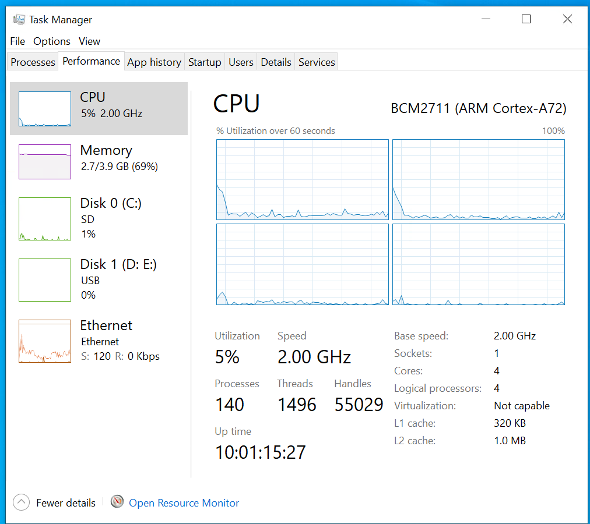

#### 1.1 安装前准备

* 硬件准备
  至少32GB可用空间的SD卡+SD卡驱动器, 或者至少32GB可用空间的外置硬盘/移动硬盘(使用USB传输)
  树莓派 4B (建议最低RAM 2GB)
  一台可以正常运行的Windows电脑

* 资料准备
  下载 WoR (Windows on Raspberry)：[点击下载WoR](https://worproject.com/downloads/thank-you?name=Windows%20on%20Raspberry%20imager%20v2.3.1&url=https%3A%2F%2Fdl.orangedox.com%2FWoR-Release-2.3.1%3Fdl%3D1)
  
  下载合适的镜像文件脚本, 镜像文件总站在[这里](https://uupdump.net/), 无论是Win10/Win11 一定要选择 **arm64** 版本. 版本号请在 **19014~251xx** 之间. 

  开始使用镜像文件脚本下载镜像文件. 首先, 将下载的压缩包解压, 找到 uup_download_windows.cmd文件, 双击运行. 注意, 请确保你的电脑可以科学上网! 然后, 等…

    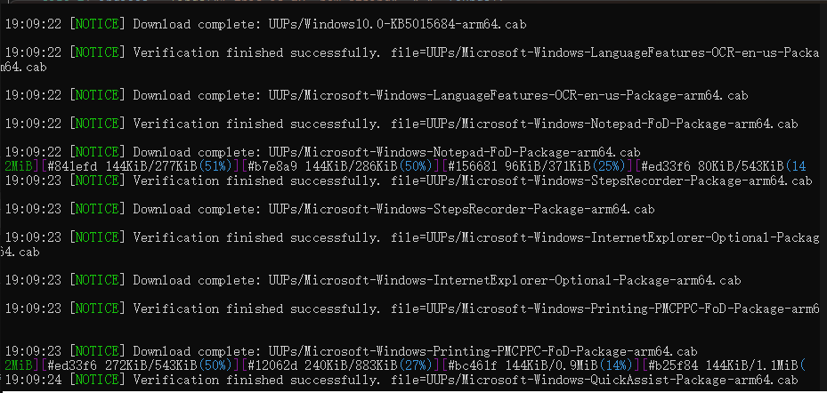

  等到, 出现了, “Press 0 to exit” 时, 在控制台中输入字符 0, 完成镜像文件的下载
 
    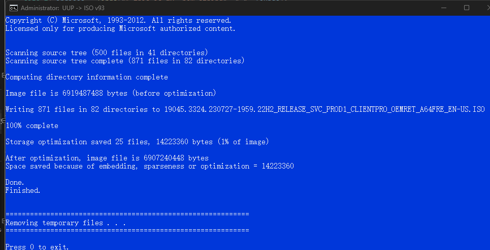

  * 如果不想通过外网下载镜像等相关文件, 这里提供了我所使用的版本: [点击下载](https://pan.baidu.com/s/1PtuMDapooR59Ronxn_wuXg?pwd=m18n), 下载完成后可以直接快进到 **开始安装系统**。

#### 1.2 开始安装系统

* 启动刚刚下载的WoR, 语言什么的选一下, 然后到这里, 根据需求选择设备和存储介质
  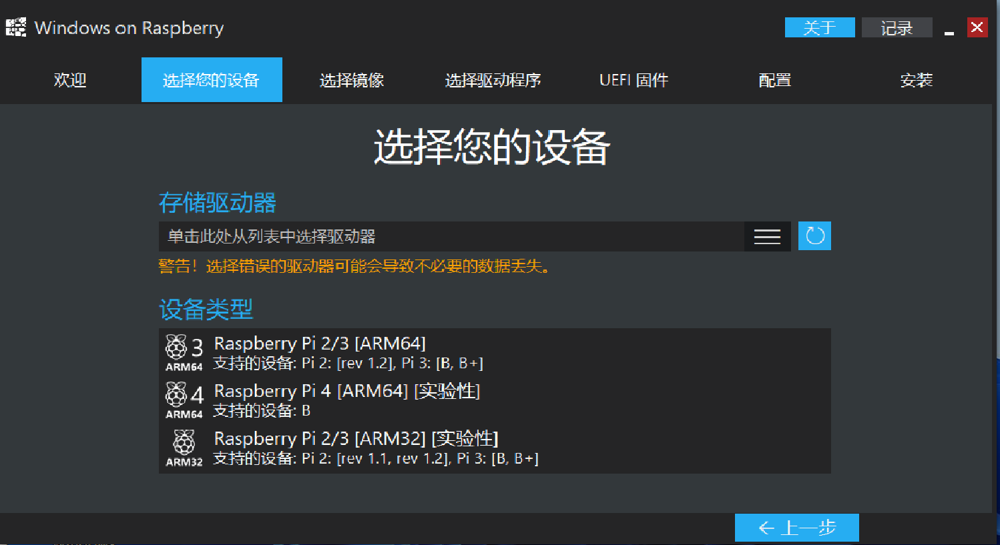

* 好的
  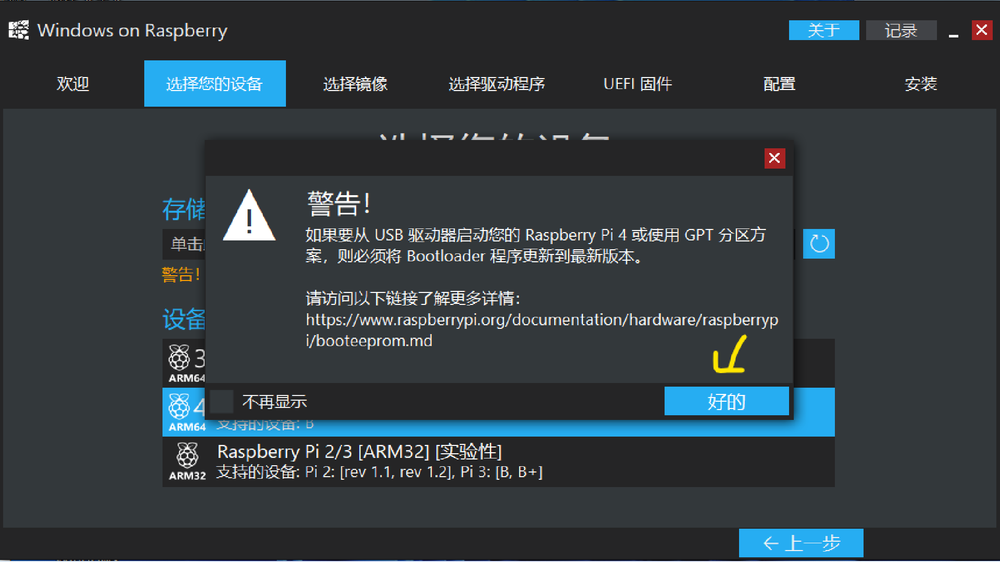

* 点击黄箭头指出的三条杠，在下面选择读卡器，一般前缀为“Disk 1”；
  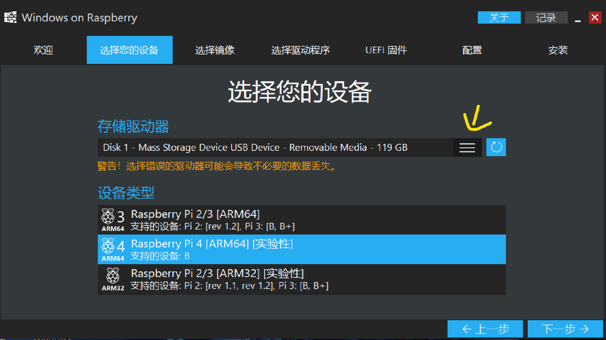

* 点击蓝色的三个点，选择刚刚下载的镜像，下面的Windows版本按照自己情况选，我选Windows专业版，下一步； 
  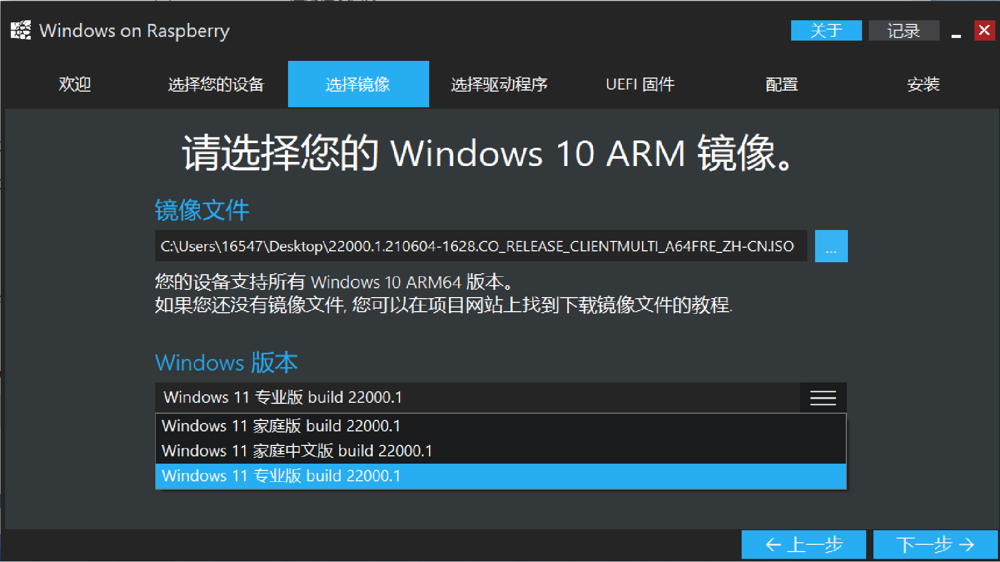

* 驱动，选择**使用网络上提供的最新驱动程序包**，之后需要等待一会
  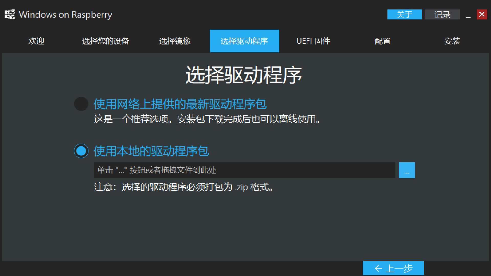

* 不管它，点击“是”，然后选择**使用网络上提供的最新固件**
  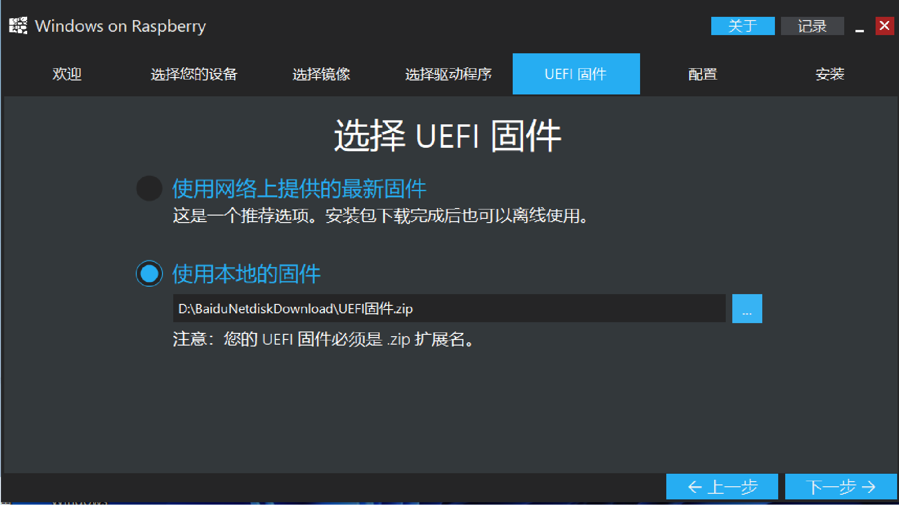

* 下一步；
  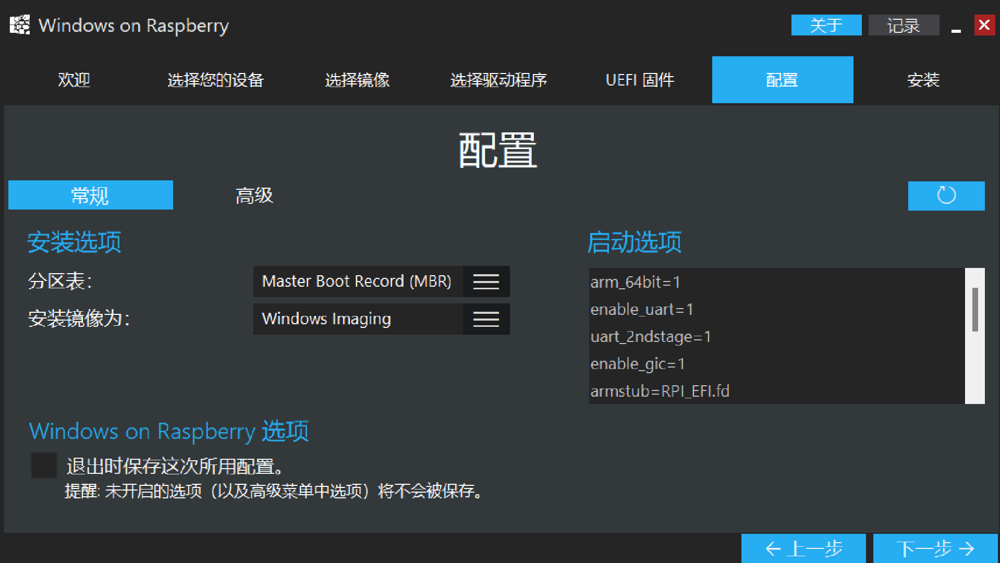

* 安装

* 过程比较慢，128G Class10卡大概半个小时，就是容量小一点的卡，需要的时间会更久一些，所以容量很重要～
  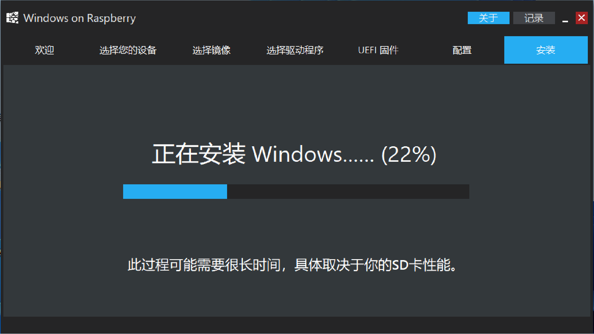

**当提示”安装完成”时就可以弹出读卡器了～**

### 2 启动树莓派上的Windows

把卡插进树莓派，插上电，在出现树莓派logo的一瞬间按下esc，进bios

* 设置第一启动项
  Boot Maintence Manager——Boot Options——Change Boot Order——回车，找到SD/MMC开头的那个回车，然后一路esc回到主界面

* 解除内存3GB限制
  Device Manager——Raspberry Pi Configuration——Advanced 开头的选项——回车Limit RAM to 3GB，上键选择Disable，回车确认，然后一路esc回到主界面，如果有碰到中间提示蓝底黑字，按Y；

然后选择“Reset”重启树莓派，耐心等待一会儿，直到出现“海内存知己，天涯若比邻”就说明你成功了。后面就是 windows 的常规安装的过程了。

* **蓝屏INACCESSIBLE_BOOT_DEVICE解决办法**
  
  如果是第一次开机遇到这个蓝屏，那么说明这个镜像是从UUP下载下来的。由于现在UUP挂了，所以引导不了，需要重新下载可用的镜像并重新安装系统。

  如果Windows之前可以正常使用过，在开机时出现这个蓝屏，那么
  * 在出现树莓派logo的一瞬间狂按esc进入bios；
  * Device Manager——Raspberry Pi Configuration——SD/MMC开头的选项（如果不是其他的选项也可以试下）——第一个选项，回车，选择eMM开头的一项，然后一路esc回到主界面，选择reset，回车

### 3 软件的下载与使用

如果软件提供了Arm64版本, 则优先选择。如果对应软件没有提供Arm64版本, 那么可以选择32位或(x86)版本尝试一下，目前我使用的32位或x86的程序都运行良好。

### 4 远程桌面

windows 默认不开启远程桌面。可以参考[Microsoft官方](https://support.microsoft.com/zh-cn/windows/%E5%A6%82%E4%BD%95%E4%BD%BF%E7%94%A8%E8%BF%9C%E7%A8%8B%E6%A1%8C%E9%9D%A2-5fe128d5-8fb1-7a23-3b8a-41e636865e8c#ID0EDD=Windows_10)开启此功能。
