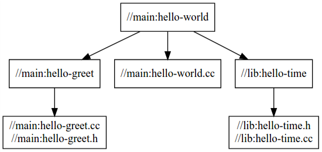
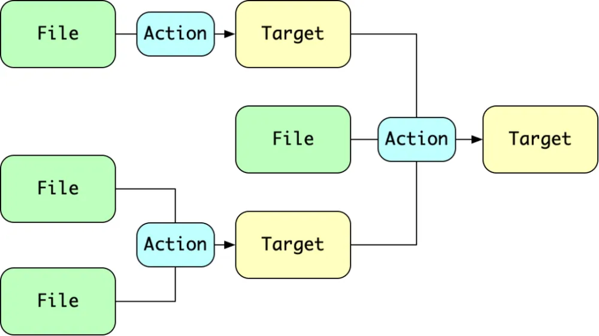
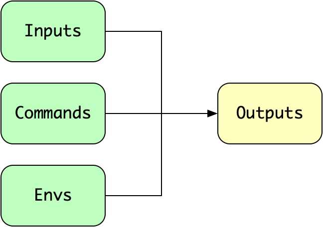
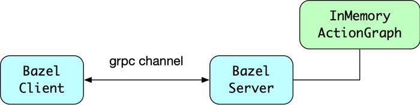

## bazel 编译 C++ 项目

### 1 bazel 安装

参考[官方的安装说明文档](https://gitee.com/link?target=https%3A%2F%2Fbazel.build%2Finstall)，[ubuntu 安装说明文档](https://gitee.com/link?target=https%3A%2F%2Fbazel.build%2Finstall%2Fubuntu)。安装的方法比较多，这里记录了**使用 Bazel 的 apt 代码库安装**和**从源码编译安装**两中方式。

#### 1.1 使用 Bazel 的 apt 代码库安装

* 将 Bazel 分发 URI 添加为软件包来源
```bash
sudo apt install apt-transport-https curl gnupg -y
curl -fsSL https://bazel.build/bazel-release.pub.gpg | gpg --dearmor >bazel-archive-keyring.gpg
sudo mv bazel-archive-keyring.gpg /usr/share/keyrings
echo "deb [arch=amd64 signed-by=/usr/share/keyrings/bazel-archive-keyring.gpg] https://storage.googleapis.com/bazel-apt stable jdk1.8" | sudo tee /etc/apt/sources.list.d/bazel.list
```

组件名称“jdk1.8”仅出于传统原因保留，与受支持或包含的 JDK 版本无关。Bazel 版本与 Java 版本无关。更改“jdk1.8”组件名称将破坏代码库的现有用户。

* 安装和更新 Bazel
```bash
sudo apt update && sudo apt install bazel
sudo apt update && sudo apt full-upgrade
```

bazel 软件包会自动安装最新的稳定版 Bazel。除了最新的 Bazel 之外，还可以安装其他的旧版本，例如：
```bash
sudo apt install bazel-1.0.0
```

可以通过创建符号链接将 bazel 设置为特定版本：
```bash
sudo ln -s /usr/bin/bazel-1.0.0 /usr/bin/bazel
bazel --version  # 1.0.0
```

* 安装 JDK（可选）
Bazel 包含一个专用捆绑 JRE 作为其运行时，不需要安装任何特定版本的 Java。但是，如果使用 Bazel 构建 Java 代码，则必须安装 JDK。
```bash
sudo apt install default-jdk
```

#### 1.2 从源代码编译 Bazel

* 下载 Bazel 的源代码（分发归档）
  从 [GitHub](https://github.com/bazelbuild/bazel/releases) 下载 bazel-<version>-dist.zip，例如 bazel-0.28.1-dist.zip。

  注意：
  * 有一个独立于架构的分发归档。没有特定于架构或操作系统的发行版归档。
  * 这些源代码与 GitHub 源代码树不同。必须使用发行版归档文件来引导 Bazel。无法使用从 GitHub 克隆的源代码树。（分发归档包含引导所需的生成的源文件，它们不属于常规 Git 源代码树。）

  * 将分发归档解压缩到磁盘上的某个位置。
  验证 Bazel 的[发布密钥](https://bazel.build/bazel-release.pub.gpg?hl=zh-cn)所做的签名。

* 在 Ubuntu Linux、macOS 和其他类似 Unix 的系统上引导 Bazel
  * 安装必备项
    * Bash
    * zip、unzip
    * C++ 构建工具链
    * JDK.。版本 21 是必需的。
    * Python。支持版本 2 和 3，安装其中一个就足够了。

    在 Ubuntu Linux 上，可以使用以下命令安装这些要求：
    ```bash
    sudo apt-get install build-essential openjdk-21-jdk python zip unzip
    ```
  * 在 Unix 上引导 Bazel
    * 打开 shell 或终端窗口。
    * 通过 cd 方法解压缩该分发归档所在的目录。
    * 运行编译脚本：`env EXTRA_BAZEL_ARGS="--tool_java_runtime_version=local_jdk" bash ./compile.sh`
    编译后的输出会放在 `output/bazel` 中。这是一个独立的 Bazel 二进制文件，无嵌入式 JDK。可以在任意位置复制它，也可以直接使用。为方便起见，可以将此二进制文件复制到 PATH 上的目录（例如 Linux 上的 `/usr/local/bin`）。若要以可重现的方式构建 bazel 二进制文件，还应在“运行编译脚本”步骤中设置 `SOURCE_DATE_EPOCH`。

  
### 2 bazel 编译 C++ 项目

Bazel是一个类似于Make的编译工具，是Google为其内部软件开发的特点量身定制的工具，如今Google使用它来构建内部大多数的软件。相比 make，Bazel的规则层级更高。

参考官方示例项目：`git clone https://github.com/bazelbuild/examples`

#### 2.1 项目结构

使用Bazel管理的项目一般包含以下几种Bazel相关的文件：WORKSPACE(同WORKSPACE.bazel)，BUILD(同BUILD.bazel)，.bzl 和 .bazelrc 等。

具体结构如下：
```bash
examples
└── cpp-tutorial
    ├──stage1
    │  ├── main
    │  │   ├── BUILD
    │  │   └── hello-world.cc
    │  └── WORKSPACE
    ├──stage2
    │  ├── main
    │  │   ├── BUILD
    │  │   ├── hello-world.cc
    │  │   ├── hello-greet.cc
    │  │   └── hello-greet.h
    │  └── WORKSPACE
    └──stage3
       ├── main
       │   ├── BUILD
       │   ├── hello-world.cc
       │   ├── hello-greet.cc
       │   └── hello-greet.h
       ├── lib
       │   ├── BUILD
       │   ├── hello-time.cc
       │   └── hello-time.h
       └── WORKSPACE
```

例子分三个 stage，由简单到复杂介绍了一些 Bazel 构建的基本概念。第一个例子是如何构建单个package中的单个target，第二个例子把整个项目拆分成单个package的多个target，第三个例子则将项目拆分成多个package，用多个target编译。

##### 2.1.1 WORKSPACE

Bazel的编译是基于工作区（workspace）的概念。一个 workspace 可以认为就是一个 project。譬如上面 cpp-tutorial 目录下分别由 stage1、stage2 和 stage3 三个项目，每个项目的根目录下有一个 WORKSPACE 文件，空的就行，Bazel 就会将包含一个 WORKSPACE 文件的目录识别为一个项目。每个项目之间互不干扰是完全独立的。一个 workspace 里可以包含多个 packages。


工作区是一个存放了所有源代码和Bazel编译输出文件的目录，也就是整个项目的根目录。同时它也包含一些Bazel认识的文件：

* WORKSPACE文件，用于指定当前文件夹就是一个Bazel的工作区。所以WORKSPACE文件总是存在于项目的根目录下。WORKSPACE文件也可能定义加载 Bazel 工具和 rules 集，以及包含对构建输出所需的外部依赖项的引用。
* 一个或多个BUILD文件。BUILD 文件采用 Starlark 语言对模块构建进行描述，包含 Bazel 的几种不同类型的指令。每个 BUILD 文件都需要至少一条规则作为一组指令，告诉 Bazel 如何构建所需的输出，例如可执行文件或库。BUILD 文件中的 build 规则的每个实例都称为一个目标target，并指向一组特定的源文件和依赖项。 目标还可以指向其他目标。从逻辑上来说即每个 package 可以包含多个 Targets，而具体的 target 则采用 Starlark 语法定义在一个 BUILD 文件中。

要指定一个目录为Bazel的工作区，就只要在该目录下创建一个空的WORKSPACE文件即可。

当Bazel编译项目时，所有的输入和依赖项都必须在同一个工作区。属于不同工作区的文件，除非linked否则彼此独立。

#### 2.2 使用Bazel编译项目

以 examples 中的 stage3 项目为例，stage3/lib/BUILD 文件内容如下：
```bash
cc_library(
    name = "hello-time",
    srcs = ["hello-time.cc"],
    hdrs = ["hello-time.h"],
    visibility = ["//main:__pkg__"],
)
```

stage3/main/BUILD 文件：
```bash
cc_library(
    name = "hello-greet",
    srcs = ["hello-greet.cc"],
    hdrs = ["hello-greet.h"],
)
 
cc_binary(
    name = "hello-world",
    srcs = ["hello-world.cc"],
    deps = [
        ":hello-greet",
        "//lib:hello-time",
    ],
)
```

在此示例中，hello-world 目标会实例化 Bazel 的内置 cc_binary rule。该规则指示 Bazel 从hello-world.cc 源文件和两个依赖项hello-greet和//lib:hello-time构建独立的可执行文件。

为使构建成功，使用可见性属性让 lib/BUILD 中的 //lib:hello-time 目标明确显示给 main/BUILD 中的目标。这是因为默认情况下，目标仅对同一 BUILD 文件中的其他目标可见。Bazel 使用目标可见性来防止出现包含有实现细节的库泄露到公共 API 等问题。

##### 2.2.1 target定义--目标

大多数目标是两种主要类型之一：文件和规则。如示例中的hello-world和hello-greet等。

文件进一步分为两种。源文件通常由用户编写并签入代码库。生成的文件（有时称为派生文件或输出文件）不会被签入，但是从源文件生成的。

第二种目标使用规则声明。每个规则实例都用于指定一组输入文件与一组输出文件之间的关系。规则的输入可以是源文件，也可以是其他规则的输出。

target是某个 rule 的一个实例。Rule规定了 一类构建规则。从 cc_library 这个规则名称上我们很容易猜测出来这 一类规则 描述了如何构建一个采用 C/C++ 编程语言编写的库（library，可以是静态库也可能是动态库）。

定义 target 就是实例化了这个 rule，上面这段代码实际上就是定义了一个 target，每个实例必须要有一个名字在同一个 package 中和其他 target 实例进行区分。所以 name 这个 attribute 是必须有的，其他 attribute 是可选的，不写则按默认值定义。

##### 2.2.2 标签 --label

label 可以认为是在一个 Bazel 的 workspace 范围中唯一标识一个 target 的 ID。我们可以用这个 label 来引用一个 target。label 的语法如下：
```bash
//path/to/package:target-name
```

以 `//` 开始，接下来的 `path/to/package` 也就是这个 target 所在 package 在 workspace 中的相对路径。然后是一个 `:` 后面跟着一个 `target-name` 即上面说的一个 target 中的 name 那个属性的字符串值。

要构建 examples/cpp-tutorial/stage3 这个 workspace 下的 main 这个 package 中的 "hello-greet" 这个 target。那么我们要做的就是先 cd 到 stage3 这个 workspace 下然后用 label 引用这个 target 执行构建。具体命令如下：
```bash
cd examples/cpp-tutorial/stage3
bazel build //main:hello-greet
```
就会生成 libhello-greet.a 和 libhello-greet.so

##### 2.2.3 依赖--dependency

各个 target 之间存在依赖关系，这是在所有构建系统中都存在的概念，同样在 Bazel 中也缺少不了。在 stage3 这个例子中，`target //main:hello-world` 依赖于 `target //main:hello-greet`，背后的含义就是我们要构建最终的可执行程序 `hello-world`，则首先要构建成功 `hello-greet` 这个规则的 `obj` 文件，这种依赖关系在 BUILD 文件中体现为 `deps` 这个 attribute 的描述。

注意以下两点：

* `":hello-greet"` 这里也是一个 label 描述，由于 `hello-greet` 和 `hello-world` 这两个 target 在一个 package 中，所以前面的 `path/to/package` 可以省略。
* 这里如果直接执行 `bazel build //main:hello-world` 并不会生成 `libhello-greet.a` 和 `libhello-greet.so`，原因是目前例子中上面的描述并没有给出构建 `hello-world` 需要依赖 `so` 或者 `.a`。所以默认只是依赖于 `hello-greet` 的 obj 文件。

##### 2.2.4 `.bzl`文件

如果项目有一些复杂构造逻辑、或者一些需要复用的构造逻辑，那么可以将这些逻辑以函数形式保存在`.bzl`文件，供`WORKSPACE`或者`BUILD`文件调用。其语法跟Python类似。

##### 2.2.5 `.bazelrc`文件

对于Bazel来说，如果某些构建动作都需要某个参数，就可以将其写在此配置中，从而省去每次敲命令都重复输入该参数。Bazel 会按以下顺序读取可选的 bazelrc 文件：
* 系统级文件，位于 `etc/bazel.bazelrc`。
* 位于 `$workspace/tools/bazel.rc` 的 Workspace rc 文件。
* 主目录文件位于 `$HOME/.bazelrc` 中

此处列出的每个 `bazelrc` 文件都有一个对应的标志，可用于停用这些标志（例如 `--nosystem_rc`、`--noworkspace_rc` 和 `--nohome_rc`）。还可以通过传递 `--ignore_all_rc_files` 启动选项让 Bazel 忽略所有 Bazelrcs。

##### 2.2.6 如何工作

当运行构建或者测试时，Bazel会：
* 加载和目标相关的BUILD文件
* 分析输入及其依赖，应用指定的构建规则，产生一个`Action`图。这个图表示需要构建的目标、目标之间的关系，以及为了构建目标需要执行的动作。Bazel依据此图来跟踪文件变动，并确定哪些目标需要重新构建
* 针对输入执行构建动作，直到最终的构建输出产生出来

##### 2.2.7 构建

切换到 stage3 目录并使用 bazel build：
```bash
cd stage3
bazel build //main:hello-world
```
在目标标签中，`//main:`部分是BUILD文件相对于工作区根目录的位置，`hello-world`是BUILD文件中的目标名称。

Bazel 会生成如下所示：
```bash
INFO: Found 1 target...
Target //main:hello-world up-to-date:
  bazel-bin/main/hello-world
INFO: Elapsed time: 0.167s, Critical Path: 0.00s
```

运行以下命令可删除输出文件:
```bash
bazel clean
```
最终构建生成的可执行文件会保存在：`bazel-bin/main/hello-world`


##### 2.2.8 依赖图

生成依赖图：
```bash
# 查找target为 //main:hello-world 的所有依赖
# --nohost_deps 		表示不包括host依赖
# --noimplicit_deps 	表示不包括隐式依赖 e.g: @bazel_tools//tools/cpp:stl
bazel query --nohost_deps --noimplicit_deps 'deps(//main:hello-world)' --output graph
```
将生成的输出图文字描述, 粘贴到 [GraphViz](http://www.webgraphviz.com/), 生成的依赖图如下



### 3 bazel 构建原理

#### 3.1 调度模型

传统构建系统有很多是基于任务的，用户可以自定义**任务(Task)**，例如执行一段 shell 脚本。用户配置它们的依赖关系，构建系统则按照顺序调度。这种模式对使用者很友好，他可以专注任务的定义，而不用关心复杂的调度逻辑。构建系统通常给予任务制定者极大的"权利"

如果一个任务，在输入条件不变的情况下，永远输出相同的结果，我们就认为这个任务是"封闭"(Hermeticity) 的。构建系统可以利用封闭性提升构建效率，例如第二次构建时，跳过某些输入没变的 Task，这种方式也称为**增量构建**。

不满足封闭性的任务，则会导致增量构建失效，例如 Task 访问某个互联网资源，或者 Task 在执行时依赖随机数或时间戳这样的动态特征，这些都会导致多次执行 Task 得到不同的结果。

Bazel 采用了不同的调度模型，它是基于目标Target。Bazel 官方定义了一些规则 (rule)，用于构建某些特定产物，例如 c++ 的 library 或者 go 语言的 package，用户配置和调用这些规则。他仅仅需要告诉 Bazel 要构建什么 target，而由 Bazel 来决定如何构建它。

bazel基于 Target 的调度模型如下图所示：



File 表示原始文件，Target 表示构建时生成的文件。当用户告诉 Bazel 要构建某个 Target 的时候，Bazel 会分析这个文件如何构建（构建动作定义为 Action，和其他构建系统的 Task 大同小异），如果 Target 依赖了其他 Target，Bazel 会进一步分析依赖的 Target 又是如何构建生成的，这样一层层分析下去，最终绘制出完整的执行计划。

#### 3.2 并行编译

Bazel 精准的知道每个 Action 依赖哪些文件，这使得没有相互依赖关系的 Action 可以并行执行，而不用担心竞争问题。基于任务的构建系统则存在这样的问题:两个 Task 都会向同一个文件写一行字符串，这就造成两个 Task 的执行顺序会影响最终的结果。要想得到稳定的结果，就需要定义这两个 Task 之间的依赖关系。

Bazel 的 Action 由构建系统本身设计，更加安全，也不会出现类似的竞争问题。因此我们可以充分利用多核 CPU 的特性，让 Action 并行执行。

通常我们采用 CPU 逻辑核心数作为 Action 执行的并发度，如果开启了远端执行，则可以开启更高的并发度。


#### 3.3 增量编译

Bazel 将构建拆分为独立的步骤，这些步骤称为操作（Action）。每项操作都有输入、输出名称、命令行和环境变量。系统会为每个操作明确声明所需的输入和预期输出。

对 Bazel 来说，每个 Target 的构建过程，都对应若干 Action 的执行。Action 的执行本质上就是"输入文件 + 编译命令 + 环境信息 = 输出文件"的过程。



如果本地文件系统保留着上一次构建的 outputs，此时 Bazel 只需要分析 inputs, commands 和 envs 和上次相比有没有改变，没有改变就直接跳过该 Action 的执行。

这对于本地开发非常有用，如果你只修改了少量代码，Bazel 会自动分析哪些 Action 的 inputs 发生了变化，并只构建这些 Action，整体的构建时间会非常快。

不过增量构建并不是 Bazel 独有的能力，大部分的构建系统都具备。但对于几万个文件的大型工程，如果不修改一行代码，只有 Bazel 能在一秒以内构建完毕，其他系统都至少需要几十秒的时间，这简直就是 降维打击 了。

Bazel 是如何做到的呢？

首先，Bazel 采用了 Client/Server 架构，当用户键入 bazel build 命令时，调用的是 bazel 的 client 工具，而 client 会拉起 server，并通过 grpc 协议将请求 (buildRequest) 发送给它。由 server 负责配置的加载，ActionGraph 的生成和执行。



构建结束后，Server 并不会立即销毁，而 ActionGraph 也会一直保存在内存中。当用户第二次发起构建时，Bazel 会检测工作空间的哪些文件发生了改变，并更新 ActionGraph。如果没有文件改变，就会直接复用上一次的 ActionGraph 进行分析。

这个分析过程完全在内存中完成，所以如果整个工程无需重新构建，即便是几万个 Action，也能在一秒以内分析完毕。而其他系统，至少需要花费几十秒的时间来重新构建 ActionGraph。


### 4 bazel 外部依赖管理

大部分项目都没法避免引入第三方的依赖项。构建系统通常提供了下载第三方依赖的能力。为了避免重复下载，Bazel 要求在声明外部依赖的时候，需要记录外部依赖的 hash，Bazel 会将下载的依赖，以 CAS 的方式存储在内置的 repository_cache 目录下。可以通过bazel info repository_cache 命令查看目录的位置。

Bazel 认为通过 checksum 机制，外部依赖应该是全局共享的，因此无论本地有多少个工程，哪怕使用的是不同的 Bazel 版本，都可以共享一份外部依赖。

除此之外，Bazel 也支持通过 1.0.0 这样的 SerVer 版本号来声明依赖，这是 Bazel6.0 版本加入的功能，也是官方推荐使用的。
