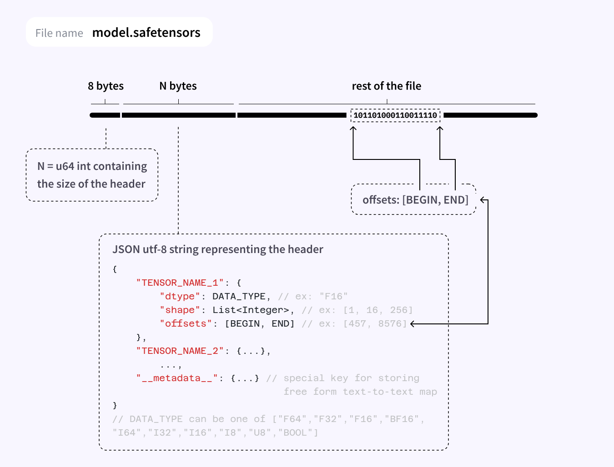

## safetensors

### 1 介绍

safetensors 是 Huggingface 推出的一种可靠、易移植的机器学习模型存储格式，用于安全地存储 Tensor，而且速度很快（零拷贝）。

safetensors 格式结构：


* 8 bytes：一个无符号的整数，表示 header 占的字节数
* N bytes：JSON UTF-8 字符串，存储 header 的内容，形如：
```json
{
    '__metadata__': {'format': 'pt'},
    'model.layers.0.attention.wo.weight': {
        'dtype': 'BF16',
        'shape': [4096, 4096],
        'data_offsets': [0, 33554432],
    }, 
    'model.layers.0.attention.wqkv.weight': {
        'dtype': 'BF16',
        'shape': [6144, 4096],
        'data_offsets': [33554432, 83886080]
    },
}
```

* Rest of the file：存储 tensor 的数据


### 2 使用

#### 2.1 安装

使用`pip`安装：
```bash
pip install safetensors
```

#### 2.2 tensor 保存为 safetensors

```python
import torch
from safetensors.torch import save_file

tensors = {
    "embedding": torch.zeros((10, 2)),
    "attention": torch.zeros((10, 3))
}
save_file(tensors, "model.safetensors")
```

#### 2.3 从 safetensors 加载 tensor

```python
from safetensors import safe_open

tensors = {}
with safe_open("model.safetensors", framework="pt", device=0) as f:
    for k in f.keys():
        tensors[k] = f.get_tensor(k)
        print(f"{k}: {tensors[k]}")
```


### 3 safetensors 的主要优点

#### 3.1 安全

使用 torch.load 加载模型权重可能会执行被插入的恶意代码，不过可以设置weights_only=False 避免这个问题。safetensors 一方面，通过限制文件头大小为100MB以阻止极端大JSON的生成。另一方面，当读取文件时，限制文件地址不被覆盖，使其在载入过程中不会在内存中超出文件大小。

#### 3.2 速度快

对机器学习常用格式中，PyTorch似乎是加载最快的文件格式。而Safetensors通过跳过额外的CPU拷贝，在常规Linux硬件上的载入速度是PyTorch的2倍。 
* CPU 上加载提速的原因：通过直接映射文件，避免了不必要的复制（zero copy）
* GPU 上加载提速的原因：跳过不必要的内存分配

#### 3.3 惰性加载

可以在不加载整个文件的情况下查看文件的信息，或者只加载文件中的部分张量而不是所有张量。在多节点或多GPU的分布式设置下，不同模型可以仅仅加载文件中的部分tensors。

```python
from safetensors import safe_open

tensors = {}
with safe_open("model.safetensors", framework="pt", device=0) as f:
    tensor_slice = f.get_slice("embedding")
    print("tensor_slice: ", tensor_slice)
    vocab_size, hidden_dim = tensor_slice.get_shape()
    print("vocab_size: ", vocab_size)
    tensor = tensor_slice[:, :hidden_dim]
    print("tensor: ", tensor)
```
