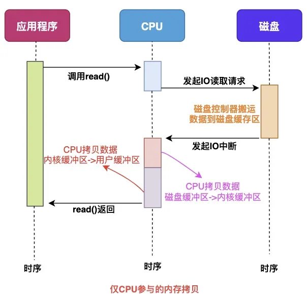
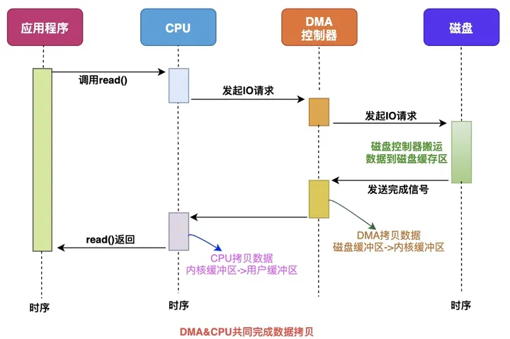
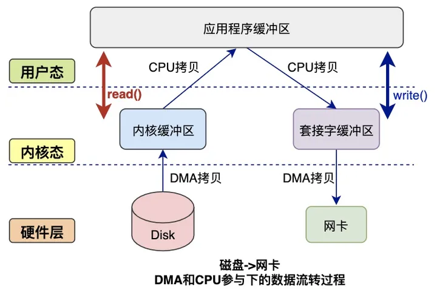
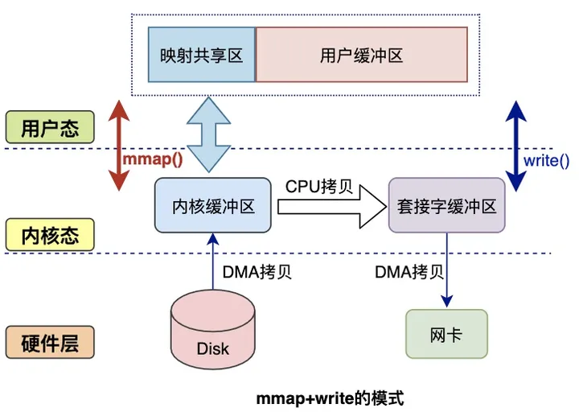
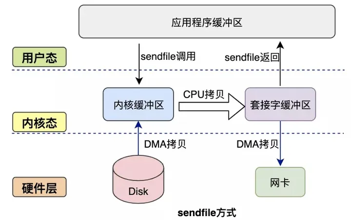
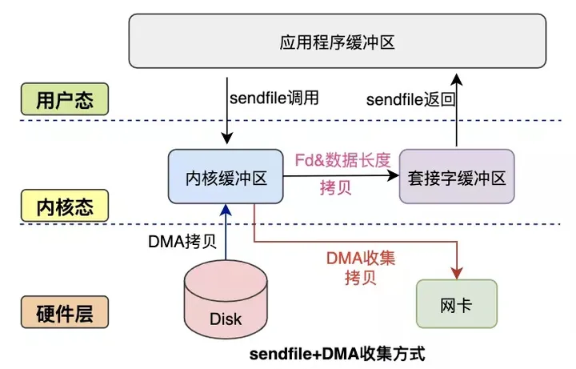
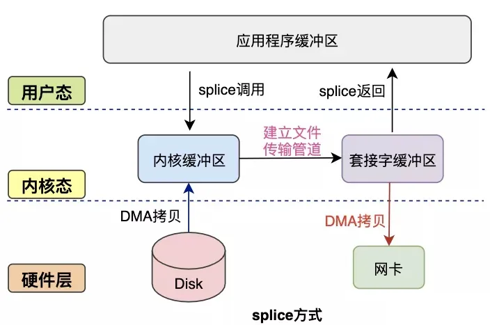

## 零拷贝(Zero Copy)

### 1 数据拷贝的过程

在Linux系统内部缓存和内存容量都是有限的，更多的数据都是存储在磁盘中。对于服务器来说，经常需要从磁盘中读取数据到内存，然后再通过网卡传输给用户：

$\boxed{disk} \rightarrow \boxed{应用程序内存} \rightarrow \boxed{网卡}$

#### 1.1 仅 CPU 参与内存拷贝

* 当应用程序需要读取磁盘数据时，调用read()从用户态陷入内核态，read()这个系统调用最终由CPU来完成；
* CPU向磁盘发起I/O请求，磁盘收到之后开始准备数据；
* 磁盘将数据放到磁盘缓冲区之后，向CPU发起I/O中断，报告CPU数据已经Ready了；
* CPU收到磁盘控制器的I/O中断之后，开始拷贝数据，完成之后read()返回，再从内核态切换到用户态；

#### 1.2 CPU&DMA 参与内存拷贝

直接内存访问（Direct Memory Access），是一种硬件设备绕开CPU独立直接访问内存的机制。DMA在一定程度上解放了CPU，把CPU参与的内存拷贝工作让硬件直接自己做，提高了CPU效率。

有了DMA的参与之后的流程发生了一些变化：

最主要的变化是，CPU不再和磁盘直接交互，而是DMA和磁盘交互并且将数据从磁盘缓冲区拷贝到内核缓冲区，之后的过程类似。

#### 1.3 普通模式数据交互

一次完整的数据交互包括几个部分：系统调用syscall、CPU、DMA、网卡、磁盘等。

系统调用syscall是应用程序和内核交互的桥梁，每次进行调用/返回就会产生两次切换：

* 调用syscall 从用户态切换到内核态
* syscall返回 从内核态切换到用户态

**读数据过程：**

* 应用程序要读取磁盘数据，调用`read()`函数从而实现用户态切换内核态，这是第1次状态切换；
* DMA控制器将数据从磁盘拷贝到内核缓冲区，这是第1次DMA拷贝；
* CPU将数据从内核缓冲区复制到用户缓冲区，这是第1次CPU拷贝；
* CPU完成拷贝之后，`read()`函数返回实现用户态切换用户态，这是第2次状态切换；

**写数据过程：**

* 应用程序要向网卡写数据，调用`write()`函数实现用户态切换内核态，这是第1次切换；
* CPU将用户缓冲区数据拷贝到内核缓冲区，这是第1次CPU拷贝；
* DMA控制器将数据从内核缓冲区复制到socket缓冲区，这是第1次DMA拷贝；
* 完成拷贝之后，`write()`函数返回实现内核态切换用户态，这是第2次切换；

**综上所述：**

* 读过程涉及2次空间切换、1次DMA拷贝、1次CPU拷贝；
* 写过程涉及2次空间切换、1次DMA拷贝、1次CPU拷贝；
* 传统模式下，涉及多次空间切换和数据冗余拷贝，效率并不高

### 2 零拷贝技术

如果应用程序不对数据做修改，从内核缓冲区到用户缓冲区，再从用户缓冲区到内核缓冲区。两次数据拷贝都需要CPU的参与，并且涉及用户态与内核态的多次切换，加重了CPU负担。降低冗余数据拷贝、解放CPU，这也就是零拷贝Zero-Copy技术。

目前来看，零拷贝技术的几个实现手段包括：mmap+write、sendfile、sendfile+DMA收集、splice等。

#### 2.1 mmap方式

`mmap`是Linux提供的一种内存映射文件的机制，它实现了将内核中读缓冲区地址与用户空间缓冲区地址进行映射，从而实现内核缓冲区与用户缓冲区的共享。这样就减少了一次用户态和内核态的CPU拷贝，但是在内核空间内仍然有一次CPU拷贝。

mmap对大文件传输有一定优势，但是小文件可能出现碎片，并且在多个进程同时操作文件时可能产生引发coredump的signal。

#### 2.2 sendfile方式

`mmap+write`方式有一定改进，但是由系统调用引起的状态切换并没有减少。

`sendfile`系统调用是在 Linux 内核2.1版本中被引入，它建立了两个文件之间的传输通道。

`sendfile`方式只使用一个函数就可以完成之前的`read+write` 和 `mmap+write`的功能，这样就少了2次状态切换，由于数据不经过用户缓冲区，因此该数据无法被修改。

应用程序只需要调用sendfile函数即可完成，只有2次状态切换、1次CPU拷贝、2次DMA拷贝。

#### 2.3 sendfile+DMA收集

Linux 2.4 内核对 `sendfile` 系统调用进行优化，但是需要硬件DMA控制器的配合。

升级后的`sendfile`将内核空间缓冲区中对应的数据描述信息（文件描述符、地址偏移量等信息）记录到socket缓冲区中。

DMA控制器根据socket缓冲区中的地址和偏移量将数据从内核缓冲区拷贝到网卡中，从而省去了内核空间中仅剩1次CPU拷贝。

这种方式有2次状态切换、0次CPU拷贝、2次DMA拷贝，但是仍然无法对数据进行修改，并且需要硬件层面DMA的支持，并且`sendfile`只能将文件数据拷贝到socket描述符上，有一定的局限性。

#### 2.4 splice方式

splice系统调用是Linux 在 2.6 版本引入的，其不需要硬件支持，并且不再限定于socket上，实现两个普通文件之间的数据零拷贝。

splice 系统调用可以在内核缓冲区和socket缓冲区之间建立管道来传输数据，避免了两者之间的 CPU 拷贝操作。

splice也有一些局限，它的两个文件描述符参数中有一个必须是管道设备。

