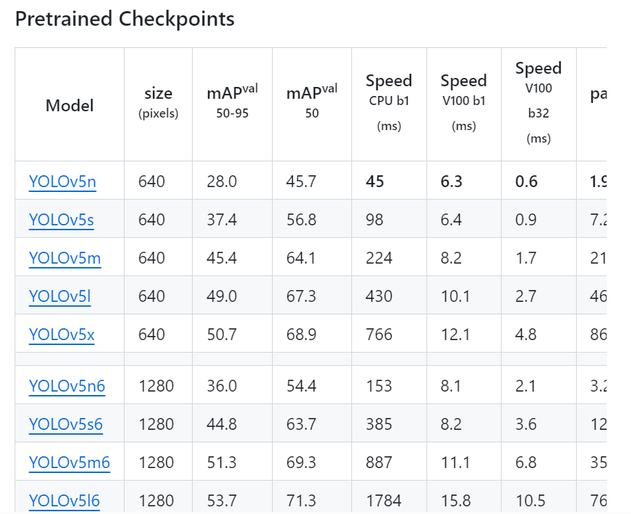

## yolov5 上手

### 0 介绍

YOLO(You Only Look Once)是一种流行的物体检测和图像分割模型，由华盛顿大学的约瑟夫-雷德蒙（Joseph Redmon）和阿里-法哈迪（Ali Farhadi）开发。YOLO 于 2015 年推出，因其高速度和高精确度而迅速受到欢迎。

YOLOv5 在 YOLOv4 的基础上进一步提高了模型的性能，并增加了超参数优化、集成实验跟踪和自动导出为常用导出格式等新功能。

### 1 环境搭建

#### 1.1 python 环境

使用 conda 创建干净的 python 环境，conda 的安装和其他软件安装类似。

conda 创建 python 环境：
```python
conda create -n yolo
```
有可能在这一步出现` Conda cannot proceed due to an error in your proxy configuration.`，或者`CondaHTTPError: HTTP 000 CONNECTION FAILED for url …`等相关的网络问题。一个可行的解决方法是修改`~/.condarc`，修改 conda 的镜像配置：
```bash
vim ~/.condarc

// 把下面的内容添加到文件的末尾
channels:
  - defaults
show_channel_urls: true
default_channels:
  - http://mirrors.tuna.tsinghua.edu.cn/anaconda/pkgs/main
  - http://mirrors.tuna.tsinghua.edu.cn/anaconda/pkgs/r
  - http://mirrors.tuna.tsinghua.edu.cn/anaconda/pkgs/msys2
custom_channels:
  conda-forge: http://mirrors.tuna.tsinghua.edu.cn/anaconda/cloud
  msys2: http://mirrors.tuna.tsinghua.edu.cn/anaconda/cloud
  bioconda: http://mirrors.tuna.tsinghua.edu.cn/anaconda/cloud
  menpo: http://mirrors.tuna.tsinghua.edu.cn/anaconda/cloud
  pytorch: http://mirrors.tuna.tsinghua.edu.cn/anaconda/cloud
  pytorch-lts: http://mirrors.tuna.tsinghua.edu.cn/anaconda/cloud
  simpleitk: http://mirrors.tuna.tsinghua.edu.cn/anaconda/cloud
```

一般情况下此时问题已经解决了。也有可能会出现`SSLError(SSLError(SSLError(“bad handshake: Error(…)”)))`相关的报错。SSL 连接问题极有可能是 https 安全性导致的问题，可以把上面`~/.condarc`中的一系列地址中的 https 都改成了 http即可。此时大概率问题可以解决。如果还有问题，就只能另寻他法了。

#### 1.2 下载YOLO-v5框架

可以直接使用 git clone github 上的 YOLOv5 项目，
```bash
git clone https://github.com/ultralytics/yolov5.git
cd yolov5
```
由于网络的原因，可能会在这里超时而克隆失败。那么可以在 [github YOLOv5](https://github.com/ultralytics/yolov5) 上把项目的压缩包下载下来解压即可：
```bash
unzip yolov5-master.zip
mv yolov5-master yolov5 && cd yolov5
```

#### 1.3 安装依赖

```bash
python3 -m pip install -r requirements.txt
```

#### 1.4 下载与训练权重

创建一个新的文件夹，用于存放YOLO-v5官方提供的预训练权重，
```bash
mkdir weights
```

到[YOLO-v5-GitHub](https://github.com/ultralytics/yolov5)官方下载权重文件，点击蓝色超链接即可进行下载，下载好的预训练权重放在前面新建的`weights`文件夹下。


#### 1.4 环境测试

至此，环境搭建基本就完成了，现在测试一下搭建的环境是否正常。
```bash
python3 detect.py --weights weights/yolov5s.pt --source data/images #   --weights的意思是指定权重文件，–source的意思是指定检测文件地址
```
推理的结果存放在`./runs/detec/exp`，可以正常检测出人、巴士，说明YOLO环境搭建没有问题。


### 2 制作数据集

#### 2.1 使用 labelimg 进行图片标注

labelimg 是常用的图片标注工具，用来准备 yolo 格式的数据集。安装 labelimg
```bash
pip install labelimg
```

图片标注完成之后，得到YOLO格式的txt文本文件。一张张图片进行标注，得到全部数据。

#### 2.2 创建文件夹

在 Yolov5 的路径下创建`satasets`文件夹，用于存放数据集。
```bash
mkdir datasets
```
在`datasets`下面创建文件夹`images`和`labels`分别用来存放图片和标签
```bash
mkdir datasets/images datasets/labels
```

在images（图片）和labels（标签）中分别再创建两个文件夹，一个是train（训练），一个是val（测试），分别存放图片数据和标签数据。
```bash
mkdir datasets/images/train datasets/images/val
mkdir datasets/labels/train datasets/labels/val
```
最终的目录结构如下：
```bash
datasets/
├── images
│   ├── train
│   └── val
└── labels
    ├── train
    └── val
```

#### 2.3 配置数据集和模型参数

##### 2.3 1 配置数据集

修改数据集配置文件`data/coco128.yaml`，修改文件中的`path`, `train`, `val`, `names`这几项的配置信息，修改为如下：
```bash
path: /path/to/datasets # dataset root dir
train: /path/to/datasets/images/train # train images (relative to 'path') 128 images
val: /path/to/datasets/images/train # val images (relative to 'path') 128 images
test: # test images (optional)

# Classes
names:
  0: class_name_0
  1: class_name_1
```
*names 根据实际数据集有哪些类别名称就配置几个*

##### 2.3.2 配置模型参数

修改模型配置文件：models/yolov5s.yaml
这里只需要修改`nc`数，`nc`数指的是目标检测的种类数，因此这里需要将`nc`修改为前面`data/coco128.yaml`中的`names`的数量一致即可。


### 3 训练

#### 3.1 训练模型

使用预训练权重yolov5s.pt和默认yolov5s网络框架进行训练。
```bash
python3 train.py  --weights weights/yolov5s.pt
```

训练完成之后，在run文件夹中查看训练后的数据文件。

#### 3.2 查看训练效果

使用detect.py进行测试，–weights选择训练完毕的权重文件，–source选择需要测试的图片。
```bash
python3 detect.py --weights run/train/exp/weights/best.pt --source data/images
```
