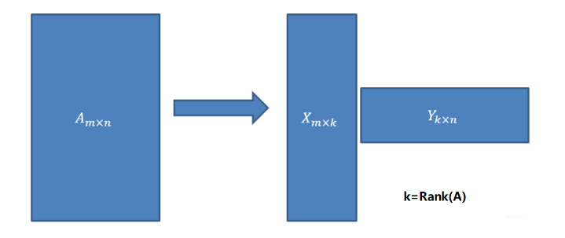
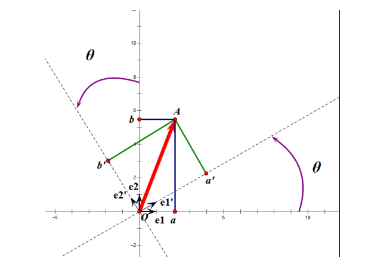
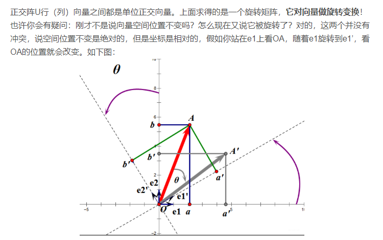
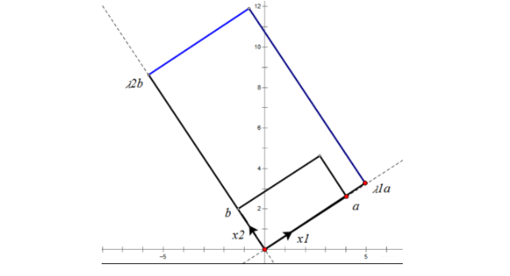

## 奇异值分解(SVD)原理

### 0 引子

**奇异值分解**（singular value decomposition,SVD）是一种矩阵因子分解方法，是线性代数的概念。在机器学习中，矩阵分解是常用的手段，作为矩阵分解的经典方法SVD，不仅是经典的数学问题，在工程应用中许多地方也都有它的身影。SVD被广泛应用在推荐系统、图像处理等领域，是一种数据降维的经典方法。

许多数学对象可以通过将它们分解成多个组成部分或者找到它们的一些属性来更好地理解，这些属性是通用的,而不是由我们选择它们的方式所产生的。对应地，我们也可以通过分解矩阵来发现矩阵表示成数组元素时不明显的函数性质。**特征分解**是使用最广的矩阵分解之一，在这个分解中，我们将矩阵分解成一组**特征向量**和**特征值**，这样可以帮助我们分析矩阵的特定性质。

**奇异值分解**是将矩阵分解为**奇异向量**和**奇异值**。通过奇异值分解，我们会得到一些与特征分解相同类型的信息，但是奇异值分解有更广泛的应用。每一个实数矩阵都有一个奇异值分解，但不一定都有特征分解（例如非方阵矩阵）。

对于矩阵 $\boldsymbol{A}$，使用特征分解分析矩阵 $\boldsymbol{A}$ 时，会得到特征向量构成的矩阵 $\boldsymbol{V}$ 和特征值构成的向量 $\boldsymbol{\lambda}$，即：

$$
\boldsymbol{A} = \boldsymbol{V} diag(\boldsymbol{\lambda}) \boldsymbol{V}^{-1}
$$

奇异值分解于特征分解类似，只是此时将矩阵 $\boldsymbol{A}$ 分解为三个矩阵的乘积：

$$
\boldsymbol{A} = \boldsymbol{U}\boldsymbol{\Sigma}\boldsymbol{V}^{\boldsymbol{T}}
$$

其中，$\boldsymbol{U}$ 是 m 阶正交矩阵，$\boldsymbol{V}$ 是 n 阶正交矩阵，$\boldsymbol{\varSigma }$ 是由降序排列的非负的对角线元素组成的 $m\times n$ 矩形对角矩阵（不一定是方阵），对角线上的元素就叫做奇异值，既是 $\boldsymbol{A}^T\boldsymbol{A}$ 特征值的平方根，也是 $\boldsymbol{AA}^T$ 特征值的平方根。$\boldsymbol{U\varSigma V}^{\boldsymbol{T}}$ 称为矩阵 $\boldsymbol{A}$ 的奇异值分解， $\boldsymbol{U}$ 的列向量被称为左奇异向量，是 $\boldsymbol{AA}^T$ 的特征向量；$\boldsymbol{V}$ 的列向量被称为右奇异向量，是 $\boldsymbol{A}^T\boldsymbol{A}$ 的特征向量。

使用SVD可以很容易得到任意矩阵的满秩分解，用满秩分解可以对数据做降维压缩。可以用SVD来证明对任意 $m \times n$ 的矩阵均存在如下分解：

以上便是奇异值分解的核心内容了，下面将使用简单的线性知识，来帮助理解 SVD 的原理。

### 1 正交矩阵

正交矩阵是在欧几里得空间里的叫法，在酉空间里叫酉矩阵，一个正交矩阵对应的变换叫正交变换，这个变换的特点是**不改变向量的尺寸和向量间的夹角**。

假设二维空间中的一个向量$\bf{OA}$，它在标准坐标系也即 $e1、e2$ 表示的坐标是中表示为 $(a,b)^T$，现在把它用另一组坐标 $e1'、e2'$ 表示为 $(a',b')^T$，存在矩阵 $\boldsymbol{U}$ 使得 $(a',b')^T=\boldsymbol{U}(a,b)^T$，则 $\boldsymbol{U}$ 即为正交矩阵。

从上面的图中可以看到，**正交变换只是将需要变换的向量使用另一组正交基表示**，在这个过程中，并没有对向量做拉伸处理，也没有改变向量的空间位置（暂且这么说吧）。那么如果对两个向量同时做相同的正交变换，变换前后这两个向量的夹角不会变化。从上面的图中可以看到，可以把坐标系 $e1', e2'$ 看作是坐标系 $e1, e2$ 旋转 $\theta$ 角度得到，也这里的正交变换时旋转变换。假设 $\boldsymbol{X} = \left[ \begin{matrix}
a \\
b    
\end{matrix} \right]$，那么，
$$
a' = \boldsymbol{X} e1'=e1'^T \boldsymbol{X} \\
b' = \boldsymbol{X} e2'=e2'^T \boldsymbol{X} 
$$

$a', b'$ 实际上是 $\boldsymbol{X}$ 在 $e1', e2'$ 上的投影大小，那么计算内积可以得到，
$$
\left[ \begin{matrix}
    a' \\
    b'
\end{matrix}\right] = \left[ \begin{matrix}
    e1^T \\
    e2^T
\end{matrix} \right] \boldsymbol{X}
$$

从上面的图上可以看出来，$e1, e2$ 是一组正交基，坐标分别为 $(1, 0), (0, 1)$，把这一对基投影到新的坐标轴上得到另一组正交基 $e1', e2'$，
$$
e1' = \left[ \begin{matrix}
    |e1| \cos \theta \\
    |e1| \sin \theta
\end{matrix} \right] \\
e2' = \left[ \begin{matrix}
    -|e2| \sin \theta \\
    |e2| \cos \theta
\end{matrix} \right]
$$
即，
$$
\boldsymbol{U} = \left[ \begin{matrix}
    \cos \theta & \sin \theta \\
    -\sin \theta & \cos \theta
\end{matrix} \right]
$$

正交阵 $\boldsymbol{U}$ 行(列)向量之间都是正交单位向量，上面求得的是一个旋转矩阵，它对向量做旋转变换。前文说到旋转变换没有改变向量的空间位置，这个实际上如下图：

选择 $e1', e2'$ 作为新的标准坐标系，那么向量 $\bf{OA}$ 在原坐标系 $e1, e2$ 中就变成了 $\bf{OA'}$，这样看起来就是向量 $\bf{OA}$ 顺时针旋转了 $\theta$ 角度。旋转变换是正交变换的一种，正交变换也可以做反射变换。

### 2 特征值分解(EVD)

对称阵，在酉空间中称作厄米阵。对称阵一定可以相似对角化，并且对称阵的不同特征值对应的特征向量两两正交。一个矩阵能够相似对角化说明其特征子空间就是其列向量空间，若不能对角化那么其特征子空间是其列向量空间的子空间。

假设矩阵 $\boldsymbol{A}$ 是 $m \times m$ 的满秩对称矩阵，那么它又 $m$ 个不同的特征值，如果特征值 $\lambda _i$ 对应的特征向量为 $\bf{x_i}$，那么有，
$$
\boldsymbol{A} \bf{x_i} = \lambda _i \bf{x_i}
$$

那么有
$$
\boldsymbol{A} \boldsymbol{U} = \boldsymbol{U} \boldsymbol{\Lambda}
$$

其中，
$$
\boldsymbol{U} = \left[ \begin{matrix}
    \bf{x_1} & \bf{x_2} & \cdots & \bf{x_m}
\end{matrix} \right]
$$

$$
\Lambda = \left[  \begin{matrix}
    \lambda _1 & \cdots & 0 \\
    \vdots & \ddots & \vdots \\
    0 & \cdots & \lambda _m
\end{matrix} \right]
$$

此时便得到了 $\boldsymbol{A}$ 的特征值分解，由于对称阵的特征向量两两正交，因此 $\boldsymbol{U}$ 是正交阵。考虑到正交阵的逆矩阵即是其转置，那么
$$
\boldsymbol{A} = \boldsymbol{U} \boldsymbol{\Lambda} \boldsymbol{U} ^{-1} = \boldsymbol{U} \boldsymbol{\Lambda} \boldsymbol{U} ^{T}
$$

假设有向量 $\bf{x}$，

$$
\boldsymbol{A} \bf{x} = \boldsymbol{U} \boldsymbol{\Lambda} \boldsymbol{U^T} \bf{x}
$$

易知，$\boldsymbol{U^T}$ 是正交矩阵，因此 $\boldsymbol{U^T}$ 对 $\bf{x}$ 的变换是正交变换，并且这个正交变换是把 $\bf{x}$ 用新的坐标系来表示，这个新的坐标系是 $\boldsymbol{A}$ 的所有正交的特征向量构成的。那么 $\bf{x}$ 可以使用 $\boldsymbol{A}$ 的所有正交的特征向量来表示，
$$
\bf{x} = a_1 \bf{x_1} + a_2 \bf{x_2} + \cdots + a_m \bf{x_m}
$$

那么向量 $\bf{x}$ 经过这样的正交变换之后，其坐标为 $\left[a_1, a_2, \cdots , a_m \right] ^T$，那么前面的方程可以写成
$$
\boldsymbol{U} \boldsymbol{\Lambda} \boldsymbol{U^T} \bf{x} = \boldsymbol{U} \boldsymbol{\Lambda} \left[ \begin{matrix}
    \bf{x}_1^T \\
    \bf{x}_2^T \\
    \vdots \\
    \bf{x}_m^T
\end{matrix} \right] (a_1 \bf{x_1} + a_2 \bf{x_2} + \cdots + a_m \bf{x_m}) = \boldsymbol{U} \boldsymbol{\Lambda} \left[ \begin{matrix}
    a_1 \\
    a_2 \\
    \vdots \\
    a_m
\end{matrix} \right]
$$

从上面的等式可以看出，如果 $\boldsymbol{A}$ 不是满秩的话，那么就是说对角阵的对角线上元素存在 0，这时候就会导致维度退化， 这样就可以降维了，这样就会使映射后的向量落入 m 维空间的子空间中。

由于 $\boldsymbol{U}$ 和 $\boldsymbol{U_T}$ 互为逆矩阵，所以 $\boldsymbol{U}$ 变换是 $\boldsymbol{U_T}$ 变换的逆变换。因此，从对称阵的分解对应的映射分解来分析一个矩阵的变换特点是非常直观的。假设对称阵特征值全为1那么显然它就是单位阵，如果对称阵的特征值有个别是0其他全是1，那么它就是一个正交投影矩阵，它将 m 维向量投影到它的列空间中。

根据对称阵 $\boldsymbol{A}$ 的特征向量，如果 $\boldsymbol{A}$ 是 $2*2$ 的，那么就可以在二维平面中找到这样一个矩形，这个矩形经过 $\boldsymbol{A}$ 变换后还是矩形：

这个矩形的选择就是让其边都落在 $\boldsymbol{A}$ 的特征向量方向上，如果选择其他矩形的话变换后的图形就不是矩形了。

特征值分解的对象是对称矩阵 $\boldsymbol{A}$，根据特征值分解可以找到一个超矩形，使其变换之后依然是超矩形，即对称阵 $\boldsymbol{A}$ 可以将一组正交基映射到零一组正交基。

### 3 奇异值分解(SVD)

特征值分解针对的是对称矩阵，那么对于任意 $m \times n$ 的矩阵，找到一组正交基使得它经过变换之后依然是正交基，这便是奇异值分解的核心了。SVD 针对的不限于 $m \times m$ 的满秩对称矩阵，而是针对任意非零实矩阵 $\boldsymbol{A}$。

矩阵的奇异值分解是指将一个非零的实矩阵 $\boldsymbol{A}$，$A \in \boldsymbol{B}^{m \times n}$，表示为以下三个实矩阵乘积形式的运算，即进行矩阵的因子分解：
$$
\boldsymbol{A} = \boldsymbol{U} \boldsymbol{\Sigma} \boldsymbol{V} ^T
$$

其中，$\boldsymbol{U}$ 是 m 阶正交矩阵，$\boldsymbol{V}$ 是 n 阶正交矩阵，$\boldsymbol{\Sigma}$ 是由降序排列的非负的对角线元素组成的 $m \times n$ 矩形对角矩阵，对角线上的元素就叫做**奇异值**，满足：

$$
\boldsymbol{U} \boldsymbol{U} ^T = \boldsymbol{I} \\
\boldsymbol{V} \boldsymbol{V} ^T = \boldsymbol{I} \\
\boldsymbol{\Sigma} = diag(\sigma _1, \sigma _2, \cdots, \sigma _p) //
\sigma _1 \ge \sigma _2 \ge \cdots \ge \sigma _p \ge 0 \\
p = \min(m, n)
$$

$\boldsymbol{U} \boldsymbol{\Sigma} \boldsymbol{V} ^T$ 称为矩阵 $\boldsymbol{A}$ 的奇异值分解，$\sigma _i$ 称为矩阵 $\boldsymbol{A}$ 的奇异值，$\boldsymbol{U}$ 的列向量被称为左奇异向量，$boldsymbol{V}$ 的列向量被称为右奇异向量。

**任意给定一个实矩阵，其奇异值分解一定存在，但不唯一**，这就是**奇异值分解的基本定理**。

现在假设存在 $m \times n$ 矩阵 $\boldsymbol{A}$，将 n 维空间中的向量映射到 k（$k = Rank(A), k \le m$） 维空间中。现在的目标就是：在 n 维空间中找一组正交基，使得经过 $\boldsymbol{A}$ 变换后还是正交的。假设已经找到这样一组正交基：
$$
{\bf{v_1}, \bf{v_2}, \cdots, \bf{v_n}}
$$

那么这组基经过 $\boldsymbol{A}$ 变换之后依然是正交基，那么这组基经过 $\boldsymbol{A}$ 变换：
$$
{\boldsymbol{A} \bf{v_1}, \boldsymbol{A} \bf{v_2}, \cdots, \boldsymbol{A} \bf{v_n}}
$$

由于经过 $\boldsymbol{A}$ 变换之后依然两两正交，那么：
$$
\boldsymbol{A} \bf{v_i} \cdot \boldsymbol{A} \bf{v_j} = (\boldsymbol{A} \bf{v_i})^T \cdot \boldsymbol{A} \bf{v_j} = \bf{v_i}^T \boldsymbol{A} ^T \boldsymbol{A} \bf{v_j} = 0
$$

考虑到前面假设 $\bf{v_i}$ 是一组正交基，那么，
$$
\bf{v_i}^T \cdot \bf{v_j} = \bf{v_i} \cdot \bf{v_j} = 0
$$

如果正交基 $\bf{v}$ 选择为 $\boldsymbol{A} ^T \boldsymbol{A}$ 的特征向量，即 $\boldsymbol{A}^T \boldsymbol{A} \bf{v_i} = \lambda _i \bf{v_i}$。由于 $\boldsymbol{A}^T \boldsymbol{A}$ 是对称阵，那么 $\bf{v_i}$ 两两正交，
$$
\bf{v_i}^T \boldsymbol{A}^T \boldsymbol{A} \bf{v_j} = \bf{v_i}^T \lambda _i \bf{v_j} = \lambda _i \bf{v_i}^T \bf{v_j} = \lambda _i \bf{v_i} \bf{v_j} = 0
$$

至此，就找到了经过经过映射之后仍然为正交基的正交基，将映射后的正交基单位化，由于
$$
\boldsymbol{A} \bf{v_i} \cdot \boldsymbol{A} \bf{v_i} = \lambda _i \cdot \bf{v_i} \cdot \bf{v_i} = \lambda _i
$$

即，
$$
|\boldsymbol{A} \bf{v_i}|^2 = \lambda _i \ge 0
$$

那么对 $\boldsymbol{A} \bf{v_i}$ 单位化得到：
$$
\bf{u_i} = \frac{\boldsymbol{A} \bf{v_i}}{|\boldsymbol{A} \bf{v_i}|} = \frac{1}{\sqrt{\lambda _i}} \boldsymbol{A} \bf{v_i}
$$

那么有
$$
\boldsymbol{A} \bf{v_i} = \sigma _i \bf{u_i}, 奇异值，\sigma _i = \sqrt{\lambda _i}, 0 \le i \le k, k = Rank(\boldsymbol{A})
$$

当 $0 \le i \le m$ 时对 $\bf{u_1}, \bf{u_2}, \cdots, \bf{u_k}$ 进行拓展 $\bf{u_{k+1}}, \cdots, \bf{u_m}$，使得 $\bf{u_1}, \bf{u_2}, \cdots, \bf{u_m}$ 为 $m$ 维空间中的一组正交基。同样地，对 $\bf{v_1}, \bf{v_2}, \cdots, \bf{v_k}$ 进行拓展 $\bf{v_{k+1}}, \cdots, \bf{v_n}$，使得 $\bf{v_1}, \bf{v_2}, \cdots, \bf{v_v}$ 为 $n$ 维空间中的一组正交基(其中，$\bf{v_{k+1}}, \cdots, \bf{v_n}$ 存在于 $\boldsymbol{A}$ 地零空间中，即 $\boldsymbol{A} \bf{x} = 0$ 的解)，那么有，
$$
\boldsymbol{A} [\bf{v_1}, \bf{v_2}, \cdots, \bf{v_k} | \bf{v_{k+1}}, \cdots, \bf{v_n}] = [\bf{u_1}, \bf{u_2}, \cdots, \bf{u_k} | \bf{u_{k+1}}, \cdots, \bf{u_m}] \left[ \begin{array}{cccc|c}
    \sigma _1 & 0 & \cdots & 0 & 0 \\ 
    0 & \sigma _2 & \cdots & 0 & 0 \\
    \vdots & \vdots & \ddots & \vdots & \vdots \\
    0 & 0 & \cdots & \sigma _k & 0 \\ \hline
    0 & 0 & \cdots & 0 & 0
\end{array} \right]
$$

从而便得到了矩阵 $\boldsymbol{A}$ 的奇异值分解
$$
\boldsymbol{A} = \boldsymbol{U} \boldsymbol{\Sigma} \boldsymbol{V}^T
$$

其中，$\boldsymbol{V}$ 是 $n \times n$ 的正交矩阵，$\boldsymbol{U}$ 是 $m \times m$ 的正交矩阵，$\Sigma$ 是 $m \times n$ 的对角阵。

对 $\boldsymbol{A}$ 矩阵映射过程分析：
如果在 n 维空间中找到一个超矩形，使其边都落在 $\boldsymbol{A^T A}$ 的特征向量方向上，那么在经过 $\boldsymbol{A}$ 变换之后仍然为超矩形。$\bf{v_i}$ 为矩阵 $\boldsymbol{A^T A}$ 的特征向量，称作 $\boldsymbol{A}$ 的右奇异向量。$\bf{u_i} = \boldsymbol{A} \bf{v_i}$，为 $\boldsymbol{A A^T}$ 的特征向量，称作 $\boldsymbol{A}$ 的左奇异向量。

下面证明前面提到的，任意 $m \times n$ 矩阵，都存在满秩分解：

$$
\boldsymbol{A} = [\bf{u_1}, \bf{u_2}, \cdots, \bf{u_k} | \bf{u_{k+1}}, \cdots, \bf{u_m}] \left[ \begin{array}{cccc|c}
    \sigma _1 & 0 & \cdots & 0 & 0 \\ 
    0 & \sigma _2 & \cdots & 0 & 0 \\
    \vdots & \vdots & \ddots & \vdots & \vdots \\
    0 & 0 & \cdots & \sigma _k & 0 \\ \hline
    0 & 0 & \cdots & 0 & 0
\end{array} \right] \left[ \begin{array}{c}
    \bf{v_1}^T \\
    \vdots \\
    \bf{v_k}^T \\ \hline
    \bf{v_{k+1}}^T \\
    \vdots \\
    \bf{v_n}^T
\end{array} \right]
$$

根据矩阵分块乘法的规则，
$$
\boldsymbol{A} = [\bf{u_1}, \bf{u_2}, \cdots, \bf{u_k}] \left[ \begin{matrix}
    \sigma _1  &  & \\ 
     &  \ddots  &  \\
     &  &  \sigma _k \\
\end{matrix} \right] \left[ \begin{matrix}
    \bf{v_1}^T \\
    \vdots \\
    \bf{v_k}^T
\end{matrix} \right] + [\bf{u_{k+1}}, \cdots, \bf{u_m}] \left[ \begin{matrix}
    0
\end{matrix} \right] \left[ \begin{matrix}
    \bf{v_{k+1}}^T \\
    \vdots \\
    \bf{v_n}^T
\end{matrix} \right]
$$

由于第二项为 0，那么有，
$$
\boldsymbol{A} = [\bf{u_1}, \bf{u_2}, \cdots, \bf{u_k}] \left[ \begin{matrix}
    \sigma _1  &  & \\ 
     &  \ddots  &  \\
     &  &  \sigma _k \\
\end{matrix} \right] \left[ \begin{matrix}
    \bf{v_1}^T \\
    \vdots \\
    \bf{v_k}^T
\end{matrix} \right]
$$

令，
$$
\boldsymbol{X} = [\bf{u_1}, \bf{u_2}, \cdots, \bf{u_k}] \left[ \begin{matrix}
    \sigma _1  &  & \\ 
     &  \ddots  &  \\
     &  &  \sigma _k \\
\end{matrix} \right] = \left[ \sigma _1 \bf{u_1}, \sigma _2 \bf{u_2}, \cdots, \sigma _k \bf{u_k} \right]
$$

$$
\boldsymbol{Y} = \left[ \begin{matrix}
    \bf{v_1}^T \\
    \vdots \\
    \bf{v_k}^T
\end{matrix} \right]
$$

那么，$\boldsymbol{A} = \boldsymbol{XY}$ 即是 $\boldsymbol{A}$ 的满秩分解。

### 4 紧奇异值分解和截断奇异值分解

在前面给出的奇异值分解被称为矩阵的**完全奇异值分解**。实际上常用的是奇异值分解的**紧凑形式**和**截断形式**。**紧奇异值分解是与原始矩阵等秩的奇异值分解，截断奇异值分解是比原始矩阵低秩的奇异值分解**。

#### 4.1 紧奇异值分解

对于 $m \times n$ 实矩阵 $\boldsymbol{A}$，其秩 $Rank(\boldsymbol{A}) = r, r \le \min(m, n)$，则称 $\boldsymbol{U_r \Sigma _r V_r ^T}$ 为 $\boldsymbol{A}$ 的紧奇异值分解(compact singular valus decomposition)，即
$$
\boldsymbol{A} = \boldsymbol{U_r \Sigma _r V_r ^T}
$$

其中 $\boldsymbol{U_r}$ 是 $m \times r$ 矩阵，由完全奇异值分解中 $\boldsymbol{U}$ 的前 r 列得到，$\boldsymbol{V_r}$ 是 $n \times r$ 矩阵，由完全奇异值分解中 $\boldsymbol{V}$ 的前 r 列得到，$\Sigma _r$ 是 r 阶对角矩阵，由完全奇异值分解中 $\Sigma$ 的前 r 个对角元素得到，其秩与 $\boldsymbol{A}$ 的秩相等。

#### 4.1 截断奇异值分解

在矩阵的奇异值分解中，只取最大的 k 个奇异值（$k>r$, r 为矩阵的秩）对应的部分，就得到矩阵的截断奇异值分解。实际应用中提到矩阵的奇异值分解时，通常指截断奇异值分解。

对于 $m \times n$ 实矩阵 $\boldsymbol{A}$，其秩 $Rank(\boldsymbol{A}) = r$，且 $0 < k < r$，则称 $\boldsymbol{U_k \Sigma _k V_k ^T}$ 为 $\boldsymbol{A}$ 的截断奇异值分解(truncated singular valus decomposition)，即
$$
\boldsymbol{A} \approx \boldsymbol{U_k \Sigma _k V_k ^T}
$$

其中 $\boldsymbol{U_k}$ 是 $m \times k$ 矩阵，由完全奇异值分解中 $\boldsymbol{U}$ 的前 k 列得到，$\boldsymbol{V_k}$ 是 $n \times k$ 矩阵，由完全奇异值分解中 $\boldsymbol{V}$ 的前 k 列得到，$\Sigma _k$ 是 k 阶对角矩阵，由完全奇异值分解中 $\Sigma$ 的前 k 个对角元素得到，其秩比 $\boldsymbol{A}$ 的秩低。

实际上，紧奇异值分解就是截断奇异值分解的一种特殊表现形式。实际应用中，常常需要对矩阵的数据进行压缩，将其近似表示，奇异值分解提供了一种方法。奇异值分解是在平方损失意义下对矩阵的最优近似。紧奇异值分解对应无损压缩，截断奇异值分解对应有损压缩。

### 5 奇异值分解的外积展开式

$\boldsymbol{A}$ 的奇异值分解可以写成外积的形式，
$$
\boldsymbol{A} = \sum _{k=1} ^{n} \boldsymbol{A} _k = \sum _{k=1} ^{n} \sigma _k \bf{u} _k \bf{v} _k ^T
$$

其中 $\boldsymbol{A} _k = \sigma _k \bf{u} _k \bf{v} _k ^T$，是 $m \times n$ 矩阵，上式将 $\boldsymbol{A}$ 分解为矩阵的有序加权和，展开可以得到，
$$\boldsymbol{A}=\sigma _1\boldsymbol{u}_1\boldsymbol{v}_{1}^{T}+\sigma _2\boldsymbol{u}_2\boldsymbol{v}_{2}^{T}+\cdots +\sigma _n\boldsymbol{u}_n\boldsymbol{v}_{n}^{T}
$$

当 $n=k$ 时，矩阵 $\boldsymbol{A}$ 的秩为 k，并且 $\boldsymbol{A}_k$ 是秩为 k 的矩阵中在弗罗贝尼乌斯范数意义下 $\boldsymbol{A}$ 的最优近似矩阵。矩阵 $\boldsymbol{A}_k$ 就是 $\boldsymbol{A}$ 的截断奇异值分解。

通常奇异值 $\sigma _i$ 递减的很快，因此 k 取很小值时，$\boldsymbol{A}_k$ 也可以对 $\boldsymbol{A}$ 有很好地近似。
