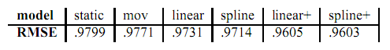
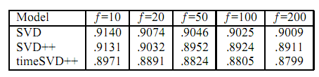

## 奇异值分解(SVD)时间复杂度分析与优化

奇异值分解是一种矩阵分解的方法，大学线性代数里面也讲过奇异值分解的方法，因此这是一个为大家所熟知的算法。

### 1 SVD 时间复杂度分析

给定一个 $m \times n$ 的矩阵 $\boldsymbol{a}$，按照下面公式做分解，其中 $\Sigma$
是一个 $m \times n$ 的矩阵，除对角线以为其他元素都是 0，对角线上的值就是所谓的奇异值。$\boldsymbol{U}$ 是 $m \times n$ 的酉矩阵，$\boldsymbol{V}$ 是 $\n \times n$ 的酉矩阵，即满足 $\boldsymbol{U} ^T * \boldsymbol{U} = \boldsymbol{I}$
$$
\boldsymbol{A} = \boldsymbol{U} \boldsymbol{\Sigma} \boldsymbol{V} ^T
$$

* 将 $\boldsymbol{A}$ 的转置和 $\boldsymbol{A}$ 做矩阵乘法，这样就会得到一个 $n \times n$ 的方阵 $\boldsymbol{A} ^T ∗ \boldsymbol{A}$，然后运用方阵特征分解，得到 $(\boldsymbol{A} ^T ∗ \boldsymbol{A}) ∗ \bf{v}_i = \lambda _i ∗ \fbf{v} _i$
* 得到矩阵 $\boldsymbol{A} ^T ∗ \boldsymbol{A}$ 的 n 个特征值和对应的 n 个特征向量 $\bf{v}$，将所有特征向量 $\bf{v}$ 张成一个 $\n \times n$ 的矩阵 $\boldsymbol{V}$，就是前面公式里的 $\boldsymbol{V}$ 矩阵，一般叫其中 $\boldsymbol{V}$ 中的每个特征向量是 $\boldsymbol{A}$ 的右奇异向量。
* 同样的对 $\boldsymbol{A}$ 和 $\boldsymbol{A}$ 的转置做乘法，就得到 $\m \times m$ 的方阵$\boldsymbol{A} ∗ \boldsymbol{A} ^T$，运用方阵特征分解，得到 $\boldsymbol{A} ∗ \boldsymbol{A} ^T * \bf{u} _i = \lambda _i * \bf{u} _i$
* 得到矩阵 $\boldsymbol{A} ∗ \boldsymbol{A} ^T$ 的 m 个特征值和对应的 m 个特征向量 $\bf{u}$，将所有特征向量 $\bf{u}$ 张成一个 $\m \times m$ 的矩阵 $\boldsymbol{U}$，就是前面公式里的 $\boldsymbol{U}$ 矩阵，一般叫 $\boldsymbol{U}$ 中的每个特征向量是 $\boldsymbol{A}$ 的左奇异向量。
* 计算奇异矩阵 $\Sigma$ 
  $$
  \boldsymbol{A} = \boldsymbol{U} ∗ \boldsymbol{\Sigma} ∗ \boldsymbol{V} ^T \Rightarrow \boldsymbol{A}  ∗ \boldsymbol{U} = \boldsymbol{U} ∗ \boldsymbol{\Sigma} ∗ \boldsymbol{V} ^T ∗ \boldsymbol{V} \Rightarrow \boldsymbol{A} ∗ \boldsymbol{V} = \boldsymbol{U} ∗ \boldsymbol{\Sigma} \Rightarrow \boldsymbol{A} ∗ \bf{v} _i = \bf{\sigma} _i ∗ \bf{u} _i \Rightarrow \bf{\sigma} _i = \boldsymbol{A} ∗ \bf{v} _i / \bf{u} _i
  $$

这样得到奇异值 $\sigma$, 组成奇异值矩阵 $\Sigma$。

这是标准的按照线性代数理论进行分解的方法。由于矩阵乘法的实时间复杂度是 $O(n^3)$，那么不难得知，按照线性代数理论进行奇异值分解的时间复杂度是 $O(\max(m, n)^3)$。

SVD 在工业上通常用于推荐系统，物料数和用户数通常最少也是千万级别，三次方下来就10，0000亿，一个很恐怖的时间复杂度，接下来介绍一个 SVD 的性质，然后继续分析怎么优化这个算法。

### 2 SVD 分解算法优化

#### 2.1 奇异值分解性质

对于奇异值分解结果的中间矩阵，它对角线上的值称为奇异值，按照从大到小排序，并且奇异值下降特别快，正常情况下前10%的奇异值占有了全部奇异值的99%，那么可以用前 k 个奇异值近似表示原始矩阵。
$$
\boldsymbol{A} _{m \times N} = \boldsymbol{U} _{m \times m} * \Sigma _{m \times n} * \boldsymbol{V} _{n \times n} ^T \approx \boldsymbol{U} _{m \times k} * \Sigma _{k \times k} * \boldsymbol{V} _{k \times n} ^T
$$
一般来说，这里 $k << \min(m,n)$，可以达到数据压缩或者降维的作用。

#### 2.2 截断奇异值分解

利用上面提到的奇异值分解的性质，可以借助截断奇异值分解来优化奇异值分解。

首先不直接分解矩阵，而是用机器学习的方法，直接去求第二个矩阵。定义损失函数
$$
\boldsymbol{C} = \sum _{(i, j) \in \boldsymbol{R}} [(\bf{a}_(ij) - \bf{u} _i * \bf{v} _j ^T)^2 + \lambda (\bf{u} _i ^2 + \bf{v}_j ^2)]
$$

第一项使用平方差定义分解后和原始矩阵的 RMSE，其中 $bf{a}_{ij}$ 是原始矩阵的第 i 行第 j 列，$\bf{u} _i$ 是推荐系统场景中的用户特征向量，$\bf{v} _j$ 是物品特征向量，后面一项是正则化项。

有了损失函数就可以用 ALS 或者梯度下降法求解了。这里的时间复杂度是 $O(mnk)$，而 k 是个很小的数，那么复杂度就是相当于是 $O(m*n)$，这样在千万的数据上计算复杂度瞬间变成100亿了。

*另外，在算法实现上，还可以使用并行计算的方式来进行 SVD 分解计算，限于篇幅这里暂时不做展开，[Mars算法实践](https://developer.aliyun.com/article/685091)*

### 3 变种 SVD 算法

#### 3.1 改进的 SVD 算法

前面说到，奇异值分解常用在推荐系统中，最简单的方法就是直接把评分矩阵分解去做推荐，但是实际中发现不管是用户还是物品都存在一定偏差，比如有些用户给的评分就是比其他人高0.5，或者有些电影用户倾向于给高分，但是建模的时候没有考虑进去这种情况。那么把用户和物品的偏差考虑进来，那么就可以对 SVD 算法进行改进，**评分 = 兴趣 + 偏见**。

$$
\bf{a} _{u, i} = \bf{u} + \bf{b}_u + \bf{b}_i + \boldsymbol{U}_u * \boldsymbol{V}_i^T
$$

其中 $\bf{b}_u$ 表示用户偏见，$\bf{b}_i$ 表示物品偏见，$\bf{u}$ 表示全局均值，损失函数为：

$$
\boldsymbol{C} = \sum _{(u, i) \in \boldsymbol{R}} \left( \bf{a}_{u, i} - \bf{b}_i - \bf{b}_u - \boldsymbol{U}_u * \boldsymbol{V}_i^T \right) ^2 + \lambda \left( ||\boldsymbol{U}_u|| ^2 + ||\boldsymbol{V}_i|| ^2 + \bf{b}_u ^2 \bf{b}_i ^2 \right)
$$

#### 3.2 SVD++ 算法

实际使用中，除了用户或者物品偏见，还有一个问题就是行为数据中的评分数据很少，但是隐式行为数据有很多，把隐式行为数据建模进去从而缓解评分稀疏提高推荐效果，这就是 SVD++ 算法。SVD++ 在 SVD 中加入了用户对物品的隐式行为，SVD++ 的假设条件是**评分 = 显式兴趣 + 隐式兴趣 + 偏见**

$$
\bf{a} _{u, i} = \bf{u} + \bf{b}_u + \bf{b}_i + \boldsymbol{V}_i^T * \left( \boldsymbol{U}_u + |\boldsymbol{I}_u| ^{-\frac{1}{2}} * \sum _{j \in \boldsymbol{I} _u} y_j \right)
$$

其中 $\boldsymbol{I} _u$ 是该用户有隐式行为的所有物品集合，而 $y_j$ 是隐式评分电影 j 反应出的喜好值，其中对 $\boldsymbol{I} _u$ 取根号是一个经验值，这样就把系统中大量的隐式行为也建模到 SVD 算法中，虽然这么做对计算复杂度提高了不少，但是能够缓解评分稀疏提高推荐效果。同样的，损失函数为：

$$
\boldsymbol{C} = \sum _{(u, i) \in \boldsymbol{R}} \left( \bf{a}_{u, i} - \bf{b}_i - \bf{b}_u - \boldsymbol{V}_i^T * （\boldsymbol{U}_u + \min(|\boldsymbol{I}_u| ^{-\frac{1}{2}} * \sum _{j \in \boldsymbol{I} _u} y_j)） \right) ^2 + \lambda \left( \sum _u (\bf{b}_{i, u}^2 + ||\boldsymbol{U} _u||^2) + \sum _i (\bf{b}_i^2 + ||\boldsymbol{V}_i|| ^2 + ||\bf{y}_i||^2) \right)
$$

#### 3.3 timeSVD 算法

2010 年，Koren 发现在 Netflix 的数据中，个体用户的兴趣会随着时间转移，论文中称作 concepte drift (观念转移)。比如大家都知道的《大话西游》，刚上映票房很低，大家都给出的评分也不高，但是随着时间流逝，大家给出的评分越来越高。另外可能有些电影在某些特定的节日或者某天会获得高分，作者希望建立模型能捕捉到这些。

timeSVD 在 SVD 中加入了时间因素，也可以叫做有时序的SVD。timeSVD 的假设条件是**评分 = 显式兴趣 + 时序兴趣 + 热点 + 偏见**

按照原始论文的介绍来说，这个模型是为了对观念转移建模。从三个角度出发，首先是时间窗口概念，另外是实例权重，采用时间衰减，最后是集成学习的概念，引入多个基础预估方法。

**static predictor** 是最基础的预估方法:
$$
\bf{b}_{u,i}(t) = \bf{u} + \bf{b}_u + \bf{b}_i
$$
mov方案 **mov predictor**:
$$
\bf{b}_{u,i}(t) = \bf{u} + \bf{b}_u + \bf{b}_i + \bf{b}_{i, Bin(t)}
$$

这里对 $\bf{b}_i$ 是 $\bf{b}_i(t) = bf{b}_i + \bf{b}_{i, Bin(t)}$，分为**Static**和**time changing**两部分，引入物品的时间变化因素，对时间片进行划分。论文中是以10周为一片，共划分了30片，赋予一个 $Bin(t)$，即1-30之间。时间片划分也可以是其他的，小的时间片可以有更好的性能，大的时间片能够让每片有更多的数据。

**linear predictor**，引入用户兴趣的变化，首先定义
$$
dev_u(t) = sign(t - t_u)*|t - t_u|^{\beta}
$$
表示当前用户当前评分时间和平均评分时间的距离，论文中 $β=0.4$

然后对 $\bf{b}_u$ 引入时间变化到线性模型，多了一个需要训练的参数 $\alpha$
$$
\bf{b}_u^{(1)} = bf{b}_u + \alpha _u * dev_u(t)
$$
引入到公式中得到
$$
\bf{b}_{u, i}(t) = \bf{u} + \bf{b}_u + \alpha _u * dev_u(t) + \bf{b}_i + \bf{b}_{i, Bin(t)}
$$

**spline predictor** 通过另一种方法引入用户兴趣变化的模型，区别于前面的线性模型，这是一个曲线式模型
$$
\bf{b}_{u, i}(t) = \bf{u} + \bf{b}_u + \frac{\sum _{l=1} ^{k_u} e^{-r|t-t^u|} * \bf{b}_{t, l}^{u}}{\sum _{l=1} ^{k_u} e^{-r|t-t^u|}} + \bf{b}_i + \bf{b}_{i, Bin(t)}
$$

**linear+ predictor** 引入实时特定，比如用户某天心情，或者生日等，引入一个参数 $\bf{b}_{u, t}$，表示每日的特定偏差
$$
\bf{b}_{u, i}(t) = \bf{u} + \bf{b}_u + \alpha _u * dev_u(t) + \bf{b}_i + \bf{b}_{u, t} + \bf{b}_{i, Bin(t)}
$$

**spline+ predictor** 曲线模型也引入,
$$
\bf{b}_{u, i}(t) = \bf{u} + \bf{b}_u + \frac{\sum _{l=1} ^{k_u} e^{-r|t-t^u|} * \bf{b}_{t, l}^{u}}{\sum _{l=1} ^{k_u} e^{-r|t-t^u|}} + \bf{b}_i + \bf{b}_{u, t} + \bf{b}_{i, Bin(t)}
$$

通过梯度下降法进行训练，损失函数为
$$
\boldsymbol{C} = \sum _{u, i, t \in \boldsymbol{K}} \left( \bf{r}_{u, i}(t) - \bf{u} - \bf{b}_u - \alpha _u * dev_u(t) - \bf{b}_i - \bf{b}_{u, t} - \bf{b}_{i, Bin(t)} \right) ^2 + \lambda * \left(\bf{b}_u^2 + \bf{\alpha}_u^2 + \bf{b}_{u, t}^2 + \bf{b}_i^2 + \bf{b}_{i, Bin{t}}^2 \right)
$$
原论文中对各个 predictor 用 RMSE 作为指标的结果

这里通过时序建模，用户矩阵的参数表示为:
$$
\bf{u}_u(t)[k] = \bf{p}_{u, k} + \bf{\alpha}_{u, k} * dev_u(t) + \bf{p}_{u, k} * \bf{k} = 1, \cdots, f
$$
这里 k 代表第 k 个 predictor，每一个 predictor 单独训练，最终得到如下公式，
$$
\bf{a}_{u, i} = \bf{u} + \bf{b}_i(t) + \bf{b}_u(t) + \boldsymbol{V}_i^T * (\bf{u}_u(t) + |\boldsymbol{I}_u|^{-\frac{1}{2}} * \sum _{j \in \boldsymbol{I}_u} y_j)
$$
通过在 Netflix 数据集测试，对比三种算法，可以得到

