## torch._dynamo 理解

### 0 概述
TorchDynamo 是一个 Python 级别的即时 (JIT) 编译器，旨在让未修改的 PyTorch 程序运行得更快。它通过 Python Frame Evaluation Hooks（Python 框架评估钩子）来实现这一目标，以便在运行时动态地生成和优化代码。这使得 TorchDynamo 可以有效地处理各种 Python 代码，包括包含控制流（如循环和条件语句）的代码，而无需进行任何修改。

整个 pytorch 的编译栈如下：
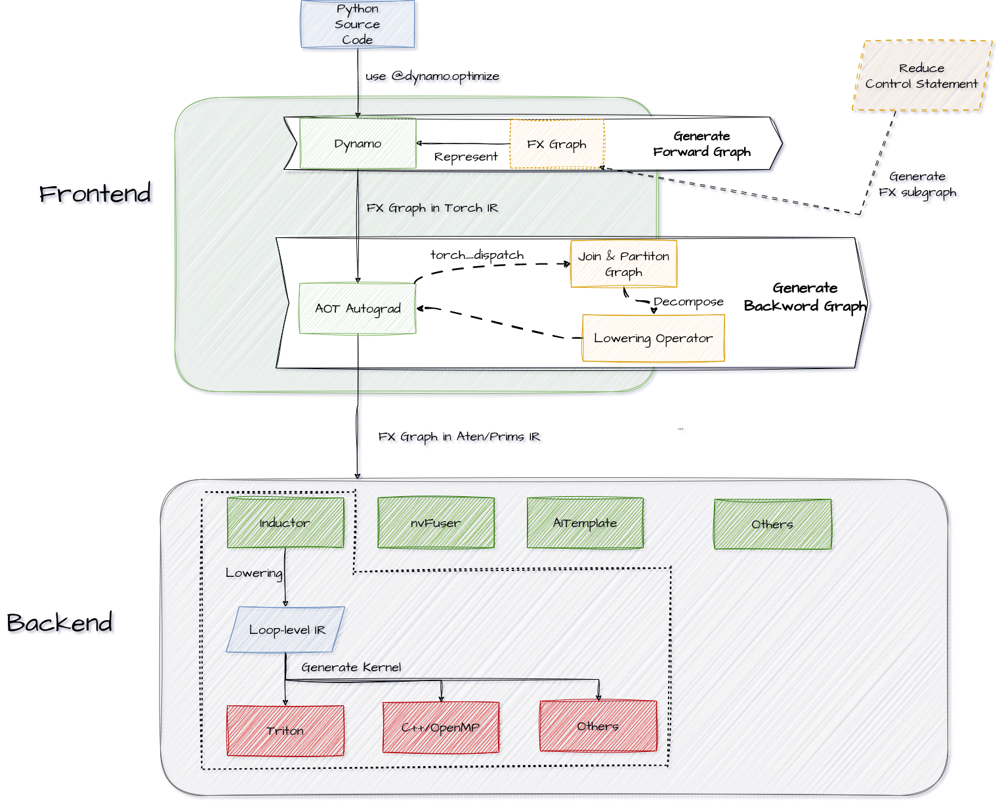

### 1 Frontend

#### 1.1 torch._dynamo

TorchDynamo 的作用是从 PyTorch 中抓取计算图。在dynamo 之前，PyTorch 有过许多尝试，例如 TorchScript，TorchFX，torch.jit.trace，lazy tensor 等，但结果都不尽人意。以至于在 Pytorch 的官方文档中也出现了官方吐槽：
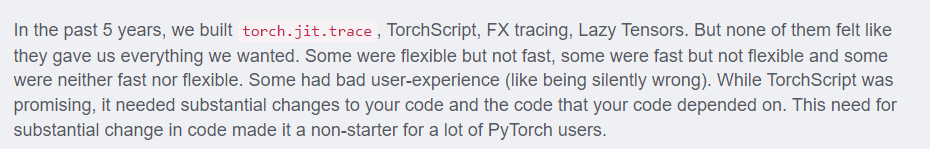

正是基于此，pytorch 基于 Dynamo 投入了那么大量的资源进行开发，并发布了 2.0。

##### 1.1.1 FX 计算图

FX 计算图实际上就是 torch.fx，是一种计算图的表示方法，也被称为 FX IR，FX IR 具备这样的特点：
* 定义简单，只有6个 Opcode
* 组织简单，很容易写出后续的解析代码
* 对正向图操作快速，并且 Trace 是 python2python 的，调试方便
* 不能表达控制流（例如 if-else 结构）

在 dynamo 中，也延续了使用 FX IR 来表示计算图的思路，但消除了不能表达控制流的缺陷。

##### 1.1.2 Dynamo 优化原理（high-level）

在 pytorch 的官方文档中，对 TorchDynamo 的定义是一个 Python 级别的即时 (JIT) 编译器。

首先，先了解一下 python 的运行原理：
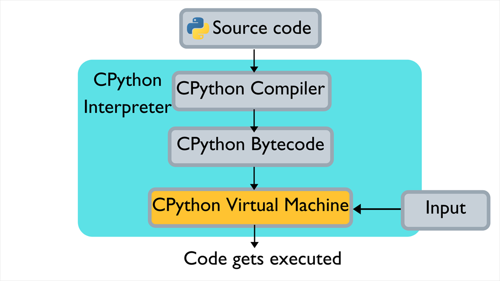

Python是通过解释器执行的，具体的机制如下：
* Python源代码被编译成一系列中间字节码
* 由CPython虚拟机内部 while 循环不断匹配字节码，并执行对应字节码指令 case 分支内部的多条C函数

例如，有如下 python 代码：
```python
import dis
def add(x, y):
    return x + y
print(dis.dis(add))

```

对应的字节码如下：
```python
2 LOAD_FAST                0 (x)
4 LOAD_FAST                1 (y)
6 BINARY_OP                0 (+)
10 RETURN_VALUE    
```

###### 1.1.2.1 帧评估(Frame evaluation)

这里的帧，实际上和平时所说的函数栈有一些类似，下图可表示 Python 中的函数和 frame 之间的关系：
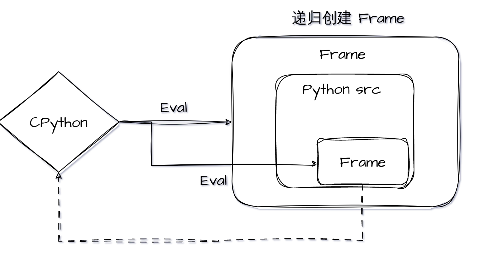

如上图所示，函数的调用栈，实际上就是递归地创建 frame（Python 内置的数据结构），执行frame 的过程。

```python
import inspect

def foo():
    frame = inspect.currentframe()
    cur_func_frame = frame
    print(f'code name of current frame is {cur_func_name.f_code.co_name}')
    prev_func_frame = frame.f_back
    print(f'current code name of previous frame is {prev_func_frame.f_code.co_name}')

def bar(a=1):
    foo()

if __name__ == '__main__':
    bar()

# 输出
# code name of current frame is foo
# current code name of previous frame is bar
```

从上面的结果可以看出，函数是运行在 Frame 中的，因此我们可以轻松地从 Frame 中获取任何函数需要的信息。例如我们可以通过上例在 frame 中获取到当前函数的名字 foo。由于 Python 的 frame 是栈式存储的，因此很简单就能访问到上一个 frame，进而获取上一帧所运行的函数名 bar。

更夸张一点，我们甚至能够在 func_a 中获取 func_b 定义的的局部变量 a：

```python
def func_a():
    frame = inspect.currentframe()
    co_name = frame.f_code.co_name
    print(f'code name of current frame is {co_name}')
    pri_frame = frame.f_back
    print(f'current code name of previous frame is {pri_frame.f_code.co_name}')
    print(f'a={pri_frame.f_locals["a"]}')

```

从上面的两个例子不难得出结论：
* frame 包含了函数执行所需要的所有信息
* 我们可以在函数中访问 frame

实际上，frame 包含了函数的所有信息，那就意味着 frame 包含了代码信息。那么如果我们在执行函数之前就能通过 frame 获取到函数的代码信息，并且能够解析这个信息，那么就可以完成整个函数的 Trace。

在官方的 dynamo 文档中，给出了 dynamo 的流程图：
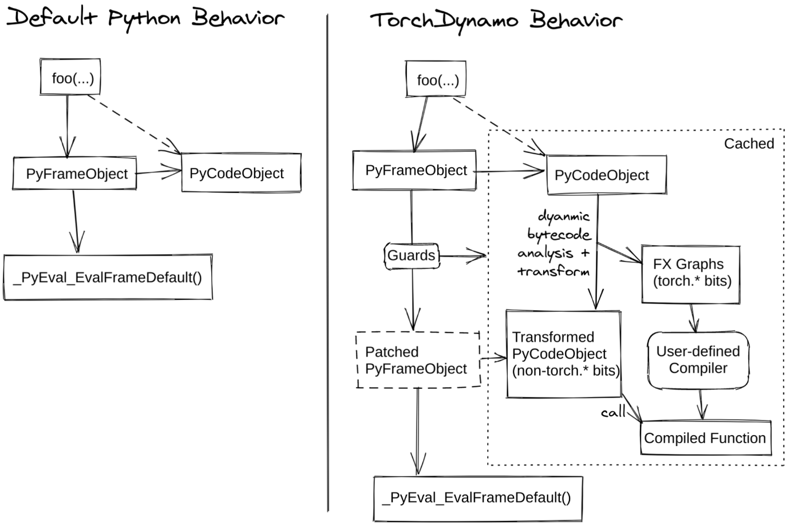

在上图右边的第一步就是在做解析 frame，通过这一步，可以得到`PyFrameObject`与`PyCodeObject`。
前面的代码例子里面都是针对单帧函数而言的，即我们特定地在 func_a 里去获取帧信息。然而模型实际运行时，其调用栈通常都会非常复杂，pytorch 提供了 [PEP 523](https://peps.python.org/pep-0523/)自动化地为每个函数额外加上解析 frame 的行为。

事实上，我们很难在 Python 层面想到一种方法，将某一个修改（例如刚才提到的函数入栈时解析 frame）递归地作用在所有的函数栈上（函数入口及其内部调用的所有接口）。这件事看上去很简单，但是做起来却非常的困难，甚至早期的 CPython 都没有开放这样功能，因此 PEP 523 应运而生。

前面提到的 Python的运行原理里面，有提到所有的 Frame evaluation 都是依赖于 CPython 解释器的。因此 PEP 523 认为，CPython 解释器的帧评估方式（Frame Evaluation）应该是可扩展的，这样用户就可以用自定义的方式进行 frame evaluation。这恰好和 Dynamo 的需求相符合：我们希望 model 内部所有的函数调用（同 frame evaluation），都能够附加一个解析 frame 的过程，以此来解析提炼 PyTorch 程序运行时的图结构。因此 Dynamo 扩展了 CPython 解释器 frame evaluation，在执行默认的帧评估函数之前，实现一些额外的 frame 解析优化的工作。

CPython 默认 Frame evaluation 的调用栈（以下代码片段摘自 Python 3.10，Python 3.11 对函数执行做了非常大的优化，以至于调用栈变得非常难懂）：
[_PyEval_EvalFrameDefault](https://github.com/python/cpython/blob/e6b0bd59481b9bc4570736c1f5ef291dbbe06b8e/Python/ceval.c#L1577) --> [call_function](https://github.com/python/cpython/blob/0e2c7839bd297ad284fd07bf3736f722b87175df/Python/ceval.c#L5874) --> [_PyFunction_Vectorcall](https://github.com/python/cpython/blob/0e2c7839bd297ad284fd07bf3736f722b87175df/Objects/call.c#L332) --> [_PyEval_Vector](https://github.com/python/cpython/blob/0e2c7839bd297ad284fd07bf3736f722b87175df/Python/ceval.c#L5052) --> [PyEval_EvalFrame](https://github.com/python/cpython/blob/0e2c7839bd297ad284fd07bf3736f722b87175df/Python/ceval.c#L1141) --> [_PyEval_EvalFrame](https://github.com/python/cpython/blob/0e2c7839bd297ad284fd07bf3736f722b87175df/Include/internal/pycore_ceval.h#L44:1)

上述六个步骤，为 CPython 解释器执行一个函数时默认的调用栈， [_PyEval_EvalFrame](https://github.com/python/cpython/blob/0e2c7839bd297ad284fd07bf3736f722b87175df/Include/internal/pycore_ceval.h#L44:1) 中的代码片段：
```cpp
_PyEval_EvalFrame(PyThreadState *tstate, PyFrameObject *f, int throwflag)
{
    return tstate->interp->eval_frame(tstate, f, throwflag);
}
```
Python 会从线程状态（tstate）中获取解释器的 eval_frame 函数指针，默认情况下， CPython 解释器的 eval_frame 的函数指针就是 [_PyEval_EvalFrameDefault](https://github.com/python/cpython/blob/e6b0bd59481b9bc4570736c1f5ef291dbbe06b8e/Python/ceval.c#L1577)。

Dynamo 想用自定义的流程去执行 frame（解析 Python 代码，编译优化等），那么最容易想到的就是更改 eval_frame 的指向，让解释器的 eval_frame 指向 Dynamo 自己实现的 custom frame evaluation function。

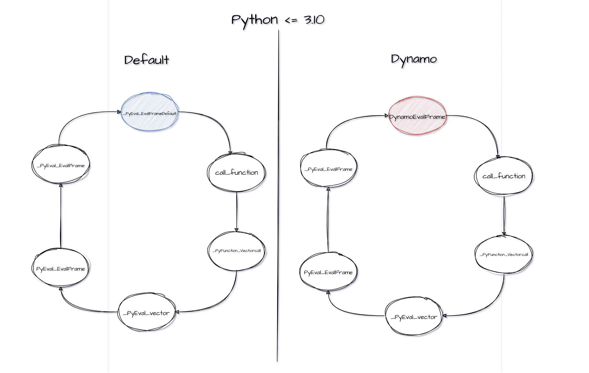

如上图所示，Dynamo 在 set_eval_frame 中将默认的 _PyEval_EvalFrameDefault 替换成 Dynamo 自定义的帧评估函数。事实上，Dynamo 在 Python 层面完成了字节码（Python 代码）的解析，重构以及 PyTorch 图结构的追踪，并将上述过程打包成一个回调函数，传给自定义的帧评估函数。

Dynamo 在 Python 层做字节码解析，以回调函数的形式传给自定义的帧评估函数。当我们调用 optimizer('inductor')(fn) 时，Dynamo 会将 fn 的帧评估函数替换成 Dynamo 自定义的，并且传入回调函数。传入的回调函数会被自定义的帧评估函数调用。回调函数会解析重构 frame 中原有的字节码，并在过程中追踪模型计算图结构。帧评估时不是每次都会调用回调函数，例如某个 frame 已经被解析重构过了（cached），此时就会直接执行缓存里已经重构好的代码。

###### 1.1.2.2 Graph Break

对于下面包含控制流的代码，
```python
def toy_example(x):
    a, b = nn.Linear(1, 1)(x), nn.Linear(1, 1)(x)
    if x.sum() < 0:
        return a + b
    return a - b
```

这里的 x.sum() 会返回一个 Tensor，此时无论如何都没有办法仅凭输入去判断会走哪个分支。对于这种情况，dynamo 使用 graph break 来处理。

dynamo 会把 `toy_example()` 拆分为 3 张子图，不能处理的 if 语句由 Python 解释器执行。编译后对应的 Python 函数如下，执行完编译好的子图 `__compiled_fn_0()` 后，程序返回到 Python 解释器，根据 if 语句的结果选择执行还未编译的子图 `__resume_at_30_1()` 或 `__resume_at_38_2()`:
```python
def compiled_toy_example(x):
    a, b, lt = __compiled_fn_0(x)
    if lt:
        return __resume_at_30_1(b, x)
    else:
        return __resume_at_38_2(b, x)
```
在这里包含三个不同的函数：
* `__compiled_fn_0()`: dynamo 编译好的子图，对应 if 语句前面的部分:
```python
def __compiled_fn_0(x):
    a, b = nn.Linear(1, 1)(x), nn.Linear(1, 1)(x)
    return x.sum() < 0:
```
* `__resume_at_30_1()`: dynamo 未编译的子图，对应 if 分支 (dynamo 直接操纵字节码):
```python
# pseudo python code with goto and label
def __resume_at_30_1(x):
    goto if_next
    a, b = nn.Linear(1, 1)(x), nn.Linear(1, 1)(x)
    if x.sum() < 0:
        label if_next
        return a + b
    return a - b
```
该函数会在首次执行时被 dynamo 捕获并编译


* `__resume_at_38_2()`: dynamo 未编译的子图，对应 else 分支，该函数也会在首次执行时被 dynamo 捕获并编译:
```python
# pseudo python code with goto and label
def __resume_at_38_2(x):
    goto if_jump
    a, b = nn.Linear(1, 1)(x), nn.Linear(1, 1)(x)
    if x.sum() < 0:
        b = a + b
    label if_jump
    return a - b
```
其字节码对应如下：
```python
 22           0 LOAD_GLOBAL              3 (__compiled_fn_0)
              2 LOAD_FAST                1 (x)
              4 CALL_FUNCTION            1
              6 UNPACK_SEQUENCE          3
              8 STORE_FAST               3 (b)
             10 STORE_FAST               2 (a)
             12 POP_JUMP_IF_FALSE       12 (to 24)
             14 LOAD_GLOBAL              4 (__resume_at_32_1)
             16 LOAD_FAST                2 (a)
             18 LOAD_FAST                3 (b)
             20 CALL_FUNCTION            2
             22 RETURN_VALUE
        >>   24 LOAD_GLOBAL              5 (__resume_at_40_2)
             26 LOAD_FAST                2 (a)
             28 LOAD_FAST                3 (b)
             30 CALL_FUNCTION            2
             32 RETURN_VALUE

```


###### 1.1.2.3 循环展开

dynamo 把 Python 中的循环捕获为循环展开的计算图，即捕获的计算图中不再包含循环。例如下面的代码片段，其中的 for 循环迭代了 4 次、每次执行一次乘法操作:
```bash
@torch.compile
def toy_example(x, n):
    for i in range(1, n + 1):
        x = x * i
    return x

def test():
    x = torch.randn(10)
    toy_example(x, 4)
```
捕获到的计算图对应的 Python 函数为:
```python
def forward(self, x : torch.Tensor):
    mul = x * 1;  x = None
    mul_1 = mul * 2;  mul = None
    mul_2 = mul_1 * 3;  mul_1 = None
    mul_3 = mul_2 * 4;  mul_2 = None
    return (mul_3,)
```

这个过程的原理是 dynamo 在它的 Python 虚拟机模拟器中模拟运行了 FOR_ITER 这条字节码指令，然后捕获在每次迭代中出现的运算，而不是把 for 循环本身捕获到计算图中。


###### 1.1.2.4 内联函数

针对用户函数调用，dynamo 会尝试内联 (inline) 被调函数，从而生成更大的计算图。但如果被调函数中存在 Graph Break，那么内联就会失败，此时函数调用栈中的每个函数都会产生一个 graph break。

下面的代码片段中`test()`调用了递归函数`toy_example()`:
```python
@torch.compile
def toy_example(x, n):
    if n > 0:
        return toy_example(x, n-1) * n
    else:
        return x

def test():
    x = torch.randn(10)
    toy_example(x, 4)
```
dynamo 在捕获`toy_example(x, 4)`的计算图时，会尝试内联`toy_example(x, 3)`的计算图，依次类推，直到成功内联`toy_example(x, 0)`的计算图。最终生成一个大的计算图，其中的函数调用被展开:
```python
def forward(self, x : torch.Tensor):
    mul = x * 1;  x = None
    mul_1 = mul * 2;  mul = None
    mul_2 = mul_1 * 3;  mul_1 = None
    mul_3 = mul_2 * 4;  mul_2 = None
    return (mul_3,)
```
但在下面的代码片段中，用户函数`baz()`无法被内联，因为其中的 if 条件依赖于张量的值，只有在运行时才能确定执行哪个分支，故而存在一个 Graph Break。这个 Graph Break 导致其调用者`bar()`和`foo`都产生了子图，最后总共生成 7 个计算图：
```python
def baz(x):
    return -x if x > 0 else x - 1

def bar(x):
    return x * baz(x - 1)

@torch.compile
def foo(x):
    return x * bar(2 * x)

def test():
    x = torch.tensor([4])
    foo(x)
```

dynamo 通过字节码指令`CALL_FUNCTION`实现内联函数，其中识别用户函数调用并尝试内联，内联失败时恢复主调函数的状态并创建子图，子图编译完后返回解释器执行子函数调用。

###### 1.1.2.5 Distributed Data Parallel

通过数据并行在多 GPU 上训练深度学习模型时，需要调用`allreduce`对所有 GPU 上的梯度进行规约。深度学习框架中往往都把一些参数的梯度放在一个`bucket`中，当这个`bucket`中的所有梯度都已经就绪后，就会使用`allreduce`进行梯度规约。

dynamo 捕获的计算图并不包含 DDP 的`hook`或者`allreduce`节点，如果整个模型被捕获为一张计算图，那么所有的`allreduce`都只能等到反向传播结束才能被触发，导致`allreduce`无法和反向传播`overlap`。为了能够在一个`bucket`中的梯度就绪时及时调用 `allreduce`进行通信，TorchDynamo 会在每个`bucket`的边界引入了 graph break。

#### 1.2 Ahead Of Time Auto Gradient (AOTAutograd)

* 获取反向传播计算图
* 用不同的后端编译器分别编译正向传播和反向传播计算图
* 针对训练 (training) 做正向传播、反向传播联合优化，比如通过在反向传播中重算 (recompute) 来减少正向传播为反向传播保留的 tensor，从而削减内存需求;

通过这一步，计算图中的算子从 torch 转化到 ATen 算子，它们是 low-level 算子，而不是 Torch 级别的算子，例如 `torch.sigmoid` 会被下降为 `torch.aten.ops.sigmoid.default()`

由于 PyTorch 反向传播的计算图是在执行正向传播的过程中动态构建的，反向传播的计算图在正向传播结束时才能确定下来。AOTAutograd 以 Ahead-of-Time 的方式同时 trace 正向传播和反向传播，从而在函数真正执行之前拿到正向传播和反向传播的计算图。

总的来说，AOTAutograd 的工作流程 如下:

* 以 AOT 方式通过 `__torch_dispatch__` 机制 trace 正向传播和反向传播，生成联合计算图 (`joint forward and backward graph`)，它是包含 `Aten/Prim` 算子的 `FX Graph`;
* 用 `partition_fn` 把 `joint graph` 划分为正向传播计算图和反向传播计算图;
* 通过 `decompositions` 把 `high-level` 算子分解、下沉到粒度更小的算子 (`optional`)
* 调用 `fw_compiler` 和 `bw_compiler` 分别编译正向传播计算图和反向传播计算图，通过 `TorchFX` 生成编译后的 Python 代码，并整合为一个 `torch.autograd.Function`

##### 1.2.1 __torch_dispatch__

`__torch_dispatch__` 是 AOTAutograd 的核心模块。PyTorch 的核心是一个 `dispatcher`，它的功能是根据输入 tensor 的属性把算子 dispatch 到具体的 kernel 上，比如根据 tensor 的 device 属性决定是调用 CUDA kernel 还是 CPU 函数执行该算子。一个算子在 PyTorch 中往往要经过多次 dispatch，`__torch_dispatch__` 给用户提供了一个入口，使得用户能够在算子最终 dispatch 前获取对应的算子和输入。

这个过程可以简化为查表，例如，我们现在有一个算子 mul，其运算的 device 为 cuda，于是我们可以从这个表中找到其底层算子实现的函数指针，从而返回。

每个aten算子都可能有其对应设备的实现（如果没有的话就会退化，例如cuda没有就可能采用默认的算子），通过查表，从而获得底层通过 C++ 实现的函数指针，然后将其返回，赋值给原来的算子，这样就能保证原来的算子可以去调用这个底层算子，从而提高运算效率。

例如 torch 中 Tensor 之间的 dot 运算，在这里就会通过 dispatch 映射到 aten::dot 上去，而这个是在底层 C++ 实现的，例如：
```cpp
Tensor dot(const Tensor &self, const Tensor &other){
  if (self.is_complex()) {
    if (self.is_conj()) {
      if (other.is_conj()) {
        return (at::native::dot(self.conj(), other.conj())).conj();
       } else {
         return at::native::vdot(self.conj(), other);
       }
    } else if (other.is_conj()) {
      return at::native::vdot(other.conj(), self);
    }
  }

  at::NoNamesGuard guard;
  dot_check(self, other);

  if (self._is_zerotensor() || other._is_zerotensor()) {
    return at::_efficientzerotensor({}, self.options());
  }

  if (use_mkldnn_bf16_matmul(self, other, /*result=*/Tensor())){
    // mkldnn matmul expect result have sizes info to create ideep tensor
    auto r =  at::empty({1, 1}, self.options());
    mkldnn_matmul(self, other, r, /*beta=*/0);
    return r;
  }

  return AT_DISPATCH_ALL_TYPES_AND_COMPLEX_AND(at::ScalarType::BFloat16, self.scalar_type(), "dot", [&] {
    Tensor result = at::empty({}, self.options());
    result.fill_(dot_impl<scalar_t>(self.numel(), self.data_ptr<scalar_t>(), self.stride(0), other.data_ptr<scalar_t>(), other.stride(0)));
    return result;
  });
}
```

这一步是多线程完成的，在 C++ 中用了一个线程池，从而进行快速的映射，因此调试起来会比较困难。通过这一步，用户有机会在 kernel 执行前获取算子和参数，从而可以做很多事情，基于 `__torch_dispatch__` 的 tracing 正是其中之一。

##### 1.2.2 去重

前面提到，Torch FX 实现了 make_fx ，与常规的 symbolic tracing 不同，make_fx 是通过 __torch_dispatch__ 实现的，AOTAutograd 的 tracing 正是用的 make_fx，
```python
import torch
from torch.fx.experimental.proxy_tensor import make_fx

def f(x, y):
    return x + y

x = torch.randn(8)
y = torch.randn(8)
g = make_fx(f)(x, y)
print(g.code)

'''输出
def forward(self, x_1, y_1):
    add = torch.ops.aten.add.Tensor(x_1, y_1);  x_1 = y_1 = None
    return add
'''
```

`symbolic tracing`（也就是 FX 层面的 trace）得到的结果如下：
```python
'''
def forward(self, x, y):
    add = x + y;  x = y = None
    return add
'''
```

对比不难看出，FX 层得到的仍是 torch 级别的算子，而在 make_fx 中已经得到了 aten 的算子，但 make_fx 存在一些问题：当用于 trace 的输入参数中包含重复的 tensor 时，例如：
```python
import torch
from torch.fx.experimental.proxy_tensor import make_fx

def f(x, y):
    return x + y

x = torch.randn(8)
g = make_fx(f)(x, x)
print(g.code)
```
得到的结果如下：
```python
'''
def forward(self, x_1, y_1):
    add = torch.ops.aten.add.Tensor(y_1, y_1);  y_1 = None
    return add
'''
```

可以看到，得到的运算是 $y + y$，而不是 $x + y$。

除此之外，如果我们使用 `torch.autograd.grad(f(x, y), (x, y))` 计算函数 `f(x, y)` 对 `(x, y)` 的梯度，但如果 x 和 y 是相同的 tensor，trace 出来的梯度就是错的。存在这样的问题是使用 `__torch_dispatch__` 进行 tracing 时使用的是 tensor，而要建立的是 `fx.Graph`，这里会通过 tensor 的 ID（这里可以看作是哈希值）把 tensor 映射到 fx.Graph 中的节点，相同的 tensor 会被映射到 `fx.Graph` 中的同一个 Proxy，因而给被 trace 的函数实际参数去重就很有必要。

因此，AOTAutograd 会在 trace 开始前给函数去重，做法如下：
* 通过 detach 把待 trace 函数的重复参数变为 `leaf tensor`: 缺点是待 trace 函数不能改变重复参数，例如在重复 tensor 上调用 `in-place` 算子;
* 把重复的参数从函数签名中移除: 捕获的计算图是针对重复参数特化的版本;

##### 1.2.3 Joint Graph

有了基于`__torch_dispatch__`的 tracing 机制，AOTAutograd 就可以 trace 联合正向传播和反向传播计算图。这里的逻辑比较直接，如果要优化的正向传播函数`fn`，AOTAutograd 则构建并 trace 一个`joint_forward_backward`函数，其中调用正向传播函数`fn`之后，再调用`torch.autograd.grad`执行反向传播。

这里通过上述的`make_fx`来 trace `joint_forward_backward`函数。对于每个算子而言，都会触发`__torch_dispatch__`，直到遍历完所有的算子，得到一张完整的`joint_graph`。

##### 1.2.3 Partition

AOTAutograd 用`partition_fn`把 joint graph 划分为正向传播计算图和反向传播计算图，目前内置了两种`partition_fn`:

* **default_partition**: 模拟了 PyTorch 的默认行为，找出从 forward 的输入到 forward 的输出的所有算子输出，其中被 backward 用到的 tensor 也作为 forward 的输出，是 forward 保留给 backward 的 tensor;
* **min_cut_rematerialization_partition**: 通过在 backward 中引入重算，减少 forward 给 backward 保留的 tensor，这种重算的思路与`gradient/activation checkpointing`一致;

在划分图的时候需要考虑的问题很多，例如，应该按照什么标准来切分正向图和反向图，如何选择 forward 保留给 backward 的算子，其理由是什么。一般采取的原则是**内存需求最少**，这里切分使用的算法是最大流最小割：
* 在源节点 (source) 和 primals 之间各添加一条边，在所有的`tangent’s closure`和目标节点 (sink) 之间各添加一条边，它们组成了一张从 source 到 sink 的有向图，边上的权重是 tensor size;
* 需要找到一个合适的切分方法，把这个有向图分成两部分，使得 source 子图到 target 子图之间边上的权重之和最小，这是一个最小割问题;
* 最小割问题的对等问题是最大流问题，已经有标准的解法，直接在该有向图上运行`max-flow`算法即可得到最佳划分方法

##### 1.2.4 ecompose (Optional)

对于一些算子，会将其分解为细粒度的算子，例如`BN`，`SiLU`等，都会分解。这里以`SiLU`为例：
```python
def fn(x):
    m = nn.SILU(inplace=True)
    return m(x)
```
此函数首先会被映射为`aten.silu`，随后，会进行分解到`aten.ops`级别：
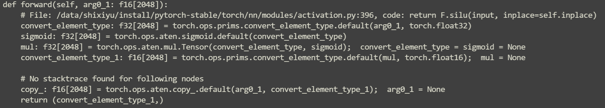
可以看到`aten.silu`被分解为四步：两次转换，一次`sigmoid`和一次矩阵乘。


#### 1.3 总结

前端的整体流程如下：
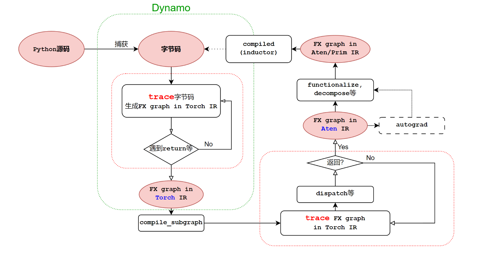

对于下面的代码：
```python
if __name__ == '__main__':
    model = nn.Sequential(
        nn.Conv2d(16, 32, 3),
        nn.BatchNorm2d(32),
        nn.ReLU(),
    ).cuda()
    model = torch.compile(model)
    x = torch.randn((2, 16, 8, 8), requires_grad=True, device="cuda")
    model(x)
```
通过前端 lowering 后，我们得到 aten/prims 级别的算子如下：
```python
def forward(self, primals_1, primals_2, primals_3, primals_4, primals_5, primals_6, primals_7, primals_8):
    clone = torch.ops.aten.clone.default(primals_5);  primals_5 = None
    clone_1 = torch.ops.aten.clone.default(primals_6);  primals_6 = None
    clone_2 = torch.ops.aten.clone.default(primals_7);  primals_7 = None
    convolution = torch.ops.aten.convolution.default(primals_8, primals_1, primals_2, [1, 1], [0, 0], [1, 1], False, [0, 0], 1);  primals_2 = None
    add = torch.ops.aten.add.Tensor(clone_2, 1);  clone_2 = None
    var_mean = torch.ops.aten.var_mean.correction(convolution, [0, 2, 3], correction = 0, keepdim = True)
    getitem = var_mean[0]
    getitem_1 = var_mean[1];  var_mean = None
    add_1 = torch.ops.aten.add.Tensor(getitem, 1e-05)
    rsqrt = torch.ops.aten.rsqrt.default(add_1);  add_1 = None
    sub = torch.ops.aten.sub.Tensor(convolution, getitem_1)
    mul = torch.ops.aten.mul.Tensor(sub, rsqrt);  sub = None
    squeeze = torch.ops.aten.squeeze.dims(getitem_1, [0, 2, 3]);  getitem_1 = None
    squeeze_1 = torch.ops.aten.squeeze.dims(rsqrt, [0, 2, 3]);  rsqrt = None
    mul_1 = torch.ops.aten.mul.Tensor(squeeze, 0.1)
    mul_2 = torch.ops.aten.mul.Tensor(clone, 0.9);  clone = None
    add_2 = torch.ops.aten.add.Tensor(mul_1, mul_2);  mul_1 = mul_2 = None
    squeeze_2 = torch.ops.aten.squeeze.dims(getitem, [0, 2, 3]);  getitem = None
    mul_3 = torch.ops.aten.mul.Tensor(squeeze_2, 1.0140845070422535);  squeeze_2 = None
    mul_4 = torch.ops.aten.mul.Tensor(mul_3, 0.1);  mul_3 = None
    mul_5 = torch.ops.aten.mul.Tensor(clone_1, 0.9);  clone_1 = None
    add_3 = torch.ops.aten.add.Tensor(mul_4, mul_5);  mul_4 = mul_5 = None
    unsqueeze = torch.ops.aten.unsqueeze.default(primals_3, -1)
    unsqueeze_1 = torch.ops.aten.unsqueeze.default(unsqueeze, -1);  unsqueeze = None
    unsqueeze_2 = torch.ops.aten.unsqueeze.default(primals_4, -1);  primals_4 = None
    unsqueeze_3 = torch.ops.aten.unsqueeze.default(unsqueeze_2, -1);  unsqueeze_2 = None
    mul_6 = torch.ops.aten.mul.Tensor(mul, unsqueeze_1);  mul = unsqueeze_1 = None
    add_4 = torch.ops.aten.add.Tensor(mul_6, unsqueeze_3);  mul_6 = unsqueeze_3 = None
    relu = torch.ops.aten.relu.default(add_4);  add_4 = None
    le = torch.ops.aten.le.Scalar(relu, 0)
    unsqueeze_4 = torch.ops.aten.unsqueeze.default(squeeze, 0);  squeeze = None
    unsqueeze_5 = torch.ops.aten.unsqueeze.default(unsqueeze_4, 2);  unsqueeze_4 = None
    unsqueeze_6 = torch.ops.aten.unsqueeze.default(unsqueeze_5, 3);  unsqueeze_5 = None
    return [add_2, add_3, add, relu, primals_1, primals_3, primals_8, convolution, squeeze_1, le, unsqueeze_6]
```
接着就会进入后端，进行代码生成。

### 2 Backend

后端整体流程如下：
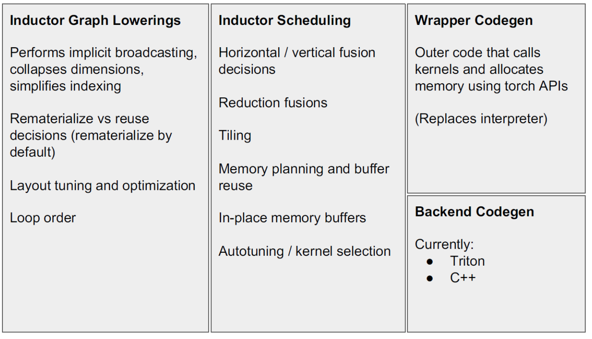

以 Triton 为例，首先会做一次 lowering，然后进行调度，最后才会生成 Triton 的 kernel。

#### 2.1 Loop-level IR

这里的 lowering，使用`loop-level IR`来表示，其对`aten IR`的每一句话做解释，并且每次的解析都会与前文联系起来。这一层 IR 的类型有：
* PointWise
* Reduction
* TensorBox
* MatrixMultiplyAdd
除此之外，还有一些其他的类型。

这一层处理流程：
* 对于从前端拿到的`aten IR`：
  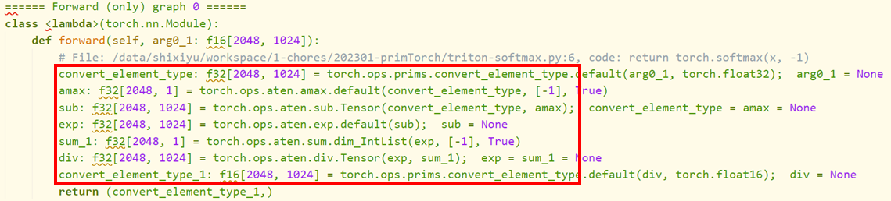

* 对于上面的每一句运算，都翻译为`loop-level IR`：
  * `convert_element_type`:
    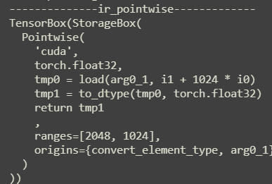
  * `amax`：
    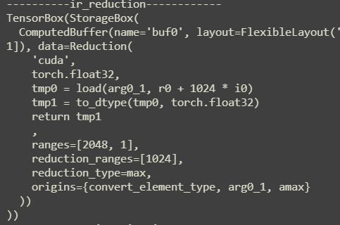
    这里将计算的结果存储到`buf0`中
  * `sub`:
    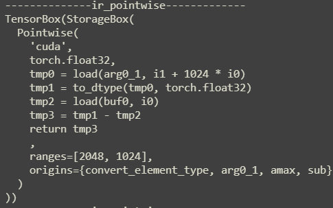
    由于`amax`将结果存储到`buf0`中，因此这里才能从`buf0`中直接 load 进来
  * `exp`:
    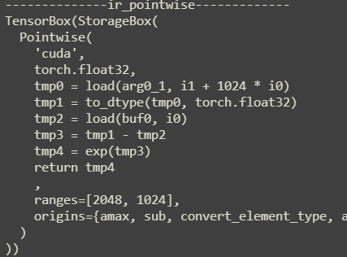
    如果上一条 IR 是`pointwise`的话，那么就会和这一次的进行归约，例如这里，只是在`sub`的 IR 上加上了`tmp4 = exp(tmp3)`并将 return 改为了`tmp4`
这一层的 pass 会对`aten IR`的每一句话进行解析，并且每次的解析都会与前文联系起来，最终得到一个归约的`loop-level IR`。

#### 2.2 Schedule

一下面的代码为例：
```python
if __name__ == '__main__':
    model = nn.Sequential(
        nn.Conv2d(16, 32, 3),
        nn.BatchNorm2d(32),
        nn.ReLU(),
    ).cuda()
    model = torch.compile(model)
    x = torch.randn((2, 16, 8, 8), requires_grad=True, device="cuda")
    model(x)
```

其在`loop-level`层构建出 11 个缓冲区。随后，对这些缓冲区进行 schedule，内容包括：
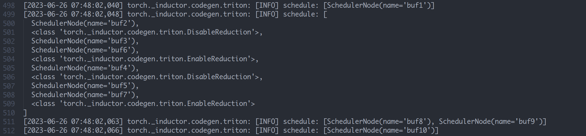

这里有些缓冲区启用了 Reduction，也就是说这里的归约是对于缓冲区而言的。将这些缓冲区放在一起，生成一个 kernel ，而其他的缓冲区，则单独生成自己的 kernel （注意这里的 kernel 是指 triton 的 kernel，实际上我们可以认为是一个函数）。*只有 reduction 的 kernel 中会出现循环语句，若只是 pointwise 的计算，则不会生成循环*

#### 2.3 Triton Kernel

最后就是 triton kernel 的生成，其采取的策略是：

* 首先生成 load 语句
* 生成 compute 语句
* 生成 store 语句
* 组合三种语句为一个 kernel
* 组合所有 kernel 与一个 call 函数和 main 模块在一起为一个 .py 文件

上述例子生成的文件如下：
```python
from ctypes import c_void_p, c_long
import torch
import math
import random
from torch import empty_strided, as_strided, device
from torch._inductor.codecache import AsyncCompile
from torch._inductor.select_algorithm import extern_kernels

aten = torch.ops.aten
assert_size_stride = torch._C._dynamo.guards.assert_size_stride
async_compile = AsyncCompile()

import triton
import triton.language as tl
from torch._inductor.triton_ops.autotune import grid
from torch._C import _cuda_getCurrentRawStream as get_cuda_stream


triton__0 = async_compile.triton('''
import triton
import triton.language as tl
from torch._inductor.ir import ReductionHint
from torch._inductor.ir import TileHint
from torch._inductor.triton_ops.autotune import pointwise
from torch._inductor.utils import instance_descriptor

@pointwise(size_hints=[4096], filename=__file__, meta={'signature': {0: '*fp32', 1: '*fp32', 2: 'i32'}, 'device': 0, 'constants': {}, 'mutated_arg_names': ['in_out_ptr0'], 'configs': [instance_descriptor(divisible_by_16=(0, 1, 2), equal_to_1=())]})
@triton.jit
def triton_(in_out_ptr0, in_ptr0, xnumel, XBLOCK : tl.constexpr):
        xnumel = 2304
        xoffset = tl.program_id(0) * XBLOCK
        xindex = xoffset + tl.arange(0, XBLOCK)[:]
        xmask = xindex < xnumel
    x3 = xindex
    x1 = (xindex // 36) % 32
    tmp0 = tl.load(in_out_ptr0 + (x3), xmask)
    tmp1 = tl.load(in_ptr0 + (x1), xmask)	
    tmp2 = tmp0 + tmp1
    tl.store(in_out_ptr0 + (x3 + tl.zeros([XBLOCK], tl.int32)), tmp2, xmask)
''')


triton__1 = async_compile.triton('''
import triton
import triton.language as tl
from torch._inductor.ir import ReductionHint
from torch._inductor.ir import TileHint
from torch._inductor.triton_ops.autotune import reduction
from torch._inductor.utils import instance_descriptor

@reduction(
    size_hints=[32, 128],
    reduction_hint=ReductionHint.INNER,
    filename=__file__,
    meta={'signature': {0: '*fp32', 1: '*fp32', 2: '*fp32', 3: '*fp32', 4: '*fp32', 5: '*fp32', 6: '*fp32', 7: '*fp32', 8: 'i32', 9: 'i32'}, 'device': 0, 'constants': {}, 'mutated_arg_names': ['in_out_ptr0'], 'configs': [instance_descriptor(divisible_by_16=(0, 1, 2, 3, 4, 5, 6, 7, 8), equal_to_1=())]}
)
@triton.jit
def triton_(in_out_ptr0, in_ptr0, in_ptr1, in_ptr2, out_ptr0, out_ptr1, out_ptr2, out_ptr3, xnumel, rnumel, XBLOCK : tl.constexpr, RBLOCK : tl.constexpr):
    xnumel = 32
    rnumel = 72
    xoffset = tl.program_id(0) * XBLOCK
    xindex = xoffset + tl.arange(0, XBLOCK)[:, None]
    xmask = xindex < xnumel
    rbase = tl.arange(0, RBLOCK)[None, :]
    x0 = xindex
    _tmp1 = tl.zeros([XBLOCK, RBLOCK], tl.float32) + 0
    for roffset in range(0, rnumel, RBLOCK):
        rindex = roffset + rbase
        rmask = rindex < rnumel
        r1 = rindex % 36
        r2 = (rindex // 36)
        tmp0 = tl.load(in_ptr0 + (r1 + (36*x0) + (1152*r2)), rmask & xmask, eviction_policy='evict_last', other=0)
        _tmp1 = tl.where(rmask & xmask, _tmp1 + tmp0, _tmp1)
    tmp1 = tl.sum(_tmp1, 1)[:, None]
    tmp6 = tl.load(in_ptr1 + (x0), xmask)
    tmp2 = 72.0
    tmp3 = tmp1 / tmp2
    tmp4 = 0.1
    tmp5 = tmp3 * tmp4
    tmp7 = 0.9
    tmp8 = tmp6 * tmp7
    tmp9 = tmp5 + tmp8
    tl.store(in_out_ptr0 + (x0 + tl.zeros([XBLOCK, 1], tl.int32)), tmp3, xmask)
    tl.store(out_ptr0 + (x0 + tl.zeros([XBLOCK, 1], tl.int32)), tmp9, xmask)
    _tmp13 = tl.zeros([XBLOCK, RBLOCK], tl.float32) + 0
    for roffset in range(0, rnumel, RBLOCK):
        rindex = roffset + rbase
        rmask = rindex < rnumel
        r1 = rindex % 36
        r2 = (rindex // 36)
        tmp10 = tl.load(in_ptr0 + (r1 + (36*x0) + (1152*r2)), rmask & xmask, eviction_policy='evict_last', other=0)
        tmp11 = tmp10 - tmp3
        tmp12 = tmp11 * tmp11
        _tmp13 = tl.where(rmask & xmask, _tmp13 + tmp12, _tmp13)
    tmp13 = tl.sum(_tmp13, 1)[:, None]
    tl.store(out_ptr1 + x0, tmp13, xmask)
    tmp23 = tl.load(in_ptr2 + (x0), xmask)
    tmp14 = 72.0
    tmp15 = tmp13 / tmp14
    tmp16 = 1e-05
    tmp17 = tmp15 + tmp16
    tmp18 = tl.libdevice.rsqrt(tmp17)
    tmp19 = 1.0140845070422535
    tmp20 = tmp15 * tmp19
    tmp21 = 0.1
    tmp22 = tmp20 * tmp21
    tmp24 = 0.9
    tmp25 = tmp23 * tmp24
    tmp26 = tmp22 + tmp25
    tl.store(out_ptr2 + (x0 + tl.zeros([XBLOCK, 1], tl.int32)), tmp18, xmask)
    tl.store(out_ptr3 + (x0 + tl.zeros([XBLOCK, 1], tl.int32)), tmp26, xmask)
''')


triton__2 = async_compile.triton('''
import triton
import triton.language as tl
from torch._inductor.ir import ReductionHint
from torch._inductor.ir import TileHint
from torch._inductor.triton_ops.autotune import pointwise
from torch._inductor.utils import instance_descriptor

@pointwise(size_hints=[4096], filename=__file__, meta={'signature': {0: '*fp32', 1: '*fp32', 2: '*fp32', 3: '*fp32', 4: '*fp32', 5: '*fp32', 6: '*i1', 7: 'i32'}, 'device': 0, 'constants': {}, 'mutated_arg_names': [], 'configs': [instance_descriptor(divisible_by_16=(0, 1, 2, 3, 4, 5, 6, 7), equal_to_1=())]})
@triton.jit
def triton_(in_ptr0, in_ptr1, in_ptr2, in_ptr3, in_ptr4, out_ptr0, out_ptr1, xnumel, XBLOCK : tl.constexpr):
    xnumel = 2304
    xoffset = tl.program_id(0) * XBLOCK
    xindex = xoffset + tl.arange(0, XBLOCK)[:]
    xmask = xindex < xnumel
    x3 = xindex
    x1 = (xindex // 36) % 32
    tmp0 = tl.load(in_ptr0 + (x3), xmask)
    tmp1 = tl.load(in_ptr1 + (x1), xmask)
    tmp3 = tl.load(in_ptr2 + (x1), xmask)
    tmp10 = tl.load(in_ptr3 + (x1), xmask)
    tmp12 = tl.load(in_ptr4 + (x1), xmask)
    tmp2 = tmp0 - tmp1
    tmp4 = 72.0
    tmp5 = tmp3 / tmp4
    tmp6 = 1e-05
    tmp7 = tmp5 + tmp6
    tmp8 = tl.libdevice.rsqrt(tmp7)
    tmp9 = tmp2 * tmp8
    tmp11 = tmp9 * tmp10
    tmp13 = tmp11 + tmp12
    tmp14 = tl.where(0 != 0, 0, tl.where(0 > tmp13, 0, tmp13))
    tmp15 = 0.0
    tmp16 = tmp14 <= tmp15
    tl.store(out_ptr0 + (x3 + tl.zeros([XBLOCK], tl.int32)), tmp14, xmask)
    tl.store(out_ptr1 + (x3 + tl.zeros([XBLOCK], tl.int32)), tmp16, xmask)
''')


triton__3 = async_compile.triton('''
import triton
import triton.language as tl
from torch._inductor.ir import ReductionHint
from torch._inductor.ir import TileHint
from torch._inductor.triton_ops.autotune import pointwise
from torch._inductor.utils import instance_descriptor

@pointwise(size_hints=[1], filename=__file__, meta={'signature': {0: '*i64', 1: '*i64', 2: 'i32'}, 'device': 0, 'constants': {}, 'mutated_arg_names': [], 'configs': [instance_descriptor(divisible_by_16=(0, 1), equal_to_1=())]})
@triton.jit
def triton_(in_ptr0, out_ptr0, xnumel, XBLOCK : tl.constexpr):
    xnumel = 1
    xoffset = tl.program_id(0) * XBLOCK
    xindex = xoffset + tl.arange(0, XBLOCK)[:]
    xmask = xindex < xnumel
    tmp0_load = tl.load(in_ptr0 + (0))
    tmp0 = tl.broadcast_to(tmp0_load, [XBLOCK])
    tmp1 = 1
    tmp2 = tmp0 + tmp1
    tl.store(out_ptr0 + (0 + tl.zeros([XBLOCK], tl.int32)), tmp2, None)
''')


async_compile.wait(globals())
del async_compile

def call(args):
    primals_1, primals_2, primals_3, primals_4, primals_5, primals_6, primals_7, primals_8 = args
    args.clear()
    with torch.cuda._DeviceGuard(0):
        torch.cuda.set_device(0) # no-op to ensure context
        buf0 = aten.convolution(primals_8, primals_1, None, (1, 1), (0, 0), (1, 1), False, (0, 0), 1)
        assert_size_stride(buf0, (2, 32, 6, 6), (1152, 36, 6, 1))
        buf1 = buf0; del buf0  # reuse
        stream0 = get_cuda_stream(0)
        triton__0.run(buf1, primals_2, 2304, grid=grid(2304), stream=stream0)
        del primals_2
        buf2 = empty_strided((1, 32, 1, 1), (32, 1, 32, 32), device='cuda', dtype=torch.float32)
        buf3 = buf2; del buf2  # reuse
        buf6 = empty_strided((32, ), (1, ), device='cuda', dtype=torch.float32)
        buf4 = empty_strided((1, 32, 1, 1), (32, 1, 32, 32), device='cuda', dtype=torch.float32)
        buf5 = empty_strided((32, ), (1, ), device='cuda', dtype=torch.float32)
        buf7 = empty_strided((32, ), (1, ), device='cuda', dtype=torch.float32)
        triton__1.run(buf3, buf1, primals_5, primals_6, buf6, buf4, buf5, buf7, 32, 72, grid=grid(32), stream=stream0)
        del primals_5
        del primals_6
        buf8 = empty_strided((2, 32, 6, 6), (1152, 36, 6, 1), device='cuda', dtype=torch.float32)
        buf9 = empty_strided((2, 32, 6, 6), (1152, 36, 6, 1), device='cuda', dtype=torch.bool)
        triton__2.run(buf1, buf3, buf4, primals_3, primals_4, buf8, buf9, 2304, grid=grid(2304), stream=stream0)
        del buf4
        del primals_4
        buf10 = empty_strided((), (), device='cuda', dtype=torch.int64)
        triton__3.run(primals_7, buf10, 1, grid=grid(1), stream=stream0)
        del primals_7
        return (buf6, buf7, buf10, buf8, primals_1, primals_3, primals_8, buf1, buf5, buf9, as_strided(buf3, (1, 32, 1, 1), (32, 1, 1, 1)), )


if __name__ == "__main__":
    from torch._dynamo.testing import rand_strided
    from torch._inductor.utils import print_performance
    primals_1 = rand_strided((32, 16, 3, 3), (144, 9, 3, 1), device='cuda:0', dtype=torch.float32)
    primals_2 = rand_strided((32, ), (1, ), device='cuda:0', dtype=torch.float32)
    primals_3 = rand_strided((32, ), (1, ), device='cuda:0', dtype=torch.float32)
    primals_4 = rand_strided((32, ), (1, ), device='cuda:0', dtype=torch.float32)
    primals_5 = rand_strided((32, ), (1, ), device='cuda:0', dtype=torch.float32)
    primals_6 = rand_strided((32, ), (1, ), device='cuda:0', dtype=torch.float32)
    primals_7 = rand_strided((), (), device='cuda:0', dtype=torch.int64)
    primals_8 = rand_strided((2, 16, 8, 8), (1024, 64, 8, 1), device='cuda:0', dtype=torch.float32)
    print_performance(lambda: call([primals_1, primals_2, primals_3, primals_4, primals_5, primals_6, primals_7, primals_8]))
```

此文件生成在`/tmp`文件夹中，后缀为`py` ，后续直接运行此文件，可得到 performace 的值，同样，也可在运行中捕获到运算的值。

#### 2.4 loop-level IR --> triton kernel

通过数据结构`GraphLowering`的方法`run(*example_input)`也就是一个`Fake Tensor`来生成 triton kernel：
```python

Graph ID : 0 

Input : {
    'primals_1': TensorBox(StorageBox(
  InputBuffer(name='primals_1', layout=FixedLayout('cuda', torch.float32, size=[32, 16, 3, 3], stride=[144, 9, 3, 1]))
)), 
    'primals_2': TensorBox(StorageBox(
  InputBuffer(name='primals_2', layout=FixedLayout('cuda', torch.float32, size=[32], stride=[1]))
)), 
    'primals_3': TensorBox(StorageBox(
  InputBuffer(name='primals_3', layout=FixedLayout('cuda', torch.float32, size=[32], stride=[1]))
)), 
    'primals_4': TensorBox(StorageBox(
  InputBuffer(name='primals_4', layout=FixedLayout('cuda', torch.float32, size=[32], stride=[1]))
)), 
    'primals_5': TensorBox(StorageBox(
  InputBuffer(name='primals_5', layout=FixedLayout('cuda', torch.float32, size=[32], stride=[1]))
)), 
    'primals_6': TensorBox(StorageBox(
  InputBuffer(name='primals_6', layout=FixedLayout('cuda', torch.float32, size=[32], stride=[1]))
)), 
    'primals_7': TensorBox(StorageBox(
  InputBuffer(name='primals_7', layout=FixedLayout('cuda', torch.int64, size=[], stride=[]))
)), 
    'primals_8': TensorBox(StorageBox(
  InputBuffer(name='primals_8', layout=FixedLayout('cuda', torch.float32, size=[2, 16, 8, 8], stride=[1024, 64, 8, 1]))
))} 

Origin Input : {
    'primals_1': InputBuffer(name='primals_1', layout=FixedLayout('cuda', torch.float32, size=[32, 16, 3, 3], stride=[144, 9, 3, 1])), 
    'primals_2': InputBuffer(name='primals_2', layout=FixedLayout('cuda', torch.float32, size=[32], stride=[1])), 
    'primals_3': InputBuffer(name='primals_3', layout=FixedLayout('cuda', torch.float32, size=[32], stride=[1])), 
    'primals_4': InputBuffer(name='primals_4', layout=FixedLayout('cuda', torch.float32, size=[32], stride=[1])), 
    'primals_5': InputBuffer(name='primals_5', layout=FixedLayout('cuda', torch.float32, size=[32], stride=[1])), 
    'primals_6': InputBuffer(name='primals_6', layout=FixedLayout('cuda', torch.float32, size=[32], stride=[1])), 
	'primals_7': InputBuffer(name='primals_7', layout=FixedLayout('cuda', torch.int64, size=[], stride=[])), 
    'primals_8': InputBuffer(name='primals_8', layout=FixedLayout('cuda', torch.float32, size=[2, 16, 8, 8], stride=[1024, 64, 8, 1]))} 


Output : [
    StorageBox(ComputedBuffer(name='buf6', layout=FixedLayout('cuda', torch.float32, size=[32], stride=[1]), data=Pointwise(
    'cuda',
    torch.float32,
    tmp0 = load(buf3, i0)
    tmp1 = constant(0.1, torch.float32)
    tmp2 = tmp0 * tmp1
    tmp3 = load(primals_5, i0)
    tmp4 = constant(0.9, torch.float32)
    tmp5 = tmp3 * tmp4
    tmp6 = tmp2 + tmp5
    return tmp6
    ,
    ranges=[32],
    origins={add_2}
  ))
), 
	StorageBox(ComputedBuffer(name='buf7', layout=FixedLayout('cuda', torch.float32, size=(32,), stride=[1]), data=Pointwise(
    'cuda',
    torch.float32,
    tmp0 = load(buf4, i0)
    tmp1 = index_expr(72, torch.float32)
    tmp2 = tmp0 / tmp1
    tmp3 = constant(1.0140845070422535, torch.float32)
    tmp4 = tmp2 * tmp3
    tmp5 = constant(0.1, torch.float32)
    tmp6 = tmp4 * tmp5
    tmp7 = load(primals_6, i0)
    tmp8 = constant(0.9, torch.float32)
    tmp9 = tmp7 * tmp8
    tmp10 = tmp6 + tmp9
    return tmp10
    ,
    ranges=(32,),
    origins={add_3}
  ))
), 
	StorageBox(ComputedBuffer(name='buf10', layout=FixedLayout('cuda', torch.int64, size=[], stride=[]), data=Pointwise(
    'cuda',
    torch.int64,
    tmp0 = load(primals_7, 0)
    tmp1 = constant(1, torch.int64)
    tmp2 = tmp0 + tmp1
    return tmp2
    ,
    ranges=[],
    origins={primals_7, clone_2, add}
  ))
), 
	StorageBox(ComputedBuffer(name='buf8', layout=FixedLayout('cuda', torch.float32, size=[2, 32, 6, 6], stride=[1152, 36, 6, 1]), data=Pointwise(
    'cuda',
    torch.float32,
    tmp0 = load(buf1, i3 + 6 * i2 + 36 * i1 + 1152 * i0)assembly
    tmp1 = load(buf3, i1)
    tmp2 = tmp0 - tmp1
    tmp3 = load(buf4, i1)
    tmp4 = index_expr(72, torch.float32)
    tmp5 = tmp3 / tmp4
    tmp6 = constant(1e-05, torch.float32)
    tmp7 = tmp5 + tmp6
    tmp8 = rsqrt(tmp7)
    tmp9 = tmp2 * tmp8
    tmp10 = load(primals_3, i1)
    tmp11 = tmp9 * tmp10
    tmp12 = load(primals_4, i1)
    tmp13 = tmp11 + tmp12
    tmp14 = relu(tmp13)
    return tmp14
    ,
    ranges=[2, 32, 6, 6],
    origins={relu}
  ))
), 
	StorageBox(InputBuffer(name='primals_1', layout=FixedLayout('cuda', torch.float32, size=[32, 16, 3, 3], stride=[144, 9, 3, 1]))
), 
	StorageBox(InputBuffer(name='primals_3', layout=FixedLayout('cuda', torch.float32, size=[32], stride=[1]))
), 
	StorageBox(InputBuffer(name='primals_8', layout=FixedLayout('cuda', torch.float32, size=[2, 16, 8, 8], stride=[1024, 64, 8, 1]))
), 
	StorageBox(ComputedBuffer(name='buf1', layout=FixedLayout('cuda', torch.float32, size=[2, 32, 6, 6], stride=[1152, 36, 6, 1]), data=Pointwise(
    'cuda',
    torch.float32,
    tmp0 = load(buf0, i3 + 6 * i2 + 36 * i1 + 1152 * i0)
    tmp1 = load(primals_2, i1)
    tmp2 = tmp0 + tmp1
    return tmp2
    ,
    ranges=[2, 32, 6, 6],
    origins={convolution}
  ))
), 
	StorageBox(ComputedBuffer(name='buf5', layout=FixedLayout('cuda', torch.float32, size=(32,), stride=[1]), data=Pointwise(
    'cuda',
    torch.float32,
    tmp0 = load(buf4, i0)
    tmp1 = index_expr(72, torch.float32)
    tmp2 = tmp0 / tmp1
    tmp3 = constant(1e-05, torch.float32)
    tmp4 = tmp2 + tmp3
    tmp5 = rsqrt(tmp4)
    return tmp5
    ,
    ranges=(32,),
    origins={squeeze_1}
  ))
), 
	StorageBox(ComputedBuffer(name='buf9', layout=FixedLayout('cuda', torch.bool, size=[2, 32, 6, 6], stride=[1152, 36, 6, 1]), data=Pointwise(
    'cuda',
    torch.bool,
    tmp0 = load(buf8, i3 + 6 * i2 + 36 * i1 + 1152 * i0)
    tmp1 = constant(0, torch.float32)
    tmp2 = tmp0 <= tmp1
    return tmp2
    ,
    ranges=[2, 32, 6, 6],
    origins={le}
  ))
), 
ReinterpretView(StorageBox(ComputedBuffer(name='buf3', layout=FixedLayout('cuda', torch.float32, size=[1, 32, 1, 1], stride=[32, 1, 32, 32]), data=Pointwise(
      'cuda',
      torch.float32,
      tmp0 = load(buf2, i1)
      tmp1 = index_expr(72, torch.float32)
      tmp2 = tmp0 / tmp1
      return tmp2
      ,
      ranges=[1, 32, 1, 1],
      origins={convolution, var_mean}
    ))
  ),
  FixedLayout('cuda', torch.float32, size=[1, 32, 1, 1], stride=[32, 1, 1, 1]),
  no origins?
)]
```

#### 2.5 调度的目的

* 调度的目的：由于在前面已经进行了 decompose (一般在转为 aten 算子的时候就已经完成了)，因此这里的目的是为了调整 buff 的次序，也就是调度内存，以优化内存访问的效率。

#### 2.6 aten IR --> loop-level IR

`aten IR`到`loop-level IR`在`torch/_inductor/compile_fx.py` 中 #179 完成的，其中，输入的 gm 中存储的 code 为：
```python
def forward(self, primals_1, primals_2, primals_3, primals_4, primals_5, primals_6, primals_7, primals_8):
    clone = torch.ops.aten.clone.default(primals_5);  primals_5 = None
    clone_1 = torch.ops.aten.clone.default(primals_6);  primals_6 = None
    clone_2 = torch.ops.aten.clone.default(primals_7);  primals_7 = None
    convolution = torch.ops.aten.convolution.default(primals_8, primals_1, primals_2, [1, 1], [0, 0], [1, 1], False, [0, 0], 1);  primals_2 = None
    add = torch.ops.aten.add.Tensor(clone_2, 1);  clone_2 = None
    var_mean = torch.ops.aten.var_mean.correction(convolution, [0, 2, 3], correction = 0, keepdim = True)
    getitem = var_mean[0]
    getitem_1 = var_mean[1];  var_mean = None
    add_1 = torch.ops.aten.add.Tensor(getitem, 1e-05)
    rsqrt = torch.ops.aten.rsqrt.default(add_1);  add_1 = None
    sub = torch.ops.aten.sub.Tensor(convolution, getitem_1)
    mul = torch.ops.aten.mul.Tensor(sub, rsqrt);  sub = None
    squeeze = torch.ops.aten.squeeze.dims(getitem_1, [0, 2, 3]);  getitem_1 = None
    squeeze_1 = torch.ops.aten.squeeze.dims(rsqrt, [0, 2, 3]);  rsqrt = None
    mul_1 = torch.ops.aten.mul.Tensor(squeeze, 0.1)
    mul_2 = torch.ops.aten.mul.Tensor(clone, 0.9);  clone = None
    add_2 = torch.ops.aten.add.Tensor(mul_1, mul_2);  mul_1 = mul_2 = None
    squeeze_2 = torch.ops.aten.squeeze.dims(getitem, [0, 2, 3]);  getitem = None
    mul_3 = torch.ops.aten.mul.Tensor(squeeze_2, 1.0140845070422535);  squeeze_2 = None
    mul_4 = torch.ops.aten.mul.Tensor(mul_3, 0.1);  mul_3 = None
    mul_5 = torch.ops.aten.mul.Tensor(clone_1, 0.9);  clone_1 = None
    add_3 = torch.ops.aten.add.Tensor(mul_4, mul_5);  mul_4 = mul_5 = None
    unsqueeze = torch.ops.aten.unsqueeze.default(primals_3, -1)
    unsqueeze_1 = torch.ops.aten.unsqueeze.default(unsqueeze, -1);  unsqueeze = None
    unsqueeze_2 = torch.ops.aten.unsqueeze.default(primals_4, -1);  primals_4 = None
    unsqueeze_3 = torch.ops.aten.unsqueeze.default(unsqueeze_2, -1);  unsqueeze_2 = None
    mul_6 = torch.ops.aten.mul.Tensor(mul, unsqueeze_1);  mul = unsqueeze_1 = None
    add_4 = torch.ops.aten.add.Tensor(mul_6, unsqueeze_3);  mul_6 = unsqueeze_3 = None
    relu = torch.ops.aten.relu.default(add_4);  add_4 = None
    le = torch.ops.aten.le.Scalar(relu, 0)
    unsqueeze_4 = torch.ops.aten.unsqueeze.default(squeeze, 0);  squeeze = None
    unsqueeze_5 = torch.ops.aten.unsqueeze.default(unsqueeze_4, 2);  unsqueeze_4 = None
    unsqueeze_6 = torch.ops.aten.unsqueeze.default(unsqueeze_5, 3);  unsqueeze_5 = None
    return [add_2, add_3, add, relu, primals_1, primals_3, primals_8, convolution, squeeze_1, le, unsqueeze_6]
```

得到的`loop-level IR`会通过下一行的`compile_to_fn()`进行到 triton 的转化，生成的 triron 代码会存储在`/tmp/`目录下的`.py`文件中。返回的值是一个函数`compiled_fn`，其`__module__`变量存储着上述的文件路径。

#### 2.7 GraphLowering --> Triton kernel

* 调用`graph.compile_to_fn()`
* 这个函数会先去调用 graph 中的`compiler_to_module()`，对此返回值，取出其 call 属性并返回
* 对于`compiler_to_module()`，首先调用`self.codegen()`来生成 triton 代码（返回一个 py 文件），随后将此代码重命名后返回
* 在 codegen 中，首先调用了`self.init_wrapper_code()`，此函数只是检查是否需要使用 cpp 包装，一般都不需要，于是实例化了一个`WrapperCodeGen()`的对象并返回
* 对 graph 中的 scheduler 进行实例化，调度的对象为`loop-level IR`中构造出的东西，实际上可以视为计算节点
  * 实例化的过程：
    * 声明一个空的 node 列表，用于新的构造
    * 拿到后续计算所依赖的缓冲区名称
    * 遍历传入的参数列表，这里就是在之前传入的列表等，对于列表中的每一个元素，做如下操作：
      * 查看此 node 是否存在入度（也就是数据是从什么地方来的，一般为缓冲区名称）
      * 对 node 的类型进行查看，在这里由于传入的节点均为 buffer ，因此不会进入`is_no_op`函数。接着，判断是否为 `ComputedBuffer` 或 `TemplateBuffer` ，其中 `TemplateBuffer` 给出的解释为 `Represents a Triton (in the futurue other type) of template operator that we can fuse an epilogue onto`.（显然，对于后续的 `ComputedBuffer` 都会进入这一条分支，并执行 `self.get_backend(node.get_device()).group_fn )`。对于卷积而言，在这里定义为 ExternKernel。
      * 将刚才生成的 node 添加到最开始创建的 node 列表中去
      * 做完这部分，接着进行死节点消除与节点融合
    * 完成调度后，接着就开始直接生成内核，注意，如果是特殊的算子（例如卷积）是不会被翻译为 triton 的，而是直接生成 aten ，否则，我们会进入 codegen_kernel 阶段。

