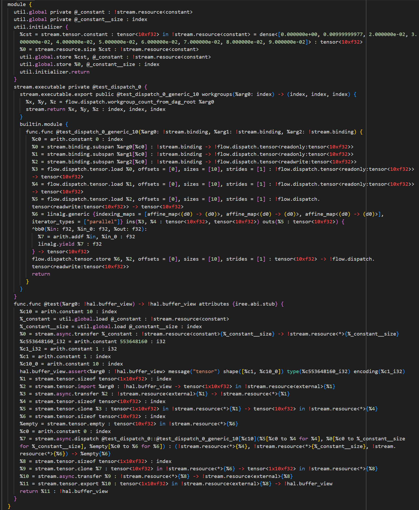
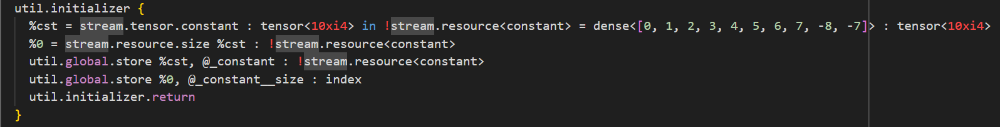
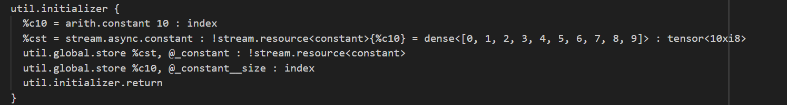

## iree 编译流程(3)——Stream::StreamTransformPassPipeline

### 6 Stream::StreamTransformPassPipeline

主要作用是将 program 转换到 stream dialect，优化变量编码方式，划分调度子图，生成异步调度策略，并实现内存规划策略。

#### 6.1 buildStreamTensorPassPipeline

* `IREE::Stream::createVerifyInputPass`
  检查program的合法性。

* `IREE::Stream::createOutlineConstantsPass`
  将 module 内部的`dense constant`转换成`global dense constant`。
  ```python
  func.func @test(%arg0: !hal.buffer_view) -> !hal.buffer_view attributes {iree.abi.stub} {
    %cst = arith.constant dense<[0.000000e+00, 0.00999999977, 2.000000e-02, 3.000000e-02, 4.000000e-02, 5.000000e-02, 6.000000e-02, 7.000000e-02, 8.000000e-02, 9.000000e-02]> : tensor<10xf32>
    %c10 = arith.constant 10 : index
    %0 = hal.tensor.import %arg0 : !hal.buffer_view -> tensor<1x10xf32>
    %1 = flow.tensor.reshape %0 : tensor<1x10xf32> -> tensor<10xf32>
    %2 = flow.tensor.empty : tensor<10xf32>
    %3 = flow.dispatch @test_dispatch_0::@test_dispatch_0_generic_10[%c10](%1, %cst, %2) : (tensor<10xf32>, tensor<10xf32>, tensor<10xf32>) -> %2
    %4 = flow.tensor.reshape %3 : tensor<10xf32> -> tensor<1x10xf32>
    %5 = hal.tensor.export %4 : tensor<1x10xf32> -> !hal.buffer_view
    return %5 : !hal.buffer_view
  }
  ```
  转换成，
  ```python
  util.global private @_constant {noinline} = dense<[0.000000e+00, 0.00999999977, 2.000000e-02, 3.000000e-02, 4.000000e-02, 5.000000e-02, 6.000000e-02, 7.000000e-02, 8.000000e-02, 9.000000e-02]> : tensor<10xf32>
  func.func @test(%arg0: !hal.buffer_view) -> !hal.buffer_view attributes {iree.abi.stub} {
    %_constant = util.global.load @_constant : tensor<10xf32>
    %c10 = arith.constant 10 : index
    %0 = hal.tensor.import %arg0 : !hal.buffer_view -> tensor<1x10xf32>
    %1 = flow.tensor.reshape %0 : tensor<1x10xf32> -> tensor<10xf32>
    %2 = flow.tensor.empty : tensor<10xf32>
    %3 = flow.dispatch @test_dispatch_0::@test_dispatch_0_generic_10[%c10](%1, %_constant, %2) : (tensor<10xf32>, tensor<10xf32>, tensor<10xf32>) -> %2
    %4 = flow.tensor.reshape %3 : tensor<10xf32> -> tensor<1x10xf32>
    %5 = hal.tensor.export %4 : tensor<1x10xf32> -> !hal.buffer_view
    return %5 : !hal.buffer_view
  }
  ```

* `addCleanupPatterns`

* `IREE::Stream::createConvertToStreamPass`
  将`IREE::Util`、`IREE::Flow`、`IREE::HAL`以及`std dialect`转换到`IREE::Stream dialect`。
  ```python
  module {
    util.global private @_constant {noinline} = dense<[0.000000e+00, 0.00999999977, 2.000000e-02, 3.000000e-02, 4.000000e-02, 5.000000e-02, 6.000000e-02, 7.000000e-02, 8.000000e-02, 9.000000e-02]> : tensor<10xf32>
    flow.executable private @test_dispatch_0 {
      flow.executable.export public @test_dispatch_0_generic_10 workgroups(%arg0: index) -> (index, index, index) {
        %x, %y, %z = flow.dispatch.workgroup_count_from_dag_root %arg0
        flow.return %x, %y, %z : index, index, index
      }
      builtin.module {
        func.func @test_dispatch_0_generic_10(%arg0: !flow.dispatch.tensor<readonly:tensor<10xf32>>, %arg1: !flow.dispatch.tensor<readonly:tensor<10xf32>>, %arg2: !flow.dispatch.tensor<readwrite:tensor<10xf32>>) {
          %0 = flow.dispatch.tensor.load %arg0, offsets = [0], sizes = [10], strides = [1] : !flow.dispatch.tensor<readonly:tensor<10xf32>> -> tensor<10xf32>
          %1 = flow.dispatch.tensor.load %arg1, offsets = [0], sizes = [10], strides = [1] : !flow.dispatch.tensor<readonly:tensor<10xf32>> -> tensor<10xf32>
          %2 = flow.dispatch.tensor.load %arg2, offsets = [0], sizes = [10], strides = [1] : !flow.dispatch.tensor<readwrite:tensor<10xf32>> -> tensor<10xf32>
          %3 = linalg.generic {indexing_maps = [affine_map<(d0) -> (d0)>, affine_map<(d0) -> (d0)>, affine_map<(d0) -> (d0)>], iterator_types = ["parallel"]} ins(%0, %1 : tensor<10xf32>, tensor<10xf32>) outs(%2 : tensor<10xf32>) {
          ^bb0(%in: f32, %in_0: f32, %out: f32):
            %4 = arith.addf %in, %in_0 : f32
            linalg.yield %4 : f32
          } -> tensor<10xf32>
          flow.dispatch.tensor.store %3, %arg2, offsets = [0], sizes = [10], strides = [1] : tensor<10xf32> -> !flow.dispatch.tensor<readwrite:tensor<10xf32>>
          return
        }
      }
    }
    func.func @test(%arg0: !hal.buffer_view) -> !hal.buffer_view attributes {iree.abi.stub} {
      %c10 = arith.constant 10 : index
      %_constant = util.global.load @_constant : tensor<10xf32>
      %0 = hal.tensor.import %arg0 : !hal.buffer_view -> tensor<1x10xf32>
      %1 = flow.tensor.reshape %0 : tensor<1x10xf32> -> tensor<10xf32>
      %2 = flow.tensor.empty : tensor<10xf32>
      %3 = flow.dispatch @test_dispatch_0::@test_dispatch_0_generic_10[%c10](%1, %_constant, %2) : (tensor<10xf32>, tensor<10xf32>, tensor<10xf32>) -> %2
      %4 = flow.tensor.reshape %3 : tensor<10xf32> -> tensor<1x10xf32>
      %5 = hal.tensor.export %4 : tensor<1x10xf32> -> !hal.buffer_view
      return %5 : !hal.buffer_view
    }
  }
  ```
  转换为

  


可以看到除了`flow.executable，module`中`tensor type`都被转换成`stream.resource`和`index`，但`hal.buffer_view type`仍然被保留。初始值为`tensor`的`util.global constant`被转换为不带初始值的 `stream.resource`和`index`，同时生成了一个`util.initializer`对 `stream.resource`和`index`进行初始化。 `util.global.load`被转换成`util.global.load + stream.async.transfer`，`hal.tensor.import`被转换成`stream.tensor.import + stream.async.transfer`，`hal.tensor.export`被转换为`stream.async.transfer + stream.tensor.export`，`flow.tensor.reshape`被转换成`stream.tensor.clone`，`flow.executable`转换为`stream.executable`，内部的`flow.executable.export`转换为`stream.executable.export` ，内部的`func op`的`argument`由`flow.dispatch.tensor`转换为`stream.binding`。

* `IREE::Stream::createVerifyLoweringToTensorsPass`
  检查program的合法性。

* `addCleanupPatterns`

* `IREE::Util::createCombineInitializersPass`
  合并所有的`util.initializer ops`。


#### 6.2 buildStreamAsyncPassPipeline

* `IREE::Stream::createEncodeHostTensorsPass`
  主要作用是将`tensor`的元素位宽（bit）扩充为 2 的幂大小，并按字节对齐。其中`i1~i7`转换为`i8`（1 byte），`i9~i15`转换为`i16` (2 bytes)，i`17~i31`转换为`i32` (4 bytes)，`i33~i63`转换为i64（8 bytes）。

  


  ```
  转换为

  


  ```
  `%cst`的类型从`i4`转成了`i8`，此外`stream.tensor.constant`转换成了`stream.async.constant`，`%0 = stream.resource.size %cst : !stream.resource<constant>`直接被替换成了常量`%c10`。

* `IREE::Stream::createEncodeDeviceTensorsPass`
  和`createEncodeHostTensorsPass`作用一样，区别是`createEncodeDeviceTensorsPass`作用的是`stream.executable`中的 op。
  ```python
  builtin.module {
      func.func @test_dispatch_0_generic_10(%arg0: !stream.binding, %arg1: !stream.binding, %arg2: !stream.binding) {
        %c0 = arith.constant 0 : index
        %0 = stream.binding.subspan %arg0[%c0] : !stream.binding -> !flow.dispatch.tensor<readonly:tensor<10xi4>>
        %1 = stream.binding.subspan %arg1[%c0] : !stream.binding -> !flow.dispatch.tensor<readonly:tensor<10xi4>>
        %2 = stream.binding.subspan %arg2[%c0] : !stream.binding -> !flow.dispatch.tensor<readwrite:tensor<10xi4>>
        %3 = flow.dispatch.tensor.load %0, offsets = [0], sizes = [10], strides = [1] : !flow.dispatch.tensor<readonly:tensor<10xi4>> -> tensor<10xi4>
        %4 = flow.dispatch.tensor.load %1, offsets = [0], sizes = [10], strides = [1] : !flow.dispatch.tensor<readonly:tensor<10xi4>> -> tensor<10xi4>
        %5 = flow.dispatch.tensor.load %2, offsets = [0], sizes = [10], strides = [1] : !flow.dispatch.tensor<readwrite:tensor<10xi4>> -> tensor<10xi4>
        %6 = linalg.generic {indexing_maps = [affine_map<(d0) -> (d0)>, affine_map<(d0) -> (d0)>, affine_map<(d0) -> (d0)>], iterator_types = ["parallel"]} ins(%3, %4 : tensor<10xi4>, tensor<10xi4>) outs(%5 : tensor<10xi4>) {
        ^bb0(%in: i4, %in_0: i4, %out: i4):
          %7 = arith.addi %in, %in_0 : i4
          linalg.yield %7 : i4
        } -> tensor<10xi4>
        flow.dispatch.tensor.store %6, %2, offsets = [0], sizes = [10], strides = [1] : tensor<10xi4> -> !flow.dispatch.tensor<readwrite:tensor<10xi4>>
        return
      }
  }
  ```
  转换为，
  ```python
  builtin.module {
      func.func @test_dispatch_0_generic_10(%arg0: !stream.binding, %arg1: !stream.binding, %arg2: !stream.binding) {
        %c0 = arith.constant 0 : index
        %0 = stream.binding.subspan %arg0[%c0] : !stream.binding -> !flow.dispatch.tensor<readonly:tensor<10xi8>>
        %1 = stream.binding.subspan %arg1[%c0] : !stream.binding -> !flow.dispatch.tensor<readonly:tensor<10xi8>>
        %2 = stream.binding.subspan %arg2[%c0] : !stream.binding -> !flow.dispatch.tensor<readwrite:tensor<10xi8>>
        %3 = flow.dispatch.tensor.load %0, offsets = [0], sizes = [10], strides = [1] : !flow.dispatch.tensor<readonly:tensor<10xi8>> -> tensor<10xi8>
        %4 = arith.trunci %3 : tensor<10xi8> to tensor<10xi4>
        %5 = flow.dispatch.tensor.load %1, offsets = [0], sizes = [10], strides = [1] : !flow.dispatch.tensor<readonly:tensor<10xi8>> -> tensor<10xi8>
        %6 = arith.trunci %5 : tensor<10xi8> to tensor<10xi4>
        %7 = flow.dispatch.tensor.load %2, offsets = [0], sizes = [10], strides = [1] : !flow.dispatch.tensor<readwrite:tensor<10xi8>> -> tensor<10xi8>
        %8 = arith.trunci %7 : tensor<10xi8> to tensor<10xi4>
        %9 = linalg.generic {indexing_maps = [affine_map<(d0) -> (d0)>, affine_map<(d0) -> (d0)>, affine_map<(d0) -> (d0)>], iterator_types = ["parallel"]} ins(%4, %6 : tensor<10xi4>, tensor<10xi4>) outs(%8 : tensor<10xi4>) {
        ^bb0(%in: i4, %in_0: i4, %out: i4):
          %11 = arith.addi %in, %in_0 : i4
          linalg.yield %11 : i4
        } -> tensor<10xi4>
        %10 = arith.extui %9 : tensor<10xi4> to tensor<10xi8>
        flow.dispatch.tensor.store %10, %2, offsets = [0], sizes = [10], strides = [1] : tensor<10xi8> -> !flow.dispatch.tensor<readwrite:tensor<10xi8>>
        return
      }
  }
  ```
  `stream.binding.subspan`的`result type`从`i4`转换成了`i8`，并且在`flow.dispatch.tensor.load`之后插入了一个`arith.trunci`，将`i8`截断为`i4`，进而参与`linalg.generic`中的计算。

* `IREE::Stream::createMaterializeBuiltinsPass`

* `addCleanupPatterns`

* `IREE::Stream::createMaterializeCopyOnWritePass`
  尝试消除`stream.async.dispatch`后的`stream.async.update op`。当`stream.async.dispatch`的结果没有绑定一个 value 时，就可以把`stream.async.update`的 target 绑定到`stream.async.dispatch`的结果，使得`stream.async.dispatch`直接把计算结果更新到 target。

* `IREE::Stream::createRefineUsagePass`
  确定每个`stream.resource`的生命期，推导`stream.resource`的类型。`stream.resource`类型包括：
  * Unknown: `stream.resource<*>`
  * External：`stream.resource<external>` 由外部程序管理的内存
  * Staging：`stream.resource<staging>` 用于上传/下载的暂存缓冲区
  * Transient：`stream.resource<transient>` 跨 stream 的一段临时值
  * Variable：`stream.resource<variable>` 跨 stream 的一段持续值
  * Constant：`stream.resource<constant>` 整个程序中持续存在的立即值（常量）。

  除此之外还消除了冗余的`stream.async.transfer`。
  ```python
  func.func @test(%arg0: !hal.buffer_view) -> !hal.buffer_view attributes {iree.abi.stub} {
      %c40 = arith.constant 40 : index
      %c0 = arith.constant 0 : index
      %c10 = arith.constant 10 : index
      %c553648160_i32 = arith.constant 553648160 : i32
      %c1_i32 = arith.constant 1 : i32
      hal.buffer_view.assert<%arg0 : !hal.buffer_view> message("tensor") shape([%c10]) type(%c553648160_i32) encoding(%c1_i32)
      %0 = stream.tensor.import %arg0 : !hal.buffer_view -> tensor<10xf32> in !stream.resource<external>[%c40]
      %1 = stream.async.transfer %0 : !stream.resource<external>[%c40] -> !stream.resource<*>[%c40]
      %2 = stream.async.dispatch @test_dispatch_0::@test_dispatch_0_generic_10[%c10](%1[%c0 to %c40 for %c40]) : (!stream.resource<*>[%c40]) -> !stream.resource<*>[%c40]
      %3 = stream.async.transfer %2 : !stream.resource<*>[%c40] -> !stream.resource<external>[%c40]
      %4 = stream.tensor.export %3 : tensor<10xf32> in !stream.resource<external>[%c40] -> !hal.buffer_view
      return %4 : !hal.buffer_view
  }
  ```
  转换为
  ```python
  func.func @test(%arg0: !hal.buffer_view) -> !hal.buffer_view attributes {iree.abi.stub} {
      %c40 = arith.constant 40 : index
      %c0 = arith.constant 0 : index
      %c10 = arith.constant 10 : index
      %c553648160_i32 = arith.constant 553648160 : i32
      %c1_i32 = arith.constant 1 : i32
      hal.buffer_view.assert<%arg0 : !hal.buffer_view> message("tensor") shape([%c10]) type(%c553648160_i32) encoding(%c1_i32)
      %0 = stream.tensor.import %arg0 : !hal.buffer_view -> tensor<10xf32> in !stream.resource<external>[%c40]
      %1 = stream.async.dispatch @test_dispatch_0::@test_dispatch_0_generic_10[%c10](%0[%c0 to %c40 for %c40]) : (!stream.resource<external>[%c40]) -> !stream.resource<external>[%c40]
      %2 = stream.tensor.export %1 : tensor<10xf32> in !stream.resource<external>[%c40] -> !hal.buffer_view
      return %2 : !hal.buffer_view
  }
  ```
  `!stream.resource<*>{ %c40}`被推导为`!stream.resource<external>{ %c40}`，并且有两处`stream.async.transfer`被删除了。

* `addCleanupPatterns`

* `IREE::Stream::createScheduleExecutionPass`
  根据启发式算法将每个 callable（包括`util.initializer`）划分成多个 part 进行调度，每个 part 独立构成一个`stream.async.execute`，并且每个`stream.async.execute`后面都跟了一个`stream.timepoint.await`操作用于同步执行结果。
  ```python
  func.func @test(%arg0: !hal.buffer_view) -> !hal.buffer_view attributes {iree.abi.stub} {
    %c40 = arith.constant 40 : index
    %c10 = arith.constant 10 : index
    %c553648160_i32 = arith.constant 553648160 : i32
    %c1_i32 = arith.constant 1 : i32
    %c1 = arith.constant 1 : index
    %c0 = arith.constant 0 : index
    %_constant = util.global.load @_constant : !stream.resource<constant>
    hal.buffer_view.assert<%arg0 : !hal.buffer_view> message("tensor") shape([%c1, %c10]) type(%c553648160_i32) encoding(%c1_i32)
    %0 = stream.tensor.import %arg0 : !hal.buffer_view -> tensor<1x10xf32> in !stream.resource<external>[%c40]
    %1 = stream.async.alloca : !stream.resource<external>[%c40]
    %2 = stream.async.dispatch @test_dispatch_0::@test_dispatch_0_generic_10[%c10](%0[%c0 to %c40 for %c40], %_constant[%c0 to %c40 for %c40], %1[%c0 to %c40 for %c40]) : (!stream.resource<external>[%c40], !stream.resource<constant>[%c40], !stream.resource<external>[%c40]) -> %1[%c40]
    %3 = stream.tensor.export %2 : tensor<1x10xf32> in !stream.resource<external>[%c40] -> !hal.buffer_view
    return %3 : !hal.buffer_view
  }
  ```
  转换成，
  ```python
  func.func @test(%arg0: !hal.buffer_view) -> !hal.buffer_view attributes {iree.abi.stub} {
    %c40 = arith.constant 40 : index
    %c10 = arith.constant 10 : index
    %c553648160_i32 = arith.constant 553648160 : i32
    %c1_i32 = arith.constant 1 : i32
    %c1 = arith.constant 1 : index
    %c0 = arith.constant 0 : index
    %_constant = util.global.load @_constant : !stream.resource<constant>
    hal.buffer_view.assert<%arg0 : !hal.buffer_view> message("tensor") shape([%c1, %c10]) type(%c553648160_i32) encoding(%c1_i32)
    %0 = stream.tensor.import %arg0 : !hal.buffer_view -> tensor<1x10xf32> in !stream.resource<external>[%c40]
    %results, %result_timepoint = stream.async.execute with(%0 as %arg1: !stream.resource<external>[%c40], %_constant as %arg2: !stream.resource<constant>[%c40]) -> !stream.resource<external>[%c40] {
      %3 = stream.async.alloca : !stream.resource<external>[%c40]
      %4 = stream.async.dispatch @test_dispatch_0::@test_dispatch_0_generic_10[%c10](%arg1[%c0 to %c40 for %c40], %arg2[%c0 to %c40 for %c40], %3[%c0 to %c40 for %c40]) : (!stream.resource<external>[%c40], !stream.resource<constant>[%c40], !stream.resource<external>[%c40]) -> %3[%c40]
      stream.yield %4 : !stream.resource<external>[%c40]
    } => !stream.timepoint
    %1 = stream.timepoint.await %result_timepoint => %results : !stream.resource<external>[%c40]
    %2 = stream.tensor.export %1 : tensor<1x10xf32> in !stream.resource<external>[%c40] -> !hal.buffer_view
    return %2 : !hal.buffer_view
  }
  ```

* `IREE::Stream::createScheduleConcurrencyPass`
  继续将`stream.async.execute`划分为多个并行调度区，每个并行调度区构成一个`stream.async.concurrent` 。

* `IREE::Stream::createPropagateTimepointsPass`
  给`stream.resource` 绑定一个 `stream.timepoint`，在代码中用`stream.resource + stream.timepoint` 的 pair 替换原来的`stream.resource`，并在需要的地方插入 await。

  * `util.global`
  ```python
  util.global private @_constant : !stream.resource<constant>
  ```
  转换成
  ```python
  util.global private mutable @_constant__timepoint = #stream.timepoint<immediate> : !stream.timepoint
  util.global private @_constant : !stream.resource<constant>
  ```

  * `util.global.load`
  ```python
  %_constant = util.global.load @_constant : !stream.resource<constant>
  ```
  转换成
  ```python
  %_constant__timepoint = util.global.load @_constant__timepoint : !stream.timepoint
  %_constant = util.global.load @_constant : !stream.resource<constant>
  %0 = stream.timepoint.await %_constant__timepoint => %_constant : !stream.resource<constant>[%c40]
  ```
  * `util.global.store`
  ```python
  util.global.store %0, @_constant : !stream.resource<constant>
  ```
  转换成
  ```python
  util.global.store %result_timepoint, @_constant__timepoint : !stream.timepoint
  util.global.store %results, @_constant : !stream.resource<constant>
  ```
  
  * `func.func`
  ```python
  func.func @foo(%0: !stream.resource) {
    ...
  }
  ```
  转换成
  ```python
  func.func @foo(%t: !stream.timepoint, %0: !stream.resource) {
    %1 = stream.timepoint.await %t, %0
    ...
  }
  ```
  * `call`
  由于 func 内部已经插入了 await，因此 call 之前的冗余 await 可以删除，call 之后需要再插入一个 func 返回值的 await。
  ```python
  %1 = stream.timepoint.await %t, %0
  %r = call @foo(%1)
  ```
  转换成
  ```python
  %rt, %r = call @foo(%t, %0)
  stream.timepoint.await %rt, %t
  ```
  
  * `return`
  ```python
  %1 = stream.timepoint.await %t, %0
  return %1
  ```
  转换成
  ```python
  return %t, %0
  ```
  
  * `branch`

  将参数的 await 挪到 branch 里面。
  ```python
  %1 = stream.timepoint.await %t, %0
  br ^bb1(%1)

  ^bb1(%b):
    ...
  ```
  转换成
  ```python
  br ^bb1(%t, %0)
  ^bb1(%a, %b):
    %1 = stream.timepoint.await %a, %b
  ```

  * `stream.async.execute`

  为每个未绑定`stream.timepoint`的输入参数绑定一个`stream.timepoint`，并在`stream.async.execute`之前计算参数的最大timepoint，`stream.async.execute` 则 await 这个最大 timepoint。
  ```python
  %results, %result_timepoint = stream.async.execute with(%0 as %arg1: !stream.resource<external>[%c40], %_constant as %arg2: !stream.resource<constant>[%c40]) -> !stream.resource<external>[%c40] {
    ...
  }
  ```
  转换成
  ```python
  %3 = stream.timepoint.join max(%2, %_constant__timepoint) => !stream.timepoint
  %results, %result_timepoint = stream.async.execute await(%3) => with(%1 as %arg1: !stream.resource<external>[%c40], %_constant as %arg2: !stream.resource<constant>[%c40]) -> !stream.resource<external>[%c40] {
    ...
  }
  ```

* `addCleanupPatterns`

* `IREE::Stream::createVerifyLoweringToAsyncPass`

  验证LoweringToAsyncPass阶段program的合法性。


#### 6.3 buildStreamCmdPassPipeline

* `IREE::Stream::createScheduleAllocationPass`
  * 首先将所有常量 op 聚合成一个`stream.resource.constants`，并移出该 region，`stream.resource.constants`的结果会被 append 到该 region 的输入参数中（原本直接 yield 的常量除外）。
    ```python
    %results, %result_timepoint = stream.async.execute with() -> !stream.resource<constant>[%c40] {
        %cst = stream.async.constant : !stream.resource<constant>[%c40] = dense<[0.000000e+00, 0.00999999977, 2.000000e-02, 3.000000e-02, 4.000000e-02, 5.000000e-02, 6.000000e-02, 7.000000e-02, 8.000000e-02, 9.000000e-02]> : tensor<10xf32>
        stream.yield %cst : !stream.resource<constant>[%c40]
    } => !stream.timepoint
    ```
    转换成
    ```python
    %results, %result_timepoint = stream.resource.constants :
        !stream.resource<constant>[%c40] = dense<[0.000000e+00, 0.00999999977, 2.000000e-02, 3.000000e-02, 4.000000e-02, 5.000000e-02, 6.000000e-02, 7.000000e-02, 8.000000e-02, 9.000000e-02]> : tensor<10xf32>
        => !stream.timepoint
    %0 = stream.cmd.execute with() {
    } => !stream.timepoint
    %1 = stream.timepoint.join max(%result_timepoint, %0) => !stream.timepoint
    ```
    
    * 分析`stream.async.execute region`中 resource 的类型和他们之间的 alias 关系，按照 resource 的类型统一分配空间。对于没有被 Tied 到输入（即非 inplace ）的 results，会统一在 region 外面由`stream.resource.alloc`申请一段 external 空间，region 再通过 Tied 的方式消费 alloc 的结果。对于中间临时的 esource，经过`stream.resource.pack`计算需要分配的空间大小后统一由`stream.resource.alloca`申请一段 transient 空间，并会在 region 后面插入`stream.resource.dealloca`释放申请的临时空间。
    ```python
    func.func @predict(%arg0: !hal.buffer_view) -> !hal.buffer_view attributes {iree.abi.stub} {
      %c8 = arith.constant 8 : index
      %c40 = arith.constant 40 : index
      %c4 = arith.constant 4 : index
      %c0 = arith.constant 0 : index
      %c1 = arith.constant 1 : index
      %c10 = arith.constant 10 : index
      %c553648160_i32 = arith.constant 553648160 : i32
      %c1_i32 = arith.constant 1 : i32
      %c2 = arith.constant 2 : index
      hal.buffer_view.assert<%arg0 : !hal.buffer_view> message("tensor") shape([%c1, %c2]) type(%c553648160_i32) encoding(%c1_i32)
      %0 = stream.tensor.import %arg0 : !hal.buffer_view -> tensor<1x2xf32> in !stream.resource<external>[%c8}]      // stream.async.execute
      %results, %result_timepoint = stream.async.execute with(%0 as %arg1: !stream.resource<external>[%c8}] -> !stream.resource<external>[%c40] {
        %3 = stream.async.dispatch @predict_dispatch_0::@predict_dispatch_0_matmul_1x10x2[%c1, %c10](%arg1[%c0 to %c8 for %c8]) : (!stream.resource<external>[%c8}] -> !stream.resource<transient>[%c40]
        %4 = stream.async.dispatch @predict_dispatch_1::@predict_dispatch_1_generic_10[%c1](%3[%c0 to %c40 for %c40]) : (!stream.resource<transient>[%c40]) -> !stream.resource<transient>[%c4}]        %5 = stream.async.dispatch @predict_dispatch_2::@predict_dispatch_2_generic_1x10[%c1, %c10](%3[%c0 to %c40 for %c40], %4[%c0 to %c4 for %c4]) : (!stream.resource<transient>[%c40], !stream.resource<transient>[%c4}] -> !stream.resource<transient>[%c40]
        %6 = stream.async.dispatch @predict_dispatch_3::@predict_dispatch_3_generic_10[%c1](%5[%c0 to %c40 for %c40]) : (!stream.resource<transient>[%c40]) -> !stream.resource<transient>[%c4}]        %7 = stream.async.dispatch @predict_dispatch_4::@predict_dispatch_4_generic_1x10[%c1, %c10](%5[%c0 to %c40 for %c40], %6[%c0 to %c4 for %c4]) : (!stream.resource<transient>[%c40], !stream.resource<transient>[%c4}] -> !stream.resource<external>[%c40]
        stream.yield %7 : !stream.resource<external>[%c40]
      } => !stream.timepoint
      %1 = stream.timepoint.await %result_timepoint => %results : !stream.resource<external>[%c40]
      %2 = stream.tensor.export %1 : tensor<1x10xf32> in !stream.resource<external>[%c40] -> !hal.buffer_view
      return %2 : !hal.buffer_view
    }
    ```
    转换成，
    ```python
    func.func @predict(%arg0: !hal.buffer_view) -> !hal.buffer_view attributes {iree.abi.stub} {
      %c8 = arith.constant 8 : index
      %c40 = arith.constant 40 : index
      %c4 = arith.constant 4 : index
      %c0 = arith.constant 0 : index
      %c1 = arith.constant 1 : index
      %c10 = arith.constant 10 : index
      %c553648160_i32 = arith.constant 553648160 : i32
      %c1_i32 = arith.constant 1 : i32
      %c2 = arith.constant 2 : index
      hal.buffer_view.assert<%arg0 : !hal.buffer_view> message("tensor") shape([%c1, %c2]) type(%c553648160_i32) encoding(%c1_i32)
      %0 = stream.tensor.import %arg0 : !hal.buffer_view -> tensor<1x2xf32> in !stream.resource<external>[%c8}]      %c0_0 = arith.constant 0 : index
      // 申请输出resource的空间
      %1 = stream.resource.alloc uninitialized : !stream.resource<external>[%c40]
      // 计算临时resource所需要的空间大小
      %2:5 = stream.resource.pack slices({
        [0, 2] = %c40,  // [0, 2]是某个resource的lifetime，%40是resource size
        [1, 2] = %c4,
        [2, 4] = %c40,
        [3, 4] = %c4
      }) : index
      // 申请临时resource的空间
      %result, %result_timepoint = stream.resource.alloca uninitialized : !stream.resource<transient>[%2#0] => !stream.timepoint
      %3 = stream.cmd.execute await(%result_timepoint) => with(%0 as %arg1: !stream.resource<external>[%c8}] %1 as %arg2: !stream.resource<external>[%c40], %result as %arg3: !stream.resource<transient>[%2#0]) {
        stream.cmd.dispatch @predict_dispatch_0::@predict_dispatch_0_matmul_1x10x2[%c1, %c10] {
          ro %arg1[%c0 for %c8] : !stream.resource<external>[%c8}]
          wo %arg3[%2#1 for %c40] : !stream.resource<transient>[%2#0]
        }
        stream.cmd.dispatch @predict_dispatch_1::@predict_dispatch_1_generic_10[%c1] {
          ro %arg3[%2#1 for %c40] : !stream.resource<transient>[%2#0],
          wo %arg3[%2#2 for %c4] : !stream.resource<transient>[%2#0]
        }
        stream.cmd.dispatch @predict_dispatch_2::@predict_dispatch_2_generic_1x10[%c1, %c10] {
          ro %arg3[%2#1 for %c40] : !stream.resource<transient>[%2#0],
          ro %arg3[%2#2 for %c4] : !stream.resource<transient>[%2#0],
          wo %arg3[%2#3 for %c40] : !stream.resource<transient>[%2#0]
        }
        stream.cmd.dispatch @predict_dispatch_3::@predict_dispatch_3_generic_10[%c1] {
          ro %arg3[%2#3 for %c40] : !stream.resource<transient>[%2#0],
          wo %arg3[%2#4 for %c4] : !stream.resource<transient>[%2#0]
        }
        stream.cmd.dispatch @predict_dispatch_4::@predict_dispatch_4_generic_1x10[%c1, %c10] {
          ro %arg3[%2#3 for %c40] : !stream.resource<transient>[%2#0],
          ro %arg3[%2#4 for %c4] : !stream.resource<transient>[%2#0],
          wo %arg2[%c0_0 for %c40] : !stream.resource<external>[%c40]
        }
      } => !stream.timepoint
      // 释放申请的临时空间
      %4 = stream.resource.dealloca await(%3) => %result : !stream.resource<transient>[%2#0] => !stream.timepoint
      %5 = stream.timepoint.join max(%4, %3) => !stream.timepoint
      %6 = stream.timepoint.await %5 => %1 : !stream.resource<external>[%c40]
      %7 = stream.tensor.export %6 : tensor<1x10xf32> in !stream.resource<external>[%c40] -> !hal.buffer_view
      return %7 : !hal.buffer_view
    }
    ```

* `IREE::Stream::createPackConstantsPass`
  将`stream.resource.constants`的结果根据 lifetime 类型分成 Constant 和 Variable 两种，每一种都替换成一个`util.buffer.constant `。
  ```cpp
  util.initializer {
    %c40 = arith.constant 40 : index
    %results, %result_timepoint = stream.resource.constants :
      !stream.resource<constant>[%c40] = dense<[0.000000e+00, 0.00999999977, 2.000000e-02, 3.000000e-02, 4.000000e-02, 5.000000e-02, 6.000000e-02, 7.000000e-02, 8.000000e-02, 9.000000e-02]> : tensor<10xf32>
      => !stream.timepoint
    %0 = stream.cmd.execute with() {
    } => !stream.timepoint
    %1 = stream.timepoint.join max(%result_timepoint, %0) => !stream.timepoint
    util.global.store %results, @_constant : !stream.resource<constant>
    util.global.store %1, @_constant__timepoint : !stream.timepoint
    util.initializer.return
  }
  ```
  转换成，
  ```cpp
  util.initializer {
    %c40 = arith.constant 40 : index
    %buffer_cst = util.buffer.constant {alignment = 64 : index} : !util.buffer = #util.composite<64xi8, [
      dense<[0.000000e+00, 0.00999999977, 2.000000e-02, 3.000000e-02, 4.000000e-02, 5.000000e-02, 6.000000e-02, 7.000000e-02, 8.000000e-02, 9.000000e-02]> : tensor<10xf32>,
      dense<0> : vector<24xi8>, // 填充的无用数据
  ]>
    %c0 = arith.constant 0 : index
    %c64 = arith.constant 64 : index
    // 尝试将buffer映射为target (!stream.resource<constant>)
    %did_map, %result = stream.resource.try_map %buffer_cst[%c0] : !util.buffer -> i1, !stream.resource<constant>[%c64]
    %0:2 = scf.if %did_map -> (!stream.resource<constant>, !stream.timepoint) {
      // 如果可以映射，则直接返回映射的结果（!stream.resource<constant>）
      %4 = stream.timepoint.immediate => !stream.timepoint
      scf.yield %result, %4 : !stream.resource<constant>, !stream.timepoint
    } else {
      // 如果不能映射，需要先将buffer映射为缓冲区（stage），然后申请一段新的空间并从缓冲区拷贝数据（copy）。
      // 如果lifetime类型是Variable，则不需要try_map，直接走该分支（stage + copy）的实现。
      %4 = stream.resource.map %buffer_cst[%c0] : !util.buffer -> !stream.resource<staging>[%c64]
      %5 = stream.resource.alloc uninitialized : !stream.resource<constant>[%c64]
      %6 = stream.cmd.execute with(%4 as %arg0: !stream.resource<staging>[%c64], %5 as %arg1: !stream.resource<constant>[%c64]) {
        stream.cmd.copy %arg0[%c0], %arg1[%c0], %c64 : !stream.resource<staging>[%c64] -> !stream.resource<constant>[%c64]
      } => !stream.timepoint
      scf.yield %5, %6 : !stream.resource<constant>, !stream.timepoint
    }
    %1 = stream.resource.subview %0#0[%c0] : !stream.resource<constant>[%c64] -> !stream.resource<constant>[%c40]
    %2 = stream.cmd.execute with() {
    } => !stream.timepoint
    %3 = stream.timepoint.join max(%0#1, %2) => !stream.timepoint
    util.global.store %1, @_constant : !stream.resource<constant>
    util.global.store %3, @_constant__timepoint : !stream.timepoint
    util.initializer.return
  }
  ```

* `IREE::Stream::createPackAllocationsPass`
  将包含多个 resource 的`stream.resource.alloc` 转换成 `stream.resource.pack + stream.resource.alloc`，并通过`stream.resource.subview` 获取每一个 resource。

* `IREE::Stream::createLayoutSlicesPass`
  将`stream.resource.pack`转化为具体的内存复用算法计算过程。
  ```cpp
  func.func @predict(%arg0: !hal.buffer_view) -> !hal.buffer_view attributes {iree.abi.stub} {
    %c8 = arith.constant 8 : index
    %c40 = arith.constant 40 : index
    %c4 = arith.constant 4 : index
    %c0 = arith.constant 0 : index
    %c1 = arith.constant 1 : index
    %c10 = arith.constant 10 : index
    %c553648160_i32 = arith.constant 553648160 : i32
    %c1_i32 = arith.constant 1 : i32
    %c2 = arith.constant 2 : index
    hal.buffer_view.assert<%arg0 : !hal.buffer_view> message("tensor") shape([%c1, %c2]) type(%c553648160_i32) encoding(%c1_i32)
    %0 = stream.tensor.import %arg0 : !hal.buffer_view -> tensor<1x2xf32> in !stream.resource<external>[%c8}]    %c0_0 = arith.constant 0 : index
    // 申请输出resource的空间
    %1 = stream.resource.alloc uninitialized : !stream.resource<external>[%c40]
    // 计算临时resource所需要的空间大小
    %2:5 = stream.resource.pack slices({
      [0, 2] = %c40,  // [0, 2]是某个resource的lifetime，%40是resource size
      [1, 2] = %c4,
      [2, 4] = %c40,
      [3, 4] = %c4
    }) : index
    // 申请临时resource的空间
    %result, %result_timepoint = stream.resource.alloca uninitialized : !stream.resource<transient>[%2#0] => !stream.timepoint
    %3 = stream.cmd.execute await(%result_timepoint) => with(%0 as %arg1: !stream.resource<external>[%c8}] %1 as %arg2: !stream.resource<external>[%c40], %result as %arg3: !stream.resource<transient>[%2#0]) {
      stream.cmd.dispatch @predict_dispatch_0::@predict_dispatch_0_matmul_1x10x2[%c1, %c10] {
        ro %arg1[%c0 for %c8] : !stream.resource<external>[%c8}]
        wo %arg3[%2#1 for %c40] : !stream.resource<transient>[%2#0]
      }
      stream.cmd.dispatch @predict_dispatch_1::@predict_dispatch_1_generic_10[%c1] {
        ro %arg3[%2#1 for %c40] : !stream.resource<transient>[%2#0],
        wo %arg3[%2#2 for %c4] : !stream.resource<transient>[%2#0]
      }
      stream.cmd.dispatch @predict_dispatch_2::@predict_dispatch_2_generic_1x10[%c1, %c10] {
        ro %arg3[%2#1 for %c40] : !stream.resource<transient>[%2#0],
        ro %arg3[%2#2 for %c4] : !stream.resource<transient>[%2#0],
        wo %arg3[%2#3 for %c40] : !stream.resource<transient>[%2#0]
      }
      stream.cmd.dispatch @predict_dispatch_3::@predict_dispatch_3_generic_10[%c1] {
        ro %arg3[%2#3 for %c40] : !stream.resource<transient>[%2#0],
        wo %arg3[%2#4 for %c4] : !stream.resource<transient>[%2#0]
      }
      stream.cmd.dispatch @predict_dispatch_4::@predict_dispatch_4_generic_1x10[%c1, %c10] {
        ro %arg3[%2#3 for %c40] : !stream.resource<transient>[%2#0],
        ro %arg3[%2#4 for %c4] : !stream.resource<transient>[%2#0],
        wo %arg2[%c0_0 for %c40] : !stream.resource<external>[%c40]
      }
    } => !stream.timepoint
    // 释放申请的临时空间
    %4 = stream.resource.dealloca await(%3) => %result : !stream.resource<transient>[%2#0] => !stream.timepoint
    %5 = stream.timepoint.join max(%4, %3) => !stream.timepoint
    %6 = stream.timepoint.await %5 => %1 : !stream.resource<external>[%c40]
    %7 = stream.tensor.export %6 : tensor<1x10xf32> in !stream.resource<external>[%c40] -> !hal.buffer_view
    return %7 : !hal.buffer_view
  }
  ```
  转换成，
  ```cpp
  func.func @predict(%arg0: !hal.buffer_view) -> !hal.buffer_view attributes {iree.abi.stub} {
    %c8 = arith.constant 8 : index
    %c40 = arith.constant 40 : index
    %c4 = arith.constant 4 : index
    %c0 = arith.constant 0 : index
    %c1 = arith.constant 1 : index
    %c10 = arith.constant 10 : index
    %c553648160_i32 = arith.constant 553648160 : i32
    %c1_i32 = arith.constant 1 : i32
    %c2 = arith.constant 2 : index
    hal.buffer_view.assert<%arg0 : !hal.buffer_view> message("tensor") shape([%c1, %c2]) type(%c553648160_i32) encoding(%c1_i32)
    %0 = stream.tensor.import %arg0 : !hal.buffer_view -> tensor<1x2xf32> in !stream.resource<external>[%c8}]    %c0_0 = arith.constant 0 : index
    %1 = stream.resource.alloc uninitialized : !stream.resource<external>[%c40]
    %c0_1 = arith.constant 0 : index
    %c64 = arith.constant 64 : index
    %c64_2 = arith.constant 64 : index
    %c128 = arith.constant 128 : index
    %c128_3 = arith.constant 128 : index
    %c192 = arith.constant 192 : index
    %c192_4 = arith.constant 192 : index
    %result, %result_timepoint = stream.resource.alloca uninitialized : !stream.resource<transient>[%c19]_4} => !stream.timepoint
    %2 = stream.cmd.execute await(%result_timepoint) => with(%0 as %arg1: !stream.resource<external>[%c8}] %1 as %arg2: !stream.resource<external>[%c40], %result as %arg3: !stream.resource<transient>[%c19]_4}) {
      stream.cmd.dispatch @predict_dispatch_0::@predict_dispatch_0_matmul_1x10x2[%c1, %c10] {
        ro %arg1[%c0 for %c8] : !stream.resource<external>[%c8}]
        wo %arg3[%c0_1 for %c40] : !stream.resource<transient>[%c19]_4}
      }
      stream.cmd.dispatch @predict_dispatch_1::@predict_dispatch_1_generic_10[%c1] {
        ro %arg3[%c0_1 for %c40] : !stream.resource<transient>[%c19]_4},
        wo %arg3[%c64_2 for %c4] : !stream.resource<transient>[%c19]_4}
      }
      stream.cmd.dispatch @predict_dispatch_2::@predict_dispatch_2_generic_1x10[%c1, %c10] {
        ro %arg3[%c0_1 for %c40] : !stream.resource<transient>[%c19]_4},
        ro %arg3[%c64_2 for %c4] : !stream.resource<transient>[%c19]_4},
        wo %arg3[%c128_3 for %c40] : !stream.resource<transient>[%c19]_4}
      }
      stream.cmd.dispatch @predict_dispatch_3::@predict_dispatch_3_generic_10[%c1] {
        ro %arg3[%c128_3 for %c40] : !stream.resource<transient>[%c19]_4},
        wo %arg3[%c0_1 for %c4] : !stream.resource<transient>[%c19]_4}
      }
      stream.cmd.dispatch @predict_dispatch_4::@predict_dispatch_4_generic_1x10[%c1, %c10] {
        ro %arg3[%c128_3 for %c40] : !stream.resource<transient>[%c19]_4},
        ro %arg3[%c0_1 for %c4] : !stream.resource<transient>[%c19]_4},
        wo %arg2[%c0_0 for %c40] : !stream.resource<external>[%c40]
      }
    } => !stream.timepoint
    %3 = stream.resource.dealloca await(%2) => %result : !stream.resource<transient>[%c19]_4} => !stream.timepoint
    %4 = stream.timepoint.join max(%3, %2) => !stream.timepoint
    %5 = stream.timepoint.await %4 => %1 : !stream.resource<external>[%c40]
    %6 = stream.tensor.export %5 : tensor<1x10xf32> in !stream.resource<external>[%c40] -> !hal.buffer_view
    return %6 : !hal.buffer_view
  }
  ```

* `IREE::Util::createPropagateSubrangesPass`
  把 resource 转换成 (resource, size, offset, length)的元组。
  * `util.global`
  ```cpp
  util.global private @_constant : !stream.resource<constant>
  ```
  转换成
  ```cpp
  util.global private @_constant : !stream.resource<constant>
  util.global private @_constant_size : index
  util.global private @_constant_offset : index
  util.global private @_constant_length : index
  ```

  * `util.global.load`
  ```cpp
  %0 = util.global.load @foo : !stream.resource
  ```
  转换成
  ```cpp
  %0 = util.global.load @foo : !stream.resource
  %s = util.global.load @foo_size : index
  %o = util.global.load @foo_offset : index
  %l = util.global.load @foo_length : index
  %1 = stream.resource.subview %0[%o] :
       !stream.resource<*>[%s} ]> !stream.resource<*>[%l}
] ```

  * `util.global.store`
  ```cpp
  %1 = stream.resource.subview %0[%o] :
       !stream.resource<*>[%s} ]> !stream.resource<*>[%l}
] util.global.store %1, @foo : !stream.resource
  ```
  转换成
  ```cpp
  util.global.store %0, @foo : !stream.resource // 这里语义是正确的吗???
  util.global.store %s, @foo_size : index
  util.global.store %o, @foo_offset : index
  util.global.store %l, @foo_length : index
  ```

  * `func.func`
  ```cpp
  func.func @foo(%0: !stream.resource) {
    ...
  }
  ```
  转换成
  ```cpp
  func.func @foo(%0: !stream.resource, %sz: index, %o: index, %l: index) {
    %1 = stream.resource.subview %0[%o] : [%sz}]-> [%l}
]   ...
  }
  ```

  * `call`
  ```cpp
  %1 = stream.resource.subview %0[%o] : [%sz}]-> [%l}
] %r = call @foo(%1)
  ```
  转换成
  ```cpp
  %r, %rsz, %ro, %rl = call @foo(%0, %sz, %o, %l)
  %2 = stream.resource.subview %r[%ro] : [%rsz] -> [%rl}]  ```

  * `return`
  ```cpp
  %1 = stream.resource.subview %0[%o] : [%sz}]-> [%l}
] return %1
  ```
  转换成
  ```cpp
  return %0, %sz, %o, %l
  ```

  * `branch`
  ```cpp
  %1 = stream.resource.subview %0[%o] : [%sz}]-> [%l}
] br ^bb1(%1)

  ^bb1(%b):
    ...
  ```
  转换成
  ```cpp
  br ^bb1(%0, %sz, %o, %l)
    
  ^bb1(%a, %b, %c, %d):
    %1 = stream.resource.subview %a[%b] : [%c} ]> [%d}
] ```

  * `cond_branch`

* `addCleanupPatterns`

* `REE::Stream::createVerifyLoweringToCmdPass`
  验证 program 的合法性。


#### 6.4 buildStreamOptimizationPassPipeline

* `addCleanupPatterns`

* `mlir::createConvertSCFToCFPass`
  将`structured control flow`算子转换成更低层基础块形式的`control flow`算子。
  ```cpp
  func.func @test(%pred: i32, %arg1: tensor<2x10xf32>, %arg2: tensor<2x10xf32>) -> tensor<2x10xf32> {
      %c0 = arith.constant 0 : i32
      %0 = arith.cmpi sgt, %pred, %c0 : i32
      %1 = scf.if %0 -> (tensor<2x10xf32>) {
        %2 = mhlo.add %arg1, %arg2 : tensor<2x10xf32>
        scf.yield %2 : tensor<2x10xf32>
      } else {
        %2 = mhlo.subtract %arg1, %arg2 : tensor<2x10xf32>
        scf.yield %2 : tensor<2x10xf32>
      }
      return %1 : tensor<2x10xf32>
  }
  ```
  转换成
  ```cpp
  func.func @test(%pred: i32, %arg1: tensor<2x10xf32>, %arg2: tensor<2x10xf32>) -> tensor<2x10xf32> {
      %c0 = arith.constant 0 : i32
      %0 = arith.cmpi sgt, %pred, %c0 : i32
      cf.cond_br %0, ^bb1, ^bb2
    ^bb1:
      %2 = mhlo.add %arg1, %arg2 : tensor<2x10xf32>
      cf.br ^bb3(%2 : tensor<2x10xf32>)
    ^bb2:
      %3 = mhlo.subtract %arg1, %arg2 : tensor<2x10xf32>
      cf.br ^bb3(%3 : tensor<2x10xf32>)
    ^bb3(%4: tensor<2x10xf32>):
      return %4 : tensor<2x10xf32>
  }
  ```

* `addCleanupPatterns`

* `IREE::Stream::createElideTimepointsPass`
  消除已经确信到达的等待。比如
  ```cpp
  %timepoint0 = ...
  %timepoint1 = ... await(%timepoint0)
  %timepoint2 = stream.timepoint.join max(%timepoint0, %timepoint1)
  ```
  timepoint1 到达时 timepoint0 一定已经达到过，因此可以转换成，
  ```cpp
  %timepoint0 = ...
  %timepoint1 = ... await(%timepoint0)
  %timepoint2 = stream.timepoint.join max(%timepoint1)
  ```
  canonicalization 之后最终是
  ```cpp
  %timepoint0 = ...
  %timepoint1 = ... await(%timepoint0)
  %timepoint2 = %timepoint1
  ```

* `IREE::Util::createFixedPointIteratorPass`
  该 pass 触发重复执行一个 pass pipeline，直到达到固定迭代次数或最大迭代次数。这里的 pipeline 包括前面的 addCleanupPatterns 和 createElideTimepointsPass 两个子 pass。

* `IREE::Stream::createFuseDispatchBindingsPass`
  根据`stream.cmd.dispatch`的 resource 关系合并`dispatch executable`的`bindings`，比如`stream.cmd.dispatch`两个 resource 是同一个地址的不同 range，则可以计算每个 resource 在 base 地址上的偏移，并将这两个 resource 合并成一个 binding，在`dispatch executable`中根据偏移来截取每个被合并的 binding。该操作默认只合并 read only 的 resource。
  ```cpp
  stream.executable private @predict_dispatch_2 {
    stream.executable.export public @predict_dispatch_2_generic_1x10 workgroups(%arg0: index, %arg1: index) -> (index, index, index) {
      %x, %y, %z = flow.dispatch.workgroup_count_from_dag_root %arg0, %arg1
      stream.return %x, %y, %z : index, index, index
    }
    builtin.module {
      func.func @predict_dispatch_2_generic_1x10(%arg0: !stream.binding, %arg1: !stream.binding, %arg2: !stream.binding) {
        %c0 = arith.constant 0 : index
        %0 = stream.binding.subspan %arg0[%c0] : !stream.binding -> !flow.dispatch.tensor<readonly:tensor<1x10xf32>>
        %1 = stream.binding.subspan %arg1[%c0] : !stream.binding -> !flow.dispatch.tensor<readonly:tensor<f32>>
        %2 = stream.binding.subspan %arg2[%c0] : !stream.binding -> !flow.dispatch.tensor<writeonly:tensor<1x10xf32>>
        %3 = flow.dispatch.tensor.load %0, offsets = [0, 0], sizes = [1, 10], strides = [1, 1] : !flow.dispatch.tensor<readonly:tensor<1x10xf32>> -> tensor<1x10xf32>
        %4 = flow.dispatch.tensor.load %1, offsets = [], sizes = [], strides = [] : !flow.dispatch.tensor<readonly:tensor<f32>> -> tensor<f32>
        %5 = tensor.empty() : tensor<1x10xf32>
        %6 = linalg.generic {indexing_maps = [affine_map<(d0, d1) -> (d0, d1)>, affine_map<(d0, d1) -> ()>, affine_map<(d0, d1) -> (d0, d1)>], iterator_types = ["parallel", "parallel"]} ins(%3, %4 : tensor<1x10xf32>, tensor<f32>) outs(%5 : tensor<1x10xf32>) {
        ^bb0(%in: f32, %in_0: f32, %out: f32):
          %7 = arith.subf %in, %in_0 : f32
          %8 = math.exp %7 : f32
          linalg.yield %8 : f32
        } -> tensor<1x10xf32>
        flow.dispatch.tensor.store %6, %2, offsets = [0, 0], sizes = [1, 10], strides = [1, 1] : tensor<1x10xf32> -> !flow.dispatch.tensor<writeonly:tensor<1x10xf32>>
        return
      }
    }
  }

  func.func @predict(%arg0: !hal.buffer_view) -> !hal.buffer_view attributes {iree.abi.stub} {
    ...
    %2 = stream.cmd.execute await(%result_timepoint) => with(%0 as %arg1: !stream.resource<external>[%c8}] %1 as %arg2: !stream.resource<external>[%c40], %result as %arg3: !stream.resource<transient>[%c19]}) {
      ...
      stream.cmd.dispatch @predict_dispatch_2::@predict_dispatch_2_generic_1x10[%c1, %c10] {
          ro %arg3[%c0 for %c40] : !stream.resource<transient>[%c19]},
          ro %arg3[%c64 for %c4] : !stream.resource<transient>[%c19]},
          wo %arg3[%c128 for %c40] : !stream.resource<transient>[%c19]}
      }
      ...
    }
  }
  ```
  转换成
  ```cpp
  stream.executable private @predict_dispatch_2 {
    stream.executable.export public @predict_dispatch_2_generic_1x10 workgroups(%arg0: index, %arg1: index) -> (index, index, index) {
      %x, %y, %z = flow.dispatch.workgroup_count_from_dag_root %arg0, %arg1
      stream.return %x, %y, %z : index, index, index
    }
    builtin.module {
      func.func @predict_dispatch_2_generic_1x10(%arg0: !stream.binding, %arg1: !stream.binding, %arg2: index, %arg3: index, %arg4: index) {
        %c0 = arith.constant 0 : index
        %0 = arith.addi %c0, %arg2 : index
        %1 = stream.binding.subspan %arg0[%0] : !stream.binding -> !flow.dispatch.tensor<readonly:tensor<1x10xf32>>
        %2 = arith.addi %c0, %arg3 : index
        %3 = stream.binding.subspan %arg0[%2] : !stream.binding -> !flow.dispatch.tensor<readonly:tensor<f32>>
        %4 = arith.addi %c0, %arg4 : index
        %5 = stream.binding.subspan %arg1[%4] : !stream.binding -> !flow.dispatch.tensor<writeonly:tensor<1x10xf32>>
        %6 = flow.dispatch.tensor.load %1, offsets = [0, 0], sizes = [1, 10], strides = [1, 1] : !flow.dispatch.tensor<readonly:tensor<1x10xf32>> -> tensor<1x10xf32>
        %7 = flow.dispatch.tensor.load %3, offsets = [], sizes = [], strides = [] : !flow.dispatch.tensor<readonly:tensor<f32>> -> tensor<f32>
        %8 = tensor.empty() : tensor<1x10xf32>
        %9 = linalg.generic {indexing_maps = [affine_map<(d0, d1) -> (d0, d1)>, affine_map<(d0, d1) -> ()>, affine_map<(d0, d1) -> (d0, d1)>], iterator_types = ["parallel", "parallel"]} ins(%6, %7 : tensor<1x10xf32>, tensor<f32>) outs(%8 : tensor<1x10xf32>) {
        ^bb0(%in: f32, %in_0: f32, %out: f32):
          %10 = arith.subf %in, %in_0 : f32
          %11 = math.exp %10 : f32
          linalg.yield %11 : f32
        } -> tensor<1x10xf32>
        flow.dispatch.tensor.store %9, %5, offsets = [0, 0], sizes = [1, 10], strides = [1, 1] : tensor<1x10xf32> -> !flow.dispatch.tensor<writeonly:tensor<1x10xf32>>
        return
      }
    }
  }

  func.func @predict(%arg0: !hal.buffer_view) -> !hal.buffer_view attributes {iree.abi.stub} {
    ...
    %2 = stream.cmd.execute await(%result_timepoint) => with(%0 as %arg1: !stream.resource<external>[%c8}] %1 as %arg2: !stream.resource<external>[%c40], %result as %arg3: !stream.resource<transient>[%c19]}) {
      ...
      stream.cmd.dispatch @predict_dispatch_2::@predict_dispatch_2_generic_1x10[%c1, %c10](%c0, %c64, %c128 : index, index, index) {
        ro %arg3[%c0_0 for %c192] : !stream.resource<transient>[%c19]},
        wo %arg3[%c0_0 for %c192] : !stream.resource<transient>[%c19]}
      }
      ...
    }
  }
  ```
  可以看到`stream.cmd.dispatch @predict_dispatch_2`的 resource 被合并为 2 个，`predict_dispatch_2_generic_1x10 dispatch executable`参数中的 binding 也减少为 2 个，但增加了 3 个表示 offset 的 index，被合并的 binding 根据 offset 来截取。

* `IREE::Stream::createPackDispatchOperandsPass`
  将`dispatch executable`参数中的标量 /index 类型转换成 i32 或 i64 类型。
  ```cpp
  func.func @predict_dispatch_2_generic_1x10(%arg0: !stream.binding, %arg1: !stream.binding, %arg2: index, %arg3: index, %arg4: index) {
    ...
  }
  ```
  转换成
  ```cpp
  func.func @predict_dispatch_2_generic_1x10(%arg0: !stream.binding, %arg1: !stream.binding, %arg2: i32, %arg3: i32, %arg4: i32) {
    ...
  }
  ```

* `mlir::createCSEPass`

* `IREE::Stream::createFoldUniformOperandsPass`
  折叠`dispatch executable`的所有调用中相同的参数。
  ```cpp
  stream.cmd.dispatch @foo(%c1, %c100 : index, index)
  stream.cmd.dispatch @foo(%c1, %c101 : index, index)
  stream.cmd.dispatch @foo2(%c1, %c101 : index, index)
  ```
  转换成
  ```cpp
  stream.cmd.dispatch @foo(%c100 : index)
  stream.cmd.dispatch @foo(%c101 : index)
  stream.cmd.dispatch @foo2()
  ```
  `@foo`内联了`%c1`，`@foo2`内联了`%c1`和`%c101`。

* `IREE::Stream::createAnnotateDispatchArgumentsPass`
  给`dispatch executable`的参数添加`potential value`和`alignment`信息。
  ```cpp
  func.func @predict_dispatch_2_generic_1x10(%arg0: !stream.binding, %arg1: !stream.binding) {
    ...
  }
  ```
  转换为
  ```cpp
  func.func @predict_dispatch_2_generic_1x10(%arg0: !stream.binding {stream.alignment = 64 : index}, %arg1: !stream.binding {stream.alignment = 64 : index}) {
    ...
  }
  ```

* `IREE::Stream::createMemoizeChannelsPass`
  找出所有`stream.channel.default ops`，为每一个`stream.channel.default op`创建一个全局缓冲区，同时在初始化时创建对应的 channel，并将 channel 结果写入全局缓冲区，最后将该`stream.channel.default op`替换为全局缓冲区的`util.global.load op`。

* `addCleanupPatterns`

* `mlir::createSymbolDCEPass`

**未完待续......**
