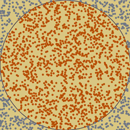

## 蒙特卡洛方法

### 0 简介

蒙特·卡罗方法（Monte Carlo method），是一种思想或者方法的统称，而不是严格意义上的算法。蒙特卡洛方法的起源是1777年由法国数学家布丰（Comte de Buffon）提出的用投针实验方法求圆周率，在20世纪40年代中期，由于计算机的发明结合概率统计理论的指导，从而正式总结为一种数值计算方法，其主要是用随机数来估算计算问题。**原理是通过大量随机样本，去了解一个系统，进而得到所要计算的值。**

### 1 原理

蒙特卡洛方法是一种以概率统计理论为指导的数值计算方法，它通过随机抽样来获取对一个问题的数值解。基本思想是利用随机数（或伪随机数）来模拟或估计复杂系统的行为，它依赖于概率和统计理论，特别是大数定律和中心极限定理。这种方法不是直接解决问题，而是通过大量的随机样本来估计问题的解，适用于那些传统分析方法难以解决的问题。

#### 1.1 理论解释

* 随机抽样与概率分布
  蒙特卡洛方法的核心在于生成代表性的随机样本。这些样本用于模拟复杂系统的行为或计算数值解。样本的生成必须满足问题的概率分布要求，这是整个方法的基础。例如均匀分布、正态分布、指数分布等。概率分布是蒙特卡洛方法能够模拟各种随机现象的根基。
* 大数定律
  大数定律是统计学中的一个基本定理，它说明如果一个随机试验重复进行，那么随着试验次数的增加，观察到的频率（即样本均值）会趋近于其真实概率（即期望值）。在蒙特卡洛方法中，随着样本数量的增加，对期望值的估计将变得越来越准确。
* 中心极限定理
  中心极限定理解释了为什么在许多自然和人工过程中，独立随机变量的平均值会趋于正态分布，即使这些变量本身不是正态分布的。对于蒙特卡洛来说，这一原理保证了即使基于非正态分布的样本，其结果的总体分布也会接近正态分布，这样可以使用正态分布的性质来估计结果的置信区间。
* 估计与误差分析
  蒙特卡洛方法通常用来估计某个量的数值，如积分、期望值等。估计的准确性和可靠性可以通过统计误差分析来评估，这包括了对结果的方差和标准差的计算以及置信区间的估计。
* 方差缩减技术
  为了提高蒙特卡洛模拟的效率，可以采用各种方差缩减技术，如控制变量、抗差性估计、条件期望法、分层抽样和重要性抽样等。这些技术的目的是在不增加样本数量的情况下，减少估计值的方差，从而提高估计的精确度。
* 随机数生成
  蒙特卡洛模拟依赖于高质量的随机数或伪随机数生成器。理想的随机数生成器应具备良好的统计特性、较长的周期和高效的计算能力。
* 概率模型
  蒙特卡洛方法在构建时需要一个概率模型，该模型决定了如何生成随机样本。在金融领域，这可能是股票价格的随机走势模型；在物理学中，可能是粒子运动的随机模型。
* 处理不确定性
  蒙特卡洛方法非常适合用于处理具有不确定性的问题，如预测模型中的未来事件或在工程分析中的偶然失效。
* 迭代与收敛性
  通过迭代的方式增加样本数量，可以不断提高估计结果的准确性。蒙特卡洛方法通常需要足够的迭代次数来确保收敛于真实值。
* 实现和计算
  蒙特卡洛方法的计算一般可以并行执行，因为每次试验（或者称为“抽样”）都是独立的，这使得它可以高效地在现代多核处理器或者分布式计算环境中实现。

#### 1.2 问题分类

蒙特卡洛方法的问题可以分为两大类：

* 直接模拟型
  这类问题本身具有内在的随机性，可以通过计算机的运算能力直接模拟这种随机的过程。例如在核物理研究中，分析中子在反应堆中的传输过程，科学家会依据其概率进行随机抽样得到裂变位置、速度和方向。
* 间接模拟型
  这类问题可以将求解问题转化为某种随机分布的特征数，比如随机事件出现的概率，或者随机变量的期望值。通过随机抽样的方法，以随机事件出现的频率估计其概率，或者以抽样的数字特征估算随机变量的数字特征，并将其作为问题的解

#### 1.3 特点

* 优点
  * 能够比较逼真地描述具有随机性质的事物的特点及物理实验过程
  * 受几何条件限制小
  * 收敛速度与问题的维数无关
  * 具有同时计算多个方案与多个未知量的能力
  * 误差容易确定
  * 程序结构简单，易于实现

* 缺点
  * 收敛速度慢
  * 误差具有概率性
  * 在粒子输运问题中，计算结果与系统大小有关

#### 1.4 与拉斯维加斯方法的比较

* 蒙特卡洛方法，采样越多，越近似最优解
  假如筐里有100个苹果，让我每次闭眼拿1个，挑出最大的。于是我随机拿1个，再随机拿1个跟它比，留下大的，再随机拿1个……我每拿一次，留下的苹果都至少不比上次的小。拿的次数越多，挑出的苹果就越大，但我除非拿100次，否则无法肯定挑出了最大的。——尽量找好的，但不保证是最好的。
  
* 拉斯维加斯方法，采样越多，越有机会找到最优解
  假如有一把锁，给我100把钥匙，只有1把是对的。于是我每次随机拿1把钥匙去试，打不开就再换1把。我试的次数越多，打开（最优解）的机会就越大，但在打开之前，那些错的钥匙都是没有用的。——尽量找最好的，但不保证能找到。


### 2 模拟步骤

蒙特卡洛方法一般分为三个步骤，分别为构造随机的概率的过程，从构造随机概率分布中抽样，求解估计量。

* 构造随机的概率的过程
  对于本身就具有随机性质的问题，如粒子输运问题，主要是正确描述和模拟这个概率过程，对于本来不是随机性质的确定性问题，比如计算定积分，就必须事先构造一个人为的概率过程，它的某些参量正好是所要求问题的解。即要将不具有随机性质的问题转化为随机性质的问题。
* 从已知概率分布抽样
  构造了概率模型以后，由于各种概率模型都可以看作是由各种各样的概率分布构成的，因此产生已知概率分布的随机变量（或随机向量），就成为实现蒙特卡洛方法模拟实验的基本手段，这也是蒙特卡洛方法被称为随机抽样的原因。
  最简单、最基本、最重要的一个概率分布是(0,1)上的均匀分布（或称矩形分布）。随机数就是具有这种均匀分布的随机变量。随机数序列就是具有这种分布的总体的一个简单子样，也就是一个具有这种分布的相互独立的随机变数序列。
  产生随机数的问题，就是从这个分布的抽样问题。在计算机上，可以用物理方法产生随机数，但价格昂贵，不能重复，使用不便。另一种方法是用数学递推公式产生。这样产生的序列，与真正的随机数序列不同，所以称为伪随机数，或伪随机数序列。不过，经过多种统计检验表明，它与真正的随机数，或随机数序列具有相近的性质，因此可把它作为真正的随机数来使用。
  由已知分布随机抽样有各种方法，与从(0,1)上均匀分布抽样不同，这些方法都是借助于随机序列来实现的，也就是说，都是以产生随机数为前提的。由此可见，随机数是我们实现蒙特卡洛模拟的基本工具。 
  建立各种估计量： 一般说来，构造了概率模型并能从中抽样后，即实现模拟实验后，我们就要确定一个随机变量，作为所要求的问题的解，我们称它为无偏估计。
* 求解估计量
  相当于对模拟实验的结果进行考察和登记，从中得到问题的解。 

### 3 样例模拟

#### 3.1 模拟计算圆周率近似值

如下图所示，在正方形内有一个与之相且的圆，它们的面积之比为 $\pi / 4$，现在，在这个正方形内部，随机采样 N 个点，计算他们是否落在园内。如果这些点均匀分布，那么落在圆内的点数量 n 与所有点的数量 N 的比值为 $\pi / 4$。那么就可以计算出 $\pi \approx 4 \frac{n}{N}$。当采样点数量 N 越大，得到的估计值精度就越高。


**python 实现：**
```python
import numpy as np
import tqdm
import math
import random
import matplotlib.pyplot as plt
import multiprocessing

def cal_pi(max_num=1000000, num_step=10, pool_size = 16):
    def _cal_pi(n, exp_num, pi_list):
        cnt = 0
        x = np.random.uniform(-0.5, 0.5, n)
        y = np.random.uniform(-0.5, 0.5, n)
        for i in range(n):
            if (math.pow(x[i], 2) + math.pow(y[i], 2)) <= 0.25:
                cnt += 1
        pi_list[exp_num] = cnt * 1.0 / n * 4
    num = np.arange(0, max_num, num_step)[1:]
    pi_list = []
    pool = []
    process_index = 0
    process_num = len(num)
    flag = False
    pi_list = multiprocessing.Manager().list(range(len(num)))
    pbar  = tqdm.tqdm(total=len(num))
    while process_index < process_num:
        _process = multiprocessing.Process(target=_cal_pi, args=(num[process_index], process_index, pi_list))
        if len(pool) < pool_size:
            _process.start()
            pool.append(_process)
            flag = True
        else:
            flag = False
            while 1:
                if any(not item.is_alive() for item in pool):
                    for item in pool:
                        if not item.is_alive():
                            pool.remove(item)
                if len(pool) < pool_size:
                    break
        if not flag:
            process_index -= 1
        if flag:
            pbar.update(1)
        process_index += 1
    plt.figure(figsize=(18, 8))
    plt.xlim(0, len(num))
    plt.ylim(0, 4)
    plt.plot(pi_list)
    plt.plot([0, len(num)], [np.pi, np.pi], color='r')
    plt.text(0, np.pi, '${\pi}$', color='r', fontsize=16)
    plt.xlabel(f'exp_num(x{num_step})',fontsize=14)
    plt.legend(['cal_π', 'rel_π'])
    plt.grid(linestyle=":", color="r")
    plt.savefig("./cal_pi.png")
if __name__  ==  "__main__":
    cal_pi(25000, 10, 32)
```


### 3.2 模拟蒲丰(buffon)投针估计圆周率

buffon投针问题是18世纪首先被Georges-Louis Leclerc, Comte de Buffon提出的。假设我们有一个由平行的木条组成的地板，每条木条的宽度都是 $a$，我们把一个长度为 $l(l＜a)$ 的针随意扔到地板上，如何计算针与木条相交的概率呢？

设 $x$ 是针的中心到最近木条的距离，$\theta$ 是针与该木条之间的角度，如下图。


因此当 $x \le \frac{1}{2}\sin(\theta)$ 时，针与木条相交，$x$ 的范围为 $0 \e x \le \frac{a}{2}$，$\theta$ 的范围为 $0 \le \theta \le \pi$，如下图所示。根据几何概率，针与木条相交的概率就为图中阴影部分的面积与整个矩形的面积的比值。因此有 $P = \frac{\int _0 ^{\pi} \frac{1}{2} \sin(\theta) d \theta}{\frac{\theta}{2} * \pi } = \frac{2l}{a \pi}$，据此，可以得到 $\pi$ 的估计为值 $\pi \approx \frac{2l}{aP}$。

**python 实现：**
```python
import numpy as np
import tqdm
import math
import random
import matplotlib.pyplot as plt
import multiprocessing    
def cal_pi_buffon(max_num=1000000, num_step=10, pool_size = 16):
    def buffon(n, ret_list, exp_num, l=0.8, a=1):
        cnt = 0
        theta = np.random.uniform(0, np.pi, n)
        x = np.random.uniform(0, a / 2, n)
        for i in range(n):
            if x[i] <= l * np.sin(theta[i]) / 2:
                cnt = cnt + 1
        ret_list[exp_num] = 2 * l * n / (a * cnt)
    num = np.arange(0, max_num, num_step)[1:]
    ret_list = []
    pool = []
    process_index = 0
    process_num = len(num)
    flag = False
    ret_list = multiprocessing.Manager().list(range(len(num)))
    pbar  = tqdm.tqdm(total=len(num))
    while process_index < process_num:
        _process = multiprocessing.Process(target=buffon, args=(num[process_index], ret_list, process_index))
        if len(pool) < pool_size:
            _process.start()
            pool.append(_process)
            flag = True
        else:
            flag = False
            while 1:
                if any(not item.is_alive() for item in pool):
                    for item in pool:
                        if not item.is_alive():
                            pool.remove(item)
                if len(pool) < pool_size:
                    break
        if not flag:
            process_index -= 1
        if flag:
            pbar.update(1)
        process_index += 1
    plt.figure(figsize=(18, 8))
    plt.xlim(0, len(num))
    plt.ylim(0, 4)
    plt.plot(ret_list)
    plt.plot([0, len(num)], [np.pi, np.pi], color='r')
    plt.text(0, np.pi, '${\pi}$', color='r', fontsize=16)
    plt.xlabel(f'exp_num(x{num_step})',fontsize=14)
    plt.legend(['cal_π', 'rel_π'])
    plt.grid(linestyle=":", color="r")
    plt.savefig("./cal_pi_buffon.png")
if __name__  ==  "__main__":    
    cal_pi_buffon(25000, 10, 32)
```


#### 3.3 模拟计算定积分

计算函数 $y = x^2$ 在 [0, 1] 区间的积分，就是求出下图中红色曲线下面的面积。这个函数在 (1,1) 点的取值为1，所以整个红色区域在一个面积为1的正方形里面。在该正方形内部，产生大量随机点，可以计算出有多少点落在红色区域（判断条件 $y < x^2$）。这个比重就是所要求的积分值。


**python 实现：**
```python
import numpy as np
import tqdm
import math
import random
import matplotlib.pyplot as plt
import multiprocessing
def cal_int_x_2(a, b, max_num=1000000, num_step=10, pool_size = 16):
    def _cal_int_x_2(a, b, n, exp_num, ret_list):
        x = np.random.uniform(a, b, n)
        y = np.random.uniform(a, b, n)
        cnt = 0
        for i in range(n):
            if (math.pow(x[i], 2) >= y[i]):
                cnt += 1
        ret_list[exp_num] = cnt / n
    
    num = np.arange(0, max_num, num_step)[1:]
    ret_list = []
    pool = []
    process_index = 0
    process_num = len(num)
    flag = False
    ret_list = multiprocessing.Manager().list(range(len(num)))
    pbar  = tqdm.tqdm(total=len(num))
    while process_index < process_num:
        _process = multiprocessing.Process(target=_cal_int_x_2, args=(a, b, num[process_index], process_index, ret_list))
        if len(pool) < pool_size:
            _process.start()
            pool.append(_process)
            flag = True
        else:
            flag = False
            while 1:
                if any(not item.is_alive() for item in pool):
                    for item in pool:
                        if not item.is_alive():
                            pool.remove(item)
                if len(pool) < pool_size:
                    break
        if not flag:
            process_index -= 1
        if flag:
            pbar.update(1)
        process_index += 1
    plt.figure(figsize=(18, 8))
    plt.xlim(0, len(num))
    plt.ylim(0.1, 0.5)
    plt.plot(ret_list)
    plt.plot([0, len(num)], [1.0 / 3, 1.0 / 3], color='r')
    plt.text(0, 1/3, '1/3', color='r', fontsize=16)
    plt.xlabel(f'exp_num(x{num_step})',fontsize=14)
    plt.legend(['cal', 'rel'])
    plt.grid(linestyle=":", color="r")
    plt.savefig("./cal_int_x_2_0_1.png")
if __name__  ==  "__main__":
    cal_int_x_2(0, 1, 25000, 10, 32)
```


#### 3.5 模拟三门问题

三门问题（Monty Hall probelm）亦称为蒙提霍尔问题，出自美国电视游戏节目Let’s Make a Deal。参赛者会看见三扇关闭了的门，其中一扇的后面有一辆汽车，选中后面有车的那扇门可赢得该汽车，另外两扇门则各藏有一只山羊。当参赛者选定了一扇门，但未去开启它的时候，节目主持人开启剩下两扇门的其中一扇，露出其中一只山羊。主持人其后问参赛者要不要换另一扇仍然关上的门。

问题是：换另一扇门是否会增加参赛者赢得汽车的几率？如果严格按照上述条件，即主持人清楚地知道，自己打开的那扇门后面是羊，那么答案是会。不换门的话，赢得汽车的几率是1/3,，换门的话，赢得汽车的几率是2/3。

应用蒙特卡洛重点在使用随机数来模拟类似于赌博问题的赢率问题，并且通过多次模拟得到所要计算值的模拟值。基本思想：在三门问题中，用0、1、2分代表三扇门的编号，在[0,2]之间随机生成一个整数代表奖品所在门的编号 prize，再次在[0,2]之间随机生成一个整数代表参赛者所选择的门的编号guess。用变量change代表游戏中的换门（true）与不换门（false）。

**python 实现：**
```python
import numpy as np
import tqdm
import math
import random
import matplotlib.pyplot as plt
import multiprocessing
def cal_monty_hall(max_num=1000000, num_step=10, pool_size = 16):
    def play(change):
        prize = random.randint(0,2)
        guess = random.randint(0,2)
        if guess == prize:
            if change:
                return False
            else:
                return True
        else:
            if change:
                return True
            else:
                return False
    def _cal_monty_hall(change, N, exp_num, ret_list):
        win = 0
        for i in range(N):
            if(play(change)):
                win += 1
        ret_list[exp_num] = win / N
    
    num = np.arange(0, max_num, num_step)[1:]
    ret_list = []
    pool = []
    process_index = 0
    process_num = len(num)
    flag = False
    ret_list = multiprocessing.Manager().list(range(len(num)))
    pbar  = tqdm.tqdm(total=len(num))
    while process_index < process_num:
        _process = multiprocessing.Process(target=_cal_monty_hall, args=(True, num[process_index], process_index, ret_list))
        if len(pool) < pool_size:
            _process.start()
            pool.append(_process)
            flag = True
        else:
            flag = False
            while 1:
                if any(not item.is_alive() for item in pool):
                    for item in pool:
                        if not item.is_alive():
                            pool.remove(item)
                if len(pool) < pool_size:
                    break
        if not flag:
            process_index -= 1
        if flag:
            pbar.update(1)
        process_index += 1
    plt.figure(figsize=(18, 8))
    plt.xlim(0, len(num))
    plt.ylim(0, 1)
    plt.plot(ret_list)
    plt.plot([0, len(num)], [2.0 / 3, 2.0 / 3], color='r')
    plt.text(0, 2/3, 'win_rate_change = 2/3', color='r', fontsize=16)
    plt.xlabel(f'exp_num(x{num_step})',fontsize=14)
    plt.legend(['cal', 'rel'])
    plt.grid(linestyle=":", color="r")
    plt.savefig("./cal_monty_hall.png")
if __name__  ==  "__main__":
    cal_monty_hall(25000, 10, 32)
```


