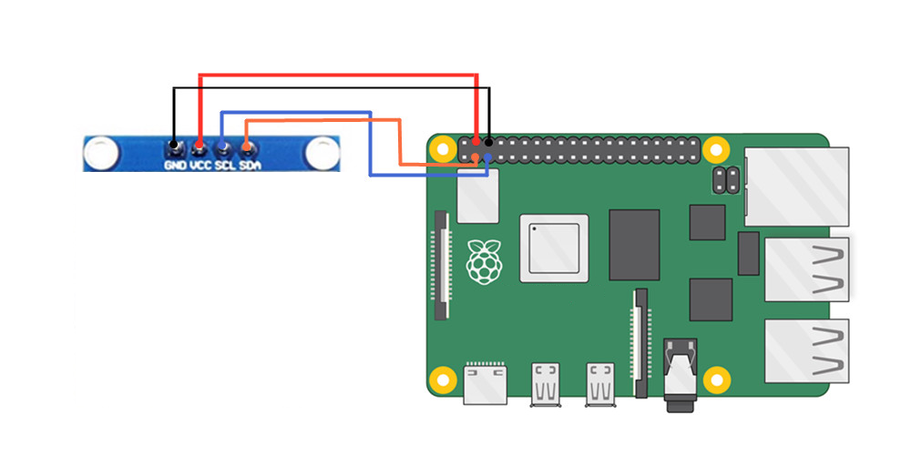

---
layout: post
title: raspi5_SSD1306_OLED
date: 2024-09-16
tags: [raspi]
author: taot
---

## 给树莓派添加 SSD1306 OLED 小屏幕

树莓派被作为一个小服务器使用的时候，通常都不需要接一台专用显示器，而是通过 ssh 远程登录。当环境中有多个设备使用远程登录的时候，就容易不记得相应设备的 IP 地址等信息；有时候只是需要了解设备的一些信息，例如 CPU 负载情况，内存、硬盘使用情况等，使用电脑或者手机远程登录又不够方便，那么给树莓派或者其他有类似需求的小板子添加一个微型的 OLED 小屏幕就是一个不错的解决方案。

### 1 硬件连接

这里使用的是 0.91 英寸 I2C 协议的 OLED 屏，OLED 屏幕模块和树莓派的 GPIO 连线如下：
|OLED 显示模块|树莓派 GPIO 引脚|
|---|---|
|VCC(电源正3.3-5V)|5V|
|GND(电源接地)|GND|
|SCL(I2C时钟线)|SCL.1(BCM3)|
|SDA(I2C数据线)|SDA.1(BCM3)|
*注意，VCC 和 GND 不要接反了，否则会烧毁屏幕*




### 2 树莓派启用 I2C 功能

```bash
sudo apt-get install -y python-smbus
sudo apt-get install -y i2c-tools
sudo raspi-config
```

之后在弹出的选项中依次选择：
`Interfacing Options --> P5 I2C --> Yes --> OK`

之后重启树莓派：
```bash
sudo reboot
```

### 3 安装 Adafruit-SSD1306 库和 I2C 库文件

Adafruit-SSD1306 是基于 Python 的 OLED 库，可以用于 128×64、128×32 像素 SSD1306 芯片控制的屏幕。
使用下面的命令安装。

```bash
sudo python -m pip install --upgrade pip setuptools wheel

# 上面命名如果报错，可以根据报错进行 fix，报错大概率可以通过卸载后重新安装 pip 来解决
sudo apt-get remove python-pip python3-pip
sudo apt-get install python-pip python3-pip

# 安装 PIL 库，有一些图片处理的程序会用到这个
sudo apt-get install python-pil python3-pil

# 使用 pip 安装 Adafruit-SSD1306 库
sudo pip3 install Adafruit_GPIO
sudo pip3 install Adafruit_SSD1306
sudo pip3 install Adafruit_BBIO

sudo apt install -y python3-dev
sudo apt install -y python3-smbus i2c-tools
sudo apt install -y python3-rpi.gpio
sudo apt install -y python3-venv
```

安装I2C库后，使用i2cdetect命令查询显示屏模块是否被识别
```bash
sudo i2cdetect -y 1

# 我这里的输出
     0   1   2   3   4   5   6   7   8   9   a   b   c   d   e   f
00:                                 --  --  --  --  --  --  --  --
10: --  --  --  --  --  --  --  --  --  --  --  --  --  --  --  --
20: --  --  --  --  --  --  --  --  --  --  --  --  --  --  --  --
30: --  --  --  --  --  --  --  --  --  --  --  --  3c  --  --  --
40: --  --  --  --  --  --  --  --  --  --  --  --  --  --  --  --
50: --  --  --  --  --  --  --  --  --  --  --  --  --  --  --  --
60: --  --  --  --  --  --  --  --  --  --  --  --  --  --  --  --
70: --  --  --  --  --  --  --  --
```

上面的输出表示检测到 I2C 设备地址为 `0X3C`，不同的屏幕地址可能会不一样，通过这个步骤可以确认一下。如果使用的是初代树莓派（256MB的树莓派1代B），那么需要用这个命令：
```bash
sudo i2cdetect -y 0
```
### 4 编写控制代码

新建一个文件夹来存放 OLED 相关的代码：
```bash
mkdir ctrl_oled & cd ctrl_oled
```

添加控制脚本`status.py`：
```python
import time
import Adafruit_GPIO.SPI as SPI
import Adafruit_SSD1306

from PIL import Image
from PIL import ImageDraw
from PIL import ImageFont

import subprocess

# Raspberry Pi pin configuration:
RST = None     # on the PiOLED this pin isnt used
# Note the following are only used with SPI:
DC = 23
SPI_PORT = 0
SPI_DEVICE = 0

# 128x32 display with hardware I2C:
disp = Adafruit_SSD1306.SSD1306_128_32(rst=RST)

# 128x64 display with hardware I2C:
# disp = Adafruit_SSD1306.SSD1306_128_64(rst=RST)

# Note you can change the I2C address by passing an i2c_address parameter like:
# disp = Adafruit_SSD1306.SSD1306_128_64(rst=RST, i2c_address=0x3C)

# Alternatively you can specify an explicit I2C bus number, for example
# with the 128x32 display you would use:
# disp = Adafruit_SSD1306.SSD1306_128_32(rst=RST, i2c_bus=2)

# 128x32 display with hardware SPI:
# disp = Adafruit_SSD1306.SSD1306_128_32(rst=RST, dc=DC, spi=SPI.SpiDev(SPI_PORT, SPI_DEVICE, max_speed_hz=8000000))

# 128x64 display with hardware SPI:
# disp = Adafruit_SSD1306.SSD1306_128_64(rst=RST, dc=DC, spi=SPI.SpiDev(SPI_PORT, SPI_DEVICE, max_speed_hz=8000000))

# Alternatively you can specify a software SPI implementation by providing
# digital GPIO pin numbers for all the required display pins.  For example
# on a Raspberry Pi with the 128x32 display you might use:
# disp = Adafruit_SSD1306.SSD1306_128_32(rst=RST, dc=DC, sclk=18, din=25, cs=22)

# Initialize library.
disp.begin()

# Clear display.
disp.clear()
disp.display()

# Create blank image for drawing.
# Make sure to create image with mode '1' for 1-bit color.
width = disp.width
height = disp.height
image = Image.new('1', (width, height))

# Get drawing object to draw on image.
draw = ImageDraw.Draw(image)

# Draw a black filled box to clear the image.
draw.rectangle((0,0,width,height), outline=0, fill=0)

# Draw some shapes.
# First define some constants to allow easy resizing of shapes.
padding = -2
top = padding
bottom = height-padding
# Move left to right keeping track of the current x position for drawing shapes.
x = 0

while True:
    # Draw a black filled box to clear the image.
    draw.rectangle((0,0,width,height), outline=0, fill=0)

    cmd = "hostname -I | cut -d\' \' -f1"
    IP = subprocess.check_output(cmd, shell = True )
    cmd = "top -bn1 | grep load | awk '{printf \"CPU Load: %.2f\", $(NF-2)}'"
    CPU = subprocess.check_output(cmd, shell = True )
    cmd = "free -m | awk 'NR==2{printf \"Mem: %s/%sMB %.2f%%\", $3,$2,$3*100/$2 }'"
    MemUsage = subprocess.check_output(cmd, shell = True )
    cmd = "df -h | awk '$NF==\"/\"{printf \"Disk: %d/%dGB %s\", $3,$2,$5}'"
    Disk = subprocess.check_output(cmd, shell = True )

    # Write two lines of text.
    draw.text((x, top),       "IP: " + str(IP),  font=font, fill=255)
    draw.text((x, top+8),     str(CPU), font=font, fill=255)
    draw.text((x, top+16),    str(Mem),  font=font, fill=255)
    draw.text((x, top+25),    str(Disk),  font=font, fill=255)

    # Display image.
    disp.image(image)
    disp.display()
    time.sleep(.1)
```
屏幕上的图片、形状、文本和字体都是由 PIL（Python Imaging Library）的模块 Image, ImageDraw, and ImageFont 来实现的。

### 5 设置开机运行

为了让前面的写的 OLED 控制脚本能够开机自动运行，我们可以做下面的配置，这样我们就可以不用通过工具或路由器去查找树莓派的 IP 地址等信息了。

修改 /etc/rc.local 文件
```bash
sudo vim /etc/rc.local

# 在 exit 0 前面增加一行：
sudo python3 /path/to/status.py &
```

保存修改之后，重启树莓派验证一下效果:
```bash
sudo reboot
```

### 6 提高屏幕刷新率

为了更好的显示性能，例如显示动画时如对帧率有要求，可以通过修改下面的参数将 I2C 频率从默认的 100KHz 或 400KHz 提升到 1MHz。

```bash
sudo vim /boot/config.txt
# 在文件末添加一行：
dtparam=i2c_baudrate=1000000
```
