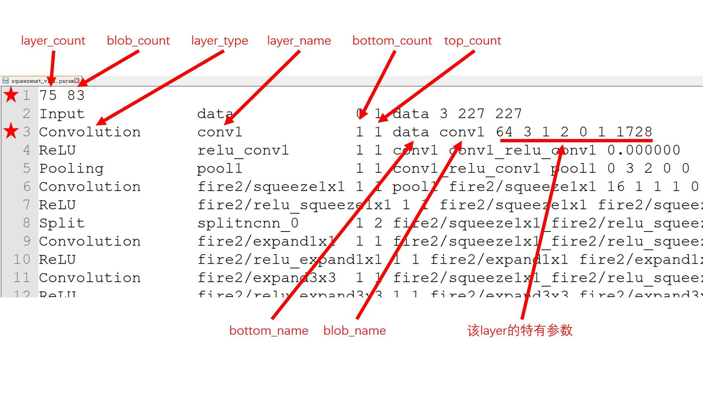

## NCNN 源码(1)-模型加载-数据预处理-模型推理

参考 ncnn 第一个版本的代码。

### 0 整体流程 demo：squeezenet

ncnn 自带的一个经典 demo：squeezenet 的代码:
```cpp
// 网络加载
ncnn::Net squeezenet;
squeezenet.load_param("squeezenet_v1.1.param");
squeezenet.load_model("squeezenet_v1.1.bin");

// 数据预处理
ncnn::Mat in = ncnn::Mat::from_pixels_resize(image.data, ncnn::Mat::PIXEL_BGR, image.cols, image.rows, 227, 227);
const float mean_vals[3] = { 104.f, 117.f, 123.f };
in.substract_mean_normalize(mean_vals, 0);

// 网络推理
ncnn::Extractor ex = squeezenet.create_extractor();
ex.input("data", in);
ncnn::Mat out;
ex.extract("prob", out);
```
上面的代码描述了从模型加载到模型推理的完整过程：
* 网络加载
  * load_param
  * load_model
* 数据预处理
  * from_pixels_resize
  * substract_mean_normalize
* 网络推理
  * create_extractor
  * input
  * extract
* 每一层的推理（隐含在模型内，这里没有体现出来）

### 1 模型加载

```cpp
ncnn::Net squeezenet;
squeezenet.load_param("squeezenet_v1.1.param");
squeezenet.load_model("squeezenet_v1.1.bin");
```

这里首先新建一个 `ncnn::Net` 对象，用来记录网络，除此之外，还有 `load_param`和`load_model`方法，分别用来加载网络模型的 param(参数) 文件和 bin(模型)文件。

#### 1.1 load_param

param 文件内容：


在 param 文件中，第一行记录了模型的 layer 和 blob 的数量，后面的每一行分别记录一个 layer 的一些属性信息。
* 第一行
  * 第一个数：记录该 param 所表示的模型一共有多少 layer，所以如果增删某几行，这里也要对应修改
  * 第二个数，记录该模型有多少个 blob，可以理解成有多少个数据流节点。例如一个卷积就是一个输入 blob 一个输出 blob，数据在 blob 之间流动。
* 其他行：除了第一行，其他的都是 layer 行，上图用第三行举例，具体行内容依次为：
  * layer_type：该行记录的 layer 对应的类型，例如输入 Input、卷积 Convolution、激活 ReLU、池化 Pooling 等
  * layer_name：该行记录的 layer 的名字，这个可以自己起，模型导出的时候导出工具自动生成的
  * bottom_count：这里的 bottom 表示该 layer 在谁的下面，因此这个参数的含义是前置节点的数量
  * top_count：该 layer 后置节点的数量
  * bottom_name：这个名字的数量由 bottom_count 指示，上图因为 bottom_count 为 1 所以只有一个。这个参数的含义是前置节点的名称
  * blob_name：后置节点的名字
  * 特有参数：这个是该 layer 特有的一些参数。例如卷积有 kernel_size、stride_size、padding_size，Softmax 则需要一个指示维度的参

load_param 流程伪代码：
```cpp
# layers 列表，存下所有 layer
# blobs 列表，背后维护，为 find_blob 服务

layer_count, blob_count = read(param_file) # 读取第一行数据

for param_file is not EOF: # 循环读取每一行的layer数据
    layer_type, layer_name, bottom_count, top_count = read(param_file) # 读取前四个固定参数
    layer = create_layer(layer_type) # 根据layer类型创建一个layer

    for bottom_count:
        bottom_name = read(param_file) # 读取每一个bottom_name
        blob = find_blob(bottom_name) # 查找该 blob，没有的话就要新建一个
        blob.consumers.append(layer) # 当前层是这个 blob 的消费者，这里的 blob 是前置节点
        layer.bottoms.append(blob) # 记录前置节点的名称
    
    for top_count:
        blob_name= read(param_file) # 读取每一个 blob_name
        blob = find_blob(bottom_name) # 查找该 blob，没有的话就要新建一个
        blob.producer = layer # 当前层是这个 blob 的生产者，这里的blob是后置节点
        layer.tops.append(blob) # 记录后置节点的名称
    
    layer.param = read(param_file) # 读取该层的一些特殊参数
    layers.append(layer)
```

### 2 数据预处理

```cpp
ncnn::Mat in = ncnn::Mat::from_pixels_resize(image.data, ncnn::Mat::PIXEL_BGR, image.cols, image.rows, 227, 227);
in.substract_mean_normalize(mean_vals, norm_vals);
```

数据预处理部分主要是这样的两个函数：
* `ncnn::Mat::from_pixels_resize`：将 `cv::Mat` 格式的`image.data`转成`ncnn::Mat`格式，之后将其 resize 到固定的 shape
* `substract_mean_normalize`：对输入数据进行减均值、乘以方差的处理

#### 2.1 ncnn::Mat::from_pixels_resize

先对输入的 image 数据进行 resize 处理，之后将 resize 之后的数据转成`ncnn::Mat`格式。

##### 2.1.1 resize

`ncnn::Mat::from_pixels_resize`的 resize 处理支持三种格式的图像：单通道的灰度图像 GRAY，三通道的 RGB 和 BGR，四通道的 RGBA。

resize 使用的是双线性插值算法，即 bilinear：
* 计算 x、y 方向上插值点的位置索引 xofs 和 yofs
* 计算 x、y 方向上插值点左右的两个插值系数 ialpha 和 ibeta
* 遍历插值，x 方向上的插值用 xofs 和 ialpha 得到，y 方向上的插值用 yofs 和 ibeta 得到


##### 2.1.2 from_pixels

这里是先申请一块`ncnn::Mat`的内存，之后再将转换好的数据逐个填进去即可。这里支持三通道、三通道、四通道的图片输入，一些颜色转换 RGB2BGR、RGB2GRAY 这些也都是在这里实现。

RGB 转 GRAY 的实现如下，from_rgb2gray：
```cpp
static Mat from_rgb2gray(const unsigned char* rgb, int w, int h) {
    const unsigned char Y_shift = 8;//14
    const unsigned char R2Y = 77;
    const unsigned char G2Y = 150;
    const unsigned char B2Y = 29;

    Mat m(w, h, 1);
    if (m.empty())
        return m;

    float* ptr = m;
    int size = w * h;
    int remain = size;
    for (; remain > 0; remain--) {
        *ptr = (rgb[0] * R2Y + rgb[1] * G2Y + rgb[2] * B2Y) >> Y_shift;
        rgb += 3;
        ptr++;
    }
    return m;
}
```

代码中，首先定义了转换时 R、G、B 对应要乘的系数，这里用的是整数乘法，所以系数放大了 $2^8$，因此后面算结果那里再右移回去。后面就是 for 循环遍历每一个 pixel，全部遍历完并把数据写进 ncnn::Mat 就可以了。


#### 2.2 substract_mean_normalize

这个代码同时支持**只mean不norm**，**只norm不mean**，**既mean又norm**。既 mean 又 norm：
```cpp
void Mat::substract_mean_normalize(const float* mean_vals, const float* norm_vals) {
    int size = w * h;
    for (int q = 0; q < c; q++) {
        float* ptr = data + cstep * q;
        const float mean = mean_vals[q];
        const float norm = norm_vals[q];
        int remain = size;
        for (; remain > 0; remain--) {
            *ptr = (*ptr - mean) * norm;
            ptr++;
        }
    }
}
```
遍历 Mat 所有数据，减 mean 乘 norm。

### 3 模型推理

```cpp
ncnn::Extractor ex = squeezenet.create_extractor();
ex.input("data", in);
ncnn::Mat out;
ex.extract("prob", out);
```

这里主要是三个步骤：
* ncnn::Extractor，即 create_extractor，是一个专门用来维护推理过程数据的类，跟 ncnn::Net 解耦开，这个最主要的就是开辟了一个大小为网络的 blob size 的 std::vector<ncnn::Mat> 来维护计算中间的数据
* input，在上一步开辟的 vector 中，把该 input 的 blob 的数据 in 放进去
* extract，做推理，计算目标层的数据

#### 3.1 extract

```cpp
int Extractor::extract(const char* blob_name, Mat& feat) {
    int blob_index = net->find_blob_index_by_name(blob_name);
    if (blob_index == -1)
        return -1;
    int ret = 0;
    if (blob_mats[blob_index].dims == 0) {
        int layer_index = net->blobs[blob_index].producer;
        ret = net->forward_layer(layer_index, blob_mats, lightmode);
    }
    feat = blob_mats[blob_index];
    return ret;
}
```

* `find_blob_index_by_name`, 查找输入的 blob 名字在 vector 中的下标
* 判断`blob_mats[blob_index].dims ==0`
  * 如果这个 blob 没有计算过，那么该 blob 对应的数据应该是空的，说明要进行推理
  * 如果 blob 计算过，就有数据了，那么 dims 就不会等于 0，不用再算了，直接取数据就可以了
  * `net->forward_layer`，又回到了`ncnn::Net`，`ncnn::Extractor`也可以从代码中看出来主要就是维护数据

#### 3.2 forward_layer

函数声明：
```cpp
int Net::forward_layer(int layer_index, std::vector<Mat>& blob_mats, bool lightmode)
```

三个参数，
* layer_index，要计算哪一层
* blob_mats，记录计算中的数据
* lightmode 配合 inplace 来做一些动态的 release，及时释放内存资源

推理分 layer 是不是**一个输入一个输出** 和 **其它**。一个输入一个输出的代码比较简单，先看这个，
```cpp
// 1. 获取当前层
const Layer* layer = layers[layer_index];

// 2. 获取当前层的前置节点和后置节点
int bottom_blob_index = layer->bottoms[0];
int top_blob_index = layer->tops[0];

// 3. 前置节点如果没有推理，就先推理前置节点
if (blob_mats[bottom_blob_index].dims == 0) {
    int ret = forward_layer(blobs[bottom_blob_index].producer, blob_mats, lightmode);
    if (ret != 0)
        return ret;
}

// 4. 推理当前节点
Mat bottom_blob = blob_mats[bottom_blob_index];
Mat top_blob;
int ret = layer->forward(bottom_blob, top_blob);
if (ret != 0)
    return ret;

// 5. 当前节点的输出送至后置节点
blob_mats[top_blob_index] = top_blob;
```

从上面的代码接哦股很清晰，是一个递归，当前层需要的输入 blob 还没算，就递归进去算，算完就算当前层，这里`layer->forward`是每一层的特定实现

再看非一个输入一个输出的复杂一点的：
```cpp
const Layer* layer = layers[layer_index];

// 1. 所有的前置节点里面，没有推理的都先推理
std::vector<Mat> bottom_blobs;
bottom_blobs.resize(layer->bottoms.size());
for (size_t i=0; i<layer->bottoms.size(); i++) {
    int bottom_blob_index = layer->bottoms[i];
    if (blob_mats[bottom_blob_index].dims == 0) {
        int ret = forward_layer(blobs[bottom_blob_index].producer, blob_mats, lightmode);
        if (ret != 0)
            return ret;
    }
    bottom_blobs[i] = blob_mats[bottom_blob_index];
}

// 2. 前置节点推理完成后，推理当前节点
std::vector<Mat> top_blobs;
top_blobs.resize(layer->tops.size());
int ret = layer->forward(bottom_blobs, top_blobs);
if (ret != 0)
    return ret;

// 3. 当前节点的数据送到所有后置节点
for (size_t i=0; i<layer->tops.size(); i++)
{
    int top_blob_index = layer->tops[i];
    blob_mats[top_blob_index] = top_blobs[i];
}
```
多输入多输出，就是所有前置节点都要先算完，然后再算自己，最后给后置节点送数据。

#### 3.3 推理流程总结

ncnn 推理的整体简要流程：

* 读取 param 和 bin 文件，记录下每一层的 layer、layer 的输入输出节点、layer 的特定参数
* 推理
  * 维护一个列表用于存所有节点的数据
  * 给输入节点放入输入数据
  * 计算输出节点的 layer
    * 计算 layer 所需的输入节点还没给输入——>递归调用上一层 layer 计算
    * 有输入了——>计算当前 layer
    * 输出结果，数据送入后置节点

