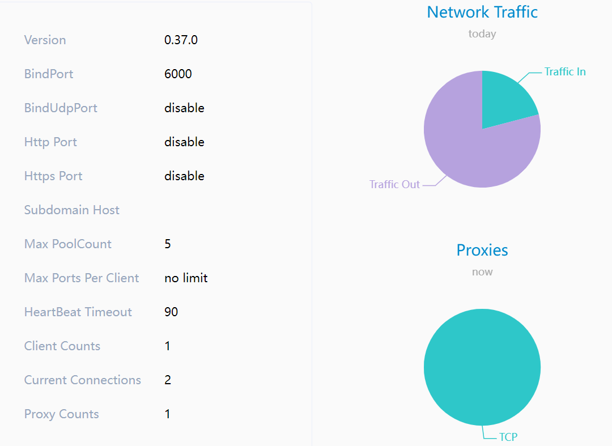

## 阿里云+frp内网穿透&工作站远程开机

frp 是一个可用于内网穿透的高性能的反向代理应用，支持 tcp, udp, http, https 等协议。利用 frp 和一个带有公网 IP 的云服务器作为中间跳板，可以实现内网穿透，不在家的时候也可以访问到家里面的工作站。有了这个缺口之后，在外面的时候，就可以再通过工作站，来访问家里面其他的机器了。

但是工作站功耗比较大，还是希望能够在需要的时候，通过远程开机，不用的时候再关机，可以省点电费来攒新的机器。这里使用的方案是利用工作站主板的来电自启动功能和智能开关来实现。


### 1 服务端部署（阿里云服务器）

#### 1.1 下载 linux 服务端 frp

登录阿里云服务器，在 home 目录下 执行 wget 命令下载：
```bash
wget https://github.com/fatedier/frp/releases/download/v0.37.0/frp_0.37.0_linux_amd64.tar.gz
```

下载完毕，解压
```bash
tar -xvf frp_0.37.0_linux_amd64.tar.gz
```

解压完毕后进入目录，解压文件夹内：
```bash
frps 相关的文件是放在服务器端运行的可执行文件和配置文件。
frpc 相关的文件是放在客户端端运行的可执行文件和配置文件。
```
*在服务端，frpc 相关的文件用不上，可以删掉。*

#### 1.2 修改服务端配置

修改配置文件
```bash
vim frps.ini

[common]
bind_addr=0.0.0.0
bind_port = 6000
token=*****

dashboard_port = 6500
dashboard_user = admin
dashboard_pwd = admin123
```

> 说明：
> **bind_addr** 是服务器本地 IP，不改。
> **bind_port** 是 frp 监听端口。
> **token** 是验证 token 建议设置上。
> **dashboard_port** 是 frp 面板端口。
> **dashboard_user, dashboard_pwd** 是面板的账户密码。

*除了**bind_addr**参数之外的其他参数，都可以根据需求自行修改，务必记住改过的参数。*

#### 1.3 配置项中用到的端口，需要在服务器上开启

由于阿里云有安全组配置，需要进入阿里云管理界面找到安全组配置，把 6500 端口开放。否则外网依然无法方位该端口。
除此之外，还需要把 frp 监听端口和 frp 面板端口的防火墙设置为开放状态，以及 ssh 的通信映射端口的安全组和防火墙都设置为开启状态，这里使用的 ssh 通信映射端口为 3333，这个设置是在后面客户端设置的，后面再说。

阿里云安全组端口开启没什么可说的，防火墙端口开启需要注意，有些操作系统可能在阿里云的网页里面找不到设置页面，需要通过命令行来设置：
```bash
# 这里以 6500 端口为例，下面的命令成功会输出 success 代表成功（–permanent永久生效，没有此参数重启后失效）
firewall-cmd --zone=public --add-port=6500/tcp --permanent
firewall-cmd --reload  #重新载入 返回 success 代表成功

firewall-cmd --zone=public --list-ports # 查看所有打开的端口，注意看有没有自己需要打开的端口列出来
```

#### 1.4 给服务器端 frps 赋予执行权限

```bash
sudo chmod 755 ./frps
```

#### 1.5 运行服务端 frps

```bash
./frps -c ./frps.ini
```

#### 1.6 访问 frp 控制面板

面板仅供参考，可用可不用。访问 http://服务器ip:6500

6500端口是上面配置的，使用上面配置的用户名和密码 admin/admin123 登录即可。



### 2 客户端配置（工作站）

* 这里工作站用的是 ubuntu 系统，因此需要先下载和服务端一样的软件并解压：
```bash
wget https://github.com/fatedier/frp/releases/download/v0.37.0/frp_0.37.0_linux_amd64.tar.gz
tar -xvf frp_0.60.0_linux_amd64.tar.gz
```

* frpc 客户端配置
`cd`到`frp_0.37.1_linux_amd64`目录，对于客户端的配置可以直接先将`frps`和`frps.ini`文件删除，配置`frpc.ini`:
```bash
[common]
server_addr = 公网服务器ip
server_port = 6000
token=******

[ssh1]
type = tcp
local_ip = 工作站内网IP或者是 127.0.0.1
local_port = 22
remote_port = 3333
```
说明：
* server_addr 就是阿里云服务器的公网IP
* server_port/token 需要和服务端配置的 bind_port/token 一致
* local_port 就是工作站的 ssh 端口，一般默认是 22
* remote_port 就是需要映射到服务端用于通信映射的端口，这里设置的是 3333，可以使用其他端口，但是不要忘记在阿里云安全组和防火墙里都设置为开启
* ssh 访问的是公网 ip，remote_port 是公网服务器的 port，访问 remote_port 后会转发到 local_por

* 保存后就可以启动客户端了
```bash
# 前台启动
./frpc -c ./frpc.ini   
```

* ssh远程连接内网服务器
前面步骤顺利的话，到这里就可以使用局域网外面的机器来通过 ssh 连接家里面的工作站了。
```bash
ssh -p remote_port username@公网ip
```
不出意外的话，就可以使用任意一台可以访问到阿里云服务器公网 IP 的机器来通过 ssh 连接到工作站了。

### 3 其他配置

#### 3.1 连接失败的可能原因

* 前面使用到的端口存在没有在安全组和防火墙里面开启的
* 服务端启动失败或者出现报错
* 客户端启动失败或者出现报错
  * 如果出现报错，会在服务端和客户端都有报错信息

#### 3.2 多端口转发

如果出现多人访问的情况，可能出现一个 local_port 和 remote_port 对应不够用的情况，可以在客户端配置多端口转发：
```bash
# 本地端口和远程端口可以指定多个范围，如下格式，且范围之间必须一一对应
local_port = 6010-6020,6022,6024-6028
remote_port = 16010-16020,16022,16024-16028
```
有的机器上会出现非法端口号的报错，也可以分开写：
```bash
[common]
server_addr = 公网服务器ip
server_port = 6000
token=******

[ssh1]
type = tcp
local_ip = 工作站内网IP或者是 127.0.0.1
local_port = 22
remote_port = 3333

[ssh2]
type = tcp
local_ip = 工作站内网IP或者是 127.0.0.1
local_port = 4000
remote_port = 4000

[ssh3]
type = tcp
local_ip = 工作站内网IP或者是 127.0.0.1
local_port = 5000
remote_port = 5000
```

需要注意，上面的端口在客户端和服务端也都需要开启，否则还是会访问失败。

#### 3.3 客户端和服务端设置后台运行和开机自启

* 服务端
由于云服务器可以一直开机，因此直接把启动任务的命令后台运行即可：
```bash
nohup ./frps -c frps.ini >/dev/null 2>&1 &
```

* 客户端
客户端可以把启动任务放后台运行，并且把这个任务设置为开机自启：
编写启动脚本`start_frpc.sh`:
```bash
 nohup /path/to/frpc -c /path/to/frpc.ini >/dev/null 2>&1 &
```
修改脚本权限：
```bash
chmod +x start_frpc.sh
```
通过`rc.local`设置开机自启任务：
```bash
vim /etc/rc.local 

# 在 exit0 前面加一行
cd /path/to/start_frpc.sh && ./start_frpc.sh
```
重启即可。

### 4 设置通电自启

现在的主板大部分都有通电后自动开机的功能，这里使用的是华硕的主板，华硕主板 BIOS 中提供了选项 Restore AC Power Loss，可以允许用户按需调整，以实现断电恢复后具体的行为，比如断电恢复后开机、断电恢复后关机、保持之前的状态等。

* Power On：开机，即断电恢复后，电脑开机。
* Power Off (默认值)：关机，即断电恢复后，电脑关机。
* Last State：上一次的状态，即断电恢复后，恢复至上一次的状态。如下：
  * 如果断电之前是开机状态，包括 S3(Sleep，睡眠)/ S4(Hibernate，休眠)等，则断电恢复后，恢复至开机状态；
  * 如果断电之前是关机状态，则断电恢复后，恢复至关机状态，及保持关机状态。

需要注意到是，无论是正常关机后断电，还是意外断电，由于电源的设计，电并不会立即消失。因此在断电之后，需要等主板完全断电，再通电才会自启，可以断电后等半分钟左右。

实际上，此时就已经可以把工作站电源接在智能开关上，需要用了打开智能开关，不用了关掉即可。但是考虑到工作站上的设备比较多，频繁意外断电不好，尤其是机器上的几张卡和几个机械硬盘，因此在关机的时候还是尽量先用命令行关机，再通过智能开关断电比较安全。

现在终于可以愉快地玩耍了。
