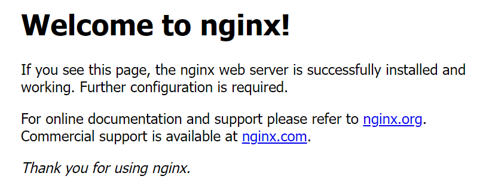
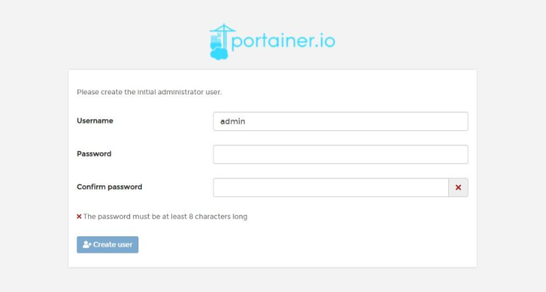
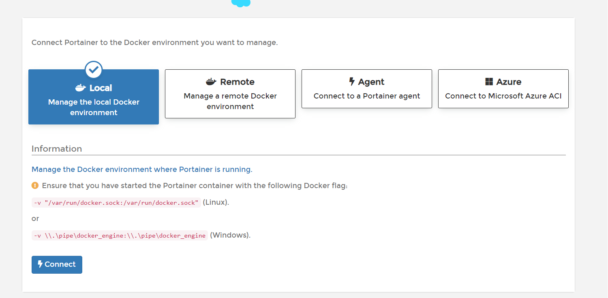
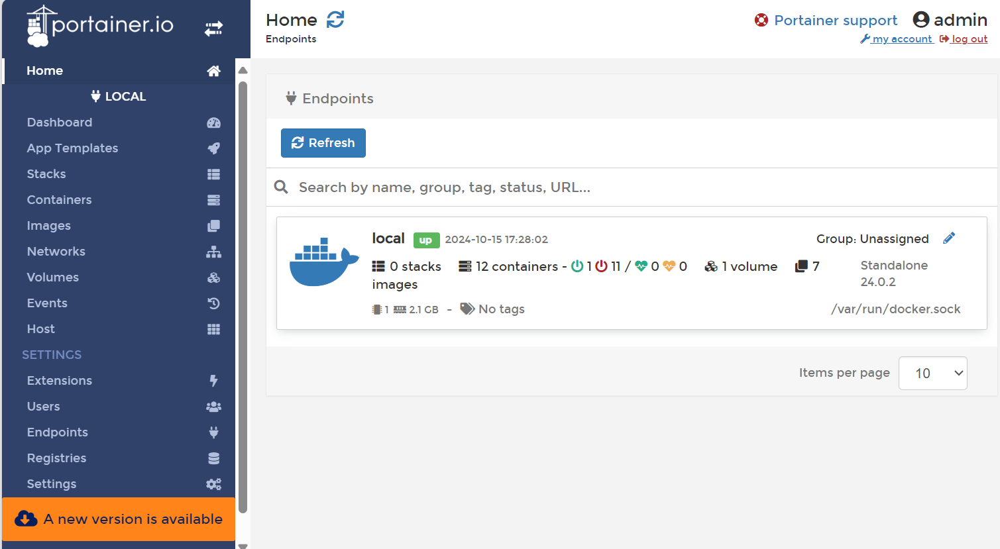

# docker学习笔记

## docker 安装与使用

### 0 docker 出现的原因

软件在开发机器上可以跑，但是在其他机器上，无法跑，或者其他机器需要繁琐的环境配置。在另外的机器上能跑，必须保证：
  * 操作系统的设置
  * 各种库和组件的安装
  从根本上解决问题，软件带环境安装，安装的时候，把原始环境一模一样地复制过来。

* 虚拟机是带环境安装的一种方法，但是主要有这样的几个缺点：
  * 资源占用多，虚拟机本身会独占一部分内存和硬盘空间。它运行的时候，其他程序就不能使用这些资源了。
  * 冗余步骤多，虚拟机是完整的操作系统，一些系统级别的操作步骤，往往无法跳过，比如用户登录。
  * 启动慢，启动操作系统需要多久，启动虚拟机就需要多久。可能要等几分钟，应用程序才能真正运行。

* linux 容器（Linux Containers，缩写为 LXC）
  * Linux 容器不是模拟一个完整的操作系统，而是对进程进行隔离。或者说，在正常进程的外面套了一个保护层。对于容器里面的进程来说，它接触到的各种资源都是虚拟的，从而实现与底层系统的隔离。由于容器是进程级别的，相比虚拟机有很多优势。
    * 启动快，容器里面的应用，直接就是底层系统的一个进程，而不是虚拟机内部的进程。所以，启动容器相当于启动本机的一个进程，而不是启动一个操作系统，速度就快很多。
    * 资源占用少，容器只占用需要的资源，不占用那些没有用到的资源；虚拟机由于是完整的操作系统，不可避免要占用所有资源。另外，多个容器可以共享资源，虚拟机都是独享资源。
    * 体积小，容器只要包含用到的组件即可，而虚拟机是整个操作系统的打包，所以容器文件比虚拟机文件要小很多。

    容器有点像轻量级的虚拟机，能够提供虚拟化的环境，但是成本开销小得多。

* docker， Linux 容器的一种封装，提供简单易用的容器使用接口
  * Docker 将应用程序与该程序的依赖，打包在一个文件里面。运行这个文件，就会生成一个虚拟容器。程序在这个虚拟容器里运行，就好像在真实的物理机上运行一样。

docker 目前主要用于**提供一次性环境**，**提供弹性的云服务**，**组建微服务架构**。

### 1 安装 docker

#### 1.1 docker 的构成

* 镜像（Image）：
docker镜像类似一个模板，可以通过这个模板来创建容器服务，`tomcat镜像 --> run --> tomcat01容器（提供服务器）`，通过这个镜像可以创建多个容器（最终服务运行或者项目运行就是在容器中的）。

* 容器（container）：
docker利用容器技术，独立运行一个或者一组应用通过镜像来创建，可以暂且把这个容器理解为就是一个简易的linux系统

* 仓库（repository）：
仓库就是存放镜像（image）的地方，可以分为公有仓库和私有仓库。

#### 1.2 安装 docker

* linux 内核要求在 3.0 以上，查看环境信息：
```bash
uname -r 
# 4.15.0-192-generic

cat /etc/os-release
# NAME="Ubuntu"
# VERSION="18.04.6 LTS (Bionic Beaver)"
# ID=ubuntu
# ID_LIKE=debian
# PRETTY_NAME="Ubuntu 18.04.6 LTS"
# VERSION_ID="18.04"
# HOME_URL="https://www.ubuntu.com/"
# SUPPORT_URL="https://help.ubuntu.com/"
# BUG_REPORT_URL="https://bugs.launchpad.net/ubuntu/"
# PRIVACY_POLICY_URL="https://www.ubuntu.com/legal/terms-and-policies/privacy-policy"
# VERSION_CODENAME=bionic
# UBUNTU_CODENAME=bionic
```

* 安装 docker
```bash
# 卸载旧版本
sudo apt remove \
  docker-client \
  docker-client-latest \
  docker-common \
  docker-latest \
  docker-latest-logrotate \
  docker-logrotate \
  docker-engine

# 安装容器之前，更新软件包索引。
sudo apt-get update && sudo apt-get upgrade

# 安装Docker的依赖包
sudo apt install apt-transport-https ca-certificates curl software-properties-common

# 设置使用国内的镜像仓库
sudo mkdir -p /etc/docker
sudo tee /etc/docker/daemon.json <<-'EOF'
{
  "registry-mirrors": ["xxx"]
}
EOF
sudo systemctl daemon-reload
sudo systemctl restart docker


# 安装容器相关的 docker-ce（社区版）docker-ee（企业版）
sudo apt install docker-ce docker-ce-cli containerd.io

# 启动docker
sudo systemctl start docker

# Docker 需要用户具有 sudo 权限，为了避免每次命令都输入sudo，可以把用户加入 Docker 用户组
sudo usermod -aG docker $USER

# 查看是否安装成功
docker version

# 测试 hello-world
docker run hello-world

# 查看下载的这个hello-world镜像
docker images

# 卸载docker
# 卸载依赖
apt remove docker-ce docker-ce-cli containerd.io
# 删除资源
rm -rf /var/lib/docker
# /var/lib/docker 是docker的默认工作路径
```

### 2 docker 常用命令

#### 2.1 帮助命令

* `docker version` 显示docker的版本信息。
* `docker info` 显示docker的系统信息，包括镜像和容器的数量
* `docker --help` 帮助命令
帮助文档的地址：https://docs.docker.com/engine/reference/commandline/docker/

#### 2.2 镜像命令

* `docker images` 查看所有本地主机上的镜像 可以使用`docker image ls`代替
* `docker search` 搜索镜像
* `docker pull` 下载镜像 `docker image pull`
* `docker rmi` 删除镜像 `docker image rm`
使用说明：
```bash
docker images
REPOSITORY    TAG       IMAGE ID       CREATED        SIZE
hello-world   latest    d1165f221234   4 months ago   13.3kB
# 解释
REPOSITORY   镜像的仓库源
TAG          镜像的标签
IMAGE ID     镜像的ID
CREATED      镜像的创建时间
SIZE         镜像的大小
# 可选项
  -a, --all             # 列出所有的镜像
  -q, --quiet           # 只显示镜像的id
docker images -aq ＃显示所有镜像的id

docker search mysql
NAME                              DESCRIPTION                                     STARS     OFFICIAL   AUTOMATED
mysql                             MySQL is a widely used, open-source relation…   11138     [OK]       
mariadb                           MariaDB Server is a high performing open sou…   4221      [OK]       
mysql/mysql-server                Optimized MySQL Server Docker images. Create…   829                  [OK]
percona                           Percona Server is a fork of the MySQL relati…   547       [OK]       
phpmyadmin                        phpMyAdmin - A web interface for MySQL and M…   274       [OK]       
centos/mysql-57-centos7           MySQL 5.7 SQL database server                   89                   
mysql/mysql-cluster               Experimental MySQL Cluster Docker images. Cr…   88   
# 可选项
--filter=STARS=3000   # 搜索出来的镜像就死starts 大于3000的
# docker search mysql --filter=STARS=3000
NAME      DESCRIPTION                                     STARS     OFFICIAL   AUTOMATED
mysql     MySQL is a widely used, open-source relation…   11138     [OK]       
mariadb   MariaDB Server is a high performing open sou…   4221      [OK]

docker pull 下载镜像
# 下载镜像 docker pull 镜像名[:tag]
docker pull mysql
# 等价于
docker pull docker.io/library/mysql:latest
# 指定版本下载
docker pull mysql:5.7

docker rmi 删除镜像
docker rmi -f 镜像id         # 删除指定的镜像
docker rmi -f 镜像id 镜像id 镜像id 镜像id   # 删除多个镜像
docker rmi -f $(docker images -aq)     # 删除全部的镜像
```

#### 2.3、容器命令

* `docker run 镜像id` 新建容器并启动
* `docker ps` 列出所有运行的容器 `docker container list`
* `docker rm 容器id` 删除指定容器
* `docker start 容器id` 启动容器
* `docker restart容器id` #重启容器
* `docker stop 容器id` #停止当前正在运行的容器
* `docker kill 容器id` #强制停止当前容器

下面拉取一个 centos 的镜像试验一下：
```bash
# 拉取镜像
docker pull centos
# Using default tag: latest
# latest: Pulling from library/centos
# a1d0c7532777: Pull complete
# Digest: sha256:a27fd8080b517143cbbbab9dfb7c8571c40d67d534bbdee55bd6c473f432b177
# Status: Downloaded newer image for centos:latest
# docker.io/library/centos:latest


# 新建容器并启动
docker run [可选参数] image
# 参数说明
# --name="Name"     容器名字   tomcat01   tomcat02，  用来区分容器
# -d                后台方式运行
# -it               使用交互方式运行，进入容器查看内容
# -p                指定容器的端口 -p  8080:8080
#     -p   ip:主机端口:容器端口
#     -p   主机端口:容器端口（常用）
#     -p   容器端口
#     容器端口
# -p                随机指定端口
docker run -it centos /bin/bash
# runc: symbol lookup error: runc: undefined symbol: seccomp_api_get
# docker: Error response from daemon: cannot start a stopped process: unknown.
# 直接运行的时候，有时候可能会出现错误，此时需要新增一下依赖即可。
yum install libseccomp-devel
# 然后重新运行
# 测试，启动并进入容器
此时主机名称发生了一些变化，新的这个主机名称，也就是我们的镜像的id
# 从容器中退回主机
exit

# 列出所有的运行的容器
docker ps #列出当前正在运行的容器
    -a  # 列出当前正在运行的容器+带出历史运行过的容器
    -n=? # 显示最近创建的容器
    -q  # 只显示容器的编号


# 退出容器
exit    # 直接容器停止并退出
Ctrl + P + Q # 容器不停止退出，退出了容器，但是容器还是在后台运行的


# 删除容器
docker rm 容器id     # 删除指定容器，不能删除正在运行的容器，如果要强制删除  rm -f
docker rm -f $(docker ps -aq)  # 删除所有的容器
docker ps -a -q | xargs docker rm  # 删除所有的容器


# 启动和停止容器的操作
docker start 容器id     #启动容器
docker restart 容器id  #重启容器
docker stop 容器id      #停止当前正在运行的容器
docker kill 容器id      #强制停止当前容器
```


#### 2.4、常用其他命令

##### 2.4.1 后台启动容器:

* `docker  run -d 镜像名`
  * 常见的坑，docker 容器使用后台运行，就必须要有一个前台进程， docker 发现没有应用，就会自动停止
  * nginx，容器启动后，发现自己没有提供服务，就会立刻停止，就是没有程序了

##### 2.4.2 查看日志

* `docker logs --help`
```bash
Usage:  docker logs [OPTIONS] CONTAINER

Fetch the logs of a container

Aliases:
  docker container logs, docker logs

Options:
      --details        Show extra details provided to logs
  -f, --follow         Follow log output
      --since string   Show logs since timestamp (e.g. "2013-01-02T13:23:37Z") or relative (e.g. "42m" for 42 minutes)
  -n, --tail string    Number of lines to show from the end of the logs (default "all")
  -t, --timestamps     Show timestamps
      --until string   Show logs before a timestamp (e.g. "2013-01-02T13:23:37Z") or relative (e.g. "42m" for 42 minutes)
```

##### 2.4.3 查看容器中进程信息

* `docker top 容器id`

##### 2.4.4 查看镜像的元数据

* `docker inspect 容器id`

具体的去了解这个镜像里面到底有一些什么东西


##### 2.4.5 进入当前正在运行的容器

通常容器都是使用后台方式运行，需要进入容器，修改一些配置
* 方式1：`docker exec -it 容器id bashShell`
```bash
docker exec -it b1177469c5ce /bin/bash
ls
# bin  dev  etc  home  lib  lib64  lost+found  media  mnt  opt  proc  root  run  sbin  srv  sys  tmp  usr  var
ps -ef
# UID          PID    PPID  C STIME TTY          TIME CMD
# root           1       0  0 05:35 ?        00:00:00 /bin/bash -c while true;do echo 666;sleep 1;done;
# root         654       0  0 05:46 pts/0    00:00:00 /bin/bash
# root         674       1  0 05:46 ?        00:00:00 /usr/bin/coreutils --coreutils-prog-shebang=sleep /usr/bin/sleep 1
# root         675     654  0 05:46 pts/0    00:00:00 ps -ef
```

* 方式2：`docker attach 容器id`
```bash
docker attach 596b80f933ac
```
  * `docker exec`, 进入容器后开启一个新的终端，可以在里面操作（常用）
  * `docker attach`, 进入容器正在执行的终端，不会启动新的进程


##### 2.4.6 从容器内拷贝到主机上

* `docker cp 容器id:容器内路径   目的的主机路径`
  * 拷贝是一个手动过程，使用 -v 卷的技术，可以实现数据的自动同步, 可以实现镜像的`/home`目录和主机的`/home`目录联通


## docker 初步理解

### 1 docker 相关文件

#### 1.1 image 文件

Docker 把应用程序及其依赖，打包在 image 文件里面。只有通过这个文件，才能生成 Docker 容器。image 文件可以看作是容器的模板。Docker 根据 image 文件生成容器的实例。同一个 image 文件，可以生成多个同时运行的容器实例。

image 是二进制文件。实际开发中，一个 image 文件往往通过继承另一个 image 文件，加上一些个性化设置而生成。例如，可以在 Ubuntu 的 image 基础上，往里面加入 Apache 服务器，形成新的 image。

```bash
# 列出本机的所有 image 文件
docker image ls

# 删除 image 文件
docker image rm [imageName]
```

image 文件是通用的，一台机器的 image 文件拷贝到另一台机器，可以直接使用。一般来说，为了节省时间，我们应该尽量使用别人制作好的 image 文件。如果需要定制，可以基于别人的 image 文件进行加工，不必要从零开始制作。

为了方便共享，image 文件制作完成后，可以上传到网上的仓库。Docker 的官方仓库 [Docker Hub](https://hub.docker.com/) 是最重要、最常用的 image 仓库。

#### 1.2 镜像实例

从仓库下载 image 文件，国内访问 Docker 的官方仓库很慢，还经常断线，所以要把仓库网址改成国内的镜像站。

* 打开`/etc/default/docker`文件（需要sudo权限），在文件的底部加上一行。
```bash
DOCKER_OPTS="--registry-mirror=https://registry.docker-cn.com"
```

* 重启 Docker 服务
```bash
sudo service docker restart
```

现在就会自动从镜像仓库下载 image 文件.

运行下面的命令，将 image 文件从仓库抓取到本地
```bash
docker image pull library/hello-world
```
说明：
* `docker image pull`是抓取 image 文件的命令
* `library/hello-world`是 image 文件在仓库里面的位置，其中`library`是 image 文件所在的组
* `hello-world`是 image 文件的名字
Docker 官方提供的 image 文件，都放在library组里面，所以它的是默认组，可以省略。因此，上面的命令可以写成下面这样:
```bash
docker image pull hello-world
```

运行这个 image 文件:
```bash
docker container run hello-world
```
说明：
* `docker container run`命令会从 image 文件，生成一个正在运行的容器实例。`docker container run`命令具有自动抓取 image 文件的功能。如果发现本地没有指定的 image 文件，就会从仓库自动抓取。因此，前面的`docker image pull`命令并不是必需的步骤。

如果运行成功，屏幕上会有相应的输出：
```bash
Hello from Docker!
This message shows that your installation appears to be working correctly.
```
输出这段提示以后，`hello world`就会停止运行，容器自动终止。

有些容器不会自动终止，因为提供的是服务。比如，安装运行 centos 的 image，就可以在命令行体验 centos 系统。对于那些不会自动终止的容器，必须使用`docker container kill` 命令手动终止:
```bash
docker container kill [containID]
```


#### 1.3 容器文件

image 文件生成的容器实例，本身也是一个文件，称为容器文件。也就是说，一旦容器生成，就会同时存在两个文件： image 文件和容器文件。而且关闭容器并不会删除容器文件，只是容器停止运行而已。

```bash
# 列出本机正在运行的容器
docker container ls

# 列出本机所有容器，包括终止运行的容器
docker container ls --all
```

终止运行的容器文件，依然会占据硬盘空间，可以使用`docker container rm`命令删除。
```bash
docker container rm [containerID]
```

#### 1.4 Dockerfile 文件

Dockerfile 文件是一个文本文件，用来配置 image。Docker 根据该文件生成二进制的 image 文件。

镜像文件可以通过Dockerfile来一步一步的去进行构建，Dockerfile其实这就是一堆的命令和脚本。

##### 1.4.1 dockerfile 基本语法：
* 每个保留关键字（指令）都是必须是大写字母
* 执行从上到下顺序
* `#`表示注释
* 每一个指令都会创建提交一个新的镜像，并提交

##### 1.4.2 DockerFile常用指令

```bash
FROM             # 基础镜像，一切从这里开始构建  centos
MAINTAINER        # 镜像是谁写的， 姓名+邮箱
RUN             # 镜像构建的时候需要运行的命令
ADD             # 步骤，tomcat镜像，这个tomcat压缩包！添加内容 添加同目录
WORKDIR         # 镜像的工作目录
VOLUME             # 挂载的目录
EXPOSE             # 暴露端口配置  和 -p 一样
CMD             # 指定这个容器启动的时候要运行的命令，只有最后一个会生效，可被替代。
ENTRYPOINT         # 指定这个容器启动的时候要运行的命令，可以追加命令
ONBUILD         # 当构建一个被继承 DockerFile 这个时候就会运行ONBUILD的指令，触发指令。
COPY             # 类似ADD，将我们文件拷贝到镜像中
ENV             # 构建的时候设置环境变量！
```

### 2 Docker镜像加载原理

#### 2.1 UnionFS（联合文件系统）

Union文件系统（UnionFS）是一种分层、轻量级并且高性能的文件系统，它支持对文件系统的修改作为一次提交来一层层的叠加，类似于Git中的一层一层提交的一个概念，同时可以将不同目录挂载到同一个虚拟文件系统下（unite several directories into a single virtual filesystem）。Union文件系统是Docker镜像的基础。镜像可以通过分层来进行继承，基于基础镜像（没有父镜像），可以制作各种具体的应用镜像。

UnionFS 一次同时加载多个文件系统，但从外面看起来，只能看到一个文件系统，联合加载会把文件系统叠加起来，这样最终的文件系统包含所有底层的文件和目录。因此在下载镜像的时候，在 Terminal 看到的日志是在下载名称类似 git commit ID 那一个个文件。

#### 2.2 Dcoker镜像加载原理

**bootfs（boot file system）**:主要包含bootloader和kernel。bootloader主要是引导加载kernel，Linux刚启动时会加载bootfs文件系统，在Docker镜像的最底层是bootfs。这一层与我们电脑的Linux/Unix系统是一样的，包含boot加载器和内核。当boot加载完成之后整个内核就都在内存中了，此时内存的使用权已由bootfs转交给内核，此时系统也会卸载bootfs。

**rootfs（root file system）**:在bootfs之上。包含的就是典型Linux 系统中的 /dev，/proc，/bin，/etc 等标准目录和文件。rootfs就是各种不同的操作系统发行版，比如Ubuntu，Centos等等。

前面提到虚拟机的体积比docker占用的资源和存储空间都要大很多，例如安装进虚拟机的CentOS都是好几个G，Docker只有200M。原因是：对于个精简的OS,rootfs可以很小，只需要包合最基本的命令，工具和程序库就可以了，因为底层直接用Host的kernel，自己只需要提供rootfs就可以了。由此可见对于不同的Linux发行版， bootfs基本是一致的， rootfs会有差別，因此不同的发行版可以公用bootfs。

#### 2.3 分层理解

前面提到，docker 的文件系统是分层的，这样做的目的是为了能够提高资源共享，有多个镜像都从相同的Base镜像构建而来，那么宿主机只需在磁盘上保留一份base镜像，同时内存中也只需要加载一份base镜像，这样就可以为所有的容器服务了，而且镜像的每一层都可以被共享。

查看镜像分层的方式可以通过docker image inspect 命令:
```bash
docker inspect redis
```

**所有的docker镜像都起始于一个基础镜像层，当进行修改或者增加新的内容时，就会在当前镜像层之上，创建新的镜像层。**

在添加额外的镜像层的同时，镜像始终是保持当前所有镜像的组合。例如在一些基础层当中，原本有了一些环境，比如java、tomcat、maven，然后我们需要再去安装一些redis、mysql或者是python等等，那么就只需要在层的概念上，添加上一层需要添加的环境就可以。对于一个新的镜像，如果其他层级不变，都与前面那个镜像相同，可以直接用。如果其他的一些文件发生了一些变化，那只需要操作文件就可以，新增修改这一层的文件。所有的镜像都是一步一步的进行分层的。这种情况下，上层镜像层中的文件覆盖了底层镜像层中的文件。这样就使得文件的更新版本作为一个新的镜像层添加到镜像当中。

Docker通过存储引擎（新版本采用快照机制）的方式来实现镜像层堆栈，并保证多镜像层对外展示为统一的文件系统。Linux 上可用的存储引擎有AUFS、Overlay2，Device Maper、Btrfs 以及 ZFS，每种存储引擎都基于Linux中对应的文件系统或者块设备技术。Docker在Windows上仅支持windowsfiler 一种存储引擎，该引擎基于NTFS文件系统之上实现了分层和CoW。

Docker镜像都是只读的，当容器启动时，一个新的可写层被加载到镜像的顶部。这一层就是通常说的容器层，容器之下的都叫镜像层。


### 3 容器数据卷

数据卷技术的目的是容器的持久化，实现容器之间数据共享，Docker容器中产生的数据，同步到本地。

#### 3.1 使用数据卷

* 直接使用命令挂载 `-v`, -v, --volume list Bind mount a volume
```bash
docker run -it -v 主机目录:容器内目录 

# 下面将启动一个 centos 容器，并将 centos 容器的 /home 映射到本地的 /home/centosTest 路径
run -it -v /home/centosTest:/home centos /bin/bash
# 在 本地主机查看centos 容器的 ID ：
docker ps
# CONTAINER ID   IMAGE     COMMAND       CREATED         STATUS         PORTS     NAMES
# f8c960030aaa   centos    "/bin/bash"   4 minutes ago   Up 4 minutes             quirky_mendel
# 在本地主机通过 docker inspect 命令查看
docker inspect f8c960030aaa
# 可以看到挂载的地址
"HostConfig": {
            "Binds": [
                "/home/centosTest:/home"
            ],

cd /home
# 新建 test.txt 并在文件中添加 test，保存退出
# 在本地主机查看 /home/centosTest 会发现下面有一个 test.txt 文件，文件内容为 test, 就是刚才在 centos 容器内新建的
# 在本地主机编辑 /home/centosTest/test.txt 这个文件，在文件末尾添加 test also
# 在 centos 容器内查看 /home/test.txt，看到 文件内容为 test 和 test also

# 在本地主机关闭容器
docker kill f8c960030aaa
# 再在本地主机查看 /home/centosTest，看到 文件内容还是为 test 和 test also
```

上面的实验说明：
* 通过上面的命令，可以将本地主机的目录挂载在容器内
* 容器内的数据和本地主机的挂载地址的数据是同步的，并且同步是双向的
* 在容器关闭之后，本地的数据还在


#### 3.2 具名和匿名挂载

* `-v 容器内地址` 匿名挂载
* `-v 卷名:容器内地址` 具名挂载
* `-v /宿主机路径：容器路径` 指定路径挂载
其中具名挂载的卷所在位置可以通过下面的命令来查看：
```bash
docker volume inspect valume_name
# 或者
docker inspect nginx_hh valume_name
```
所有的docker容器内的卷，没有指定目录的情况下都是在 `/var/lib/docker/volumes/xxx/_data`

* 通过 `-v 容器内路径： ro rw` 改变读写权限
```bash
ro readonly 只读
rw readwrite 可读可写
```

一旦设置了容器权限，容器对我们挂载出来的内容权限就有限制了。`ro` 说明这个路径只能通过宿主机来操作，容器内部是无法操作。


## docker 实践

### 1 安装nginx

```bash
# 搜索镜像 search 建议去docker hub搜索，可以看到帮助文档
docker search nginx

# 拉取镜像 pull
docker pull nginx
# Using default tag: latest
# latest: Pulling from library/nginx
# Digest: sha256:0d17b565c37bcbd895e9d92315a05c1c3c9a29f762b011a10c54a66cd53c9b31
# Status: Image is up to date for nginx:latest
# docker.io/library/nginx:latest

# 运行测试
# -d 后台运行
# --name 给容器命名
# -p 宿主机端口：容器内部端口
docker images
# REPOSITORY     TAG       IMAGE ID       CREATED       SIZE
# nginx          latest    605c77e624dd   2 years ago   141MB
# hello-world    latest    feb5d9fea6a5   3 years ago   13.3kB
# centos         latest    5d0da3dc9764   3 years ago   231MB
# ruibaby/halo   latest    caebc1d425f9   3 years ago   326MB

# 通过-d进行后台启动  --name 给容器重新命名  -P 容器对外暴露的端口号
docker run -d --name nginx01 -p 3344:80 nginx
# d9a61a74fd9a04652263acc5ead7d1646dee249d7af0171affe86c3127e4879c

docker ps
# CONTAINER ID   IMAGE     COMMAND                  CREATED          STATUS          PORTS                  NAMES
# d9a61a74fd9a   nginx     "/docker-entrypoint.…"   19 seconds ago   Up 18 seconds   0.0.0.0:3344->80/tcp   nginx01

# 测试链接
curl localhost:3344
# <!DOCTYPE html>
# <html>
# <head>
# <title>Welcome to nginx!</title>
# <style>
# html { color-scheme: light dark; }
# body { width: 35em; margin: 0 auto;
# font-family: Tahoma, Verdana, Arial, sans-serif; }
# </style>
# </head>
# <body>
# <h1>Welcome to nginx!</h1>
# <p>If you see this page, the nginx web server is successfully installed and
# working. Further configuration is required.</p>

# <p>For online documentation and support please refer to
# <a href="http://nginx.org/">nginx.org</a>.<br/>
# Commercial support is available at
# <a href="http://nginx.com/">nginx.com</a>.</p>

# <p><em>Thank you for using nginx.</em></p>
# </body>
# </html>


# 进入容器
docker exec -it nginx01 /bin/bash
ls
# bin  boot  dev  docker-entrypoint.d  docker-entrypoint.sh  etc  home  lib  lib64  media  mnt  opt  proc  root  run  sbin  srv  sys  tmp  usr  var
whereis nginx
# nginx: /usr/sbin/nginx /usr/lib/nginx /etc/nginx /usr/share/nginx
cd /etc/nginx && ls
# conf.d  fastcgi_params  mime.types  modules  nginx.conf  scgi_params  uwsgi_params
```

公网访问nginx:
```bash
本地机器公网IP:3344
```
在浏览器就可以看到如下页面：


实际上，需要改动 nginx 配置文件的时候，并不需要进入容器内部，可以通过数据卷在容器外部提供一个映射路径，达到在容器外部修改容器内部文件的目的。

### 2 安装tomcat

```bash
# 官方的使用
docker run -it --rm tomcat:9.0


# 之前的启动都是后台，停止了容器之后，容器还是可以查到     
docker run -it --rm # 一般用来测试，用完就删除

# 下载再启动
docker pull tomcat 
# 启动运行
docker run -d -p 3355:8080 --name tomcat01 tomcat
# 测试访问
本地机器公网IP:3355
```

### 3 Docker可视化

portainer 是一个 Docker 图形化界面管理工具，提供一个后台面板供我们操作。

运行如下命令即可 打开可视化服务
```bash
# -v是挂载，将里面的数据挂在到我们的本机   
# 后面的这个--privileged=true 是授权可以访问，最后的就是安装
docker run -d -p 8088:9000 --restart=always -v /var/run/docker.sock:/var/run/docker.sock --privileged=true portainer/portainer
# 访问
http://本地机器公网IP:8088/
```
访问之后，浏览器出现如下界面：


注册登录之后，我们选择一个本地的链接就可以了


登录之后，我们就可以看到当前的这个界面，就是我们本地的docker服务



## docker 微服务实践

Docker 是一个容器工具，提供虚拟环境。站在 Docker 的角度，软件就是容器的组合：业务逻辑容器、数据库容器、储存容器、队列容器......Docker 使得软件可以拆分成若干个标准化容器，然后像搭积木一样组合起来。微服务（microservices）的思想也是如此：软件把任务外包出去，让各种外部服务完成这些任务，软件本身只是底层服务的调度中心和组装层。

微服务很适合用 Docker 容器实现，每个容器承载一个服务。一台计算机同时运行多个容器，从而就能很轻松地模拟出复杂的微服务架构。

WordPress 是一个常用软件，只要两个容器就够了（业务容器 + 数据库容器）。这种"业务 + 数据库"的容器架构，具有通用性，许多应用程序都可以复用。

这里记录三种方法来搭建 WordPress 网站：
* 自建 WordPress 容器
* 采用官方的 WordPress 容器
* 采用 Docker Compose 工具

### 1 自建 WordPress 容器搭建 WordPress 网站

#### 1.1 新建 PHP 容器

首先，新建一个工作目录，并进入该目录。
```bash
mkdir docker-demo && cd docker-demo
```

然后，执行下面的命令。
```bash
docker container run \
  --rm \
  --name wordpress \
  --volume "$PWD/":/var/www/html \
  php:5.6-apache
```
上面的命令基于php的 image 文件新建一个容器，并且运行该容器。命令的三个参数含义如下。
* `--rm`：停止运行后，自动删除容器文件。
`--name wordpress`：容器的名字叫做wordpress。
`--volume "$PWD/":/var/www/html`：将当前目录（$PWD）映射到容器的/var/www/html（Apache 对外访问的默认目录）。因此，当前目录的任何修改，都会反映到容器里面，进而被外部访问到。

运行上面的命令以后，如果一切正常，命令行会提示容器对外的 IP 地址，记下这个地址，需要用它来访问容器。

打开浏览器，访问前面的 IP 地址，可以看到下面的提示:
```bash
Forbidden
You don't have permission to access / on this server.
```
这是因为容器的`/var/www/html`目录（也就是本机的docker-demo目录）下面什么也没有，无法提供可以访问的内容。

在本机的docker-demo目录下面，添加一个最简单的 PHP 文件`index.php`。
```php
<?php 
phpinfo();
?>
```
保存以后，浏览器刷新前面的 IP，应该就会看到`phpinfo`页面了。

#### 1.2 拷贝 WordPress 安装包

首先，在docker-demo目录下，执行下面的命令，抓取并解压 WordPress 安装包。
```bash
wget https://cn.wordpress.org/wordpress-4.9.4-zh_CN.tar.gz
tar -xvf wordpress-4.9.4-zh_CN.tar.gz
```

解压以后，WordPress 的安装文件会在docker-demo/wordpress目录下。
这时浏览器访问http://ip/wordpress，就能看到 WordPress 的安装提示了。

#### 1.3 官方的 MySQL 容器
WordPress 必须有数据库才能安装，所以必须新建 MySQL 容器。

打开一个新的命令行窗口，执行下面的命令。
```bash
docker container run \
  -d \
  --rm \
  --name wordpressdb \
  --env MYSQL_ROOT_PASSWORD=123456 \
  --env MYSQL_DATABASE=wordpress \
  mysql:5.7
```
上面的命令会基于 MySQL 的 image 文件（5.7版本）新建一个容器。该命令的五个命令行参数的含义如下:
* `-d`：容器启动后，在后台运行。
* `--rm`：容器终止运行后，自动删除容器文件。
* `--name wordpressdb`：容器的名字叫做wordpressdb
* `--env MYSQL_ROOT_PASSWORD=123456`：向容器进程传入一个环境变
* `MYSQL_ROOT_PASSWORD`，该变量会被用作 MySQL 的根密码。
* `--env MYSQL_DATABASE=wordpress`：向容器进程传入一个环境变量MYSQL_DATABASE，容器里面的 MySQL 会根据该变量创建一个同名数据库

运行上面的命令以后，正常情况下，命令行会显示一行字符串，这是容器的 ID，表示已经新建成功了。

这时，使用下面的命令查看正在运行的容器，你应该看到wordpress和wordpressdb两个容器正在运行。
```bash
docker container ls
```

其中，wordpressdb是后台运行的，前台看不见它的输出，必须使用下面的命令查看:
```bash
docker container logs wordpressdb
```

#### 1·4 定制 PHP 容器

现在 WordPress 容器和 MySQL 容器都已经有了。接下来，要把 WordPress 容器连接到 MySQL 容器了。但是，PHP 的官方 image 不带有mysql扩展，必须自己新建 image 文件。

首先，停掉 WordPress 容器。
```bash
docker container stop wordpress
```
停掉以后，由于`--rm`参数的作用，该容器文件会被自动删除。

然后，在`docker-demo`目录里面，新建一个`Dockerfile`文件，写入下面的内容。
```bash
FROM php:5.6-apache
RUN docker-php-ext-install mysqli
CMD apache2-foreground
```
上面代码的意思，就是在原来 PHP 的 image 基础上，安装mysqli的扩展。然后，启动 Apache。

基于这个 Dockerfile 文件，新建一个名为phpwithmysql的 image 文件。
```bash
docker build -t phpwithmysql .
```

#### 1.5 Wordpress 容器连接 MySQL

现在基于 phpwithmysql image，重新新建一个 WordPress 容器。
```bash
docker container run \
  --rm \
  --name wordpress \
  --volume "$PWD/":/var/www/html \
  --link wordpressdb:mysql \
  phpwithmysql
```
跟上一次相比，上面的命令多了一个参数`--link wordpressdb:mysql`，表示 WordPress 容器要连到wordpressdb容器，冒号表示该容器的别名是mysql。

这时还要改一下wordpress目录的权限，让容器可以将配置信息写入这个目录（容器内部写入的`/var/www/html`目录，会映射到这个目录）。
```bash
chmod -R 777 wordpress
```
接着，回到浏览器的http://ip/wordpress页面，点击"现在就开始！"按钮，开始安装。WordPress 提示要输入数据库参数:
* 数据库名：wordpress
* 用户名：root
* 密码：123456
* 数据库主机：mysql
* 表前缀：wp_（不变）

点击"下一步"按钮，等待 Wordpress 连接数据库成功，就可以安装了。至此，自建 WordPress 容器完毕，可以把正在运行的两个容器关闭了（容器文件会自动删除）。


### 2 采用官方的 WordPress 容器搭建 WordPress 网站

docker 提供了官方 WordPress image，可以直接用。

首先，新建并启动 MySQL 容器。
```bash
docker container run \
  -d \
  --rm \
  --name wordpressdb \
  --env MYSQL_ROOT_PASSWORD=123456 \
  --env MYSQL_DATABASE=wordpress \
  mysql:5.7
```
然后，基于官方的 WordPress image，新建并启动 WordPress 容器。
```bash
docker container run \
  -d \
  --rm \
  --name wordpress \
  --env WORDPRESS_DB_PASSWORD=123456 \
  --link wordpressdb:mysql \
  wordpress
```

上面命令指定wordpress容器在后台运行，导致前台看不见输出，使用下面的命令查出wordpress容器的 IP 地址。
```bash
docker container inspect wordpress
```
上面命令运行以后，会输出很多内容，找到IPAddress字段即可。浏览器访问ip，就会看到 WordPress 的安装提示。

到了这一步，官方 WordPress 容器的安装就已经成功了。但是，这种方法有两个很不方便的地方：
* 每次新建容器，返回的 IP 地址不能保证相同，导致要更换 IP 地址访问 WordPress。
* WordPress 安装在容器里面，本地无法修改文件。

解决这两个问题要新建容器的时候，加两个命令行参数。使用下面的命令新建并启动 WordPress 容器。
```bash
docker container run \
  -d \
  -p 127.0.0.2:8080:80 \
  --rm \
  --name wordpress \
  --env WORDPRESS_DB_PASSWORD=123456 \
  --link wordpressdb:mysql \
  --volume "$PWD/wordpress":/var/www/html \
  wordpress
```
跟前面相比，命令行参数多出了两个:
* `-p 127.0.0.2:8080:80`：将容器的`80`端口映射到`127.0.0.2`的`8080`端口。
* `--volume "$PWD/wordpress":/var/www/html`：将容器的`/var/www/html`目录映射到当前目录的wordpress子目录。

浏览器访问`127.0.0.2:8080:80`就能看到 WordPress 的安装提示了。而且，在wordpress子目录下的每次修改，都会反映到容器里面。


### 3 采用 Docker Compose 工具搭建 WordPress 网站

Docker 提供了一种更简单的方法，来管理多个容器的联动。

#### 3.1 Docker Compose

Compose 是 Docker 公司推出的一个工具软件，可以管理多个 Docker 容器组成一个应用。需要定义一个 YAML 格式的配置文件docker-compose.yml，写好多个容器之间的调用关系。然后，只要一个命令，就能同时启动/关闭这些容器。
```bash
# 启动所有服务
docker-compose up
# 关闭所有服务
docker-compose stop
```

#### 3.2 Docker Compose 的安装

Mac 和 Windows 在安装 docker 的时候，会一起安装 docker compose。Linux(ubuntu) 系统下的安装(其他发行版参考[官方文档](https://docs.docker.com/desktop/install/linux/)):
```bash
# For non-Gnome Desktop environments, gnome-terminal must be installed:
sudo apt install gnome-terminal

# 安装 Docker Desktop
# Set up Docker's apt repository
# Add Docker's official GPG key:
sudo apt-get update
sudo apt-get install ca-certificates curl
sudo install -m 0755 -d /etc/apt/keyrings
sudo curl -fsSL https://download.docker.com/linux/ubuntu/gpg -o /etc/apt/keyrings/docker.asc
sudo chmod a+r /etc/apt/keyrings/docker.asc

# Add the repository to Apt sources:
echo \
  "deb [arch=$(dpkg --print-architecture) signed-by=/etc/apt/keyrings/docker.asc] https://download.docker.com/linux/ubuntu \
  $(. /etc/os-release && echo "$VERSION_CODENAME") stable" | \
  sudo tee /etc/apt/sources.list.d/docker.list > /dev/null
sudo apt-get update

# Install the Docker packages
sudo apt-get install docker-ce docker-ce-cli containerd.io docker-buildx-plugin docker-compose-plugin

# 验证
sudo docker run hello-world
# 运行docker-desktop
systemctl --user start docker-desktop
```

安装完成后，运行下面的命令，查看docker compose版本
```bash
docker-compose --version
```

#### 3.3 WordPress

在docker-demo目录下，新建docker-compose.yml文件，写入下面的内容:
```bash
mysql:
    image: mysql:5.7
    environment:
     - MYSQL_ROOT_PASSWORD=123456
     - MYSQL_DATABASE=wordpress
web:
    image: wordpress
    links:
     - mysql
    environment:
     - WORDPRESS_DB_PASSWORD=123456
    ports:
     - "127.0.0.3:8080:80"
    working_dir: /var/www/html
    volumes:
     - wordpress:/var/www/html
```

上面代码中，两个顶层标签表示有两个容器mysql和web。
启动两个容器。
```bash
docker-compose up
```

浏览器访问 http://127.0.0.3:8080，应该就能看到 WordPress 的安装界面。

关闭两个容器。
```bash
docker-compose stop
```

关闭以后，这两个容器文件还是存在的，写在里面的数据不会丢失。下次启动的时候，还可以复用。下面的命令可以把这两个容器文件删除（容器必须已经停止运行）。
```bash
docker-compose rm
```


## 发布镜像

如果要推广自己的软件，势必要自己制作 image 文件。

### 1 制作自己的 Docker 容器

基于 centos 镜像构建自己的 centos 镜像，可以在 centos 镜像基础上，安装相关的软件，之后进行构建新的镜像。

#### 1.1 dockerfile 文件编写

首先，需要在项目的根目录下，新建一个文本文件.dockerignore，写入下面的内容：
```bash
.git
```
上面代码表示，这个路径要排除，不要打包进入 image 文件。如果没有路径要排除，这个文件可以不新建。

然后，在项目的根目录下，新建一个文本文件 dockerfile_test，写入下面的内容::
```bash
FROM centos
MAINTAINER oehuosi<oehuosi@foxmail.com>

ENV MYPATH /usr/local
WORKDIR $MYPATH

RUN yum -y install vim
RUN yum -y install net-tools


EXPOSE 80

CMD echo $MYPATH
CMD echo "-----end-----"
CMD /bin/bash
```

说明：
* FROM centos，该 image 文件继承官方的 centos，有标签的话，可以用`:`连接。Docker Hub中 99% 镜像都是从这个基础镜像过来的FROM scratch , 然后配置需要的软件和配置来进行的构建
* `RUN`命令在 image 文件的构建阶段执行，执行结果都会打包进入 image 文件；`CMD`命令则是在容器启动后执行。另外，一个 Dockerfile 可以包含多个RUN命令生效，但是只有最后一个CMD命令生效。
* 指定了CMD命令以后，`docker container run`命令就不能附加命令了（比如`/bin/bash`），否则它会覆盖CMD命令。
* 官方的 centos 镜像不包含 vim，net-tools 等软件，这里是在官方的 centos 的基础上安装了 vim，net-tools，并构建新的镜像文件

#### 1.2 构建镜像

```bash
# 命令: docker build -f dockerfile 文件路径 -t 镜像名:[tag] .
docker build -f dockerfile_test -t mycentos:0.1 .
```
出现`Successfully tagged mycentos:0.1`之后，即表示构建完成。

说明：
* tag 可以不加，不加的话，默认就是 latest

启动容器，然后查看下：
```bash
doker run mycentos
pwd
# /usr/local

# 此时 vim 和 ifconfig 也都可以使用了
```
拿到一个镜像的时候，可以通过 history 命令查看这个镜像是怎么一步一步制作起来的。
```bash
docker history nginx
IMAGE          CREATED       CREATED BY                                      SIZE      COMMENT
605c77e624dd   2 years ago   /bin/sh -c #(nop)  CMD ["nginx" "-g" "daemon…   0B
<missing>      2 years ago   /bin/sh -c #(nop)  STOPSIGNAL SIGQUIT           0B
<missing>      2 years ago   /bin/sh -c #(nop)  EXPOSE 80                    0B
<missing>      2 years ago   /bin/sh -c #(nop)  ENTRYPOINT ["/docker-entr…   0B
<missing>      2 years ago   /bin/sh -c #(nop) COPY file:09a214a3e07c919a…   4.61kB
<missing>      2 years ago   /bin/sh -c #(nop) COPY file:0fd5fca330dcd6a7…   1.04kB
<missing>      2 years ago   /bin/sh -c #(nop) COPY file:0b866ff3fc1ef5b0…   1.96kB
<missing>      2 years ago   /bin/sh -c #(nop) COPY file:65504f71f5855ca0…   1.2kB
<missing>      2 years ago   /bin/sh -c set -x     && addgroup --system -…   61.1MB
<missing>      2 years ago   /bin/sh -c #(nop)  ENV PKG_RELEASE=1~bullseye   0B
<missing>      2 years ago   /bin/sh -c #(nop)  ENV NJS_VERSION=0.7.1        0B
<missing>      2 years ago   /bin/sh -c #(nop)  ENV NGINX_VERSION=1.21.5     0B
<missing>      2 years ago   /bin/sh -c #(nop)  LABEL maintainer=NGINX Do…   0B
<missing>      2 years ago   /bin/sh -c #(nop)  CMD ["bash"]                 0B
<missing>      2 years ago   /bin/sh -c #(nop) ADD file:09675d11695f65c55…   80.4MB
```

### 2 注册账号

首先，去 [hub.docker.com](https://hub.docker.com/) 或 [cloud.docker.com](https://cloud.docker.com/) 注册一个账户。然后登录。
```bash
# 查看登录命令帮助信息
docker login --help 

# Usage:  docker login [OPTIONS] [SERVER]

# Log in to a Docker registry.
# If no server is specified, the default is defined by the daemon.

# Options:
#   -p, --password string   Password
#       --password-stdin    Take the password from stdin
#   -u, --username string   Username

# 登录
docker login -u oehuosi
```
出现 `Login Succeeded` 即可表示登录成功了。

### 3 发布 docker 镜像

```bash
docker push mycentos
# 如果提示,那么去修改下镜像配置，给容器新增一个tag标签
docker tag 容器ID oehuosi/mycentos:0.1

# 再去重新提交
docker push oehuosi/mycentos:0.1
# 提交的时候也是一层一层的去进行提交的，我们等待片刻，即可push成功了。

# 如果还是push不上去，因为没有前缀的话默认是push到 官方的library
# 解决方法
# 第一种 build的时候添加dockerhub用户名，然后在push就可以放到自己的仓库了
docker build -t oehuosi/mycentos:0.1 .
# 第二种 使用docker tag #然后再次push
docker tag 容器id oehuosi/mycentos:0.1 
#然后再次push
docker push oehuosi/mycentos:0.1 
```

#### 3.1 发布阿里云镜像服务上

* 登录阿里云
* 找到容器镜像服务
* 创建命名空间
* 创建容器镜像
* 选择本地仓库

官网介绍：https://link.zhihu.com/?target=https%3A//cr.console.aliyun.com/repository/
