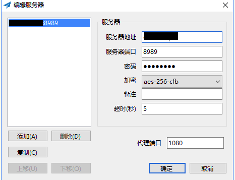
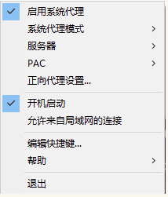

# 云服务器搭建VPN

## 阿里云香港服务器搭建 ssr 科学上网

### 1 环境准备

```bash
环境：阿里云香港 ECS
配置：cpu 1核心、内存 0.5GB、出网带宽 1Mbps
系统：centos7.5
```

#### 1.1 shadowsocks

shadowsocks 是一种基于 Socks5 代理方式的网络数据加密传输包，并采用 Apache 许可证、GPL、MIT 许可证等多种自由软件许可协议开放源代码。shadowsocks 分为服务器端和客户端，在使用之前，需要先将服务器端部署到服务器上面，然后通过客户端连接并创建本地代理。目前包使用 Python、C、C++、C#、Go 语言等编程语言开发。

运行原理：Shadowsocks 的运行原理与其他代理工具基本相同，使用特定的中转服务器完成数据传输。在服务器端部署完成后，用户需要按照指定的密码、加密方式和端口使用客户端软件与其连接。在成功连接到服务器后，客户端会在用户的电脑上构建一个本地 Socks5 代理。浏览网络时，网络流量会被分到本地 socks5 代理，客户端将其加密之后发送到服务器，服务器以同样的加密方式将流量回传给客户端，以此实现代理上网。

### 2 搭建代理（服务器）

#### 2.1 部署 shadowsocks
```bash
sudo wget --no-check-certificate -O shadowsocks-all.sh https://raw.githubusercontent.com/teddysun/shadowsocks_install/master/shadowsocks-all.sh
sudo chmod +x shadowsocks-all.sh
sudo ./shadowsocks-all.sh 2>&1 ' tee shadowsocks-all.log
```

执行后，会提示输入源码语言，密码、端口、及加密方式等。（这里端口使用8989；源码选择的是 python 语言；加密方式这里选择aes-256-cfb；）

最终会显示以下效果，说明部署已完成：

```bash
Congratulations, your_shadowsocks_version install completed!  
Your Server IP        :11.11.11.11  
Your Server Port      :8989  
Your Password         :123456  
Your Encryption Method:aes-256-cfb
Welcome to visit:https://teddysun.com/486.html  
 Enjoy it
```

#### 2.2 把 8989 端口设置为开放状态

打开防火墙配置文件：
```bash
sudo vim /etc/sysconfig/iptables
```
插入下面这句：
```bash
-A INPUT -p tcp -m state --state NEW -m tcp --dport 8989 -j ACCEPT
```
保存后使更改生效，执行以下：
```bash
sudo service iptables save  
```

#### 2.3 开放云服务器端口

阿里云有安全组配置，需要进入阿里云管理界面找到安全组配置，把 8989 端口开放。否则外网依然无法方位该端口。

至此，服务器部署完成！

#### 2.4 卸载方法
```bash
sudo ./shadowsocks-all.sh uninstall
```

### 3 使用

#### 3.1 windows 客户端

首先搜索`shadowsocks-windows`，打开后进行如下配置。

服务器地址：云服务器ip、端口：之前配置的端口、加密方式要选择服务器选择的加密方式、本级代理端口 1080（可以改成别的）。



配置好后，在电脑右下角找到ss，并点击启用。



#### 3.2 iphone 代理配置

* 下载：APP Store 中下载 shadowrocket

* 使用：打开App后， 点击右上角 + 号：
```bash
type：ss  
name : 随便起一个名字即可
server : 云服务器ip  
port : 刚才配置的ip 端口, 8989  
password ： 服务器设置的密码  
proxyMethod：system  
method ： 刚才配置的加密方式，AES-256-CFB
点击 save configuration 后进入 choos 页面，点击刚刚创建的那个名字即可。回到首页，找到创建的代理并打开。
配置成功
```

#### 3.3 ubuntu 系统代理配置

* 安装 shadowsocks
```bash
sudo apt install shadowsocks
```

* 找到`config.json`，并编辑代理配置
```bash
cd /etc/shadowsocks/
sudo vim config.json
{
    "server":"x.x.x.x",    //ss服务器的ip
    "server_port":8989, //ss 服务器的端口，这里配置的是8989
     "local_address": "127.0.0.1",
    "local_port":1080,  //本机端口：可以换成别的
    "password":"123456", //ss服务器密码
    "timeout":300,
    "method":"aes-256-cfb" //ss服务器配置的加密方式
}
```
* 启动 shadowsocks，启动后控制台不要关闭
```bash
sslocal -c config.json
```
也可以后台运行，这样启动后控制台关闭不影响
```bash
nohup sslocal -c config.json >/dev/null 2>&1 &
```

* 配置代理
  * 右上角-系统设置-网络-网络代理-手动
  * Socks主机：127.0.0.1    端口：1080
  * 最后点击**应用到整个系统**，至此，配置完成。

* 让终端也走代理的方法
在`~/.bashrc`文件中增加以下两句，表示 bash 终端中的`http`和`https`的请求也通过`socks5`协议进行代理转发。
```bash
export http_proxy="socks5://127.0.0.1:1080"
export https_proxy="socks5://127.0.0.1:1080"</pre>
```

这里的方法也适用于其他的境外服务器，例如：
* vultr：https://www.vultr.com/?ref=8872889
* 搬瓦工：https://www.cn-bwg.com/

