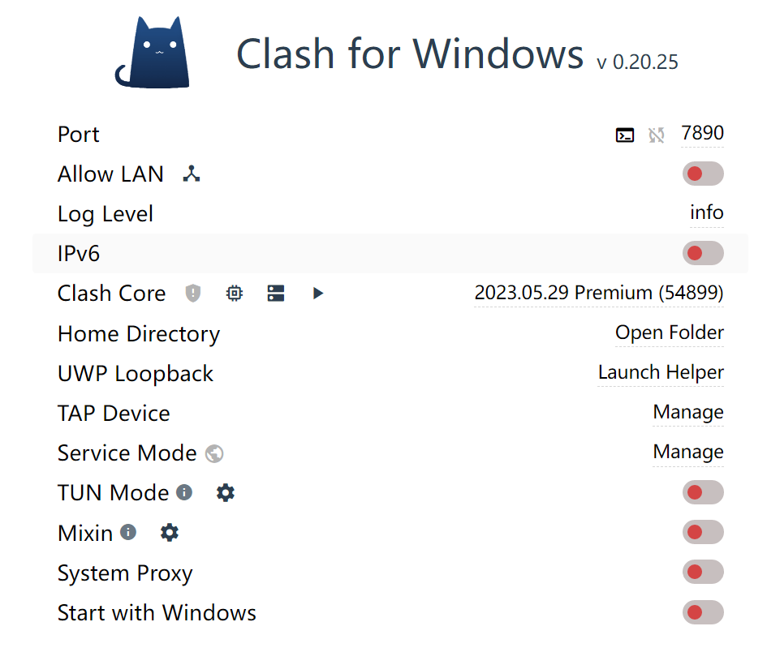
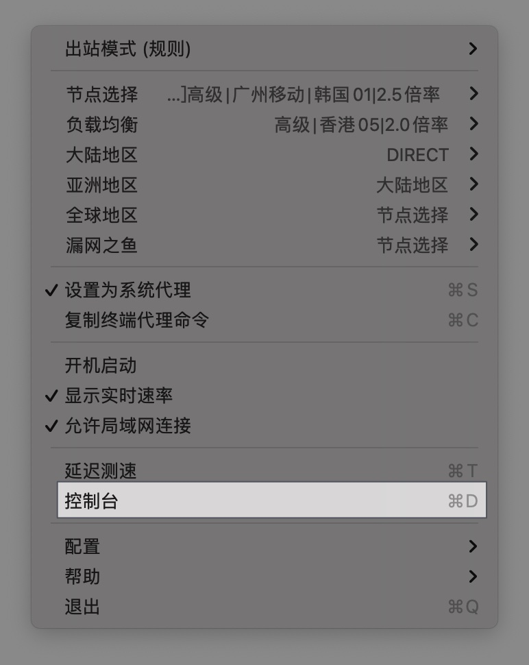
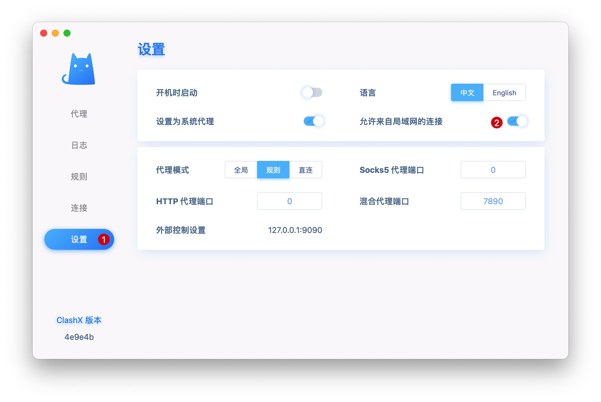

## 使用 clash 共享代理给同一局域网下的其他设备

在实际使用中，往往会遇到这样的情况，有一台设备 A 和一台设备 B，设备 A 装了 Clash，现在要通过设备 A 实现设备 B 上网。

共享代理是指多台设备连接同一个网络的情况下，其中一台设备开启代理共享使其它设备一起实现网络代理服务。

### 1 打开局域网连接

确保设备 A 代理正常。然后打开 Clash 的 Allow LAN。

#### 1.1 Clash for Windows

#### 1.2 ClashX

点击 控制台 —> 设置，打开 允许来自局域网的连接。

### 2 获取局域网 IP

这里获取的是设备 A 的局域网 IP，也就是安装了 Clash 的设备。

#### 2.1 Windows

使用组合键 `Win + R`，在搜索框输入 cmd 回车，在接下来的窗口里输入`ipconfig`找到无线局域网适配器`WLAN`项，IPv4 地址 即为设备 A 在局域网里的 ip 地址。

#### 2.2 MacOS

桌面右上角 —> 系统偏好设置…，选择网络，可以立即看到当前 Wi—Fi 下的局域网 IP 地址。局域网 IP 地址一般都以 192.168 开头。

### 3 被共享设备（设备B）

确保设备 A 和设备 B 接入相同的 Wi—Fi 下 。不同系统操作方法不太一样，一般的操作步骤：

* 打开设置
* 打开无线局域网
* 点击已经连接的 Wi-Fi
* 进入 Wi—Fi 设置页
* 点击配置 HTTP 代理
* HTTP 代理改 自动 为 手动，在**服务器/主机**栏填写设备 A 的局域网 IP，**端口栏填写 7890**(就是前面打开局域网连接 Clash 的 Allow LAN 那个界面上面的端口号)。如果有认证，关闭认证，最后保存。

不出意外，现在设备 B 也可以通过代理上网了。
