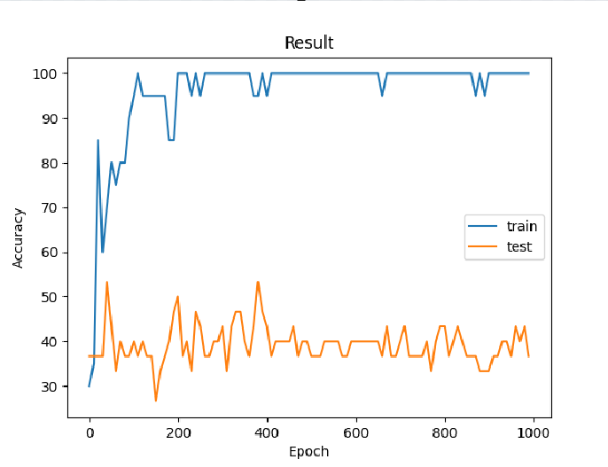

## 树莓派5使用pytorch训练模型(CPU)

Pytorch 对于树莓派提供了较好的支持，可以利用 Pytorch 在树莓派上进行试试推理，当然也可以使用树莓派进行模型训练了，这里尝试使用树莓派CPU对模型进行训练。

### 0 环境配置

必要的环境安装，这个步骤没有什么值得说的，这里不再赘述，有需要可以参考之前的博客：[树莓派5上手](https://blog.csdn.net/qq_38342510/article/details/142289792?spm=1001.2014.3001.5501)。

另外，这里还需要安装matplotlib绘图库（之后绘制损失曲线用的到）：
```bash
python3 -m pip install matplotlib
```

### 1 训练代码

这里通过自己生成随机数据集，来训练一个简单的一维 CNN 模型。github地址：https://github.com/Taot-chen/raspberrypi_dl
项目结构：
```bash
.
├── gen_dataset.py
├── Models
│   └── MobileNetV3.py
└── train.py
```

#### 1.1 生成模拟数据集

在没有数据集的情况下，通过简单的方式来生成一个数据集。数据集包含两部分，训练的值和标签，训练的值用data表示，训练的标签用label表示，`gen_dataset.py`：
```python
import numpy as np
import pathlib

def gen_data(data_num = 100, data_chal = 3, data_len = 224, classes = 2, save_path="./dataset/"):
    pathlib.Path(save_path).mkdir(parents=True, exist_ok=True) 
    data = np.random.randn(data_num, data_chal, data_len)
    label = np.random.randint(0, classes, data_num)
    np.save(f'{save_path}/data.npy', data, allow_pickle=True)
    np.save(f'{save_path}/label.npy', label, allow_pickle=True)

def package_dataset(data, label):
    dataset = [[i, j] for i, j in zip(data, label)]
    data_chal = data[0].shape[0]
    data_len = data[0].shape[1]
    classes = len(np.unique(label))
    return dataset, data_chal, data_len, classes


if __name__ == '__main__':
    data_path = "./dataset/"
    data_num = 100
    data_chal = 3
    data_len = 224
    classes = 2
    gen_data(data_num = data_num, data_chal = data_chal, data_len = data_len, classes = classes, save_path = data_path)
    data = np.load(f'{data_path}/data.npy')
    label = np.load(f'{data_path}/label.npy')
    dataset, channels, length, classes = package_dataset(data, label)
    print("generate dataset complete")
    print(channels, length, classes)
```

#### 1.2 训练数据处理

* 导入需要的工具包：
```python
import numpy as np
import torch
import matplotlib.pyplot as plt
from torch.utils.data import DataLoader, Dataset,random_split
```

* 导入自定义数据集 API：
```python
from gen_dataset import package_dataset
```

* 导入自定义模型

这里自定义的模型比较多，可以去github仓库取完整代码，这里只使用了 MobileNetV3:
`MobileNetV3.py`
```python
import torch

class conv(torch.nn.Module):
    def __init__(self, in_channels, out_channels, keral,stride=1, groups=1,activation = None):
        super().__init__()

        padding = keral//2
        self.use_activation = activation
        self.conv = torch.nn.Conv1d(in_channels, out_channels, keral, stride,padding, groups=groups)
        self.bath = torch.nn.BatchNorm1d(out_channels)
        if self.use_activation == 'Relu':
            self.activation = torch.nn.ReLU6()
        elif self.use_activation == 'H_swish':
            self.activation = torch.nn.Hardswish()

    def forward(self,x):
        x = self.conv(x)
        if x.size()[-1] != 1:
            x = self.bath(x)
        if self.use_activation != None:
            x = self.activation(x)
        return x


class bottleneck(torch.nn.Module):
    def __init__(self,in_channels,keral_size,expansion_size,out_channels,use_attenton = False,activation = 'Relu',stride=1):
        super().__init__()

        self.stride = stride
        self.in_channels = in_channels
        self.out_channels = out_channels
        self.use_attenton = use_attenton

        self.conv = conv(in_channels,expansion_size,1,activation=activation)
        self.conv1 = conv(expansion_size,expansion_size,keral_size,stride=stride,groups=expansion_size,activation=activation)

        if self.use_attenton:
            self.attenton = SE_block(expansion_size)

        self.conv2 = conv(expansion_size,out_channels,1,activation=activation)

    def forward(self,x):

        x1 = self.conv(x)
        x1 = self.conv1(x1)
        if self.use_attenton:
            x1 = self.attenton(x1)
        x1 = self.conv2(x1)

        if self.stride == 1 and self.in_channels == self.out_channels:
            x1 += x

        return x1

class SE_block(torch.nn.Module):
    def __init__(self,in_channel,ratio=1):
        super(SE_block, self).__init__()
        self.avepool = torch.nn.AdaptiveAvgPool1d(1)
        self.linear1 = torch.nn.Linear(in_channel,in_channel//ratio)
        self.linear2 = torch.nn.Linear(in_channel//ratio,in_channel)
        self.Hardsigmoid = torch.nn.Hardsigmoid(inplace=True)
        self.Relu = torch.nn.ReLU(inplace=True)

    def forward(self,input):
        b,c,_ = input.shape
        x = self.avepool(input)
        x = x.view([b,c])
        x = self.linear1(x)
        x = self.Relu(x)
        x = self.linear2(x)
        x = self.Hardsigmoid(x)
        x = x.view([b,c,1])

        return input*x


class MobileNetV3_small(torch.nn.Module):
    def __init__(self,in_channels,classes):
        super().__init__()
        self.fearures = torch.nn.Sequential(
            conv(in_channels,16,3,2,activation='H_swish'),
            bottleneck(16,3,16,16,True,'Relu',2),
            bottleneck(16,3,72,24,False,'Relu',2),
            bottleneck(24,3,88,24,False,'Relu',1),
            bottleneck(24,5,96,40,False,'H_swish',2),
            bottleneck(40,5,240,40,True,'H_swish',1),
            bottleneck(40,5,240,40,True,'H_swish',1),
            bottleneck(40,5,120,48,True,'H_swish',1),
            bottleneck(48,5,144,48,True,'H_swish',1),
            bottleneck(48,5,288,96,True,'H_swish',2),
            bottleneck(96,5,576,96,True,'H_swish',1),
            bottleneck(96,5,576,96,True,'H_swish',1),
            conv(96, 576, 1, 1, activation='H_swish'),
            torch.nn.AdaptiveAvgPool1d(1),
        )
        self.classifier = torch.nn.Sequential(
            conv(576, 1024, 1, 1, activation='H_swish'),
            conv(1024, classes, 1, 1, activation='H_swish'),
            torch.nn.Flatten()

        )
    def forward(self,x):
        x = self.fearures(x)
        x = self.classifier(x)

        return x

class MobileNetV3_large(torch.nn.Module):
    def __init__(self,in_channels,classes):
        super().__init__()
        self.features = torch.nn.Sequential(
            conv(in_channels,16,3,2,activation='H_swish'),
            bottleneck(16,3,16,16,False,'Relu',1),
            bottleneck(16,3,64,24,False,'Relu',2),
            bottleneck(24,3,72,24,False,'Relu',1),
            bottleneck(24,5,72,40,True,'Relu',2),
            bottleneck(40,5,120,40,True,'Relu',1),
            bottleneck(40,5,120,40,True,'Relu',1),
            bottleneck(40,3,240,80,False,'H_swish',2),
            bottleneck(80,3,200,80,False,'H_swish',1),
            bottleneck(80,3,184,80,False,'H_swish',1),
            bottleneck(80,3,184,80,False,'H_swish',1),
            bottleneck(80,3,480,112,True,'H_swish',1),
            bottleneck(112,3,672,112,True,'H_swish',1),
            bottleneck(112,5,672,160,True,'H_swish',2),
            bottleneck(160,5,960,160,True,'H_swish',2),
            bottleneck(160,5,960,160,True,'H_swish',2),


            conv(160, 960, 1, 1, activation='H_swish'),
            torch.nn.AdaptiveAvgPool1d(1),
        )
        self.classifier = torch.nn.Sequential(
            conv(960, 1280, 1, 1, activation='H_swish'),
            conv(1280, classes, 1, 1, activation='H_swish'),
            torch.nn.Flatten()

        )
    def forward(self,x):
        x = self.fearures(x)
        x = self.classifier(x)

        return x

if __name__ == "__main__":
    input = torch.randn((1,112,224))
    # model = MobileNetV3_small(in_channels=112, classes=5)
    model = MobileNetV3_large(in_channels=112, classes=5)
    output = model(input)
    print(output.shape)
```

导入模型：
```python
from Models.MobileNetV3 import MobileNetV3_large
```

* 加载数据集
```python
data = np.load(f'{data_path}/data.npy')
label = np.load(f'{data_path}/label.npy')
```

* 划分训练集和测试集
去数据集的前 70% 为训练集，后 30% 为测试集：
```python
data_part = 0.7
epoch_num = 1000
show_result_epoch = 10 
bsz = 50
dataset, data_chal, data_len, classes = package_dataset(data, label)

# partition dataset
train_len = int(len(dataset) * data_part)
test_len = int(len(dataset)) - train_len
train_data, test_data = random_split(dataset=dataset, lengths=[train_len, test_len])
```

* 数据加载 class
```python
class Dataset(Dataset):
    def __init__(self, data):
        self.len = len(data)
        self.x_data = torch.from_numpy(np.array(list(map(lambda x: x[0], data)), dtype=np.float32))
        self.y_data = torch.from_numpy(np.array(list(map(lambda x: x[-1], data)))).squeeze().long()

    def __getitem__(self, index):
        return self.x_data[index], self.y_data[index]

    def __len__(self):
        return self.len
```

* 构建 dataloader
```python
train_dataset = Dataset(train_data)
test_dataset = Dataset(test_data)
dataloader = DataLoader(train_dataset, shuffle=True, batch_size=bsz)
testloader = DataLoader(test_dataset, shuffle=True, batch_size=bsz)
```

* 数据加载至训练设备上
选择CPU训练还是GPU训练：
```python
device = torch.device("cuda:0" if torch.cuda.is_available() else "cpu")
```

* 加载模型
```python
model =MobileNetV3_large(in_channels=data_chal, classes=classes)
model.to(device)
```

* 加载损失函数

这里使用交叉误熵损失函数：
```python
criterion = torch.nn.CrossEntropyLoss()
criterion.to(device)
```

* 加载优化器

```bash
# optimizer = torch.optim.Adam(model.parameters(), lr=0.001)
optimizer = torch.optim.SGD(model.parameters(), lr=0.001, momentum=0.9)
```

* 初始化训练集准确率和测试集准确率列表

初始化两个列表，这两个列表分别用于存储训练集准确率和测试集准确率，每间隔show_result_epoch轮保存一次训练准确率和测试准确率，打印一次训练集和测试集的准确率:
```python
train_acc_list = []
test_acc_list = []
```

#### 1.3 完整训练函数

`train.py`
```python
import numpy as np
import torch
import matplotlib.pyplot as plt
from torch.utils.data import DataLoader, Dataset,random_split
from gen_dataset import package_dataset
from Models.MobileNetV3 import MobileNetV3_large

class Dataset(Dataset):
    def __init__(self, data):
        self.len = len(data)
        self.x_data = torch.from_numpy(np.array(list(map(lambda x: x[0], data)), dtype=np.float32))
        self.y_data = torch.from_numpy(np.array(list(map(lambda x: x[-1], data)))).squeeze().long()

    def __getitem__(self, index):
        return self.x_data[index], self.y_data[index]

    def __len__(self):
        return self.len

def test(model, testloader, device, criterion, optimizer, test_acc_list):
    model.eval()
    test_correct = 0
    test_total = 0
    with torch.no_grad():
        for testdata in testloader:
            test_data_value, test_data_label = testdata
            test_data_value, test_data_label = test_data_value.to(device), test_data_label.to(device)
            test_data_label_pred = model(test_data_value)
            test_probability, test_predicted = torch.max(test_data_label_pred.data, dim=1)
            test_total += test_data_label_pred.size(0)
            test_correct += (test_predicted == test_data_label).sum().item()
    test_acc = round(100 * test_correct / test_total, 3)
    test_acc_list.append(test_acc)
    print(f'Test accuracy:{(test_acc)}%')

def train(model, epoch, dataloader, testloader, device, criterion, optimizer, train_acc_list, test_acc_list,  show_result_epoch):
    model.train()
    train_correct = 0
    train_total = 0
    for data in dataloader:
        train_data_value, train_data_label = data
        train_data_value, train_data_label = train_data_value.to(device), train_data_label.to(device)
        train_data_label_pred = model(train_data_value)
        loss = criterion(train_data_label_pred, train_data_label)
        optimizer.zero_grad()
        loss.backward()
        optimizer.step()
    if epoch % show_result_epoch == 0:
        probability, predicted = torch.max(train_data_label_pred.data, dim=1)
        train_total += train_data_label_pred.size(0)
        train_correct += (predicted == train_data_label).sum().item()
        train_acc = round(100 * train_correct / train_total, 4)
        train_acc_list.append(train_acc)
        print('=' * 10, epoch // 10, '=' * 10)
        print('loss:', loss.item())
        print(f'Train accuracy:{train_acc}%')
        test(model, testloader, device, criterion, optimizer, test_acc_list)

def main():
    data_path = "./dataset/"
    data = np.load(f'{data_path}/data.npy')
    label = np.load(f'{data_path}/label.npy')
    data_part = 0.7
    epoch_num = 1000
    show_result_epoch = 10 
    bsz = 50
    dataset, data_chal, data_len, classes = package_dataset(data, label)

    # partition dataset
    train_len = int(len(dataset) * data_part)
    test_len = int(len(dataset)) - train_len
    train_data, test_data = random_split(dataset=dataset, lengths=[train_len, test_len])
    train_dataset = Dataset(train_data)
    test_dataset = Dataset(test_data)
    dataloader = DataLoader(train_dataset, shuffle=True, batch_size=bsz)
    testloader = DataLoader(test_dataset, shuffle=True, batch_size=bsz)

    device = torch.device("cuda:0" if torch.cuda.is_available() else "cpu")
    model =MobileNetV3_large(in_channels=data_chal, classes=classes)
    model.to(device)
    criterion = torch.nn.CrossEntropyLoss()
    criterion.to(device)
    # optimizer = torch.optim.Adam(model.parameters(), lr=0.001)
    optimizer = torch.optim.SGD(model.parameters(), lr=0.001, momentum=0.9)

    train_acc_list = []
    test_acc_list = []

    for epoch in range(epoch_num):
        train(model, epoch, dataloader, testloader, device, criterion, optimizer, train_acc_list, test_acc_list, show_result_epoch)

    plt.plot(np.array(range(epoch_num//show_result_epoch)) * show_result_epoch, train_acc_list)
    plt.plot(np.array(range(epoch_num//show_result_epoch)) * show_result_epoch, test_acc_list)
    plt.legend(['train', 'test'])
    plt.title('Result')
    plt.xlabel('Epoch')
    plt.ylabel('Accuracy')
    plt.savefig("./result.png")

    
if __name__ == "__main__":
    main()
```

### 2 训练

#### 2.1 生成训练数据
```bash
python3 gen_dataset.py
```

#### 2.2 训练模型

```bash
python3 train.py
```

#### 2.3 训练结果

由于这里的训练集和测试集都是使用的随机数，可以的看到，测试的准确率比较低。训练速度的话，就真的是不快。


