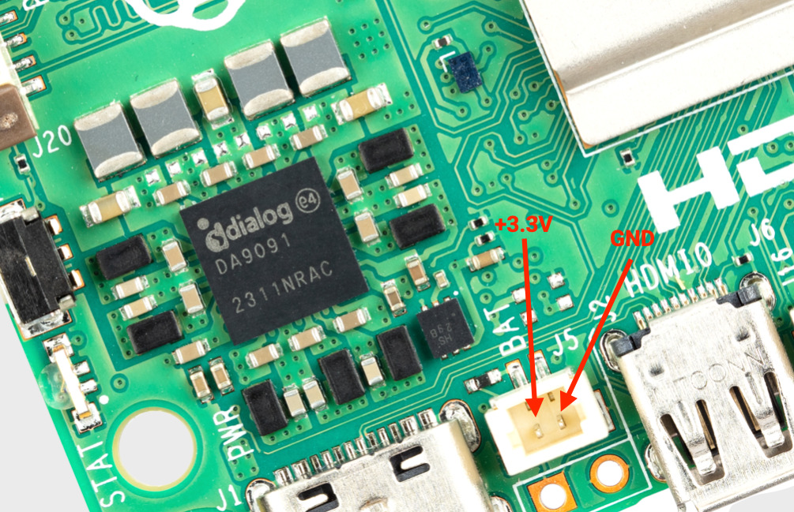
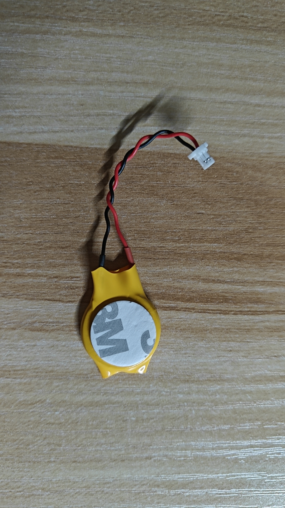

## 树莓派5实时时钟(RTC)

树莓派5板载一个实时时钟模块。它可以通过 USB-C 电源插口右侧板上的 J5(BAT) 插口进行电池供电。如果没有互联网连接来通过 NTP 获取时间，RTC 可能会很有用。



可以设置唤醒警报，将树莓派5切换到非常低功耗的状态（大约3mA）。当到达闹钟时间时，树莓派将重新上电。这对于定时拍摄图像等周期性作业非常有用。

### 1 bootloader 配置

要支持唤醒警报的低功耗模式，需要编辑bootloader配置：
```bash
sudo -E rpi-eeprom-config --edit
```

添加以下两行:
```bash
POWER_OFF_ON_HALT=1
WAKE_ON_GPIO=0
```

可以使用以下方法测试功能：
```bash
echo +600 | sudo tee /sys/class/rtc/rtc0/wakealarm
sudo halt
```

这将使开发板停机并进入低功耗的状态，然后在10分钟后唤醒并重新启动。

实时时钟还提供启动时间，例如 dmesg：
```bash
[    1.295799] rpi-rtc soc:rpi_rtc: setting system clock to 2023-08-16T15:58:50 UTC (1692201530)
```
> 即使J5插口上没有连接备用电池，RTC仍然可用。


### 2 添加备用电池

可以使用这样的可充电 RTC 电池：


这样的可充电 RTC 电池带有预装的两针JST插头和粘合安装垫。这适用于在树莓派5的主电源断开时为RTC供电，断电电流消耗为个位数µA，从而提供可以以月为单位的持续时间。也就是说可以在板子断电数月内，都由这颗电池为树莓派5的实时时钟供电，从而保证树莓派5的时钟准确。


### 3 启用涓流充电

默认情况下电池的涓流充电处于禁用状态。有一些`sysfs`文件显示当前的涓流充电电压和限制：
```bash
/sys/devices/platform/soc/soc:rpi_rtc/rtc/rtc0/charging_voltage:0
/sys/devices/platform/soc/soc:rpi_rtc/rtc/rtc0/charging_voltage_max:4400000
/sys/devices/platform/soc/soc:rpi_rtc/rtc/rtc0/charging_voltage_min:1300000
```

添加`rtc_bbat_vchg`到`/boot/firmware/config.txt`：
```bash
dtparam=rtc_bbat_vchg=3000000
```
然后重新启动，会看到：
```bash
/sys/devices/platform/soc/soc:rpi_rtc/rtc/rtc0/charging_voltage:3000000
/sys/devices/platform/soc/soc:rpi_rtc/rtc/rtc0/charging_voltage_max:4400000
/sys/devices/platform/soc/soc:rpi_rtc/rtc/rtc0/charging_voltage_min:1300000
```
电池将进行涓流充电。

移除`config.txt`中的`dtparam`行以停止涓流充电。

*注：只有使用带充电功能的电池才可以加这个配置。 不带充电功能的电池不能加这个配置。否则会损坏电池*
