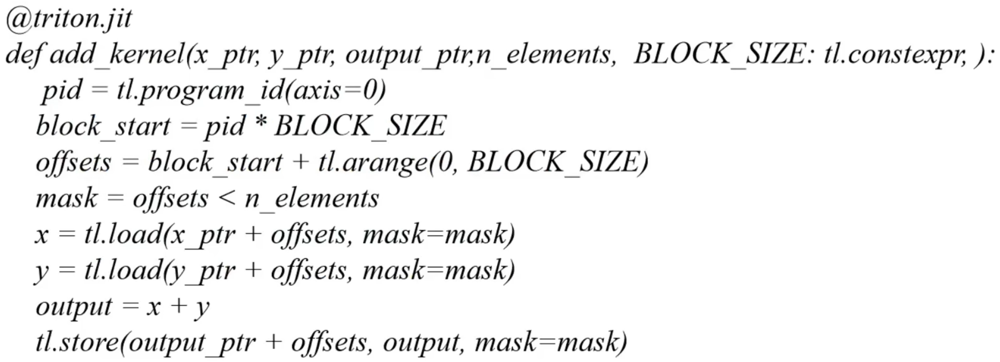
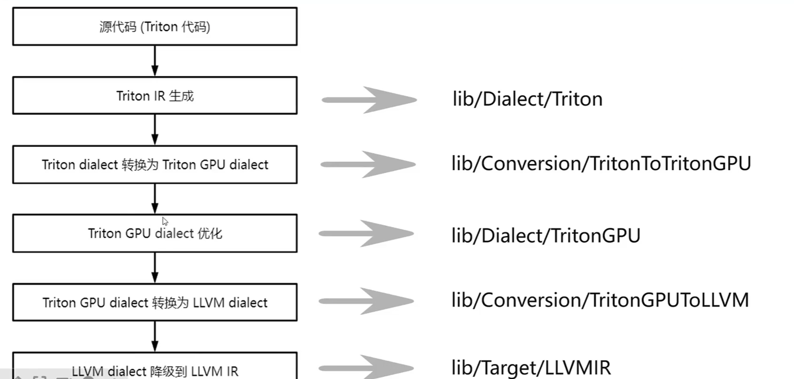

## triton get started

Triton 基于 python 的 DSL，面向 GPU 体系特点，自动分析和实施神经网路计算的分块，triton 既是语言，也是编译器。

### 0 Triton 理解

TVM、XLA 等框架能实现从模型到硬件的端到端的优化：

* 起点是深度学习模型，之后模型被转换成计算图，即一种数据结构，用于表示模型中的所有操作和他们之间的数据依赖关系。
* 在图表示的基础上，编译器应用多种优化策略来提高性能，例如合并操作，消除冗余
* 优化后的计算图会被转换成一系列的内核(kernel)，是实际执行计算的代码
* 最终，将 kernel 部署到目标设备上执行

多数情况下，TVM/XLA 生成的代码性能不如供应商算子库。

triton 通过提供领域特定的语言和编译器，直接面向底层的 kernel 开发和编译优化问题，使得开发者能够以更高抽象层次编写高效的 GPU kernel，从而提升性能。

与 CUDA 相比，triton 拥有更易用的编程模型，可以简化 GPU 的编程过程。在从 model 到 device 的过程中，triton 位于 kernel这个层次，实际上就是大量算子和多种数据类型的组合。


#### 0.1 triton 编译器的流程

Triton 兼容 pytorch 等框架:

* 可以通过 inductor 后端，降级为 triton kernel
* 具体流程：
    * pytorch 中的深度学习模型，经过`torch.dynamo`得到 fx 计算图，后经过`inductor`后端生成 triton 代码；
    * 之后会进行基于 MLIR 的多层中间表示与优化，包括`triton Dialect`，`triton GPU Dialect`等
        * `triton Dialect`，公共子表达式消除，死代码消除等优化
        * `triton GPU dialect`，流水线 pipeline，数据预取 prefetch 等优化
    * 利用 LLVM 生成不同硬件平台的高效可执行代码


### 1 triton 安装

#### 1.1 pip 安装

```bash
pip install triton
```
这里没什么说的，没报错就安装成功了，报错了再根据报错信息解决即可。


#### 1.2 源码安装

* 环境版本：
```bash
Ubuntu 18.04.6 LTS x86_64
Python 3.10.15
cuda 11.8
triton 3.1.0(基于库上最新代码: https://github.com/triton-lang/triton)
```

* triton 源码下载
```bash
git clone https://github.com/triton-lang/triton.git
# git clone git@github.com:triton-lang/triton.git
```

* 虚拟环境
```bash
cd triton
conda create -n triton python=3.10
conda activate triton
# python -m venv .venv --prompt triton
# source ~/.venv/bin/activate
python3 -m pip install ninja cmake wheel
python3 -m pip install scipy numpy pytest lit pandas matplotlib
```

* 下载 llvm 源码
```bash
# 获取与当前 triton 版本适配的 llvm 分支
cat /path/to/triton/cmake/llvm-hash.txt
# 这里可以获取一个 hash 值 hash-str

git clone https://github.com/llvm/llvm-project
cd llvm-project
git checkout hash-str
```

* 编译 llvm
```bash
mkdir build && cd build
cmake -G Ninja -DCMAKE_BUILD_TYPE=Release -DLLVM_ENABLE_ASSERTIONS=ON ../llvm -DLLVM_ENABLE_PROJECTS="mlir;llvm" -DLLVM_TARGETS_TO_BUILD="host;NVPTX;AMDGPU"
ninja -j32
```

* 构建 triton
```bash
export LLVM_BUILD_DIR=/path/to/llvm-project/build
cd /path/to/triton
LLVM_INCLUDE_DIRS=$LLVM_BUILD_DIR/include
LLVM_LIBRARY_DIR=$LLVM_BUILD_DIR/lib
LLVM_SYSPATH=$LLVM_BUILD_DIR
pip install -e python -i https://pipi.tuna.tsing.edu.cn/simple
```
上面的环境变量也可以写在文件中：
```bash
cd /path/to/triton
vim env
# 以下内容添加到文件中
export LLVM_BUILD_DIR=/path/to/llvm-project/build
LLVM_INCLUDE_DIRS=$LLVM_BUILD_DIR/include
LLVM_LIBRARY_DIR=$LLVM_BUILD_DIR/lib
LLVM_SYSPATH=$LLVM_BUILD_DIR
source ./env
```

* 验证安装
```bash
cd /path/to/triton/python/tutorials
python3 01-vector-add.py

# 输出，可以看到 triton 的输出结果与 torch 的结果一致，且性能接近，在某些 size 下，triton 还具有更好的性能
tensor([1.3713, 1.3076, 0.4940,  ..., 1.1495, 0.9265, 1.1323], device='cuda:0')
tensor([1.3713, 1.3076, 0.4940,  ..., 1.1495, 0.9265, 1.1323], device='cuda:0')
The maximum difference between torch and triton is 0.0
vector-add-performance:
           size      Triton       Torch
0        4096.0   12.000000   12.190476
1        8192.0   23.813955   28.444444
2       16384.0   51.200001   52.067795
3       32768.0   97.523810   96.755900
4       65536.0  166.054047  160.627450
5      131072.0  255.999991  250.775518
6      262144.0  348.595753  334.367350
7      524288.0  433.057275  402.472881
8     1048576.0  472.615390  467.002371
9     2097152.0  510.670140  505.744062
10    4194304.0  525.865604  524.637757
11    8388608.0  535.625424  535.807890
12   16777216.0  540.619226  542.507197
13   33554432.0  542.729481  545.080577
14   67108864.0  543.034000  546.127409
15  134217728.0  543.356430  546.578161
```


### 2 triton 程序

#### 2.1 riton 常用 API 语法

常见的 triton API 语法：https://triton-lang.org/main/index.html

##### 2.1.1 triton

* `triton.jit`：装饰器，用于使用 triton 编译器对函数进行 jit 编译，该函数将在 GPU 上编译和运行
    * 使用 jit 编译器的函数只能访问 **python 基元**、**triton 包内的内置函数**、**该函数的参数**以及**其他 jit 函数**
* `triton.autotune`：评估所有配置
    * kernel 将会运行多次，最终使用最好的配置进行执行
    * 常见的配置：num_warps、num_stages，块的大小
* `triton.heuristics`：作用类似 `autotune`,但是允许根据输入参数动态计算元参数，提供 triton 内核的灵活性
* `triton.config`：表示 `autotune`要尝试的可能内核配置
    * 配置内容：num_warps、num_stages，块的大小

##### 2.1.2 常用 math op

* abs：绝对值
* cidv：除法，并对结果向上取整
* ceil：向上取整
* cos：余弦函数
* sin：正弦函数
* softmax：激活函数，将输入值转换为概率分布，所有输出总和为 1
* sqrt：算术平方根


##### 2.1.3 debug ops

* 编译时的 API：
    * `static_print`：打印编译时的数值
    * `static_assert`：打印编译时的断言
* 运行时的 API：
    * `device_print`：打印运行时的数值
    * `device_assert`：打印运行时的断言
*注：在 triton 的 kernel 中，只能使用 debug api 进行打印，如果使用`print`打印会直接报错*


#### 2.2 官网 triton 程序示例：`01-vector-add`

##### 2.2.1 向量加法 kernel



* x_ptr/y_ptr：输入的两个向量指针，计算他们的加法，并把结果存放在`output_ptr`中
* n_elements：要处理的元素数量
* BLOCK_SIZE：块的大小
* tl.constexpr：告诉编译器，这个参数是一个常量，值在编译时就已经确定，对于优化内核性能和生成高效代码有用
* tl.program_id(axis=0)：获取当前线程块的 ID，`axis=0`表示沿着第一个维度获取线程块 ID
* block_start = pid * BLOCK_SZIE：计算当前块在全局数组中的起始索引
* offsets：当前块内所有线程的全局索引
* mask：bool 数组，用于标识那些索引在有效范围内，避免访问越界

*注：在 triton 中，计算的最小单位是**块**，在 cuda 中，最小单位是**线程***


##### 2.2.2 调用内核函数


* lambda 函数 grid：用于计算网格的大小
* 使用 网格函数 grid 启动内核函数


编译运行：
```bash
cd /path/to/triton/python/tutorials
python3 01-vector-add.py
```


### 3 triton 源码结构

#### 3.1 triton 3.0.0 源码结构

* triton
    * docs/：项目文档
    * cmake/：构建配置相关
    * bin/：工具、脚本
    * CmakeLists.txt：cmake 配置文件
    * LSCENSE
    * README.md
    * Pyproject.toml：python 项目配置文件
    * utils/：项目配置文件目录
    * unittest/：单元测试代码
    * third_party/：第三方资源
        * amd/
        * f2reduce/
    * test/：测试代码
    * python/：python 接口代码
    * lib/：核心逻辑实现，`.cc/.cpp`，核心功能的具体实现
        * Analysis：相关分析
            * Alias.cpp：内存别名分析
            * Allocation.cpp：共享内存分配相关分析
            * Axisinfo.cpp：轴分析相关
            * Membar.cpp：线程同步、内存屏障相关
        * Conversion：dialect 之间的转换
            * TritonGPUToLLVM：tritonGPU dialect 降级到 LLVM dialect
            * TritonToTritonGPU：triton dialect 降级到 tritonGPU dialect
        * Dialect：各级中间表示 dialect 的定义，以及在对应 dialect 上进行的优化 pass
            * triton
                * IR：dialect/算子/属性/类型的定义
                * Transforms：相应中间表示上的优化 pass
                    * Combine.cpp：优化 select 和 load 操作的组合
                    * ReorderBroadcast.cpp：将**通过 broad 和乘法生成的规约操作**优化为**点积操作**
            * tritonGPU
            * TritonNvidiaGPU
        * Target：将 llvm dialect 降级到 llvm ir，为 llvm ir 添加元数据，链接外部数学库
            * LLVMIR
        * Tools：辅助工具头文件，分析、调试、优化生成的代码
        CMakeLists.txt
    * include/：核心逻辑定义，核心功能的`.h`头文件，提供约定和规范
        * triton
            * Analysis
                * Alias.h
                * ...
            * Conversion
                * TritonGPUToLLVM
                * TritonToTritonGPU
            * Dialect
                * triton
                * tritonGPU
                * TritonNvidiaGPU
            * Target
                * LLVMIR
            * Tools
        * CMakeLists.txt

        CMakeLists.txt

*注：transforms 用于各级 dialect 之上，conversion 用于各级 dialect 之间*

编译流程对应源码位置：




#### 3.2 常用源码位置

**Triton dialect：**
* OP 定义：include/triton/Dialect/IR/TritonOps.td
    tt.call, tt.func, tt.return, tt.load, tt.store, tt.dot 等 OP
* 优化 pass：lib/Dialect/Triton/Transforms
    CombineOpsPass, ReorderBroadcastPass, RewriterTensorPointerPass, LoopUnrollPass

**triton dialect --> tritonGPU Dialect:**
转换 pass：lib/Conversion/TritonToTritonGPU/TritonToTritonGPUPass.cpp

**TritonGPU Dialect:**
* Op 定义：include/triton/Dialect/TritonGPU/IR/TritonGPUOps.td
    async_wait, alloc_tensor, insert_slice_async, convert_Layout 等 OP
* Layout 属性定义：include/triton/Dialect/TritonGPU/IR/TritonGPUAttrDefs.td
    Blocked Layout, MMA Layout, DotOperand Layout, Slice Layout, Shared Layout
* 优化 pass：lib/Dialect/TritonGPU/Transforms
    AccelerateMatmul, Coalesce, CombineTensorSelectAndIf
