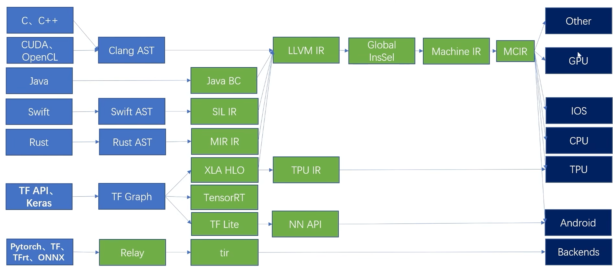
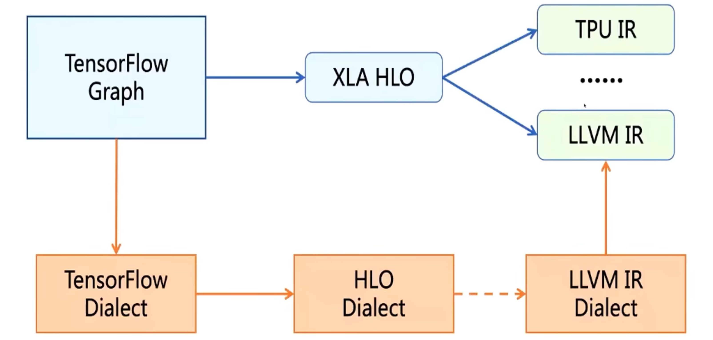
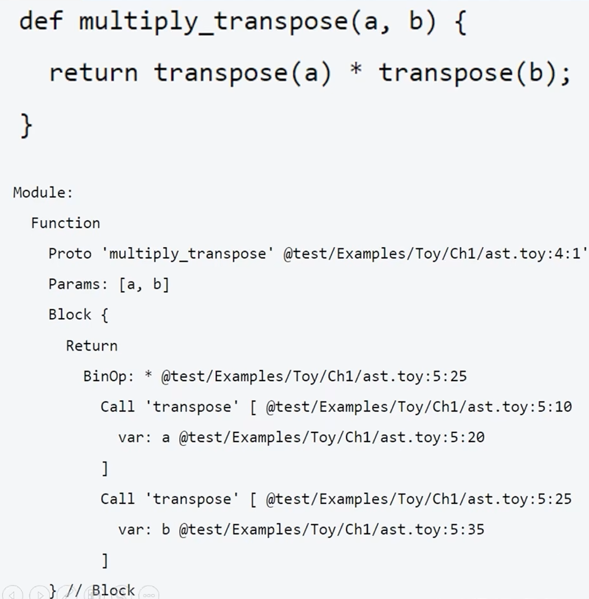
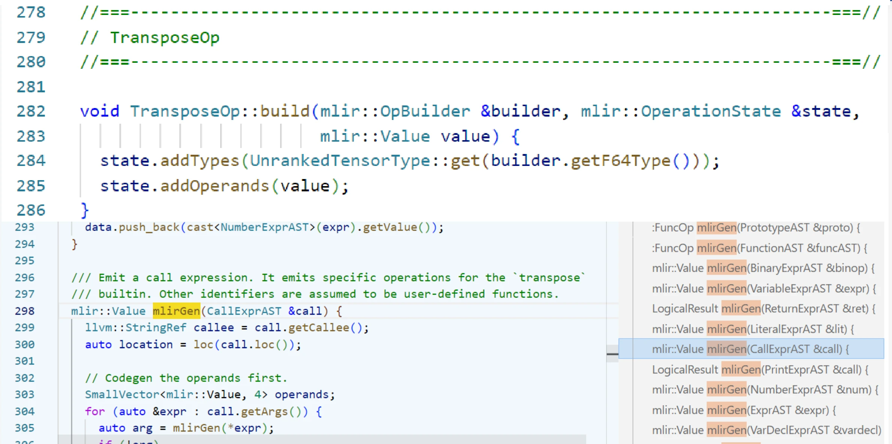

## MLIR 学习

### 1 MLIR

#### 1.1 常见的 IR 表示系统

clang 对 AST 进行静态分析和转换操作，各个语言的AST都需要进行类似的优化转换成对应的 IR，分为高级编程语言和机器学习框架两种不同的前端：

如上图，以C语言为例，在编译阶段，首先由 Clang 编译器前端生成对应的抽象语法树 AST，然后 AST 会被转换成 LLVM IR，在LLVM IR 上进行相关的优化工作。之后，优化完成的 LLVM IR 会经过一系列的流程被转换成机器码，最终在指定的硬件设备上运行。

在这里，C语言的编译过程中，由 C语言源码直接转 AST，不会进行特定于 C 语言的相关优化，程序的优化主要集中在 LLVM IR 这个阶段。LLVM IR 的表示抽象层级偏低（原因是 LLVM IR 是由很多的指令组成的），会丢失很多 C 语言源语言中的一些信息，可能会导致优化不充分，报错信息不完整等问题。

对比上图中 JAVA 语言，他的路径与 C 语言不完全一样，JAVA 源码会被转换成 JAVA 字节码（JAVA BC），这是一种内部 IR，可以进行一些特定于 JAVA 语言的优化，在此之后，JAVA 字节码被转换成 LLVM IR，之后再进行进一步的优化，根据 LLVM 编译器的后端再一步一步转换成机器码。JAVA 语言没有转换成 AST，而是转换成了自己的一种 IR，从而也创建出了属于自己的优化空间。

SWIFT 语言在被转换成 Swift AST 之后，没有直接转换成 LLVM IR，而是在此之前，创建了属于自己的 IR，SIL IR 是 Swift 的一种内部表示，基于这种内部 IR，可以进行特定于 Swift 的相关优化。之后再转换成 LLVM IR，与其他语言一样，对接到 LLVM 后端，经过一些列的 lowering 流程，通过代码生成，或多指定的硬件的机器码，进行执行。

Swift 的处理方案后来被广泛接受了，后续的语言，例如 Rust，都会开发属于自己的一套 IR 系统。但是这样就会出现这样的问题，每出现一个新的语言，就需要设计一套独属于这个语言的 IR，并且针对语言特性编写一套特定于当前语言的优化 pass。对于大多数语言，这些 pass 可能是类似或者相同的，但是由于语言之间的差别，这些 pass 可能又需要完全重写，针对某种语言开发的 pass，无法在其他语言上使用。**这样的问题不仅会出现在高级编程语言中，深度学习框架编译流程中也会出现类似的问题。**

对于 TensorFlow 框架，是一种常见的基于算子的编译框架，在编译模型的部署阶段，首先会将这个框架转换成图IR来表示，即 TF Graph。之后会基于这个图做一些优化，例如图的切分。由于图 IR 缺少需要部署的硬件的硬件信息，之后图IR会被进一步转换成基于某个硬件后端的表示，进行算子融合等优化。TensorFlow 目前支持的后端比较多，如上图，针对专业的 TPU 后端，会转换成 TPU IR，用于手机等移动端的设备的会用 TF-Lite 表示。

这里针对不同的后端有多种不同的 IR，由于他们之间不相互兼容，即便优化是类似的，也需要设计不同的 IR，并实现相应 IR 的优化 pass。

TVM，一种端到端的，基于算子的人工智能编译器，有自己的图 IR，Relay，来接收高级框架产生的模型，进而转换成比较低一级的算子 IR，TIR。之后在 TIR 上做一些算子级的优化，最终再根据不同的目标设备，进行不同的代码生成。TVM 有自己的后端。***也可以对接到 LLVM IR？***

#### 1.2 当前 IR 存在的问题

* IR 种类太多，针对不同的 IR 开发的 pass 可能重复
* 不同类型的 IR 所做的 PASS 优化在下一层中不可见
* 不同类型 IR 之间的转换开销大

TensorFlow 框架采用的多种 IR 的部署，中间至少有三个层次：`TF Graph --> 中间的加速相关的优化所在的 IR --> 基于硬件的IR`。**随着后端越来越多，上面的 IR 存在的问题就会越来越明显，软件碎片化也会会越来越严重。基于此，TensorFlow 团队提出了 MLIR。**

MLIR，模糊不同层级 IR 之间的界限，统一 编译流程中各个阶段的 IR 的格式，都以相同的格式进行开发，不局限于 TensorFlow 框架，也可以用来构建高级语言前端的中间表示。

#### 1.3 使用 Dialect 构建 IR 系统

如上图，对于 TensorFlow，它的图表示就会转换成 TensorFlow Dialect；XLA 就会转换成 HLO Dialect。编译过程中，就在 MLIR 的这些 Dialect 之间进行转换。

### 2 Toy 接入 MLIR

Toy 语言是 MLIR 开发这为了验证、演示 MLIR 系统的各种流程的可行性而开发的一种基于 Tensor 的语言，常用的两个函数，`transpose` 和 `print`。

#### 2.1 Toy 源码和 AST

AST 由 module、function 和 block 组成。

上面的 AST 对 内置函数 transpose 进行了两次调用，生成了两个 call 类型的 ast 节点`Call transpose`，接下来会对 AST 进行遍历，去生成对应的 mlir 表达式，进而接入 mlir 系统。上图中当前的层级是 Toy Dialect，是对 Toy 语言的一种中间表示。

mlirGen 模块，会对 AST 进行遍历，针对 AST 的调用进行 operation 的生成。operation 是 Dialect 的重要组成，用来表示 Dialect 中的某个操作。Dialect 可以看做是描述语言的类，operation 则是类中具有一定功能的函数。

`create.builder`会唤起这里的 build 函数，在这里会通过 `addTypes`和 `addOperands`方法对 operation 添加参数。
