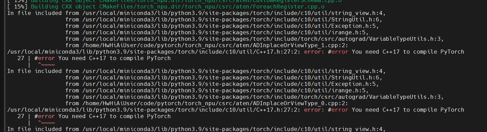

## CANN 学习——基于香橙派 KunpengPro

### 1 CANN

异构计算架构CANN（Compute Architecture for Neural Networks）是**昇腾针对AI场景推出的异构计算架构**，向上支持多种AI框架，包括MindSpore、PyTorch、TensorFlow等，向下服务AI处理器与编程。

#### 1.1 CANN 总体架构

CANN 软件架构：


CANN 向上对接各种深度学习框架，向下对接driver 驱动和 AI 处理器。

CANN 主要包含六部分：

* GE图引擎（ Graph Engine），是**计算图编译和运行的控制中心**，提供**图优化、图编译管理以及图执行控制**等功能。GE通过统一的图开发接口提供多种AI框架的支持，**不同AI框架的计算图可以实现到Ascend图的转换**。

* Ascend C算子开发语言，是CANN针对算子开发场景推出的**编程语言**，**原生支持C和C++标准规范**，最大化匹配用户开发习惯；通过多层接口抽象、**自动并行计算**、孪生调试等关键技术，极大提高算子开发效率，助力AI开发者低成本完成算子开发和模型调优部署。

* AOL算子加速库（Ascend Operator Library），提供了丰富的深度优化、硬件亲和的高性能算子，**包括神经网络（Neural Network，NN）库**、**线性代数计算库（Basic Linear Algebra Subprograms，BLAS）**等，为神经网络在昇腾硬件上加速计算奠定了基础。

* HCCL集合通信库（Huawei Collective Communication Library），是基于昇腾硬件的高性能集合通信库，提供**单机多卡以及多机多卡间的数据并行**、**模型并行**集合通信方案。HCCL支持**AllReduce、Broadcast、Allgather、ReduceScatter、AlltoAll**等通信原语，**Ring、Mesh、HD**等通信算法，在HCCS、RoCE和PCIe高速链路实现集合通信。

* BiSheng Compiler毕昇编译器，提供**Host-Device异构编程编译**能力，利用微架构精准编译优化释放昇腾AI处理器性能，提供**完备二进制调试信息与二进制工具链**，支撑AI开发者自主调试调优。

* Runtime运行时，提供了高效的**硬件资源管理**、**媒体数据预处理**、**单算子加载执行**、**模型推理**等开发接口，供开发者轻松构建高性能人工智能应用。


统一的API框架，实现对所有资源的调用。

CANN针对训练任务提供了完备的支持，针对**PyTorch**、**TensorFlow**等开源框架网络模型，CANN提供了**模型迁移工具**，支持将其快速迁移到昇腾平台。此外，CANN还提供了多种自动化调测工具，支持**数据异常检测、融合异常检测、整网数据比对**等，帮助开发者高效问题定位。


#### 1.2 CANN 软件安装

安装驱动固件和CANN开发套件包Toolkit。

这里基于 香橙派 KunpengPro（310B4），在 ubuntu 物理机上安装，用来尝试 训练&推理&开发调试。安装方案如下：


由于 昇腾NPU驱动 和 NPU 固件系统中已经有了，并且香橙派也有提供喜爱能够赢得安装包，这里便不再赘述。这里主要安装Toolkit（CANN开发套件包）和Kernels（CANN二进制算子包）。

CANN开发套件包，在训练&推理&开发调试场景下安装，主要用于训练和推理业务、模型转换、算子/应用/模型的开发和编译；CANN二进制算子包，提供了静态库，并能够节省算子编译时间，在大模型推理、训练场景，使用静态库编译应用程序，和运行包含动态shape网络或单算子API（例如aclnn类API）相关业务。


#### 1.2.1 下载安装包

在升腾社区下载 310b 对应的 kernels 和 Toolkit 安装包：

https://www.hiascend.com/zh/developer/download/community/result?module=cann

Kernels:


Toolkit:


#### 1.2.2 安装

* 配置最大线程数

训练场景下，OS的最大线程数可能不满足训练要求，需执行以下命令修改最大线程数为无限制：
```bash
# 配置环境变量，修改线程数为无限制，编辑“/etc/profile”文件，在文件的最后添加如下内容后保存退出：
ulimit -u unlimited
```

执行如下命令使环境变量生效:
```bash
source /etc/profile
```

* 安装Toolkit开发套件包

增加对软件包的可执行权限，校验软件包安装文件的一致性和完整性:
```bash
chmod +x Ascend-cann-toolkit_8.0.0.alpha002_linux-aarch64.run
./Ascend-cann-toolkit_8.0.0.alpha002_linux-aarch64.run --check
```

出现如下回显信息，表示软件包校验成功:
```bash
Verifying archive integrity...  100%   SHA256 checksums are OK. All good.
```

安装软件包:
```bash
./Ascend-cann-toolkit_8.0.0.alpha002_linux-aarch64.run --install
```

安装完成后，若显示如下信息，则说明软件安装成功：
```bash
xxx install success
```

配置环境变量，根据set_env.sh的实际安装路径进行替换:
```bash
source /home/HwHiAiUser/Ascend/ascend-toolkit/set_env.sh
```
也可以将 `source /home/HwHiAiUser/Ascend/ascend-toolkit/set_env.sh` 添加到`~/.bashrc`里面。


安装后检查。执行如下命令查询CANN版本信息，查询结果与安装软件包的版本一致时，则验证安装成功:
```bash
cd /usr/local/Ascend/ascend-toolkit/latest/aarch64-linux
cat ascend_toolkit_install.info
```

* 安装Kernels算子包

Kernels算子包安装之前，需已安装配套版本的Toolkit并配置环境变量，请使用同一用户安装。

增加对软件包的可执行权限，校验软件包安装文件的一致性和完整性：
```bash
chmod +x Ascend-cann-kernels-310b_8.0.0_linux-aarch64.run
./Ascend-cann-kernels-310b_8.0.0_linux-aarch64.run --check
```

出现如下回显信息，表示软件包校验成功:
```bash
Verifying archive integrity...  100%   SHA256 checksums are OK. All good.
```

安装除静态库之外的其他文件，请执行如下命令：
```bash
./Ascend-cann-kernels-310b_8.0.0_linux-aarch64.run --install
```

安装所有文件，包括静态库和动态库，请执行如下命令：
```bash
./Ascend-cann-kernels-310b_8.0.0_linux-aarch64.run --devel
```

安装完成后，若显示如下信息，则说明软件安装成功：
```bash
xxx install success
```

* 安装后检查

执行如下命令查询软件版本信息，查询结果与安装软件包的版本一致时，则验证安装成功,进入软件包安装信息文件目录:
```bash
cd /home/HwHiAiUser/Ascend/ascend-toolkit/latest/opp_kernel
cat version.info
```


### 2 Ascend Extension for PyTorch 配置与安装

将 PyTorch 网络迁移到昇腾平台并执行训练或推理，直接使用昇腾提供的构图接口构图。Ascend Extension for PyTorch插件用于适配PyTorch框架，可以使用昇腾AI处理器的算力。

#### 2.1 pip 安装

```bash
# 下载PyTorch安装包
wget https://download.pytorch.org/whl/cpu/torch-2.1.0-cp39-cp39-manylinux_2_17_aarch64.manylinux2014_aarch64.whl
# 下载torch_npu插件包
wget https://gitee.com/ascend/pytorch/releases/download/v6.0.rc3-pytorch2.1.0/torch_npu-2.1.0.post8-cp39-cp39-manylinux_2_17_aarch64.manylinux2014_aarch64.whl

# 安装命令
pip3 install torch-2.1.0-cp39-cp39-manylinux_2_17_aarch64.manylinux2014_aarch64.whl
pip3 install torch_npu-2.1.0.post8-cp39-cp39-manylinux_2_17_aarch64.manylinux2014_aarch64.whl
```

注：
* 如果下载whl包时出现`ERROR: cannot verify gitee.com's certificate`报错，可在下载命令后加上`--no-check-certificate`参数避免此问题
* 执行如下命令，若返回True则说明安装成功
```bash
python3 -c "import torch;import torch_npu;print(torch_npu.npu.is_available())"
```

* 若Pytorch版本为2.1.0，出现`找不到google或者protobuf或者protobuf版本过高`报错时，需执行如下命令：
```bash
pip install protobuf==3.20
```


#### 2.2 源码安装


##### 2.2.1 源码编译安装PyTorch框架

* Get the PyTorch Source
```bash
git clone --recursive https://github.com/pytorch/pytorch
cd pytorch
# if you are updating an existing checkout
git submodule sync
git submodule update --init --recursive
```

* Install Dependencies
```bash
conda install cmake ninja
# Run this command from the PyTorch directory after cloning the source code using the “Get the PyTorch Source“ section below
pip install -r requirements.txt

pip install mkl-static mkl-include
# CUDA only: Add LAPACK support for the GPU if needed
conda install -c pytorch magma-cuda121  # or the magma-cuda* that matches your CUDA version from https://anaconda.org/pytorch/repo

# (optional) If using torch.compile with inductor/triton, install the matching version of triton
# Run from the pytorch directory after cloning
# For Intel GPU support, please explicitly `export USE_XPU=1` before running command.
make triton
```

* Install PyTorch
```bash
export _GLIBCXX_USE_CXX11_ABI=1
# Only run this if you're compiling for ROCm
python tools/amd_build/build_amd.py

export CMAKE_PREFIX_PATH="${CONDA_PREFIX:-'$(dirname $(which conda))/../'}:${CMAKE_PREFIX_PATH}"
python setup.py develop
```


##### 2.2.2 源码编译安装torch_npu插件

**源码物理机编译**

编译安装适用于进行算子适配开发、CANN版本与PyTorch兼容适配场景，`PyTorch 2.1.0`。

* 安装依赖
```bash
apt-get install -y patch build-essential libbz2-dev libreadline-dev wget curl llvm libncurses5-dev libncursesw5-dev xz-utils tk-dev liblzma-dev m4 dos2unix libopenblas-dev git 
apt-get install -y gcc==10.2.0 cmake==3.18.0
```

* 编译生成torch_npu插件的二进制安装包
```bash
# 下载对应PyTorch版本分支代码
git clone -b v2.1.0-6.0.rc3 https://gitee.com/ascend/pytorch.git 
cd pytorch

# 编译生成二进制安装包
# 指定Python版本编包方式，以Python3.9为例，其他Python版本请使用--python=3.8、--python3.10或--python3.11
bash ci/build.sh --python=3.9
```

在编译过程中报错：


这个报错在v6.0.rc1.alpha002-pytorch2.0.1版本中就存在：


在 issue 中看到：gcc版本需要使用10.2.0，10.5.0 也可
```bash
sudo add-apt-repository ppa:ubuntu-toolchain-r/test
sudo apt-get update
sudo apt-get install -y gcc-10 g++-10
sudo update-alternatives --install /usr/bin/gcc gcc /usr/bin/gcc-10 10
sudo update-alternatives --install /usr/bin/g++ g++ /usr/bin/g++-10 10
sudo update-alternatives --config gcc
```

遇到新的报错：



***看来只能用 docker 了***


* 安装`pytorch/dist`目录下生成的插件`torch_npu`包，如果使用非root用户安装，需要在命令后加`--user`
```bash
# 用户根据实际情况更改命令中的torch_npu包名
pip3 install --upgrade 
```


**docker**

* 下载torch_npu源码
```bash
git clone https://gitee.com/ascend/pytorch.git -b v2.1.0-6.0.rc3 --depth 1  
```

* 构建镜像

```bash
cd pytorch/ci/docker/ARM
docker build -t manylinux-builder:v1 .
```

* 进入Docker容器，并将torch_npu源代码挂载至容器内
```bash
docker run -it -v /home/HwHiAiUser/code/pytorch:/home/HwHiAiUser/code/pytorch manylinux-builder:v1 bash
```

* 编译生成二进制安装包

```bash
cd /home/HwHiAiUser/code/pytorch 
bash ci/build.sh --python=3.8
```

* 在运行环境中安装生成的插件torch_npu包，如果使用非root用户安装，需要在命令后加--user
```bash
# 请用户根据实际情况更改命令中的torch_npu包名
pip3 install --upgrade dist/torch_npu-2.1.0.post8-cp39-cp39-linux_aarch64.whl
```


##### 2.2.3 验证成功安装

验证是否安装成功，可执行如下命令：
```bash
python3 -c "import torch;import torch_npu; a = torch.randn(3, 4).npu(); print(a + a);"
```

显示如下类似信息证明PyTorch框架与插件安装成功:
```bash
tensor([[-0.6066,  6.3385,  0.0379,  3.3356],
        [ 2.9243,  3.3134, -1.5465,  0.1916],
        [-2.1807,  0.2008, -1.1431,  2.1523]], device='npu:0')
```


### 3 pytorch 模型迁移

通用模型迁移适配可以分为四个阶段：迁移分析、迁移适配、精度调试与性能调优。


* 迁移分析
    迁移支持度分析：
    * 准备NPU环境，获取模型的源码、权重和数据集等文件；
    * 使用迁移分析工具采集目标网络中的模型/算子清单，识别第三方库及目标网络中算子支持情况，分析模型迁移的可行性；
    * 在迁移支持度分析中如果存在平台未支持的算子，可通过修改模型脚本，使用等价支持的算子替换的方式解决，或者进行算子适配

* 迁移适配
    * 通过模型脚本迁移，实现GPU -> NPU的接口替换、NPU分布式框架改造；
    * 配置训练相关环境变量，以保证模型训练可以在昇腾NPU上正常运行；根据实际场景选择相应操作完成模型脚本和启动脚本配置；
    * 数据类型为BF16或FP32的模型训练；混合使用单精度（float32）与半精度(float16)数据类型
    * 保存模型文件用于在线推理，使用模型文件导出ONNX模型通过ATC工具将其转换为适配昇腾AI处理器的.om文件用于离线推理

* 精度调试
    * 确保迁移前后模型精度差异在可接受范围之内，数据无异常溢出；如果出现精度相关问题，需要借助精度问题分析工具分析

* 性能调优
    * 在NPU环境上，使用性能分析工具介绍对模型进行性能拆解；基于性能拆解得到的数据，分析瓶颈模块，明确性能优化方向
    * 数据加载加速、模型代码亲和适配、内存优化、融合算子、融合优化器；通信优化


#### 3.1 迁移分析

进行模型迁移之前，需要做以下准备与分析工作：
* 选取合适的模型，在三方平台运行成功，并获取精度/性能基线
* 在昇腾设备上搭建环境，并使用迁移分析工具分析模型在昇腾设备上的支持度

分析流程：


##### 3.1.1 模型选取与约束说明


* 模型选取
在选取迁移模型时，尽可能选取权威PyTorch模型实现仓，包括但不限于PyTorch(imagenet/vision等)、facebookresearch(Detectron/detectron2等)、open-mmlab(MMDetection/mmpose等)。

对于大模型，使用较为广泛的资源仓库是huggingface社区、Megatron-LM、Llama-Factory等仓库。

* 约束说明

    * 迁移前要保证选定的模型能在GPU或CPU上运行，并输出精度和性能基线
    * 模型迁移前需要完成昇腾PyTorch训练环境安装，以完成迁移支持度分析与后续的模型训练
        包括NPU驱动固件、CANN软件toolkit、二进制算子包以及PyTorch框架的安装

* 目前已知的不支持场景：
    * 不支持使用DP（distributed parallel）模式的模型迁移。若用户训练脚本中包含昇腾NPU平台不支持的torch.nn.parallel.DataParallel接口，则需手动修改该接口为torch.nn.parallel.DistributedDataParallel接口，以执行多卡训练。原脚本需要在GPU环境下基于Python3.8及以上跑通。
    * APEX库中的FusedAdam融合优化器，目前不支持使用自动迁移或PyTorch GPU2Ascend工具迁移该优化器，需用户手工进行迁移
    * 大模型迁移暂不支持bmtrain框架的迁移
    * 大模型迁移暂不支持使用了bitsandbytes的迁移
    * 大模型迁移暂不支持colossai三方库中HybridAdam优化器相关接口的迁移
    * 目前暂不原生支持xFormers训练，需要使用xFormers中的FlashAttentionScore融合算子的迁移
    * 当前NPU不支持grouped_gemm第三方库安装
    * 当前NPU支持composer第三方库安装，但NPU未做适配，无法使用


#### 3.2 迁移适配

迁移适配流程总体可分为模型脚本迁移、环境变量和脚本配置和关键特性适配三部分，主要包含以下工作：

* 模型脚本迁移：把三方平台上的PyTorch模型代码映射到昇腾设备上。推荐使用自动迁移，通过导入一键迁移库的形式，将三方平台上的代码映射为昇腾设备代码。
    * 自动迁移：在训练脚本中导入脚本转换库，然后拉起脚本执行训练。**训练脚本在运行时，会自动将脚本中的CUDA接口替换为昇腾AI处理器支持的NPU接口。整体过程为边训练边转换。**
    * 工具迁移：使用迁移工具（pytorch_gpu2npu或PyTorch GPU2Ascend），自动将训练脚本中的CUDA接口替换为昇腾AI处理器支持的NPU接口，并生成迁移报告（脚本转换日志、不支持算子的列表、脚本修改记录）。训练时，运行转换后的脚本。**整体过程为先转换脚本，再进行训练。**
    * 手工迁移：通过分析模型，对比GPU与NPU接口，手动对训练脚本进行修改，以支持在昇腾AI处理器上执行训练。
        * 定义NPU为训练设备，将训练脚本中适配GPU的接口切换至适配NPU的接口。
        * 多卡迁移需修改芯片间通信方式为昇腾支持的hccl。
* 环境变量和脚本配置：在昇腾设备上运行PyTorch模型代码时，必须的适配操作，包括环境变量配置和模型脚本与启动脚本配置。
* 关键特性适配：在昇腾设备上运行PyTorch模型代码时，可选的适配操作。用户需要查看特性是否适用于当前训练场景与设备，根据具体情况选择性适配。


#### 3.2.1 模型脚本迁移


