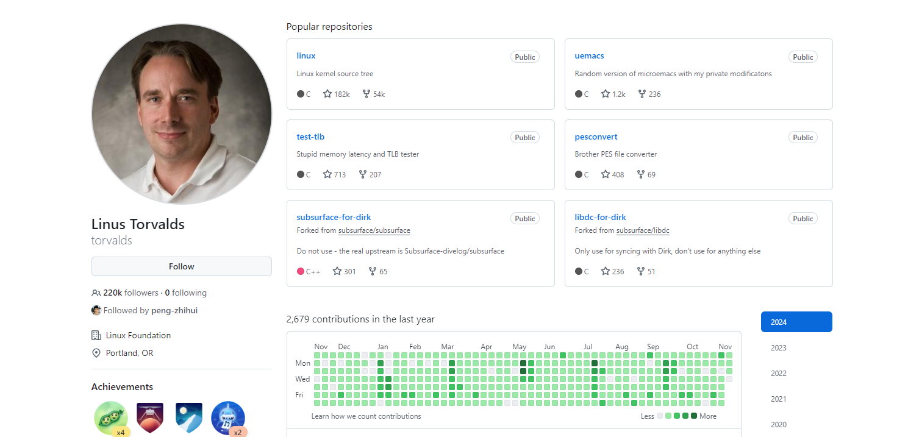
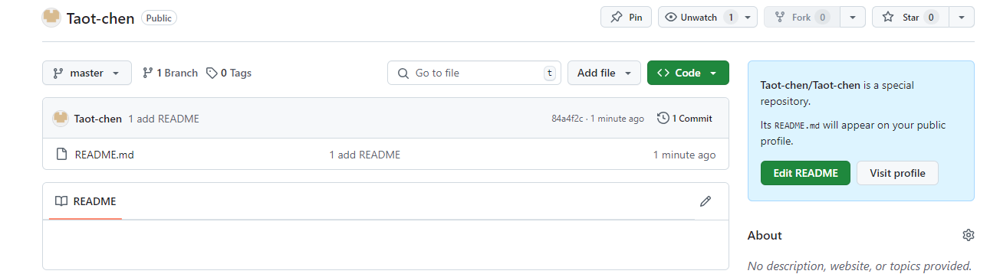
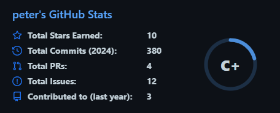
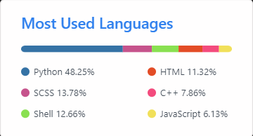
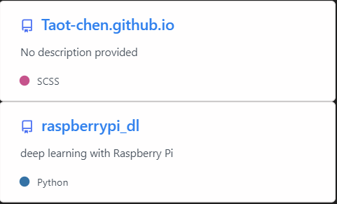
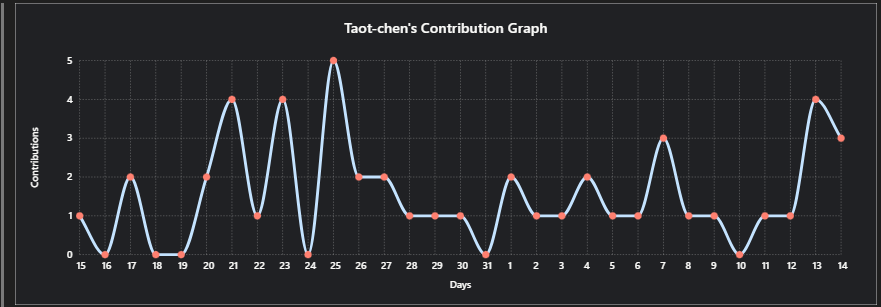
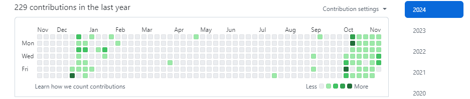
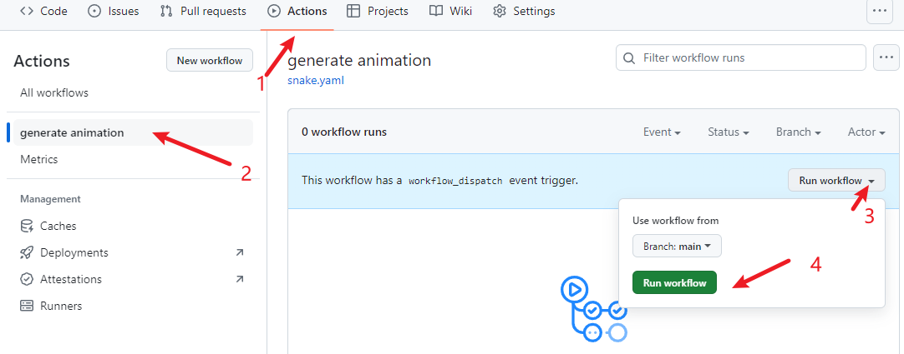
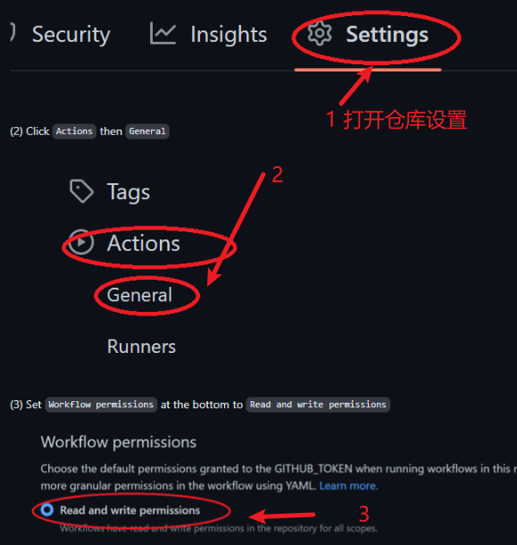
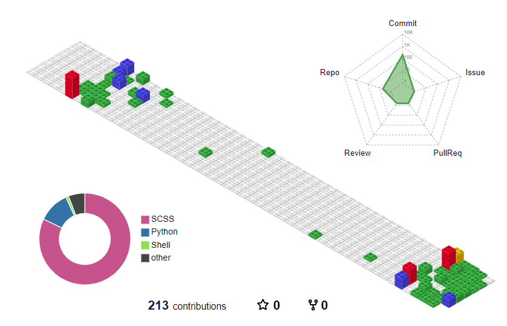

## github 个人主页配置

Guthub 个人主页 （官方称呼是 profile）可以展示很多有用的信息，例如添加一个首页被访问次数的计数器，一个被 Star 与 Commit 的概览信息，以及各种技能标签，设备标签等，还可以利用 wakatime 显示你最近编码各类语言的使用时长。

默认的主页会显示其仓库信息、提交信息，例如 [Linux 之父 Linus 的 GitHub 主页](https://github.com/torvalds) 长这样：


Github 关于主页定制的说明文档：[Setting up and managing your GitHub profile](https://docs.github.com/en/account-and-profile/setting-up-and-managing-your-github-profile)


### 1 原理

在 GitHub 上新建一个仓库，仓库名和自己 Github 用户名相同，然后添加一个 README.md 自述文件，在该文件里添加信息即可。

这是我的仓库：https://github.com/Taot-chen/Taot-chen

仓库建好后，添加一个 README.md 文件，此时可以看到右上角有个提示：

```bash
Taot-chen/Taot-chen is a special repository.

Its README.md will appear on your public profile.
```



### 2 主页定制

接下来，就可以通过修改 README.md 来定制主页了。

首先可以找一个好看的模板，修改信息作为自己的主页。例如：
* [awesome-github-profile-readme](https://github.com/abhisheknaiidu/awesome-github-profile-readme)
* [awesome-github-profiles](https://github.com/EddieHubCommunity/awesome-github-profiles)
* [beautify-github-profile](https://github.com/rzashakeri/beautify-github-profile)

#### 2.1 GitHub 统计卡片

* 项目地址：[github-readme-stats](https://github.com/anuraghazra/github-readme-stats)


* 使用：在 README 文件中添加如下代码，`?username=`​ 的值修改为 GitHub 用户名：
```bash

```
显示图标、主题样式等配置可以参考官网文档。

* 效果：

  

#### 2.2 GitHub 使用语言统计

* 项目地址：[github-readme-stats](https://github.com/anuraghazra/github-readme-stats)
* 使用：在 README 文件中添加如下代码，`?username=`​ 的值修改为 GitHub 用户名：
```bash

```

* 效果：



#### 2.3 GitHub Gist Pins

* 项目地址：[github-readme-stats](https://github.com/anuraghazra/github-readme-stats)
* 使用：在 README 文件中添加如下代码，`?username=`​ 的值修改为 GitHub 用户名，`href` 的值改为对应 github 项目的地址：
```bash
<a href="https://github.com/Taot-chen/Taot-chen.github.io">
  


<a href="https://github.com/Taot-chen/raspberrypi_dl">
  
```

* 效果：



#### 2.4 GitHub 资料奖杯

* 项目地址：[github-profile-trophy](https://github.com/ryo-ma/github-profile-trophy)

* 使用：在 README 文件中添加如下代码，`?username=`​ 的值修改为 GitHub 用户名：
```bash
[](https://github.com/ryo-ma/github-profile-trophy)
```

* 效果：


#### 2.5 GitHub 徽章

为 github 开源项目生成高质量小徽章图标，直接复制链接使用。

* 项目地址：[Shields.io](https://shields.io/)

* 使用：在 README 文件中添加如下代码:
```bash
 
 

```

* 效果：


#### 2.6 GitHub 访客徽章

这个徽章会实时改变，记录此页面被访问的次数。

* 项目地址：[visitor-badge.glitch.me](https://visitor-badge.glitch.me/)

* 使用：在 README 文件中添加如下代码，`page_id=`​ 的值修改为 GitHub 用户名：
```bash

```

* 效果：


#### 2.7 GitHub 活动统计图

动态生成的活动图，用于显示过去 31 天的 GitHub 活动。

* 项目地址：[github-readme-activity-graph](https://github.com/Ashutosh00710/github-readme-activity-graph/)

* 使用：在 README 文件中添加如下代码,`?username=`​ 的值修改为 GitHub 用户名：
```bash

```

* 效果：



#### 2.8 修仙系列统计卡片

一个以凡人修仙传境界为基础的 Github 统计卡片。等级分为：['道祖', '大罗', '太乙', '金仙', '真仙', '大乘', '合体', '炼虚', '化神', '元婴', '金丹', '筑基', '练气']，对应区间：[1, 5, 10, 15, 20, 30,40,50,60, 70, 80, 90, 100]。


* 项目地址：[github-immortality](https://github.com/IceEnd/github-immortality)

* 使用：在 README 文件中添加如下代码,`?username=`​ 的值修改为 GitHub 用户名：
```bash

```


#### 2.9 GitHub 连续打卡

在 README 中展示连续提交代码的次数。

* 项目地址：[github-readme-streak-stats](https://github.com/DenverCoder1/github-readme-streak-stats)

* 使用：在 README 文件中添加如下代码,`?username=`​ 的值修改为 GitHub 用户名：
```bash

```

#### 2.10 社交统计

在 README 中展示在一些流行的网站的数据，例如知乎，GitHub，B 站，LeetCode，掘金，CSDN，牛客。

* 项目地址：[stats-cards](https://github.com/songquanpeng/stats-cards)

* 使用：在 README 文件中添加如下代码,`username=`​ 的值为那个网站的用户名：
```bash

```


#### 2.11 star 趋势

统计和展示自己某个项目的 star 趋势。


* 项目地址：[star-history.t9t.io](https://star-history.t9t.io/)

* 使用：输入仓库名，就能自动生成 star 增长曲线。还能输入多个仓库查看项目对比。


#### 2.12 GitHub Corners：分享角标

如果你的 GitHub 项目有一个对应的网站，并且想要用户通过网站跳转到 GitHub 项目页从而得到 star，不防试试这个。

* 项目地址：[github-corners](https://tholman.com/github-corners)

* 使用：它可以帮你生成给网站添加 GitHub 角标的代码，只需要选择一个风格，复制代码到自己的项目主页文件中，将超链接替换为自己的仓库地址即可。


#### 2.13 打字特效

让内容通过打字的特效来展示。

* 项目地址：[readme-typing-svg](https://github.com/DenverCoder1/readme-typing-svg)

* 使用：复制代码到 Markdown 并替换 `?lines=`​ 的值为你想要的内容，字与字之间用加号隔开：
```bash

```


#### 2.14 贪吃蛇

默认的提交信息是这样的：


可以将其变成一个动画：一只贪吃蛇挨个吃掉图里的绿点。

* 新建一个 workflow 文件（名字随意），不需要任何改动，然后提交：
```bash
name: generate animation

on:
  # run automatically every 2 hours
  schedule:
    - cron: "0 */2 * * *" 
  
  # allows to manually run the job at any time
  workflow_dispatch:
  
  # run on every push on the master branch
  push:
    branches:
    - master
  
  

jobs:
  generate:
    permissions: 
      contents: write
    runs-on: ubuntu-latest
    timeout-minutes: 5
  
    steps:
      # generates a snake game from a github user (<github_user_name>) contributions graph, output a svg animation at <svg_out_path>
      - name: generate github-contribution-grid-snake.svg
        uses: Platane/snk/svg-only@v3
        with:
          github_user_name: ${{ github.repository_owner }}
          outputs: |
            dist/github-contribution-grid-snake.svg
            dist/github-contribution-grid-snake-dark.svg?palette=github-dark
  
  
      # push the content of <build_dir> to a branch
      # the content will be available at https://raw.githubusercontent.com/<github_user>/<repository>/<target_branch>/<file> , or as github page
      - name: push github-contribution-grid-snake.svg to the output branch
        uses: crazy-max/ghaction-github-pages@v3.1.0
        with:
          target_branch: output
          build_dir: dist
        env:
          GITHUB_TOKEN: ${{ secrets.GITHUB_TOKEN }}
```

* 将下列代码复制到 Markdown 内，将用户名部分替换成自己的，并提交
```bash
<picture>
  <source media="(prefers-color-scheme: dark)" srcset="https://raw.githubusercontent.com/Taot-chen/Taot-chen/output/github-contribution-grid-snake-dark.svg">
  <source media="(prefers-color-scheme: light)" srcset="https://raw.githubusercontent.com/Taot-chen/Taot-chen/output/github-contribution-grid-snake.svg">
  
</picture>
```

这段代码的目的是：加载贪吃蛇动画，且贪吃蛇的暗亮风格与你的 Github 的暗亮风格进行自动适配。

前面的 workflow 里面设置的是每隔 2 小时更新一次，可以先手动跑一次。点击 generate animation​，点击 Run workflow​：


稍等片刻，显示运行成功，再次回到仓库主页就会看到贪吃蛇动画已被加载。


#### 2.15 博客文章同步

如果你有博客网站，且网站带有 RSS 功能，就可以配置此功能，它能在你的 GitHub 首页上显示最近更新的博客。

* 原理：利用 [blog-post-workflow](https://github.com/gautamkrishnar/blog-post-workflow) 在自述文件上展示最近几篇博客文章。

* 使用
  * 创建一个 workflow（例如 blog-post-workflow.yml​ ），需要改动最后一行的 feed_list​ 的内容为你自己网站的 RSS 链接。
    ```bash
    name: Latest blog post workflow
    on:
      schedule: # Run workflow automatically
        - cron: '0 */2 * * *' # Runs every hour, on the hour
      workflow_dispatch: # Run workflow manually (without waiting for the cron to be called), through the GitHub Actions Workflow page directly
    permissions:
      contents: write # To write the generated contents to the readme

    jobs:
      update-readme-with-blog:
        name: Update this repo's README with latest blog posts
        runs-on: ubuntu-latest
        steps:
          - name: Checkout
            uses: actions/checkout@v3
          - name: Pull in blog's posts
            uses: gautamkrishnar/blog-post-workflow@v1
            with:
              feed_list: "https://taot-chen.github.io/rss.xml"
    ```
  
  * 然后在自述文件输入这些内容，程序会自动抓取文章标题、链接等并替换这两个注释：
  ```bash
  📕 &nbsp;**Latest Blog Posts**
  <!-- BLOG-POST-LIST:START -->
  <!-- BLOG-POST-LIST:END -->
  ```

  * 与贪吃蛇同理，此时是看不到文章列表的，得先手工运行一次 action，稍等片刻，显示运行成功，再次回到仓库主页就会看到生效了。


#### 2.16 GitHub 3D 统计

使用 3D 图来展示信息。

* 项目地址：[github-profile-3d-contrib](https://github.com/yoshi389111/github-profile-3d-contrib)

* 使用：用 GitHub Action。首先创建文件 .github/workflows/profile-3d.yaml​，内容如下：

```bash
name: GitHub-Profile-3D-Contrib

on:
  schedule: # 03:00 JST == 18:00 UTC
    - cron: "0 18 * * *"
  workflow_dispatch:

jobs:
  build:
    runs-on: ubuntu-latest
    name: generate-github-profile-3d-contrib
    steps:
      - uses: actions/checkout@v3
      - uses: yoshi389111/github-profile-3d-contrib@0.7.1
        env:
          GITHUB_TOKEN: ${{ secrets.GITHUB_TOKEN }}
          USERNAME: ${{ github.repository_owner }}
      - name: Commit & Push
        run: |
          git config user.name github-actions
          git config user.email github-actions@github.com
          git add -A .
          git commit -m "generated"
          git push
```

* 然后手动执行一次 action：Actions​ -> GitHub-Profile-3D-Contrib​ -> Run workflow​

* 然后会生成这些文件（带路径，各种主题的都有）：
  * profile-3d-contrib/profile-green-animate.svg​
  * profile-3d-contrib/profile-green.svg​
  * profile-3d-contrib/profile-season-animate.svg​
  * profile-3d-contrib/profile-season.svg​
  * profile-3d-contrib/profile-south-season-animate.svg​
  * profile-3d-contrib/profile-south-season.svg​
  * profile-3d-contrib/profile-night-view.svg​
  * profile-3d-contrib/profile-night-green.svg​
  * profile-3d-contrib/profile-night-rainbow.svg​
  * profile-3d-contrib/profile-gitblock.svg​
‍

* 最后在 Markdown 里添加即可
```bash
<picture>
  <source media="(prefers-color-scheme: dark)" srcset="/profile-3d-contrib/profile-night-rainbow.svg" />
  <source media="(prefers-color-scheme: light)" srcset="/profile-3d-contrib/profile-gitblock.svg" />
  
</picture>
```

* 报错解决：
```bash
remote: Permission to mthsBelloni/mthsBelloni.git denied to github-actions[bot].
fatal: unable to access 'https://github.com/Taot-chen/Taot-chen/': The requested URL returned error: 403
Error: Process completed with exit code 128.
```
大概率是因为没有配置 actions 的写权限，导致无​法写入 svg 文件。添加权限即可：



* 效果



#### 2.17 感谢参与者


每位开源项目的参与者都值得记录和感谢，传统方式是手工编辑，项目负责人一个一个地把参与者的名字记录到 README.md，非常低效。

可以使用一种更高效、自动化的方式来添加项目贡献者。

* 项目地址：[allcontributors.org](https://allcontributors.org/)
* 使用：可以用命令行或者机器人的方式自动将项目的贡献者补充到项目文档中，并且生成排版精美的表格。

