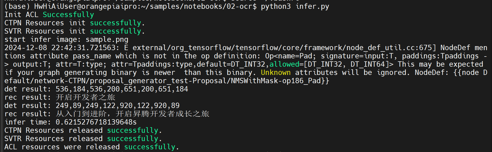
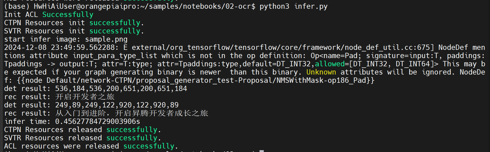

## 香橙派 Kunpengpro NPU 超频提升AI算力

香橙派 Kunpengpro 的 CPU 频率为 1GHz，NPU 频率为 500MHz，NPU 的 INT8 AI 算力为 8TOPS。

香橙派官方为香橙派 AIPRO 提供了将 CPU 超频至 1.6GHz 的固件；另外还提供了同时将 CPU 超频到 1.6GHz 和将 NPU 超频到 750MHz 的固件，这个固件可以将 NPU 的 INT8 AI 算力为 12TOPS。

香橙派 KungpengPro、AIPRO 是香橙派的不同的基于昇腾AI路线的人工智能开发板，官方为他们提供的固件是通用的，因此可以使用后者的超频固件来超频香橙KunpengPro。

### 1 KunpengPro CPU 超频至 1.6GHz

#### 1.1 CPU 超频

首先在香橙派官网**香橙派 AIPRO**的[下载页面](http://www.orangepi.cn/html/hardWare/computerAndMicrocontrollers/service-and-support/Orange-Pi-AIpro.html)下载官方工具里面的`Ascend310B-firmware固件包`。
* 将`Ascend310B-firmware-7.3.t3.0.b309-rc-signed-8t-1.6ghz-20240428.run`上传到OPi AI Pro开发板的Linux系统中；
* 然后添加执行权限：
```bash
chmod +x Ascend310B-firmware-7.3.t3.0.b309-rc-signed-8t-1.6ghz-20240428.run
```
* 然后运行`./Ascend310B-firmware-7.3.t3.0.b309-rc-signed-8t-1.6ghz-20240428.run --full`命令更新固件
* 然后输入小写的 y 确认开始更新
* 更新完成后的打印输出如下所示：
```bash
Firmware package installed successfully! Reboot now or after driver installation for the installation/upgrade to take effect.
```
* 然后断电重启即可使用新的 1.6GHz 的固件

*注：这里的命令需要以 root 权限执行。*

可以通过查看 npu 的 device log 来查看是否成功超频：
```bash
cat /var/log/npu/slog/device-0/device-0* | grep "aicore freq"

[INFO] LPM(-1,null):1970-01-01-00:00:15.565000 [avs] [AvsProfileLimitUpdate 55] profile[0] aicore freq[500] cpu freq[1600] config done
```
从上面的 log 中可以看出来，NPU 频率依然为 500MHz，cpu 频率超频到 1600MHz 了。


#### 1.2 AI 性能测试

KunpengPro 的系统内提供了一些 CV 的网络示例，这里以`02-ocr`作为性能标准版来跑。
```bash
cd /home/HwHiAiUser/samples/notebooks/02-ocr
```
修改`infer.py`，添加推理时间计算：
```python
import cv2
import tqdm
from PIL import Image, ImageDraw

from model import CTPN, SVTR
from utils import get_images_from_path, img_read

import IPython
import time

def init_acl(device_id=0):
    acl.init()
    ret = acl.rt.set_device(device_id)
    if ret:
        raise RuntimeError(ret)
    context, ret = acl.rt.create_context(device_id)
    if ret:
        raise RuntimeError(ret)
    print('Init ACL Successfully')
    return context


def deinit_acl(context, device_id=0):
    ret = acl.rt.destroy_context(context)
    if ret:
        raise RuntimeError(ret)

    ret = acl.rt.reset_device(device_id)
    if ret:
        raise RuntimeError(ret)
    print('ACL resources were released successfully.')


def get_images_from_path(img_path):
    img_list = []
    if os.path.isfile(img_path):
        img_list.append(img_path)
    if os.path.isdir(img_path):
        for file in os.listdir(img_path):
            img_list.append(os.path.join(img_path, file))
    return img_list


def img_read(path):
    path = os.path.realpath(path)
    img = cv2.imread(path, cv2.IMREAD_COLOR)
    if img is None:
        raise ValueError(f"cannot decode file:{path}")
    return img


CTPN_MODEL_PATH = './ctpn.om'
SVTR_MODEL_PATH = './svtr.om'
SVTR_DICT_PATH = './ppocr_keys_v1.txt'
DEVICE_ID = 0

context = init_acl(DEVICE_ID)
det_model = CTPN(model_path=CTPN_MODEL_PATH, device_id=DEVICE_ID)
rec_model = SVTR(model_path=SVTR_MODEL_PATH, dict_path=SVTR_DICT_PATH,
                     device_id=DEVICE_ID)
IMAGE_PATH = './sample.png'

if not os.path.exists('infer_result'):
    os.makedirs('infer_result')
ans = {}

start = time.time()
img_src = img_read(IMAGE_PATH)
basename = os.path.basename(IMAGE_PATH)
print(f'start infer image: {basename}')
name, ext = os.path.splitext(basename)
image_h, image_w = img_src.shape[:2]

det_input_tensor = det_model.preprocess(img_src)

output = det_model.infer(det_input_tensor)

bboxes = det_model.postprocess(output)
im = Image.open(IMAGE_PATH)
draw = ImageDraw.Draw(im)
ans['image_name'] = basename
ans['result'] = []
for bbox in bboxes:
    bbox_detail = {}
    x1 = int(bbox[0] / det_model.model_width * image_w)
    y1 = int(bbox[1] / det_model.model_height * image_h)
    x2 = int(bbox[2] / det_model.model_width * image_w)
    y2 = int(bbox[3] / det_model.model_height * image_h)
    draw.line([(x1, y1), (x1, y2), (x2, y2), (x2, y1), (x1, y1)], fill='red', width=2)
    bbox_detail['bbox'] = [x1, y1, x1, y2, x2, y2, x2, y1]
    res  = ','.join(map(str,bbox_detail['bbox']))
    print(f'det result: {res}')
    crop_img = img_src[y1:y2, x1:x2]

    rec_input_tensor = rec_model.preprocess(crop_img)
    rec_output = rec_model.infer(rec_input_tensor)
    bbox_detail['text'] = rec_model.postprocess(rec_output)
    print(f'rec result: {bbox_detail["text"]}')
    ans['result'].append(bbox_detail)

im.save(os.path.join('infer_result', name + '_res' + ext))
end = time.time()
print(f"infer time: {str(end - start)}s")

IPython.display.Image(filename=os.path.join('infer_result', name + '_res' + ext))

det_model.deinit()
rec_model.deinit()
deinit_acl(context, DEVICE_ID)
```

输出结果：


此时的推理耗时 0.62s。


### 2 KunpengPro CPU 超频至 1.6GHz 并且 NPU 超频至 750MHz(12TOPS)

#### 2.1 CPU & NPU 超频

首先在香橙派官网**香橙派 AIPRO**的[下载页面](http://www.orangepi.cn/html/hardWare/computerAndMicrocontrollers/service-and-support/Orange-Pi-AIpro.html)下载官方工具里面的`Ascend310B-firmware固件包`。
* 将`Ascend310B-firmware-7.3.t3.0.b309-rc-signed-8t-1.6ghz-20241022.run`上传到OPi AI Pro开发板的Linux系统中；
* 然后添加执行权限：
```bash
chmod +x Ascend310B-firmware-7.3.t3.0.b309-rc-signed-8t-1.6ghz-20241022.run
```
* 然后运行`./Ascend310B-firmware-7.3.t3.0.b309-rc-signed-8t-1.6ghz-20241022.run --full`命令更新固件
* 然后输入小写的 y 确认开始更新
* 更新完成后的打印输出如下所示：
```bash
Firmware package installed successfully! Reboot now or after driver installation for the installation/upgrade to take effect.
```
* 然后断电重启系统
* 重启系统后使用下面的命令切换到12T的AI算力档位：
```bash
sudo npu-smi set -t nve-level -i 0 -c 0 -d 1
        Status                         : OK
        Message                        : The nve-level of the chip is set successfully.
```

* 然后重启系统

*注：这里的命令需要以 root 权限执行。*

可以通过查看 npu 的 device log 来查看是否成功超频：
```bash
cat /var/log/npu/slog/device-0/device-0* | grep "aicore freq"

[INFO] LPM(-1,null):1970-01-01-00:00:15.135000 [avs] [AvsProfileLimitUpdate 55] profile[1] aicore freq[750] cpu freq[1600] config done
```
从上面的 log 中可以看出来，NPU 频率依然为 750MHz，cpu 频率超频到 1600MHz 了。

#### 2.2 AI 性能测试

```bash
cd /home/HwHiAiUser/samples/notebooks/02-ocr
python3 infer.py
```

输出结果：


此时的推理耗时 0.45s。
