## triton get started

Triton 基于 python 的 DSL，面向 GPU 体系特点，自动分析和实施神经网路计算的分块，triton 既是语言，也是编译器。

### 0 Triton 理解

TVM、XLA 等框架能实现从模型到硬件的端到端的优化：

* 起点是深度学习模型，之后模型被转换成计算图，即一种数据结构，用于表示模型中的所有操作和他们之间的数据依赖关系。
* 在图表示的基础上，编译器应用多种优化策略来提高性能，例如合并操作，消除冗余
* 优化后的计算图会被转换成一系列的内核(kernel)，是实际执行计算的代码
* 最终，将 kernel 部署到目标设备上执行

多数情况下，TVM/XLA 生成的代码性能不如供应商算子库。

triton 通过提供领域特定的语言和编译器，直接面向底层的 kernel 开发和编译优化问题，使得开发者能够以更高抽象层次编写高效的 GPU kernel，从而提升性能。

与 CUDA 相比，triton 拥有更易用的编程模型，可以简化 GPU 的编程过程。在从 model 到 device 的过程中，triton 位于 kernel这个层次，实际上就是大量算子和多种数据类型的组合。


#### 0.1 triton 编译器的流程

Triton 兼容 pytorch 等框架:

* 可以通过 inductor 后端，降级为 triton kernel
* 具体流程：
    * pytorch 中的深度学习模型，经过`torch.dynamo`得到 fx 计算图，后经过`inductor`后端生成 triton 代码；
    * 之后会进行基于 MLIR 的多层中间表示与优化，包括`triton Dialect`，`triton GPU Dialect`等
        * `triton Dialect`，公共子表达式消除，死代码消除等优化
        * `triton GPU dialect`，流水线 pipeline，数据预取 prefetch 等优化
    * 利用 LLVM 生成不同硬件平台的高效可执行代码


### 1 triton 安装

#### 1.1 pip 安装

```bash
pip install triton
```
这里没什么说的，没报错就安装成功了，报错了再根据报错信息解决即可。


#### 1.2 源码安装

目前测试 torch 2.3.0 + triton 3.1.0 的组合式可以使用的，其他的版本组合没有测试。

* 环境版本：
```bash
Ubuntu 22.04.5 LTS x86_64
Python 3.10.16
cuda 12.2
triton 3.2.x(基于库上最新代码: https://github.com/triton-lang/triton)
triton 对应分支 origin/release/3.2.x，commit: 35c6c7c6284582b3f41c71c150e11b517acf074a
```

* triton 源码下载
```bash
git clone https://github.com/triton-lang/triton.git
# git clone git@github.com:triton-lang/triton.git
```

* 虚拟环境
```bash
cd triton
git check origin/release/3.1.x
conda create -n triton python=3.10
conda activate triton
# python -m venv .venv --prompt triton
# source ~/.venv/bin/activate
python3 -m pip install ninja cmake wheel
python3 -m pip install scipy numpy pytest lit pandas matplotlib
```

* 下载 llvm 源码
```bash
# 获取与当前 triton 版本适配的 llvm 分支
cat /path/to/triton/cmake/llvm-hash.txt
# 这里可以获取一个 hash 值 hash-str

git clone https://github.com/llvm/llvm-project
# git clone git@github.com:llvm/llvm-project.git
cd llvm-project
git checkout hash-str
```

* 编译 llvm
```bash
mkdir build && cd build
cmake -G Ninja -DCMAKE_BUILD_TYPE=Release -DLLVM_ENABLE_ASSERTIONS=ON ../llvm -DLLVM_ENABLE_PROJECTS="mlir;llvm" -DLLVM_TARGETS_TO_BUILD="host;NVPTX;AMDGPU"
ninja -j32
```

* 构建 triton
```bash
export LLVM_BUILD_DIR=/path/to/llvm-project/build
cd /path/to/triton
LLVM_INCLUDE_DIRS=$LLVM_BUILD_DIR/include
LLVM_LIBRARY_DIR=$LLVM_BUILD_DIR/lib
LLVM_SYSPATH=$LLVM_BUILD_DIR
pip install -e python
# pip install -e python
```

*注：这里在执行 `pip install -e python` 这一命令的时候，需要下载安装部分依赖，但是由于网络问题，可能会下载非常慢，会在 `Building editable for triton (pyproject.toml) ... -` 这里卡很久。*

*实际上，这里在卡住的时候，可以看到网卡是有较低的数据流量的。*


上面的环境变量也可以写在文件中：
```bash
cd /path/to/triton
vim env
# 以下内容添加到文件中
export LLVM_BUILD_DIR=/path/to/llvm-project/build
LLVM_INCLUDE_DIRS=$LLVM_BUILD_DIR/include
LLVM_LIBRARY_DIR=$LLVM_BUILD_DIR/lib
LLVM_SYSPATH=$LLVM_BUILD_DIR

# 之后运行
source ./env
```


#### 1.3 测试

* 验证安装
```bash
cd /path/to/triton/python/tutorials
python3 01-vector-add.py

# 输出，可以看到 triton 的输出结果与 torch 的结果一致，且性能接近，在某些 size 下，triton 还具有更好的性能
tensor([1.3713, 1.3076, 0.4940,  ..., 1.1495, 0.9265, 1.1323], device='cuda:0')
tensor([1.3713, 1.3076, 0.4940,  ..., 1.1495, 0.9265, 1.1323], device='cuda:0')
The maximum difference between torch and triton is 0.0
vector-add-performance:
           size      Triton       Torch
0        4096.0   12.000000   12.190476
1        8192.0   23.813955   28.444444
2       16384.0   51.200001   52.067795
3       32768.0   97.523810   96.755900
4       65536.0  166.054047  160.627450
5      131072.0  255.999991  250.775518
6      262144.0  348.595753  334.367350
7      524288.0  433.057275  402.472881
8     1048576.0  472.615390  467.002371
9     2097152.0  510.670140  505.744062
10    4194304.0  525.865604  524.637757
11    8388608.0  535.625424  535.807890
12   16777216.0  540.619226  542.507197
13   33554432.0  542.729481  545.080577
14   67108864.0  543.034000  546.127409
15  134217728.0  543.356430  546.578161
```

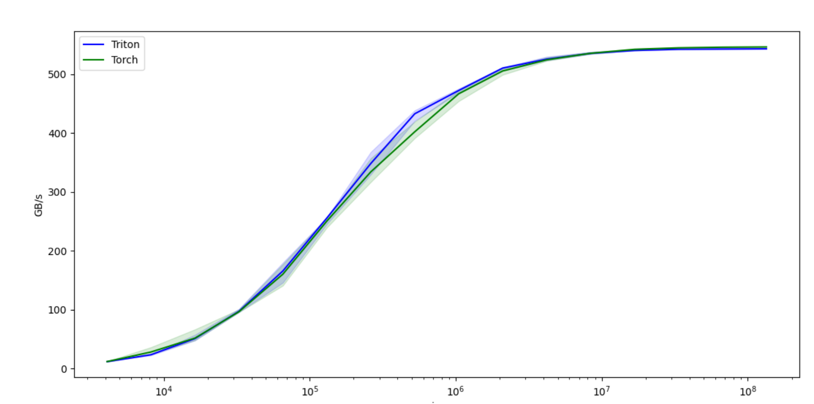


* 通过运行单元测试对安装情况进行测试：
```bash
pip install -e '.[tests]'
pytest -vs test/unit/
```

* Benchmarks
```bash
cd bench
python3 -m run --with-plots --result-dir /tmp/triton-bench
```

### 2 triton 程序

#### 2.1 riton 常用 API 语法

常见的 triton API 语法：https://triton-lang.org/main/index.html

##### 2.1.1 triton

* `triton.jit`：装饰器，用于使用 triton 编译器对函数进行 jit 编译，该函数将在 GPU 上编译和运行
    * 使用 jit 编译器的函数只能访问 **python 基元**、**triton 包内的内置函数**、**该函数的参数**以及**其他 jit 函数**
* `triton.autotune`：评估所有配置
    * kernel 将会运行多次，最终使用最好的配置进行执行
    * 常见的配置：num_warps、num_stages，块的大小
* `triton.heuristics`：作用类似 `autotune`,但是允许根据输入参数动态计算元参数，提供 triton 内核的灵活性
* `triton.config`：表示 `autotune`要尝试的可能内核配置
    * 配置内容：num_warps、num_stages，块的大小

##### 2.1.2 常用 math op

* abs：绝对值
* cidv：除法，并对结果向上取整
* ceil：向上取整
* cos：余弦函数
* sin：正弦函数
* softmax：激活函数，将输入值转换为概率分布，所有输出总和为 1
* sqrt：算术平方根


##### 2.1.3 debug ops

* 编译时的 API：
    * `static_print`：打印编译时的数值
    * `static_assert`：打印编译时的断言
* 运行时的 API：
    * `device_print`：打印运行时的数值
    * `device_assert`：打印运行时的断言
*注：在 triton 的 kernel 中，只能使用 debug api 进行打印，如果使用`print`打印会直接报错*


#### 2.2 官网 triton 程序示例：`01-vector-add`

##### 2.2.1 向量加法 kernel

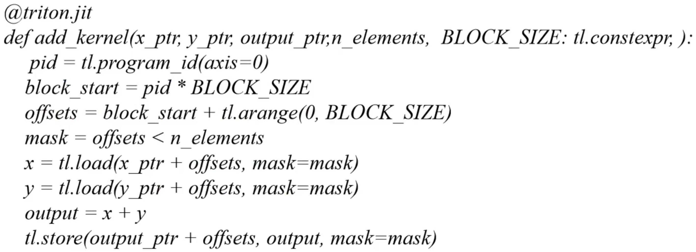

* x_ptr/y_ptr：输入的两个向量指针，计算他们的加法，并把结果存放在`output_ptr`中
* n_elements：要处理的元素数量
* BLOCK_SIZE：块的大小
* tl.constexpr：告诉编译器，这个参数是一个常量，值在编译时就已经确定，对于优化内核性能和生成高效代码有用
* tl.program_id(axis=0)：获取当前线程块的 ID，`axis=0`表示沿着第一个维度获取线程块 ID
* block_start = pid * BLOCK_SZIE：计算当前块在全局数组中的起始索引
* offsets：当前块内所有线程的全局索引
* mask：bool 数组，用于标识那些索引在有效范围内，避免访问越界

*注：在 triton 中，计算的最小单位是**块**，在 cuda 中，最小单位是**线程***


##### 2.2.2 调用内核函数

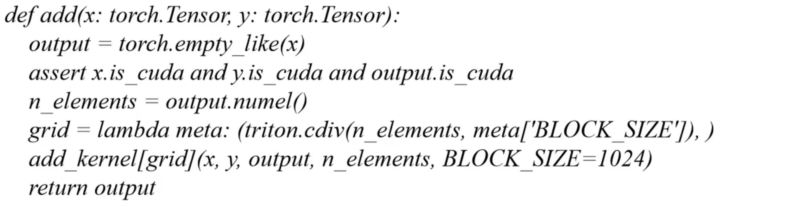

* lambda 函数 grid：用于计算网格的大小
* 使用 网格函数 grid 启动内核函数


编译运行：
```bash
cd /path/to/triton/python/tutorials
python3 01-vector-add.py
```


### 3 triton 源码结构

#### 3.1 triton 3.0.0 源码结构

* triton
    * docs/：项目文档
    * cmake/：构建配置相关
    * bin/：工具、脚本
    * CmakeLists.txt：cmake 配置文件
    * LSCENSE
    * README.md
    * Pyproject.toml：python 项目配置文件
    * utils/：项目配置文件目录
    * unittest/：单元测试代码
    * third_party/：第三方资源
        * amd/
        * f2reduce/
        * nvidia/
        * proton/
    * test/：测试代码
    * python/：python 接口代码
    * lib/：核心逻辑实现，`.cc/.cpp`，核心功能的具体实现
        * Analysis：相关分析
            * Alias.cpp：内存别名分析
            * Allocation.cpp：共享内存分配相关分析
            * Axisinfo.cpp：轴分析相关
            * Membar.cpp：线程同步、内存屏障相关
        * Conversion：dialect 之间的转换
            * TritonGPUToLLVM：tritonGPU dialect 降级到 LLVM dialect
            * TritonToTritonGPU：triton dialect 降级到 tritonGPU dialect
        * Dialect：各级中间表示 dialect 的定义，以及在对应 dialect 上进行的优化 pass
            * triton
                * IR：dialect/算子/属性/类型的定义
                * Transforms：相应中间表示上的优化 pass
                    * Combine.cpp：优化 select 和 load 操作的组合
                    * ReorderBroadcast.cpp：将**通过 broad 和乘法生成的规约操作**优化为**点积操作**
            * tritonGPU
            * TritonNvidiaGPU
        * Target：将 llvm dialect 降级到 llvm ir，为 llvm ir 添加元数据，链接外部数学库
            * LLVMIR
        * Tools：辅助工具头文件，分析、调试、优化生成的代码
        CMakeLists.txt
    * include/：核心逻辑定义，核心功能的`.h`头文件，提供约定和规范
        * triton
            * Analysis
                * Alias.h
                * ...
            * Conversion
                * TritonGPUToLLVM
                * TritonToTritonGPU
            * Dialect
                * triton
                * tritonGPU
                * TritonNvidiaGPU
            * Target
                * LLVMIR
            * Tools
        * CMakeLists.txt

        CMakeLists.txt

*注：transforms 用于各级 dialect 之上，conversion 用于各级 dialect 之间*

编译流程对应源码位置：

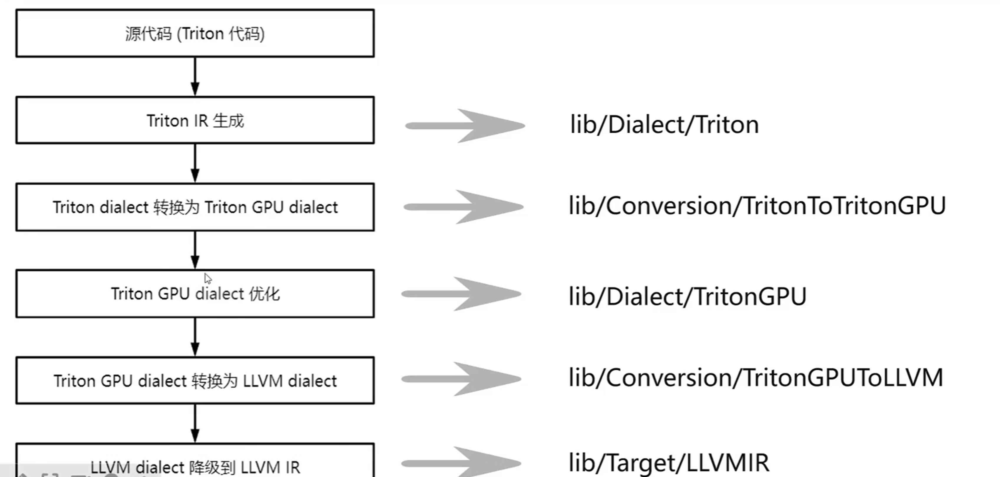


#### 3.2 常用源码位置

**Triton dialect：**
* OP 定义：include/triton/Dialect/IR/TritonOps.td
    * tt.call
    * tt.func
    * tt.return
    * tt.load
    * tt.store
    * tt.dot
    * ...
* 优化 pass：lib/Dialect/Triton/Transforms
    * CombineOpsPass
    * ReorderBroadcastPass
    * RewriterTensorPointerPass
    * LoopUnrollPass

**triton dialect --> tritonGPU Dialect:**
* 转换 pass：lib/Conversion/TritonToTritonGPU/TritonToTritonGPUPass.cpp

**TritonGPU Dialect:**
* Op 定义：include/triton/Dialect/TritonGPU/IR/TritonGPUOps.td
    * async_wait
    * alloc_tensor
    * insert_slice_async
    * convert_Layout
    * ...
* Layout 属性定义：include/triton/Dialect/TritonGPU/IR/TritonGPUAttrDefs.td
    * Blocked Layout
    * MMA Layout
    * DotOperand Layout
    * Slice Layout
    * Shared Layout
* 优化 pass：lib/Dialect/TritonGPU/Transforms
    * AccelerateMatmul
    * Coalesce
    * CombineTensorSelectAndIf


### 4 Triton 编译器架构

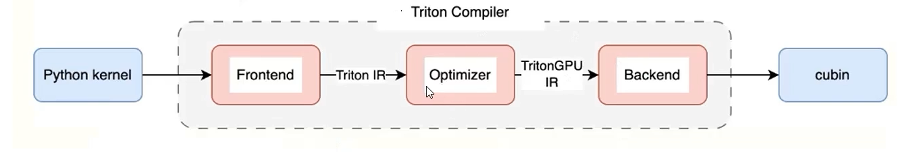

* 前端：将用户使用 python 编写的 kernel 或者 pytorch2.0 中通过 inductor 后端生成的 triton kernel 转换成对应的 triton IR，并维护 kernel launch 的 runtime
* 优化器：通过各类 PASS 将 triton IR 逐步转换并优化为 TritonGPU IR
* 后端：将 TritonGPU IR 逐步转换为 LLVm IR, nvidia 后端最终会编译为 cubin（通过 ptxas 编译为 cubin）


#### 4.1 Triton 编译流程

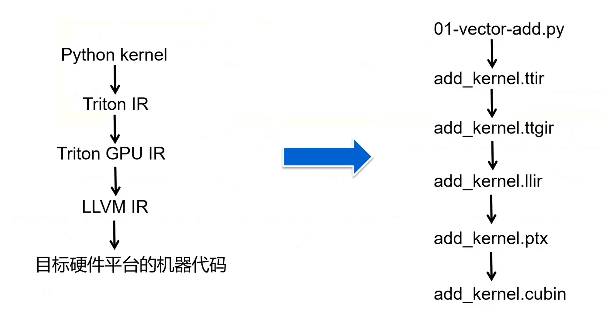

在 triton 编译过程中，程序（python kernel）首先会被转换成 triton IR(ttir)，之后根据目标硬件的特点进行优化，转换成 tritonGPU IR(ttgir)，优化后的 tritonGPU IR 可以转换成 LLVM IR（llir），然后利于llvm 的优化和代码生成能力生成可以在目标硬件平台上执行的高效代码，在 NVIDIA 平台上，后续会依次转换成 ptx 文件和 cubin 文件。


#### 4.2 Triton IR

Triton IR 是 Triton 编译器的高级中间表示，用于表示深度学习模型的计算图，并且是硬件无关的。特点：
* 高级抽象，Triton IR 使用接近于高级深度学习框架的方式来描述计算图
* 操作表示，包含了一些列的操作（矩阵乘、卷积、激活函数等）
* 优化，在 Triton IR 阶段，可以进行一些高级优化（硬件无关的优化，死代码消除、常量折叠等）
* 转换，Triton IR 可以被转换为与硬件更接近 TritonGPU IR，以便进一步的优化（硬件相关的优化）


#### 4.3 TritonGPU IR

TritonGPU IR 是 Triton 编译器的低级中间表示，专门针对 GPU 硬件优化。特点：
* 硬件特定优化，针对特定GPU架构的优化（内存访问模式、线程布局等）
* 并行性表示，如线程块，网格等
* 性能优化，TritonGPU IR层面，可以进行更细致的性能优化（内存访问优化等）
* 转换为 LLVM IR

#### 4.4 LLVM IR

* LLVM IR 是平台无关的，可以在不同的平台上使用，LLVM 提供了多种后端来生成特定平台的机器代码；
* LLVM 提供了大量的优化通道，可以在 LLVM IR 层面提供指令组合等优化
* LLVM IR 最终会被转换为特定硬件平台的机器代码，LLVM 提供了多种后端（X86,、ARM、NVIDIA GPU等）
* LLVM IR 是模块化的，可以表示程序的各个部分，如函数、全局变量、类型等

**LLVM IR 是一个线程内的所有操作，Triton IR 和 TritonGPU IR 是一个 block（线程块）内的所有操作。**


#### 4.5 中间 IR 生成

```bash
cd /path/to/triton/python/tutorials
python3 01-vector-add.py
cd ~/.triton/cache/
# 该目录下有三个目录分别存放：add_kernel.so, cuda_utils.so, 各阶段的 IR
```
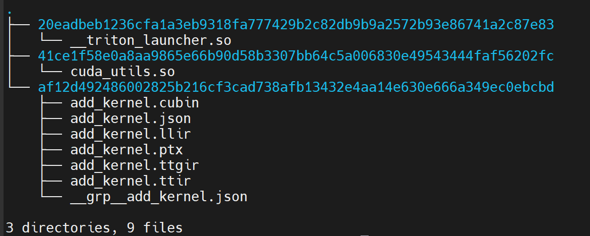

如上图所示，各个阶段的 IR 主要是 ttir、ttgir，llir，ptx，以及 cubin。另外，还有一个命名为 add_kernel.json 的文件

* `add_kernel.json`：这个 Kernel 文件里面没有具体的计算 Kernel，里面主要是硬件的相关信息，以及 triton_kernel 的位置等信息等
```bash
{"hash": "6a0974e99961b63def8c8c7c7c254db87ed20f648a0b0fc62da85201c0f2c3d7", "target": {"backend": "cuda", "arch": 75, "warp_size": 32}, "num_warps": 4, "num_ctas": 1, "num_stages": 3, "maxnreg": null, "cluster_dims": [1, 1, 1], "ptx_version": null, "enable_fp_fusion": true, "allow_fp8e4nv": false, "allow_fp8e4b15": true, "default_dot_input_precision": "tf32", "allowed_dot_input_precisions": ["tf32", "tf32x3", "ieee"], "max_num_imprecise_acc_default": 0, "extern_libs": [["libdevice", "/home/taot/code/triton-code/triton/python/triton/backends/nvidia/lib/libdevice.10.bc"]], "debug": null, "backend_name": "cuda", "shared": 0, "name": "add_kernel"}
```
* `add_kernel.ttir`：这个 Kernel 文件是 ttir 阶段的 Kernel，函数头里面包含了 triton_kernel 的 location 信息，Kernel 内部只要是使用 triton dialect 和 arith 等 dialect 对 triton_kernel 进行的翻译
```bash
#loc = loc("/home/taot/code/triton-code/triton/python/tutorials/01-vector-add.py":28:0)
module {
  tt.func public @add_kernel(%arg0: !tt.ptr<f32> {tt.divisibility = 16 : i32} loc("/home/taot/code/triton-code/triton/python/tutorials/01-vector-add.py":28:0), %arg1: !tt.ptr<f32> {tt.divisibility = 16 : i32} loc("/home/taot/code/triton-code/triton/python/tutorials/01-vector-add.py":28:0), %arg2: !tt.ptr<f32> {tt.divisibility = 16 : i32} loc("/home/taot/code/triton-code/triton/python/tutorials/01-vector-add.py":28:0), %arg3: i32 {tt.divisibility = 16 : i32} loc("/home/taot/code/triton-code/triton/python/tutorials/01-vector-add.py":28:0)) attributes {noinline = false} {
    %c1024_i32 = arith.constant 1024 : i32 loc(#loc1)
    %0 = tt.get_program_id x : i32 loc(#loc2)
    %1 = arith.muli %0, %c1024_i32 : i32 loc(#loc3)
    %2 = tt.make_range {end = 1024 : i32, start = 0 : i32} : tensor<1024xi32> loc(#loc4)
    %3 = tt.splat %1 : i32 -> tensor<1024xi32> loc(#loc5)
    %4 = arith.addi %3, %2 : tensor<1024xi32> loc(#loc5)
    %5 = tt.splat %arg3 : i32 -> tensor<1024xi32> loc(#loc6)
    %6 = arith.cmpi slt, %4, %5 : tensor<1024xi32> loc(#loc6)
    %7 = tt.splat %arg0 : !tt.ptr<f32> -> tensor<1024x!tt.ptr<f32>> loc(#loc7)
    %8 = tt.addptr %7, %4 : tensor<1024x!tt.ptr<f32>>, tensor<1024xi32> loc(#loc7)
    %9 = tt.load %8, %6 : tensor<1024x!tt.ptr<f32>> loc(#loc8)
    %10 = tt.splat %arg1 : !tt.ptr<f32> -> tensor<1024x!tt.ptr<f32>> loc(#loc9)
    %11 = tt.addptr %10, %4 : tensor<1024x!tt.ptr<f32>>, tensor<1024xi32> loc(#loc9)
    %12 = tt.load %11, %6 : tensor<1024x!tt.ptr<f32>> loc(#loc10)
    %13 = arith.addf %9, %12 : tensor<1024xf32> loc(#loc11)
    %14 = tt.splat %arg2 : !tt.ptr<f32> -> tensor<1024x!tt.ptr<f32>> loc(#loc12)
    %15 = tt.addptr %14, %4 : tensor<1024x!tt.ptr<f32>>, tensor<1024xi32> loc(#loc12)
    tt.store %15, %13, %6 : tensor<1024x!tt.ptr<f32>> loc(#loc13)
    tt.return loc(#loc14)
  } loc(#loc)
} loc(#loc)
#loc1 = loc(unknown)
#loc2 = loc("/home/taot/code/triton-code/triton/python/tutorials/01-vector-add.py":37:24)
#loc3 = loc("/home/taot/code/triton-code/triton/python/tutorials/01-vector-add.py":42:24)
#loc4 = loc("/home/taot/code/triton-code/triton/python/tutorials/01-vector-add.py":43:41)
#loc5 = loc("/home/taot/code/triton-code/triton/python/tutorials/01-vector-add.py":43:28)
#loc6 = loc("/home/taot/code/triton-code/triton/python/tutorials/01-vector-add.py":45:21)
#loc7 = loc("/home/taot/code/triton-code/triton/python/tutorials/01-vector-add.py":48:24)
#loc8 = loc("/home/taot/code/triton-code/triton/python/tutorials/01-vector-add.py":48:16)
#loc9 = loc("/home/taot/code/triton-code/triton/python/tutorials/01-vector-add.py":49:24)
#loc10 = loc("/home/taot/code/triton-code/triton/python/tutorials/01-vector-add.py":49:16)
#loc11 = loc("/home/taot/code/triton-code/triton/python/tutorials/01-vector-add.py":50:17)
#loc12 = loc("/home/taot/code/triton-code/triton/python/tutorials/01-vector-add.py":52:26)
#loc13 = loc("/home/taot/code/triton-code/triton/python/tutorials/01-vector-add.py":52:35)
#loc14 = loc("/home/taot/code/triton-code/triton/python/tutorials/01-vector-add.py":52:4)
```

* `add_kernel.ttgir`：ttgir 阶段的 IR，Kernel 内部的表示和 ttir 的基本一致，主要是使用 triton dialect 和 arith dialect 对 triton_kernel  翻译得到。在函数头部分，多出了描述硬件信息的 ` module attributes` 的部分，即 `triton_gpu` 的信息
```bash
#blocked = #triton_gpu.blocked<{sizePerThread = [4], threadsPerWarp = [32], warpsPerCTA = [4], order = [0]}>
#loc = loc("/home/taot/code/triton-code/triton/python/tutorials/01-vector-add.py":28:0)
module attributes {"triton_gpu.num-ctas" = 1 : i32, "triton_gpu.num-warps" = 4 : i32, triton_gpu.target = "cuda:75", "triton_gpu.threads-per-warp" = 32 : i32} {
  tt.func public @add_kernel(%arg0: !tt.ptr<f32> {tt.divisibility = 16 : i32} loc("/home/taot/code/triton-code/triton/python/tutorials/01-vector-add.py":28:0), %arg1: !tt.ptr<f32> {tt.divisibility = 16 : i32} loc("/home/taot/code/triton-code/triton/python/tutorials/01-vector-add.py":28:0), %arg2: !tt.ptr<f32> {tt.divisibility = 16 : i32} loc("/home/taot/code/triton-code/triton/python/tutorials/01-vector-add.py":28:0), %arg3: i32 {tt.divisibility = 16 : i32} loc("/home/taot/code/triton-code/triton/python/tutorials/01-vector-add.py":28:0)) attributes {noinline = false} {
    %c1024_i32 = arith.constant 1024 : i32 loc(#loc1)
    %0 = tt.get_program_id x : i32 loc(#loc2)
    %1 = arith.muli %0, %c1024_i32 : i32 loc(#loc3)
    %2 = tt.make_range {end = 1024 : i32, start = 0 : i32} : tensor<1024xi32, #blocked> loc(#loc4)
    %3 = tt.splat %1 : i32 -> tensor<1024xi32, #blocked> loc(#loc5)
    %4 = arith.addi %3, %2 : tensor<1024xi32, #blocked> loc(#loc5)
    %5 = tt.splat %arg3 : i32 -> tensor<1024xi32, #blocked> loc(#loc6)
    %6 = arith.cmpi slt, %4, %5 : tensor<1024xi32, #blocked> loc(#loc6)
    %7 = tt.splat %arg0 : !tt.ptr<f32> -> tensor<1024x!tt.ptr<f32>, #blocked> loc(#loc7)
    %8 = tt.addptr %7, %4 : tensor<1024x!tt.ptr<f32>, #blocked>, tensor<1024xi32, #blocked> loc(#loc7)
    %9 = tt.load %8, %6 : tensor<1024x!tt.ptr<f32>, #blocked> loc(#loc8)
    %10 = tt.splat %arg1 : !tt.ptr<f32> -> tensor<1024x!tt.ptr<f32>, #blocked> loc(#loc9)
    %11 = tt.addptr %10, %4 : tensor<1024x!tt.ptr<f32>, #blocked>, tensor<1024xi32, #blocked> loc(#loc9)
    %12 = tt.load %11, %6 : tensor<1024x!tt.ptr<f32>, #blocked> loc(#loc10)
    %13 = arith.addf %9, %12 : tensor<1024xf32, #blocked> loc(#loc11)
    %14 = tt.splat %arg2 : !tt.ptr<f32> -> tensor<1024x!tt.ptr<f32>, #blocked> loc(#loc12)
    %15 = tt.addptr %14, %4 : tensor<1024x!tt.ptr<f32>, #blocked>, tensor<1024xi32, #blocked> loc(#loc12)
    tt.store %15, %13, %6 : tensor<1024x!tt.ptr<f32>, #blocked> loc(#loc13)
    tt.return loc(#loc14)
  } loc(#loc)
} loc(#loc)
#loc1 = loc(unknown)
#loc2 = loc("/home/taot/code/triton-code/triton/python/tutorials/01-vector-add.py":37:24)
#loc3 = loc("/home/taot/code/triton-code/triton/python/tutorials/01-vector-add.py":42:24)
#loc4 = loc("/home/taot/code/triton-code/triton/python/tutorials/01-vector-add.py":43:41)
#loc5 = loc("/home/taot/code/triton-code/triton/python/tutorials/01-vector-add.py":43:28)
#loc6 = loc("/home/taot/code/triton-code/triton/python/tutorials/01-vector-add.py":45:21)
#loc7 = loc("/home/taot/code/triton-code/triton/python/tutorials/01-vector-add.py":48:24)
#loc8 = loc("/home/taot/code/triton-code/triton/python/tutorials/01-vector-add.py":48:16)
#loc9 = loc("/home/taot/code/triton-code/triton/python/tutorials/01-vector-add.py":49:24)
#loc10 = loc("/home/taot/code/triton-code/triton/python/tutorials/01-vector-add.py":49:16)
#loc11 = loc("/home/taot/code/triton-code/triton/python/tutorials/01-vector-add.py":50:17)
#loc12 = loc("/home/taot/code/triton-code/triton/python/tutorials/01-vector-add.py":52:26)
#loc13 = loc("/home/taot/code/triton-code/triton/python/tutorials/01-vector-add.py":52:35)
#loc14 = loc("/home/taot/code/triton-code/triton/python/tutorials/01-vector-add.py":52:4)
```

* `add_kernel.llir`：llvm ir 阶段的 IR，内部的计算表示使用的是 llvm 算子，也包含部分 asm 调用

* `add_kernel.ptx`：ptx 阶段的 IR，由 LLVM 的 NVPTX 后端生成，里面包含硬件的信息，计算表示都是类似汇编的指令，这个现在还看不太懂

* `add_kernel.cubin`：这个就是 NVIDIA 平台的可执行文件了，没法看了

#### 4.6 Pytorch 通过 Inductor 后端生成 TritonKernel

`torch_triton_kernel.py`

```python
import torch

def model(input):
    a = torch.add(input, input)
    b = torch.sin(a)
    c = torch.sqrt(b)
    return c

new_model = torch.compile(model, backend="inductor")

input = torch.rand((333, 444, 555), dtype=torch.float16)
output = new_model(input)
```

运行命令：`TORCH_COMPILE_DEBUG=1 python3 torch_triton_kernel.py`

*注：torch 版本 2.3.0 测试 OK，2.5.1 会有些问题*

终端会打印一堆信息，里面包含了 kernel 路径：

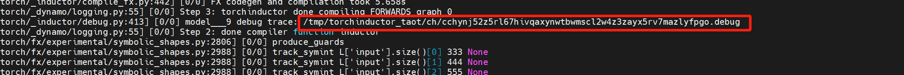

这个路径下会存放中间各个阶段的代码：


其中的`output_code.py`就是生成的 kernel：

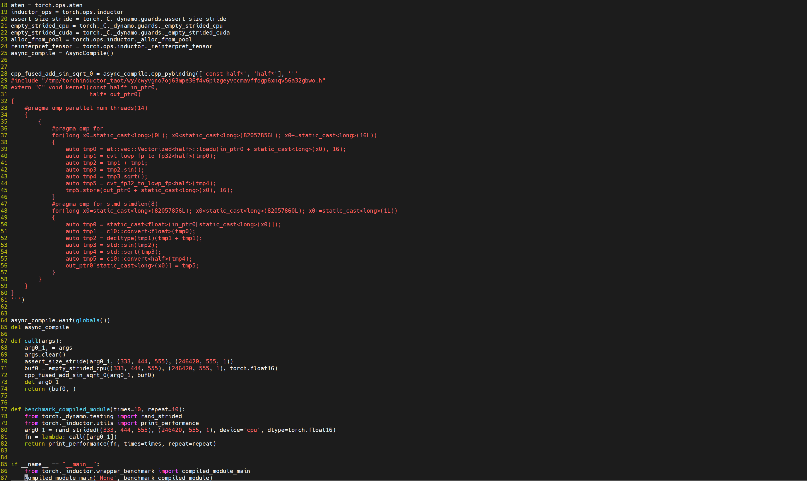


另外，在执行脚本的路径下会把 torch dynamo 和 torch inductor 的 log 保存在 `torch_compile_debug/` 下面，除此之外，中间各个阶段的代码也都会存放在 `torch_compile_debug/`下面。

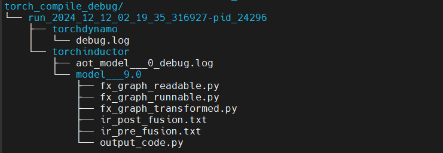


**triton编译过程不会产生cuda c, 但是会直接产生cuda c编译的中间产物 llvm ir。**


### 5 Triton 调试

需要源码安装 debug 版本才能进行调试。可以编译生成 whl 包。

常用调试工具：
* PDB
* GDB
* Debug Ops

**PDB 常用命令：**
* 启动 PDB：代码中插入`import pdb; pdb.set_trace()`，程序执行到此处自动进入调试模式
* `l`(list): 列出当前行代码
* `n`(next)：执行下一行代码
* `s`(step)：单步执行，进入函数内部执行
* `c`(continue)：继续执行直到遇到下一个断点
* `p`(print)：打印变量值
* `q`(quit)：退出调试模式

**GDB 常用命令：**
* 启动 GDB：对于 Triton 程序，`gdb -args python3 xxx.py`
* `b`(break): 设置断点，例如 `b main`，在 main 函数处设置断点；`b xxx.cpp:100`, 在 xxx.cpp 100行处打断点
* `r`(run)：运行程序
* `n`(next)：执行下一行代码
* `s`(step)：单步执行，进入函数内部执行
* `c`(continue)：继续执行直到遇到下一个断点
* `p`(print)：打印变量值
* `q`(quit)：退出 GDB


#### 5.1 常用调试命令

triton 官方提供的一些调试方法：
* `MLIR_ENABLE_DUMP=1`，打印 kernel 每一个 pass 前后的 IR，如果不起作用，可以先清理 triton cache

```bash
MLIR_ENABLE_DUMP=1 python3 01-vector-add.py &> 01.log
```

* `LLVM_IR_ENABLE_DUMP=1`，对每个 pass 运行 LLVM IR 之前，打印 IR

打印格式如下：

```bash
// -----// IR Dump Before Inliner (inline) ('builtin.module' operation) //----- //
#loc = loc("/home/taot/code/triton-code/triton/python/tutorials/01-vector-add.py":28:0)
module {
  tt.func public @add_kernel(%arg0: !tt.ptr<f32> {tt.divisibility = 16 : i32} loc("/home/taot/code/triton-code/triton/python/tutorials/01-vector-add.py":28:0), %arg1: !tt.ptr<f32> {tt.divisibility = 16 : i32} loc("/home/taot/code/triton-code/triton/python/tutorials/01-vector-add.py":28:0), %arg2: !tt.ptr<f32> {tt.divisibility = 16 : i32} loc("/home/taot/code/triton-code/triton/python/tutorials/01-vector-add.py":28:0), %arg3: i32 {tt.divisibility = 16 : i32} loc("/home/taot/code/triton-code/triton/python/tutorials/01-vector-add.py":28:0)) attributes {noinline = false} {
    %0 = tt.get_program_id x : i32 loc(#loc1)
    %c1024_i32 = arith.constant 1024 : i32 loc(#loc2)
    %1 = arith.muli %0, %c1024_i32 : i32 loc(#loc2)
    %2 = tt.make_range {end = 1024 : i32, start = 0 : i32} : tensor<1024xi32> loc(#loc3)
    %3 = tt.splat %1 : i32 -> tensor<1024xi32> loc(#loc4)
    %4 = arith.addi %3, %2 : tensor<1024xi32> loc(#loc4)
    %5 = tt.splat %arg3 : i32 -> tensor<1024xi32> loc(#loc5)
    %6 = arith.cmpi slt, %4, %5 : tensor<1024xi32> loc(#loc5)
    %7 = tt.splat %arg0 : !tt.ptr<f32> -> tensor<1024x!tt.ptr<f32>> loc(#loc6)
    %8 = tt.addptr %7, %4 : tensor<1024x!tt.ptr<f32>>, tensor<1024xi32> loc(#loc6)
    %9 = tt.load %8, %6 : tensor<1024x!tt.ptr<f32>> loc(#loc7)
    %10 = tt.splat %arg1 : !tt.ptr<f32> -> tensor<1024x!tt.ptr<f32>> loc(#loc8)
    %11 = tt.addptr %10, %4 : tensor<1024x!tt.ptr<f32>>, tensor<1024xi32> loc(#loc8)
    %12 = tt.load %11, %6 : tensor<1024x!tt.ptr<f32>> loc(#loc9)
    %13 = arith.addf %9, %12 : tensor<1024xf32> loc(#loc10)
    %14 = tt.splat %arg2 : !tt.ptr<f32> -> tensor<1024x!tt.ptr<f32>> loc(#loc11)
    %15 = tt.addptr %14, %4 : tensor<1024x!tt.ptr<f32>>, tensor<1024xi32> loc(#loc11)
    tt.store %15, %13, %6 : tensor<1024x!tt.ptr<f32>> loc(#loc12)
    tt.return loc(#loc13)
  } loc(#loc)
} loc(#loc)
#loc1 = loc("/home/taot/code/triton-code/triton/python/tutorials/01-vector-add.py":37:24)
#loc2 = loc("/home/taot/code/triton-code/triton/python/tutorials/01-vector-add.py":42:24)
#loc3 = loc("/home/taot/code/triton-code/triton/python/tutorials/01-vector-add.py":43:41)
#loc4 = loc("/home/taot/code/triton-code/triton/python/tutorials/01-vector-add.py":43:28)
#loc5 = loc("/home/taot/code/triton-code/triton/python/tutorials/01-vector-add.py":45:21)
#loc6 = loc("/home/taot/code/triton-code/triton/python/tutorials/01-vector-add.py":48:24)
#loc7 = loc("/home/taot/code/triton-code/triton/python/tutorials/01-vector-add.py":48:16)
#loc8 = loc("/home/taot/code/triton-code/triton/python/tutorials/01-vector-add.py":49:24)
#loc9 = loc("/home/taot/code/triton-code/triton/python/tutorials/01-vector-add.py":49:16)
#loc10 = loc("/home/taot/code/triton-code/triton/python/tutorials/01-vector-add.py":50:17)
#loc11 = loc("/home/taot/code/triton-code/triton/python/tutorials/01-vector-add.py":52:26)
#loc12 = loc("/home/taot/code/triton-code/triton/python/tutorials/01-vector-add.py":52:35)
#loc13 = loc("/home/taot/code/triton-code/triton/python/tutorials/01-vector-add.py":52:4)


// -----// IR Dump Before Canonicalizer (canonicalize) ('tt.func' operation: @add_kernel) //----- //
#loc = loc("/home/taot/code/triton-code/triton/python/tutorials/01-vector-add.py":28:0)
module {
...
```

* `TRITON_PRINT_AUTOTINING=1`，打印 kernel 的最优配置和总时间


#### 5.2 triton-opt，triton-translate

Triton 源码编译后提供的工具 triton-opt，triton-translate，调试之前需要将 triton-opt，triton-translate 路径添加到环境变量中，也可以直接用 triton-opt，triton-translate 的路径（`/path/to/triton/python/build/cmake.linux-x86_64-cpython-3.10/bin`）直接用来调试。

* triton-opt
```bash
triton-opt xxx.ttir -convert-triton-to-tritongpu &>xxx.ttgir    # 将 ttir 降级为 ttgir
triton-opt xxx.ttgir -某个优化编译选项 &>xxx-opt.ttgir      # 在 ttgir 层面执行某个特定优化
triton-opt --help
```

在 gdb 中调用 triton-opt：
```bash
gdb triton-opt      # 启动 gdb
b aaa.cpp:111       # 打断点
r xxx.ttir -convert-triton-to-tritongpu &>xxx.ttgir     # 将 ttir 降级为 ttgir
r xxx.ttgir -某个优化编译选项 &>xxx-opt.ttgir      # 在 ttgir 层面执行某个特定优化
```

例如可以使其单独走 cse pass（消除冗余指令）：
```bash
triton/python/build/cmake.linux-x86_64-cpython-3.10/bin/triton-opt add_kernel.ttgir -cse &>add_kernel-opt.ttgir

```
在`add_kernel.ttgir`里面，`%17`是一条冗余指令：
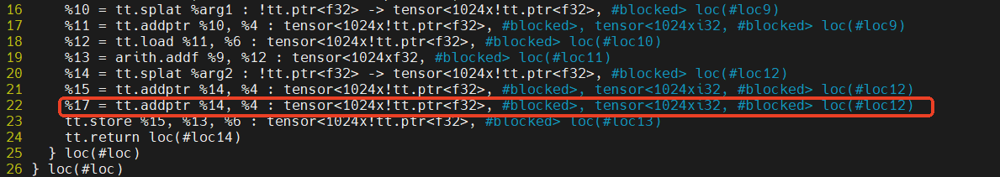

经过上面单独走 cse pass 的优化处理之后，可以看到`add_kernel-opt.ttgir`里面已经没有这条冗余指令了：
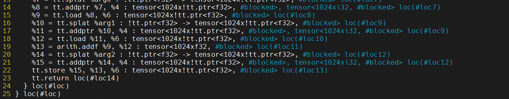


* triton-translate
```bash
triton-translate xxx.ttgir -target=llvmir &>xxx.llir        # 将 ttgir 降级为 llir
triton-translate --help
```

在 gdb 中调用 triton-translate：
```bash
gdb triton-translate    # 启动 gdb
b aaa.cpp:111       # 打断点
r xxx.ttgir -target=llvmir &>xxx.llir        # 将 ttgir 降级为 llir
```

* v3.1.0 目前编出来的调试工具有这些：

    * `triton-opt`：Triton (GPU) optimizer driver
        可用的 dialect：arith, builtin, cf, gpu, llvm, math, nvgpu, nvvm, rocdl, scf, triton_gpu, triton_nvidia_gpu, tt
        可以拿来单独执行某个 pass，或者是单独执行某个优化，pass pipeline 等
    * `triton-reduce`：MLIR test case reduction tool
        可以测试某个 pass，pass pipeline 等
    * `triton-tensor-layout`：tensor layout printer

    * `triton-lsp`：MLIR LSP Language Server

    * `triton-llvm-opt`：llvm .bc -> .bc modular optimizer and analysis printer


### 6 Triton IR 理解

Triton kernel 到 ttir 的转换过程：

* 调用 Triton Kernel(python/tutorials/01-vector-add.py): `add(x, y)`

* JIT 调用编译器（triton/runtime/jit.py）: `kernel = self.compile()`

* 调用 make_ir（triton/compiler/compiler.py）: `src.make_ir()`

* 调用 ast 生成 ttir（triton/compiler/compiler.py）: `ast_to_ttir()`
    逻辑位于 `triton/compiler/code_generator.py`文件中，具体地执行 codeGen 的遍历完成 triton python 到 triton IR 的转换。

转换过程具体如下图：

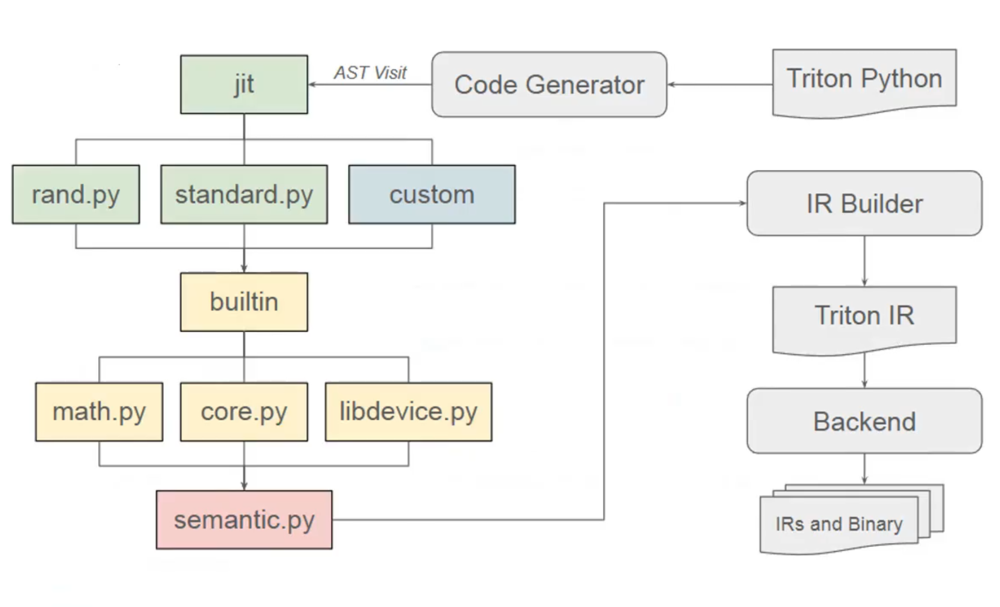

* triton/language/random.py
    随机数生成
* triton/language/standard.py
    一些算子的标准实现
* triton/language/math.py
    数学算子的实现
* triton/language/core.py
    triton kernel 的实现
* triton/language/extra/cuda/libdevice.py
    硬件相关的操作实现
* triton/language/semantic.py
    语法
