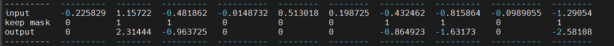
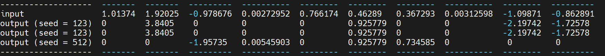

## Low Memory Dropout

Dropout 是一种用于改善低数据条件下深度神经网络性能的技术，通常用于正则化。它接受一个向量作为输入，并生成相同 shape 的输出向量。输出中的每个标量都有概率 $p$ 被设为零，否则直接从输入复制。这使得网络在仅有输入的 $1-p$ 标量时也能表现良好。在评估阶段，为了充分利用网络的能力，将 $p$ 设为0。但是简单地将 $p$ 设为 0 会增加输出的范数，可能会人为地降低输出的 softmax temperature。为了防止这种情况发生，输出被缩放为 $\frac{1}{1-p}$ ，这使得无论 dropout 概率如何都能保持一致的范数。


### 1 Dropout 常规实现

```python
import tabulate
import torch
import triton
import triton.language as tl

@triton.jit
def _dropout(
    x_ptr,      # 输入指针
    x_keep_ptr, # 由 0 和 1 组成的掩码的指针
    output_ptr, # 输出指针
    n_elements, # `x` 张量的元素数量
    p,          # 元素 `x` 被设置为 0 的概率
    BLOCK_SIZE: tl.constexpr,
):
    pid = tl.program_id(axis=0)
    block_start = pid * BLOCK_SIZE
    offsets = block_start + tl.arange(0, BLOCK_SIZE)
    mask = offsets < n_elements
    
    # 加载数据
    x = tl.load(x_ptr + offsets, mask=mask)
    x_keep = tl.load(x_keep_ptr + offsets, mask=mask)

    output = tl.where(x_keep, x / (1 - p), 0.0)
    # 写回输出
    tl.store(output_ptr + offsets, output, mask=mask)

def dropout(x, x_keep, p):
    output = torch.empty_like(x)
    assert x.is_contiguous()
    n_elements = x.numel()
    grid = lambda meta: (triton.cdiv(n_elements, meta['BLOCK_SIZE']), )
    _dropout[grid](x, x_keep, output, n_elements, p, BLOCK_SIZE=1024)
    return output

x = torch.randn(size=(10, )).cuda()
# Dropout 掩码
p = 0.5
x_keep = (torch.rand(size=(10, )) > p).to(torch.int32).cuda()
output = dropout(x, x_keep=x_keep, p=p)
print(tabulate.tabulate([
    ["input"] + x.tolist(),
    ["keep mask"] + x_keep.tolist(),
    ["output"] + output.tolist(),
]))
```

常规实现的 dropout 输出如下：




### 2 低内存方案 dropout

前面常规的 dropout 实现效果良好，但管理 Dropout 状态可能会变得复杂，特别是在考虑反向传播和重新计算/checkpoint场景的时候。

考虑在 kernel 内部通过生成随机数作为 Dropout 掩码，可以**降低内存占用**，**kernel 内部有较少的数据移动**，简化了在多次调用内核函数时持久化随机性的管理。


```python
@triton.jit
def _seeded_dropout(
    x_ptr,
    output_ptr,
    n_elements,
    p,
    seed,
    BLOCK_SIZE: tl.constexpr,
):
    # compute memory offsets of elements handled by this instance
    # 计算由此实例处理的元素的内存偏移量
    pid = tl.program_id(axis=0)
    block_start = pid * BLOCK_SIZE
    offsets = block_start + tl.arange(0, BLOCK_SIZE)
    # load data from x
    # 从 x 读取数据
    mask = offsets < n_elements
    x = tl.load(x_ptr + offsets, mask=mask)
    # randomly prune it
    # 随机修剪
    random = tl.rand(seed, offsets)
    x_keep = random > p
    # write-back
    # 写回
    output = tl.where(x_keep, x / (1 - p), 0.0)
    tl.store(output_ptr + offsets, output, mask=mask)


def seeded_dropout(x, p, seed):
    output = torch.empty_like(x)
    assert x.is_contiguous()
    n_elements = x.numel()
    grid = lambda meta: (triton.cdiv(n_elements, meta['BLOCK_SIZE']), )
    _seeded_dropout[grid](x, output, n_elements, p, seed, BLOCK_SIZE=1024)
    return output


x = torch.randn(size=(10, )).cuda()
# Compare this to the baseline - dropout mask is never instantiated!
# 与基线相比 - dropout 掩码从未被实例化！
output = seeded_dropout(x, p=0.5, seed=123)
output2 = seeded_dropout(x, p=0.5, seed=123)
output3 = seeded_dropout(x, p=0.5, seed=512)


print(tabulate.tabulate([
    ["input"] + x.tolist(),
    ["output (seed = 123)"] + output.tolist(),
    ["output (seed = 123)"] + output2.tolist(),
    ["output (seed = 512)"] + output3.tolist(),
]))
```

输出如下：




### 3 moreover

#### 3.1 扩展内核以处理矩阵，使用一个种子向量 — 每行一个种子

#### 3.2 添加对 striding 的支持

#### 3.3 实现稀疏 Johnson-Lindenstrauss 变换的内核, 每次使用种子动态生成投影矩阵


