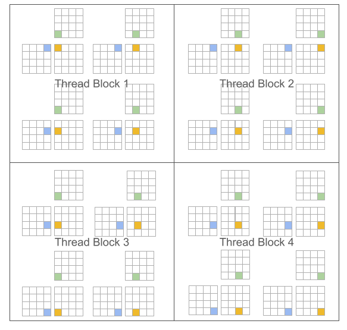

## triton和cuda编程模型对比

基于阻塞算法的编程范式可以促进神经网络的高性能计算内核的构建。在矩阵乘法中，CUDA 和 Triton 编程模型的区别如下：

### 1 CUDA 编程模型（标量程序，阻塞线程)

```cpp
#pragma parallel
for(int m = 0; m < M; m++) {
    #pragma parallel
    for(int n = 0; n < N; n++) {
        float acc = 0;
        for(int k = 0; k < K; k++)
            acc += A[m, k] * B[k, n];
        C[m, n] = acc;
    }
}
```




### 2 Triton 编程模型 (Blocked Program, Scalar Threads)

```cpp
// Triton Programming Model
#pragma parallel
for(int m = 0; m < M; m += MB) {
    #pragma parallel
    for(int n = 0; n < N; n += NB) {
        float acc[MB, NB] = 0;
        for(int k = 0; k < K; k += KB)
            acc += A[m:m+MB, k:k+KB] @ B[k:k+KB, n:n+NB];
        C[m:m+MB, n:n+NB] = acc;
    }
}
```


triton 的编程模型优势在于它产生了块结构化的迭代空间，为程序员在实现稀疏操作时提供了比现有 DSL 更多的灵活性，同时允许编译器针对数据局部性和并行性进行积极优化。

