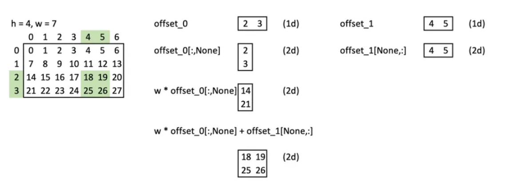
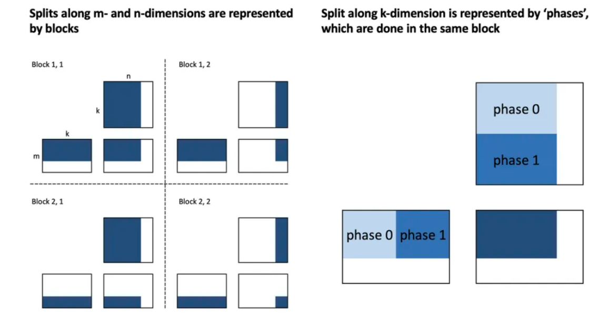
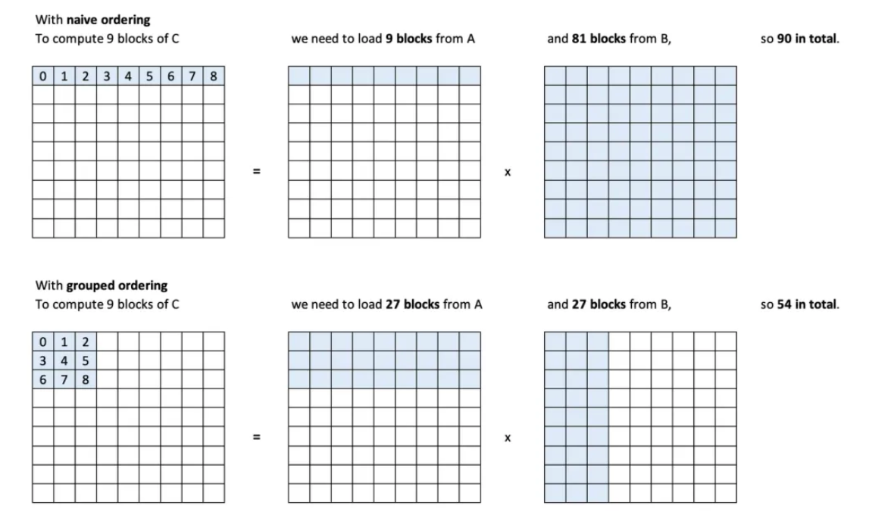
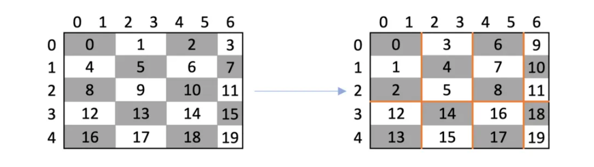
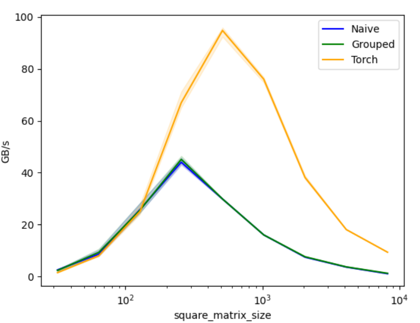
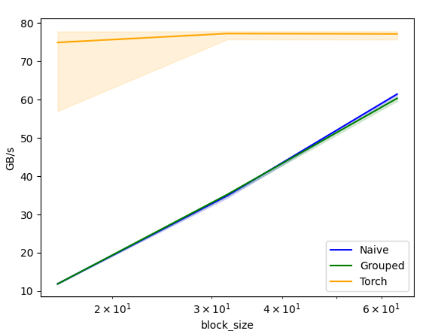
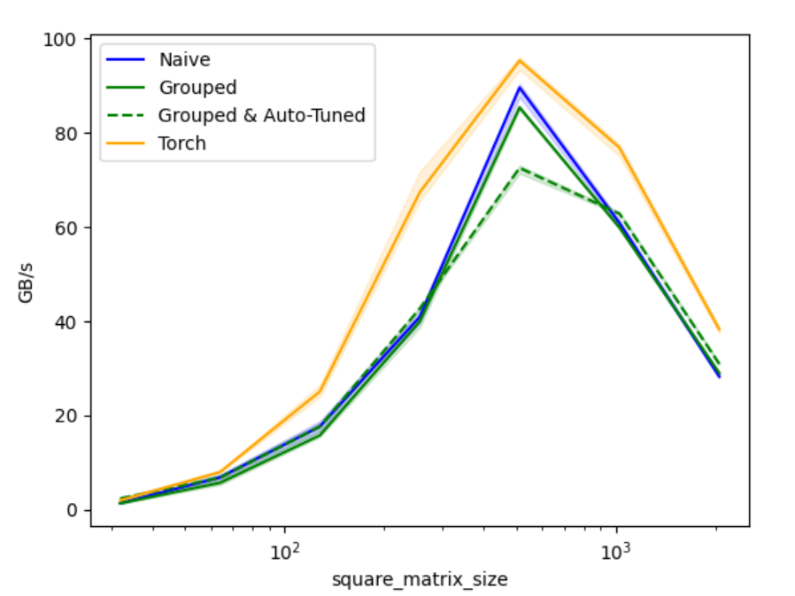

## triton编程模型

在CUDA中，将计算分解为两个层次：**首先是块，然后每个块进一步分解为线程**。一个块中的所有线程运行在同一个SM上，并共享相同的共享内存。**每个线程计算标量**。


### 1 不带 mask

在Triton中，**只将计算分解为一个层次：块。没有进一步的线程分解**。Triton要求我们对向量进行操作。此外，不需要也不能管理共享内存。Triton会自动处理这些。

假设我们要将大小为 12 的向量`x`和`y`相加，并将输出保存到大小也为 12 的向量`z`中。我们使用大小为 4 的块，因此我们有`12 / 4 = 3`个块。

CUDA运行 3 个块，每个块有 4 个线程。12 个线程中的每一个计算一个单独的位置，例如`z[0] = x[0] + y[0]`
Triton也运行 3 个块，每个块执行向量化加法。向量的大小是块的大小，即 4。例如`z[0:3] = x[0:3] + y[0:3]`


### 2 带 mask

所有Triton kernel中的操作都是向量化的：加载数据、操作数据、存储数据和创建 mask。

我们要将大小为 12 的向量`x`和`y`相加，并将输出保存到大小也为 12 的向量`z`中。我们使用大小为8的块，因此我们有`cdiv(12, 8) = 2`个块。
```python
import torch

x = torch.tensor([1,2,3,4,5,6,7,8,9,10,11,12])
y = torch.tensor([0,1,0,1,0,1,0,1,0,1,0,1])

print("x:\n", x)
print("y:\n", y)
print("x+y:\n", x+y)
```


*注：下面的 kernel 语法不完全正确，只为说明原理*
CUDA kernel 将类似于以下代码：
```python
# x,y = 输入张量, z = 输出张量, n = x的大小, bs = 块大小  
def add_cuda_k(x, y, z, n, bs):  
    # 定位此特定kernel正在执行的整体计算的哪一部分  
    block_id = ... # 在我们的例子中: 是[0,1]中的一个  
    thread_id = ... # 在我们的例子中: 是[0,1,2,3,4,5,6,7]中的一个  
  
    # 识别此特定kernel需要的数据位置  
    offs = block_id * bs + thread_id  
      
    # 保护子句, 确保我们不会越界  
    if offs < n:  
  
        # 读取数据  
        x_value = x[offs]  
        y_value = y[offs]  
          
        # 执行操作  
        z_value = x_value + y_value  
          
        # 写入数据  
        z[offs] = z_value  
  
    # offs, x_value, y_value, x_value 都是标量!  
    # 保护条件也是一种标量, 因为它检查一个值上的一个条件。  
```

相应的Triton kernel，大致如下所示：

```python
def add_triton_k(x, y, z, n, bs):  
    # 定位此特定kernel正在执行的整体计算的哪一部分  
    block_id = tl.program_id(0)  # 例子中: 是[0,1]中的一个  
      
    # 识别此特定kernel需要的数据位置  
    offs = block_id * bs + tl.arange(0, bs) # <- 这是一个向量!  
      
    # 保护子句变成一个掩码，这是一个布尔向量  
    mask = offs < n # <- 这是一个布尔向量!  
      
    # 读取数据  
    x_values = x[offs] # <- 读取一个向量!  
    y_values = y[offs] # <- 读取一个向量!  
      
    # 执行操作  
    z_value = x_value + y_value  # <- 向量相加!  
      
    # 写入数据  
    z[offs] = z_value  # <- 写入一个向量!  
```

*注：在Triton中，每个处理块的kernel被称为`program`。也就是说，上面的例子运行了2个program。因此，`block_id`通常被称为`pid`，它们是相同的。*


### 3 复制张量

给定一个形状为 (n) 的张量 x，将其复制到另一个张量 z 中。

```python
def copy(x, bs, kernel_fn):
    z = torch.zeros_like(x).to("cuda:0")
    check_tensors_gpu_ready(x, z)
    n = x.numel()
    n_blocks = math.ceil(n * 1.0 / bs)
    grid = (n_blocks,)  # 有多少个块？可以是1d/2d/3d元组或返回1d/2d/3d元组的函数

    # 启动网格
    # kernel_fn就是Triton kernel
    # grid是我们上面构建的网格
    # x,z,n,bs是传递给每个kernel函数的参数
    kernel_fn[grid](x,z,n,bs)

    return z

# triton，启动！
x = torch.rand((1, 3, 5)).to("cuda:0")
z = copy(x, bs=2, kernel_fn=copy_t)

print("x:\n", x)
print("z:\n", z)

```

简单手写一个 Triton kernel
```python
# triton.jit装饰器将一个Python函数转换为Triton kernel，该kernel在GPU上运行。在这个函数内部，只允许使用部分Python操作
# 因为不进行模拟时，不能打印或使用断点，因为这些在GPU上不存在

@triton.jit
def copy_t(x_ptr, z_ptr, n, bs: tl.constexpr):  # 当我们传递torch张量时，它们会自动转换为指向其第一个值的指针
    pid = tl.program_id(0)
    offs = pid * bs + tl.arange(0, bs) # 从pid计算偏移量，偏移量是矢量
    mask = offs < n     # 偏移量是矢量，故使用偏移量计算出来的 mask 也是矢量，mask 是与 offs相同 shape 的 bool 矢    x = tl.load(x_ptr + offs, mask) # 加载一个值向量，将`x_ptr + offs`视为`x_ptr[offs]`，类似 C 里面的数组操作
    tl.store(z_ptr + offs, x, mask) # 存储一个值向量
    print_if(f'pid = {pid} | offs = {offs}, mask = {mask}, x = {x}', '')    # 在 triton_debug 里面提到过的 print_if
```

输出：
```bash
pid = [0] | offs = [0 1], mask = [ True  True], x = [0.18320978 0.28929514]
pid = [1] | offs = [2 3], mask = [ True  True], x = [0.85810375 0.9922697 ]
pid = [2] | offs = [4 5], mask = [ True  True], x = [0.44201863 0.9971678 ]
pid = [3] | offs = [6 7], mask = [ True  True], x = [0.43323755 0.49254978]
pid = [4] | offs = [8 9], mask = [ True  True], x = [0.12303007 0.84465665]
pid = [5] | offs = [10 11], mask = [ True  True], x = [0.10476059 0.14601105]
pid = [6] | offs = [12 13], mask = [ True  True], x = [0.23298341 0.66797006]
pid = [7] | offs = [14 15], mask = [ True False], x = [0.25843203 0.        ]
x:
 tensor([[[0.1832, 0.2893, 0.8581, 0.9923, 0.4420],
         [0.9972, 0.4332, 0.4925, 0.1230, 0.8447],
         [0.1048, 0.1460, 0.2330, 0.6680, 0.2584]]], device='cuda:0')
z:
 tensor([[[0.1832, 0.2893, 0.8581, 0.9923, 0.4420],
         [0.9972, 0.4332, 0.4925, 0.1230, 0.8447],
         [0.1048, 0.1460, 0.2330, 0.6680, 0.2584]]], device='cuda:0')
```


### 4 灰度化图像

灰度化一张小狗的图像。


尝试简单的二维数据的处理，方法也适用于高维数据。要处理二维数据，将构建二维偏移量和 mask。

例如对于一个 4x7 矩阵和每个维度的大小为 2 的块：




* 图片加载与显示：
```python
import os
import matplotlib.pyplot as plt
from urllib.request import urlretrieve
from pathlib import Path
import torch
from torch import tensor
import torchvision as tv
import torchvision.transforms.functional as tvf
from torchvision import io
import triton
import triton.language as tl

def cdiv(a,b): return (a + b - 1) // b

def load_img(path_img):
    assert Path(path_img).exists(), f"image {path_img} is not exist"
    img = io.read_image(path_img)
    return img

def show_img(x, fig_path, figsize=(4,3), **kwargs):
    plt.figure(figsize=figsize)
    plt.axis('off')
    if len(x.shape)==3: x = x.permute(1,2,0)  # CHW -> HWC
    plt.imshow(x.cpu(), **kwargs)
    plt.savefig(fig_path)
```

* 简单手写一个 RGB 图像转灰度图像的 triton kernel：
```python
@triton.jit  
def rgb2grey_kernel(x_ptr, out_ptr, h, w, bs0: tl.constexpr, bs1: tl.constexpr):
    pid_0 = tl.program_id(0)
    pid_1 = tl.program_id(1)

    offs_0 = pid_0 * bs0 + tl.arange(0,bs0)  # 1d 向量
    offs_1 = pid_1 * bs1 + tl.arange(0,bs1)  # 1d 向量
    offs = w * tl.expand_dims(offs_0, 1) + tl.expand_dims(offs_1, 0)  # 2d 矩阵

    mask_0 = offs_0 < h  # 1d 向量
    mask_1 = offs_1 < w  # 1d 向量
    mask = tl.expand_dims(mask_0, 1) & tl.expand_dims(mask_1, 0)  # 2d 矩阵

    r = tl.load(x_ptr + 0*h*w+offs, mask=mask)
    g = tl.load(x_ptr + 1*h*w+offs, mask=mask)
    b = tl.load(x_ptr + 2*h*w+offs, mask=mask)
  
    out = 0.2989*r + 0.5870*g + 0.1140*b  # 根据RGB值计算灰度值
    tl.store(out_ptr + offs, out, mask=mask)  
```

* 调用上面的 triton kernel
```python
def rgb2grey(x, bs):
    c,h,w = x.shape
    out = torch.empty((h,w), dtype=x.dtype, device=x.device)
    grid = lambda meta: (cdiv(h, meta['bs0']), cdiv(w,  meta['bs1']))

    rgb2grey_kernel[grid](x, out, h, w, bs0=bs[0], bs1=bs[1])
    return out.view(h,w)

path_img = "./pm_1.png"
img = load_img(path_img)
img = tvf.resize(img, 150, antialias=True)
show_img(img, "./origin_fig.png")
grey_img = rgb2grey(img.to('cuda'), bs=(32, 32)).to('cpu')
show_img(grey_img, "grey_fig.png", cmap='gray')
```

处理之后的图像：


### 5 矩阵乘法

通过分割计算的方法，从 kernel 中调用函数，在块内使用预实现的向量/矩阵操作，计算 `mxk`矩阵`A`乘以`kxn`矩阵`B`得到`mxn`矩阵`C`。

沿着三个轴分割计算：

* 沿着 m 轴，使用块维度 0 来表示这一点
* 沿着 n 轴，使用块维度 1 来表示这一点
* 沿着共享的 k 轴，这将不会由块表示。所有计算块将在同一个块中完成

这里的示例来自 openAI 关于 triton 的 blog。





创建 mask 的代码是一块可复用的代码，可以把其封装成函数，只要这些函数被 triton.jit 编译，它们就可以在kernel中使用。

```python
@triton.jit
def get_1d_offset(size, n_prev_chunks):
    return n_prev_chunks * size + tl.arange(0, size)
@triton.jit
def get_2d_offset(offs_0, offs_1, stride_0, stride_1=1): 
    # 使用 tl.expand_dims 将 offs_0 和 offs_1 转换为二维张量
    # tl.expand_dims(offs_0, 1) 将 offs_0 转换为 (offs_0, 1) 形状的张量
    # tl.expand_dims(offs_1, 0) 将 offs_1 转换为 (1, offs_1) 形状的张量
    return tl.expand_dims(offs_0, 1)*stride_0 + tl.expand_dims(offs_1, 0)*stride_1
@triton.jit
def get_1d_mask(offs, max):
    return offs < max
@triton.jit
def get_2d_mask(offs_0, offs_1, max_0, max_1):
    # 使用 tl.expand_dims 将 offs_0 和 offs_1 转换为二维张量
    # tl.expand_dims(offs_0, 1) 将 offs_0 转换为 (offs_0, 1) 形状的张量
    # tl.expand_dims(offs_1, 0) 将 offs_1 转换为 (1, offs_1) 形状的张量
    return (tl.expand_dims(offs_0, 1) < max_0) & (tl.expand_dims(offs_1, 0) < max_1)
```

#### 5.1 naive matmul

创建朴素的矩阵乘法 kernel：
```python
@triton.jit
def naive_matmul_kernel(
    a_ptr, b_ptr, c_ptr,
    m, n, k,
    stride_am, stride_ak,
    stride_bk, stride_bn,
    stride_cm, stride_cn,
    bm: tl.constexpr, bn: tl.constexpr, bk: tl.constexpr
):  
    # 获取当前线程块的 ID
    pid_m, pid_n = tl.program_id(0), tl.program_id(1)

    # 沿 m/n/k 维度分割计算
    rm = get_1d_offset(size=bm, n_prev_chunks=pid_m)  # 计算 m 维度的偏移量
    rn = get_1d_offset(size=bn, n_prev_chunks=pid_n)  # 计算 n 维度的偏移量
    rk = get_1d_offset(size=bk, n_prev_chunks=0)  # 计算 k 维度的偏移量

    # 计算 a 和 b 的相关偏移量
    offs_a = a_ptr + get_2d_offset(rm, rk, stride_am, stride_ak)  # 计算 a 的偏移量
    offs_b = b_ptr + get_2d_offset(rk, rn, stride_bk, stride_bn)  # 计算 b 的偏移量

    # 初始化并迭代更新累加器
    acc = tl.zeros((bm, bn), dtype=tl.float32)  # 初始化累加器

    for _ in range(0, k, bk):
        # todo: 加载 a 和 b 时是否需要掩码？
        a = tl.load(offs_a)  # 加载 a 的数据
        b = tl.load(offs_b)  # 加载 b 的数据
        acc += tl.dot(a, b, allow_tf32=False)  # 在块内进行矩阵乘法；对于较旧的 GPU，allow_tf32 必须设置为 False，否则无法编译

        # 增加偏移量，以便下一次迭代加载下一个块
        offs_a += bk * stride_ak
        offs_b += bk * stride_bk

    c = c_ptr + get_2d_offset(rm, rn, stride_cm, stride_cn)  # 计算 c 的偏移量
    mask = get_2d_mask(rm, rn, m, n)  # 计算掩码
    tl.store(c, acc, mask=mask)  # 将结果存储到 c 中
```

调用上面的 kernel：
```python
import os
import torch
import triton
import triton.language as tl
from utils import cdiv, breakpoint_if, print_if, check_tensors_gpu_ready
from functools import partial
  
def matmul(a, b, matmul_k_fn, bs=16, group_sz=None):
    # 检查矩阵维度是否兼容
    assert a.shape[1] == b.shape[0], "矩阵维度不兼容，无法进行矩阵乘法"
    # 检查张量是否准备好在 GPU 上运行
    check_tensors_gpu_ready(a, b)

    # 获取矩阵 a 和 b 的形状
    (m, k), (_, n) = a.shape, b.shape
    # 创建一个空的输出张量 c
    c = torch.empty((m, n), device=a.device, dtype=torch.float16)

    # 定义网格函数，用于计算线程块的数量
    grid = lambda meta: (triton.cdiv(m, meta['bm']),  triton.cdiv(n, meta['bn']))
    # 处理 group_sz 参数，如果为 None，则使用空字典
    # group_sz = {} if group_sz is None else {"group_sz":group_sz} # 在 naive_matmul 中未使用，但在后续grouped_matmul 中会用到
    
    # 调用 matmul_k_fn 函数，传入必要的参数
    matmul_k_fn[grid](
        a, b, c,
        m, n, k,
        a.stride(0), a.stride(1),
        b.stride(0), b.stride(1),
        c.stride(0), c.stride(1),
        bm=bs, bn=bs, bk=bs, # 注意：对于较旧的 GPU，allow_tf32 必须设置为 False，否则无法编译
        **group_sz
    )
    # 返回计算结果
    return c

# 使用 partial 创建一个部分应用的函数 naive_matmul
naive_matmul = partial(matmul, matmul_k_fn=naive_matmul_kernel)
```

简单的单元测试：
```python
torch.manual_seed(0)
a = torch.randn((512, 512), device='cuda', dtype=torch.float16)  
b = torch.randn((512, 512), device='cuda', dtype=torch.float16)  

triton_output = naive_matmul(a, b)
torch_output = torch.matmul(a, b)
if torch.allclose(triton_output, torch_output, atol = 5e-2, rtol=0):  
    print("✅ Triton and Torch match")
else:
    print("❌ Triton and Torch differ")
```


#### 5.2 faster matmul

Triton 处理块内的内存访问顺序，但不处理跨块的内存访问顺序。这是一个我们可以用来加速内核的优化点。

通过重新排序块可以提高 L2 缓存的命中率，从而使我们的内核更快。这个示例来自 Triton 文档。为了更好地利用 L2 缓存，我们希望重用最近加载的数据，这些数据很可能仍然在 L2 缓存中。可以通过减少一批**连续**内核需要的不同数据加载次数来实现。这里所说的**连续**指得是大于在同一时间执行的 kernel。


如下图所示，如果按照 naive 的顺序排列，输出矩阵的第一行将“连续”计算，这需要 90 次不同的块读取（矩阵 A 中 9 次，矩阵 B 中 81 次）；如果按照 grouped 的顺序排列，输出矩阵的 3x3 块将“连续”计算，这需要 54 次不同的块读取（矩阵 A 中 27 次，矩阵 B 中 27 次）。



这里的 grouped ordering 可以通过获取 pids，改变它们的顺序，并将具有新的顺序的 pids 用作原始 pids：

```python
def process_item(id): print(f"I'm processing item {id}")

for i in range(5): process_item(i)
```

上面的方式，将会获得这样的处理顺序：

```python
I'm processing item 0
I'm processing item 1
I'm processing item 2
I'm processing item 3
I'm processing item 4
```

也可以通过微小的改变，倒序处理：

```python
def change_id(old_id): return 5-old_id

for i in range(5): process_item(change_id(i))
```

新的处理顺序为倒序：

```python
I'm processing item 5
I'm processing item 4
I'm processing item 3
I'm processing item 2
I'm processing item 1
```

上面通过简单的改变，实现了倒序处理，那么 grouped ordering 是什么样的顺序呢？下面从左到右的变换是一种可实现的变换方式：




在左侧，显示了默认的顺序（称为“行优先”）。*注意，这里处理的是块，我们无法安排单个单元格的处理顺序，只能安排块的顺序。*图中的输出矩阵有 35 个单元格，有 `cdiv(5,1) x cdiv(7,2) = 5x4 = 20` 个块；在右侧，前 9 个处理的块是我们想要的 3x3 网格，我们在一列中处理 3 个块。然后前进一列，再次处理 3 个块，如此循环。橙色线显示了前进的位置。这个操作称为 **swizzling**。*这里每次处理的块的数量 3 被称为 group size，可以更改。*

Triton 提供了一个 `triton.language.swizzle2d` 函数，可以在 kernel 中直接使用。在一个 5x4 的矩阵上使用 swizzle2d，该矩阵的元素按行优先顺序排列为 0 ... 19。我们应该得到一个元素按分组顺序排列的矩阵：

```python
@triton.jit
def swizzle_kernel(x_ptr, z_ptr, group_sz: tl.constexpr):
    # 获取当前线程块的 ID
    pid_m, pid_n = tl.program_id(0), tl.program_id(1)
    # 获取线程块的总数
    num_pid_m, num_pid_n = tl.num_programs(0), tl.num_programs(1)
    # 使用 Triton 的 swizzle2d 函数重新排列线程块的 ID
    pid_m_, pid_n_ = tl.swizzle2d(pid_m, pid_n, num_pid_m, num_pid_n, group_sz)

    # 计算原始线程块的偏移量
    offs_m = get_1d_offset(1, n_prev_chunks=pid_m)
    offs_n = get_1d_offset(1, n_prev_chunks=pid_n)
    # 计算原始线程块的 2D 偏移量和掩码
    offs = get_2d_offset(offs_m, offs_n, stride_0=num_pid_n)
    mask = get_2d_mask(offs_m, offs_n, max_0=num_pid_m, max_1=num_pid_n )
    # 计算重新排列后的线程块的偏移量
    offs_sw_m = get_1d_offset(1, n_prev_chunks=pid_m_)
    offs_sw_n = get_1d_offset(1, n_prev_chunks=pid_n_)
    # 计算重新排列后的线程块的 2D 偏移量和掩码
    offs_sw = get_2d_offset(offs_sw_m, offs_sw_n, stride_0=num_pid_n)
    mask_sw = get_2d_mask(offs_sw_m, offs_sw_n, max_0=num_pid_m, max_1=num_pid_n)

    # 从原始矩阵中加载数据
    x = tl.load(x_ptr + offs, mask=mask)
    # 将数据存储到重新排列后的矩阵中
    tl.store(z_ptr + offs_sw, x, mask=mask_sw)
```


原始矩阵排列：

```python
blocks_m, blocks_n = 5,4
x = torch.arange(blocks_m*blocks_n, device='cuda').view(blocks_m,blocks_n)
```

```bash
tensor([[ 0,  1,  2,  3],
        [ 4,  5,  6,  7],
        [ 8,  9, 10, 11],
        [12, 13, 14, 15],
        [16, 17, 18, 19]], device='cuda:0')
```

swizzle x into z：
```python
z = -torch.ones_like(x) # empty matrix, with -1 denoting empty
swizzle_kernel[(blocks_m,blocks_n)](x,z, group_sz=3)
```

swizzle 的矩阵排列：

```bash
tensor([[ 0,  3,  6,  9],
        [ 1,  4,  7, 10],
        [ 2,  5,  8, 11],
        [12, 14, 16, 18],
        [13, 15, 17, 19]], device='cuda:0')
```


#### 5.3 grouped matmul

一个 grouped 矩阵乘法kernel 的实现：

```python
@triton.jit
def grouped_matmul_kernel(
    a_ptr, b_ptr, c_ptr,  # 指向矩阵 A, B, C 的指针
    m, n, k,  # 矩阵的维度
    stride_am, stride_ak,  # 矩阵 A 的步长
    stride_bk, stride_bn,  # 矩阵 B 的步长
    stride_cm, stride_cn,  # 矩阵 C 的步长
    bm: tl.constexpr, bn: tl.constexpr, bk: tl.constexpr, group_sz: tl.constexpr  # 块大小和分组大小
):
    pid_m, pid_n = tl.program_id(0), tl.program_id(1)  # 获取当前线程块的 ID
    num_pid_m, num_pid_n = tl.num_programs(0), tl.num_programs(1)  # 获取线程块的总数

    # 确定块在分组排序中的位置, 重新排列
    pid_m, pid_n = tl.swizzle2d(pid_m, pid_n, num_pid_m, num_pid_n, group_sz)

    # 沿 m/n/k 维度的块
    rm = get_1d_offset(size=bm, n_prev_chunks=pid_m)  # 计算 m 维度的偏移
    rn = get_1d_offset(size=bn, n_prev_chunks=pid_n)  # 计算 n 维度的偏移
    rk = get_1d_offset(size=bk, n_prev_chunks=0)  # 计算 k 维度的偏移

    # 矩阵 A 和 B 的相关偏移
    offs_a = a_ptr + get_2d_offset(rm, rk, stride_am, stride_ak)  # 计算矩阵 A 的偏移
    offs_b = b_ptr + get_2d_offset(rk, rn, stride_bk, stride_bn)  # 计算矩阵 B 的偏移

    # 初始化并迭代更新累加器
    acc = tl.zeros((bm, bn), dtype=tl.float32)  # 初始化累加器

    for _ in range(0, k, bk):
        a = tl.load(offs_a)  # 加载矩阵 A 的块
        b = tl.load(offs_b)  # 加载矩阵 B 的块
        acc += tl.dot(a, b, allow_tf32=False)  # 对于较旧的 GPU，allow_tf32 必置为 False，否则无法编译
        # 增加偏移，以便下一次迭代加载下一个块
        offs_a += bk * stride_ak
        offs_b += bk * stride_bk

    c = c_ptr + get_2d_offset(rm, rn, stride_cm, stride_cn)  # 计算矩阵 C 的偏移
    mask = get_2d_mask(rm, rn, m, n)  # 计算掩码
    tl.store(c, acc, mask=mask)  # 将累加器的结果存储到矩阵 C 中
```

调用上面的 kernel 计算 matmul：

```python
grouped_matmul = partial(matmul, matmul_k_fn=grouped_matmul_kernel)
```

简单的单元测试：

```python
torch.manual_seed(0)
a = torch.randn((512, 512), device='cuda', dtype=torch.float16)
b = torch.randn((512, 512), device='cuda', dtype=torch.float16)

triton_output = grouped_matmul(a, b, group_sz=32)
torch_output = torch.matmul(a, b)
if torch.allclose(triton_output, torch_output, atol=5e-2, rtol=0):
    print("✅ Triton and Torch match")
else:
    print("❌ Triton and Torch differ")
```


#### 5.4 性能测试

Triton 自带性能测试工具:

```python
# adapted from https://triton-lang.org/main/getting-started/tutorials/01-vector-add.html
@triton.testing.perf_report(
    triton.testing.Benchmark(
        x_names=['square_matrix_size'],  # 用于绘图的 x 轴参数名称。
        x_vals=[2**i for i in range(5, 14, 1)],  # `x_name` 的不同可能值。
        x_log=True,  # x 轴为对数刻度。
        line_arg='provider',  # 对应于绘图中不同线条的参数名称。
        line_vals=['naive', 'grouped', 'torch'],  # `line_arg` 的可能值。
        line_names=['Naive', 'Grouped', 'Torch'],  # 线条的标签名称。
        styles=[('blue', '-'), ('green', '-'), ('orange','-')],  # 线条样式。
        ylabel='GB/s',  # y 轴的标签名称。
        plot_name='matmul-performance',  # 绘图的名称，也用作保存绘图的文件名。
        args={},  # 不在 `x_names` 和 `y_name` 中的函数参数值。
    ))

def benchmark(square_matrix_size, provider):
    sz = square_matrix_size  # 矩阵的大小
    a = torch.rand((sz, sz), device='cuda', dtype=torch.float32)  # 生成随机矩阵 a
    b = torch.rand((sz, sz), device='cuda', dtype=torch.float32)  # 生成随机矩阵 b
    quantiles = [0.5, 0.2, 0.8]  # 用于性能测试的分位数

    if provider == 'naive':  # 如果使用 naive 方法
        ms, min_ms, max_ms = triton.testing.do_bench(lambda: naive_matmul(a, b), quantiles=quantiles)  # 执行性能测试
    if provider == 'grouped':  # 如果使用 grouped 方法
        ms, min_ms, max_ms = triton.testing.do_bench(lambda: grouped_matmul(a, b, group_sz=32), quantiles=quantiles)  # 执行性能测试
    if provider == 'torch':  # 如果使用 PyTorch 方法
        ms, min_ms, max_ms = triton.testing.do_bench(lambda: torch.matmul(a, b), quantiles=quantiles)  # 执行性能测试

    gbps = lambda ms: 12 * sz * sz / ms * 1e-6  # 计算带宽（GB/s）
    return gbps(ms), gbps(max_ms), gbps(min_ms)  # 返回带宽值

benchmark.run(print_data=True, show_plots=True)
```



benchmark 输出结果：

```bash
matmul-performance:
   square_matrix_size      Naive    Grouped      Torch
0                32.0   2.560000   2.341463   1.505882
1                64.0   8.629213   9.309091   8.000000
2               128.0  25.815127  25.600001  25.077551
3               256.0  44.043011  45.134985  66.964578
4               512.0  29.888721  29.888721  94.796530
5              1024.0  16.035233  16.035233  76.013145
6              2048.0   7.464910   7.631409  38.172144
7              4096.0   3.644806   3.724342  18.099207
8              8192.0   1.095729   1.258701   9.373015
```

从 benchmark 输出的结果看，gbps 先随着矩阵 size 的增加而增加，再减小，可能是随着矩阵 shape 的增大，共享内存的使用逐渐增多直到用完，最终超过阈值，kernel花费了越来越多的时间重新加载数据。

数据传输量计算简单推导：

矩阵乘法需要读取两个矩阵的数据并写入输出矩阵。假设矩阵的数据类型为 float32，那么每个矩阵的数据量为：`sz * sz * 4`bytes，那么总共的数据传输量(bytes)为：

$$
total_size = 3 \times sz ^2 \times 4 
$$


带宽(GB/s)计算：

$$
带宽 = \frac{数据传输量}{时间}
$$

其中时间单位为毫秒(ms)(由于 do_bench 的返回值单位为 ms)，数据传输量单位 GB(1e9 byte)，那么：

$$
gbps = \frac{12 \times sz ^2}{ms} \times 1^{-6}
$$


尝试使用不同大小的 block_size 参数，
```python
@triton.testing.perf_report(
    triton.testing.Benchmark(
        x_names=['block_size'], x_vals=[2**i for i in range(4, 7, 1)], x_log=True,
        line_arg='provider', line_vals=['naive', 'grouped', 'torch'], line_names=['Naive', 'Grouped', 'Torch'],
        styles=[('blue', '-'), ('green', '-'), ('orange','-')],
        ylabel='GB/s', plot_name='matmul-performance', args={}
    ))
def benchmark(block_size, provider):
    sz = 1024
    a = torch.rand((sz, sz), device='cuda', dtype=torch.float32)
    b = torch.rand((sz, sz), device='cuda', dtype=torch.float32)
    quantiles = [0.5, 0.2, 0.8]
    if provider == 'naive':   ms, min_ms, max_ms = triton.testing.do_bench(lambda: naive_matmul(a, b, bs=block_size), quantiles=quantiles)
    if provider == 'grouped': ms, min_ms, max_ms = triton.testing.do_bench(lambda: grouped_matmul(a, b, bs=block_size, group_sz=8), quantiles=quantiles)
    if provider == 'torch':   ms, min_ms, max_ms = triton.testing.do_bench(lambda: torch.matmul(a,b), quantiles=quantiles)
    gbps = lambda ms: 12 * sz * sz / ms * 1e-6
    return gbps(ms), gbps(max_ms), gbps(min_ms)
benchmark.run(print_data=True, show_plots=True)
```

在矩阵 shape 固定为 1024 的条件下，gbps 随 block_szie 的变化如下图所示：



benchmark 输出如下：

```bash
matmul-performance:
   block_size      Naive    Grouped      Torch
0        16.0  11.850279  11.841002  74.912553
1        32.0  34.909091  35.217054  77.237480
2        64.0  61.420807  60.304578  77.131422
```

*这里 grouped matmul 的数据 gbps 与 naive 的基本一致，可能是这里的优化没有发挥出来？*


### 6 自动调优

元参数（例如块大小）和编译选项（例如 `num_warps`）的选择会影响kernel的速度。Triton 允许传递一个可能选择的列表，运行所有这些选择，然后为最快的选择编译kernel。这就是 triton 的**自动调优**。

```python
@triton.autotune(
    # Choices of configs to auto-tune over
    configs=[
        triton.Config({'bm': 128, 'bn': 256, 'bk': 64, 'group_sz': 8}, num_stages=3, num_warps=8),
        triton.Config({'bm': 64, 'bn': 256, 'bk': 32, 'group_sz': 8}, num_stages=4, num_warps=4),
        triton.Config({'bm': 128, 'bn': 128, 'bk': 32, 'group_sz': 8}, num_stages=4, num_warps=4),
        triton.Config({'bm': 128, 'bn': 64, 'bk': 32, 'group_sz': 8}, num_stages=4, num_warps=4),
        triton.Config({'bm': 64, 'bn': 128, 'bk': 32, 'group_sz': 8}, num_stages=4, num_warps=4),
        triton.Config({'bm': 128, 'bn': 32, 'bk': 32, 'group_sz': 8}, num_stages=4, num_warps=4),
        triton.Config({'bm': 64, 'bn': 32, 'bk': 32, 'group_sz': 8}, num_stages=5, num_warps=2),
        triton.Config({'bm': 32, 'bn': 64, 'bk': 32, 'group_sz': 8}, num_stages=5, num_warps=2),
    ],
    # Definition of problem size. If it changes, a new auto-tune is run for the new problem size.
    key=['m', 'n', 'k'],
)

@triton.jit
def grouped_autotuned_matmul_kernel(
    a_ptr, b_ptr, c_ptr,
    m, n, k,
    stride_am, stride_ak, 
    stride_bk, stride_bn,
    stride_cm, stride_cn,
    bm: tl.constexpr, bn: tl.constexpr, bk: tl.constexpr, group_sz: tl.constexpr
):
    pid_m = tl.program_id(0)
    pid_n = tl.program_id(1)
    num_pid_m = tl.num_programs(0)
    num_pid_n = tl.num_programs(1)

    # determine location of block in grouped ordering
    pid_m, pid_n = tl.swizzle2d(pid_m, pid_n, num_pid_m, num_pid_n, group_sz)

    # chunks along m/n/k dimensions
    rm = get_1d_offset(size=bm, n_prev_chunks=pid_m)
    rn = get_1d_offset(size=bn, n_prev_chunks=pid_n)
    rk = get_1d_offset(size=bk, n_prev_chunks=0)

    # relevant offsets of a, b
    offs_a = a_ptr + get_2d_offset(rm, rk, stride_am, stride_ak)
    offs_b = b_ptr + get_2d_offset(rk, rn, stride_bk, stride_bn)

    # initialize and iteratively update accumulator
    acc = tl.zeros((bm, bn), dtype=tl.float32)
    for _ in range(0, k, bk):
        a = tl.load(offs_a)
        b = tl.load(offs_b)
        acc += tl.dot(a, b, allow_tf32=False)

        # increase offets, so next iteration loads next chunks
        offs_a += bk * stride_ak
        offs_b += bk * stride_bk

    c = c_ptr + get_2d_offset(rm, rn, stride_cm, stride_cn)
    mask = get_2d_mask(rm, rn, m, n)
    tl.store(c, acc, mask=mask)

def grouped_autotuned_matmul(a, b):
    matmul_k_fn = grouped_autotuned_matmul_kernel
    assert a.shape[1] == b.shape[0], "matrix dims not compatible for matmul"
    check_tensors_gpu_ready(a, b)

    (m, k), (_, n) = a.shape, b.shape
    c = torch.empty((m, n), device=a.device, dtype=torch.float16)
    grid = lambda meta: (triton.cdiv(m, meta['bm']),  triton.cdiv(n, meta['bn']))

    matmul_k_fn[grid](
        a, b, c,
        m, n, k,
        a.stride(0), a.stride(1),
        b.stride(0), b.stride(1),
        c.stride(0), c.stride(1),
        # bm=bs, bn=bs, bk=bs, <- will be autotuned
        # **group_sz <- will be autotuned
    )
    return c
```

启动自动调优：

```python
a,b = torch.ones(3,4, device='cuda'), torch.ones(4,5, device='cuda')

c = grouped_autotuned_matmul(a,b)
```

c 的数据如下：

```bash
c:
 tensor([[4., 4., 4., 4., 4.],
        [4., 4., 4., 4., 4.],
        [4., 4., 4., 4., 4.]], device='cuda:0', dtype=torch.float16)
```

benchmark，这次的 benchmark 会消耗较多的时间，因为我们将为每个基准测试参数选择进行自动调优（这里对我们来说是 `12-5=7` 次）。

```python
@triton.testing.perf_report(
    triton.testing.Benchmark(
        x_names=['square_matrix_size'], x_vals=[2**i for i in range(5, 12, 1)], x_log=True,
        line_arg='provider', line_vals=['naive', 'grouped', 'grouped-autotuned', 'torch'], line_names=['Naive', 'Grouped', 'Grouped & Auto-Tuned','Torch'],
        styles=[('blue', '-'), ('green', '-'), ('green', '--'), ('orange','-')],
        ylabel='GB/s', plot_name='matmul-performance', args={}
    ))
def benchmark(square_matrix_size, provider):
    sz = square_matrix_size
    a = torch.rand((sz, sz), device='cuda', dtype=torch.float32)
    b = torch.rand((sz, sz), device='cuda', dtype=torch.float32)
    quantiles = [0.5, 0.2, 0.8]
    if provider == 'naive':   ms, min_ms, max_ms = triton.testing.do_bench(lambda: naive_matmul(a, b, bs=64), quantiles=quantiles)
    if provider == 'grouped': ms, min_ms, max_ms = triton.testing.do_bench(lambda: grouped_matmul(a, b, group_sz=8, bs=64), quantiles=quantiles)
    if provider == 'grouped-autotuned': ms, min_ms, max_ms = triton.testing.do_bench(lambda: grouped_autotuned_matmul(a, b), quantiles=quantiles)
    if provider == 'torch':   ms, min_ms, max_ms = triton.testing.do_bench(lambda: torch.matmul(a,b), quantiles=quantiles)
    gbps = lambda ms: 12 * sz*sz / ms * 1e-6
    return gbps(ms), gbps(max_ms), gbps(min_ms)
benchmark.run(print_data=True, show_plots=True)
```




benchmark 输出如下：
```bash
matmul-performance:
   square_matrix_size      Naive    Grouped  Grouped & Auto-Tuned      Torch
0                32.0   1.401460   1.356890              2.392523   2.000000
1                64.0   6.857143   5.710037              6.766520   8.000000
2               128.0  17.655172  15.794345             17.629842  25.077551
3               256.0  40.891848  39.928511             42.666665  67.331504
4               512.0  89.530056  85.333330             72.495577  95.255819
5              1024.0  60.831684  59.854783             62.793994  76.800002
6              2048.0  28.256396  29.003043             30.922932  38.279444
```
