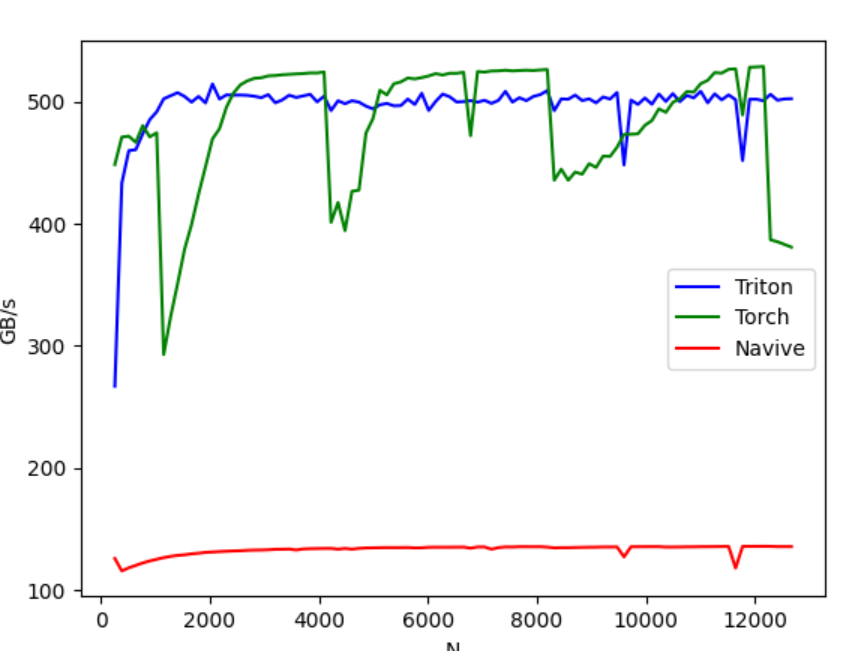

## Fused Softmax

fused softmax 在可以适应 GPU 静态随机存取存储器 (SRAM) 的行的情况下，比 PyTorch 的原生操作快得多。

### 1 naive softmax

```python
import torch
import triton
import triton.language as tl
from triton.runtime import driver

def naive_softmax(x):
    """
    使用原生 PyTorch 计算 X 的逐行 softmax
    减去最大元素以避免溢出。Softmax 对于这种偏移是不变的。
    """
    # 读取 MN 个元素；写入 M 个元素
    x_max = x.max(dim=1)[0]

    # 读取 MN + M 个元素；写入 MN 个元素
    z = x - x_max[:, None]

    # 读取 MN 个元素；写入 MN 个元素
    numerator = torch.exp(z)

    # 读取 MN 个元素；写入 M 个元素
    denominator = numerator.sum(dim=1)

    # 读取 MN + M 个元素；写入 MN 个元素
    ret = numerator / denominator[:, None]
    return ret
```

上面的 softmax 计算，$x \in \Bbb{R} ^{M \times N}$，一共需要从 DRAM 中读取 $5MN + 2M$ 个元素，写回 DRAM $3MN + 2M$ 个元素。存在大量的读写过程，资源浪费严重。

使用自定义的融合内核，期望只需要读取一次 X，并在芯片上进行所有必要的计算。这样做只需要读写 $MN$ 个元素，那么相比前面的`naive_softmax`可以有四倍的加速：$\frac{8MN + 4M}{2MN}$


### 2 fused softmax

softmax kernel 工作原理如下：每个程序加载输入矩阵 X 的一组行，按程序数量跨步处理，对其进行归一化，并将结果写回输出 Y。

考虑到 triton 要求每个 block 必须具有 2 的幂次数的元素，因此对于任意形状的输入，需要在 kernel 内部对每一行做填充处理，并适当保护内存操作，那么便有了下面的 kernel：

```python
@triton.jit
def softmax_kernel(output_ptr, input_ptr, input_row_stride, output_row_stride, n_rows, n_cols, BLOCK_SIZE: tl.constexpr,
                   num_stages: tl.constexpr):
    row_start = tl.program_id(0)
    row_step = tl.num_programs(0)
    for row_idx in tl.range(row_start, n_rows, row_step, num_stages=num_stages):

        # 步长表示我们需要对指针增加多少以推进 1 行
        row_start_ptr = input_ptr + row_idx * input_row_stride

        # 块大小是大于 n_cols 的下一个二的幂，因此需要做适配
        col_offsets = tl.arange(0, BLOCK_SIZE)
        input_ptrs = row_start_ptr + col_offsets

        # 将行加载到 SRAM 中，需要使用掩码，因为 BLOCK_SIZE 可能大于 n_cols，就是前面提到的对每一行做填充处理
        mask = col_offsets < n_cols
        row = tl.load(input_ptrs, mask=mask, other=-float('inf'))
        row_minus_max = row - tl.max(row, axis=0)

        # Triton 中的指数运算速度很快，但是是近似的
        numerator = tl.exp(row_minus_max)
        denominator = tl.sum(numerator, axis=0)
        softmax_output = numerator / denominator

        # 将输出写回 DRAM
        output_row_start_ptr = output_ptr + row_idx * output_row_stride
        output_ptrs = output_row_start_ptr + col_offsets
        tl.store(output_ptrs, softmax_output, mask=mask)
```

调用 kernel，为任何给定的输入张量建立内核及其（元）参数队列：

```python
device = torch.cuda.current_device()
properties = driver.active.utils.get_device_properties(device)
NUM_SM = properties["multiprocessor_count"]
NUM_REGS = properties["max_num_regs"]
SIZE_SMEM = properties["max_shared_mem"]
WARP_SIZE = properties["warpSize"]
target = triton.runtime.driver.active.get_current_target()
kernels = {}

def softmax(x):
    n_rows, n_cols = x.shape

    # 每次循环迭代的块大小是大于 `x` 列数的最小二的幂
    BLOCK_SIZE = triton.next_power_of_2(n_cols)

    # 可以通过增加每行分配的线程数来要求编译器使用更多的线程块 (`num_warps`)
    num_warps = 8

    # 软件流水线阶段的数量
    num_stages = 4 if SIZE_SMEM > 200000 else 2

    # 分配输出空间
    y = torch.empty_like(x)


    # 预编译内核以获取寄存器使用情况并计算线程占用情况。
    kernel, num_programs = kernels.get(BLOCK_SIZE, (None, 0))
    if kernel is None:
        kernel = softmax_kernel.warmup(y, x, x.stride(0), y.stride(0), n_rows, n_cols, BLOCK_SIZE=BLOCK_SIZE,
                                       num_stages=num_stages, num_warps=num_warps, grid=(1, ))
        kernel._init_handles()
        n_regs = kernel.n_regs
        size_smem = kernel.metadata.shared
        occupancy = NUM_REGS // (n_regs * WARP_SIZE * num_warps)
        occupancy = min(occupancy, SIZE_SMEM // size_smem)
        num_programs = NUM_SM * occupancy
        kernels[BLOCK_SIZE] = (kernel, num_programs)

    num_programs = min(num_programs, n_rows)
    kernel[(num_programs, 1, 1)](
        y,
        x,
        x.stride(0),
        y.stride(0),
        n_rows,
        n_cols,
    )
    return y
```


### 3 测试

这里比对`naive_softmax`, `torch.softmax`和`softmax_kernel`的性能。在行数固定为 4096行不变的条件下，在不同的 N 值的时候的性能。

```bash
@triton.testing.perf_report(
    triton.testing.Benchmark(
        x_names=['N'],  # 用作图表 x 轴的参数名
        x_vals=[128 * i for i in range(2, 100)],  # `x_name` 的不同可能值
        line_arg='provider',  # 参数名，其值对应于图表中不同线条
        line_vals=['triton', 'torch', 'navive_softmax'],  # `line_arg` 的可能值
        line_names=[
            "Triton",
            "Torch",
            "Navive"
        ],  # 线条的标签名称
        styles=[('blue', '-'), ('green', '-'), ('red', '-')],  # 线条的样式
        ylabel="GB/s",  # y 轴的标签名称
        plot_name="softmax-performance",  # 图表的名称，也用作保存图表的文件名
        args={'M': 4096},  # `x_names` 和 `y_name` 中未包含的函数参数的值
    ))
def benchmark(M, N, provider):
    x = torch.randn(M, N, device='cuda', dtype=torch.float32)
    stream = torch.cuda.Stream()
    torch.cuda.set_stream(stream)
    if provider == 'torch':
        ms = triton.testing.do_bench(lambda: torch.softmax(x, axis=-1))
    if provider == 'triton':
        ms = triton.testing.do_bench(lambda: softmax(x))
    if provider == 'navive_softmax':
        ms = triton.testing.do_bench(lambed: naive_softmax(x))
    gbps = lambda ms: 2 * x.nelement() * x.element_size() * 1e-9 / (ms * 1e-3)
    return gbps(ms)
benchmark.run(show_plots=True, print_data=True)
```

性能对比如下如图所示：



可以看到 triton 的性能大概是 naive softmax 的四倍左右，与前面的推断一致。
