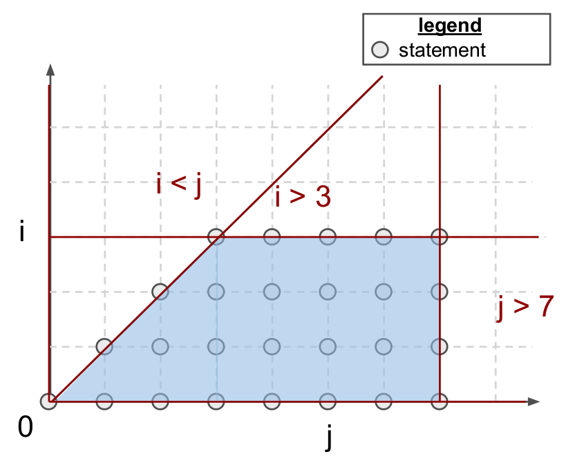

## 多面体编译与调度语言

### 1 多面体编译

传统编译器通常依赖于中间表征 (intermediate representations)。例如 LLVM-IR，它使用（无）条件分支来编码控制流信息。这种相对低阶的格式在静态分析输入程序的运行时行为（例如缓存未命中），通过使用 flatten，fuse，exchange 等技术自动优化循环会比较困难。

多面体编译器依赖于具有静态可预测控制流的程序表示，从而可以针对数据局部性和并行性的激进编译进行优化。

#### 1.1 程序表征

多面体编译专注于静态控制部分（SCoP），即包含条件语句和循环边界为环绕循环索引和全局不变参数的仿射函数的最大连续语句集合。这种格式的程序可以由仿射不等式来表示迭代域，即多面体形状的迭代域。

如下的代码表示的二维迭代域如下图的平面图形所示：

```python
for(int i = 0; i < 3; i++)
    for(int j = i; j < 7; j++)
        A[i][j] = 0;
```



这样的多面体也可以通过代数表示：

$$
\it{P} = \{ i, j \in \Bbb{Z}^2 | \left( \begin{matrix} 
1 & 0 \\
-1 & 0 \\
-1 & 1 \\
0 & -1 \\
\end{matrix} \right)
\left( \begin{matrix} 
i \\
j \\
\end{matrix} \right)
+
\left( \begin{matrix} 
0 \\
2 \\
0 \\
4 \\
\end{matrix}
\right) \ge 0 \}
$$

每个点 `(i, j)`在`P`中代表一个多面体语句，即一个程序语句。多面体语句不引起控制流副作用（例如 for、if、break），且仅包含循环索引和数组访问中的仿射函数的全局参数。为了便于别名分析，数组访问被数学抽象化，使用所谓的访问函数，即`A[i] [j]` 是 `A[f(i,j)]`，其中访问函数 `f` 定义为：

$$
f(i, j) = \left( \begin{matrix} 
1 & 0 \\
0 & 1 \\
\end{matrix} \right)
\left( \begin{matrix} 
i \\
j \\
\end{matrix} \right)
= (i, j)
$$


SCoP 的迭代域不指定其语句执行的顺序。事实上，这个迭代域可以以许多不同的合法顺序进行遍历，即**调度**。形式上，调度被定义为 p 维仿射变换 $\Theta$ ，其循环索引 $\mathbf{x}$ 和全局不变参数 $\mathbf{g}$ 满足：

$$
\Theta _S (\mathbf{x}) = T_S \left( \begin{matrix} 
\vec{x} \\
\vec{g} \\
\end{matrix} \right) T_S ^{\mathrm T}
\in \Bbb{Z}^{P \times (dim(\mathbf{x}) + dim(\mathbf{g}) + 1)}
$$

其中 $\Theta _S (\mathbf{x})$ 是一个 P 维向量，表示在遍历 S 周围的循环嵌套时，从最慢增长到最快增长的索引（从左到右）。对于上述代码，通过使用 C 中循环嵌套定义的原始调度可以检索到：

$$
\Theta _S (\mathbf{x}) = \left( \begin{matrix}
1 & 0 \\
0 & 1 \\
\end{matrix}
\right)
\begin{pmatrix}i & j\end{pmatrix}^T=T_S ^{\mathrm T}
$$

其中 i 和 j 分别是嵌套中最慢和最快增长的循环索引。如果 T_S 是一个向量（或张量），那么  $\Theta _S (\mathbf{x})$ 是一个 P 维向量。

#### 1.2 多面体编译的优势和局限性

* **优势**

适合多面体编译的程序可以进行激进的转换和优化。这些转换实际上大多数可以归结为生成能够促进并行性和空间/时间数据局部性的调度和迭代域（例如融合、交换、平铺、并行化）。

多面体编译器还可以自动通过复杂的验证过程来确保其输入程序的语义在优化阶段保持不变。多面体优化器并不与更标准的优化技术冲突。事实上，这些系统通常被实现为一组可以在传统编译技术之前运行的 LLVM pipeline。

总之，多面体编译在使用的时候非常强大，已经证明支持大多数常见的循环转换，并且实际上已经实现了与用于稠密矩阵乘法的最先进 GPU 库相媲美的性能。此外，它是完全自动的，不需要程序员在除了 C 类似格式的源代码外提供任何提示。


* **局限**

多面体编译器主要存在两个局限性：

* 首先，可能的程序转换集合 $\Omega = \{ \Theta _S | S \in program \}$ 很大，并随着程序中语句数量以及它们迭代域的大小而增长。验证每个转换的合法性可能需要解决复杂的整数线性规划问题，这使得多面体编译非常计算密集。此外，硬件属性（如缓存大小、SM 数量）和上下文特征（如输入张量 shape）也必须被此框架考虑，导致自动调优过程成本巨大。

* 其次，多面体框架的适用性不是很广泛；在静态控制流图 (SCoPs) 相对常见，但要求循环边界和数组下标是循环索引的仿射函数，这通常仅在正则、密集计算中发生。最近几年，神经网络越来越火热，因此很有必要将其应用到稀疏甚至结构稀疏的神经网络中。


### 2 调度语言

**分离关注点** (Separation of concerns)是计算机科学中一个众所周知的设计原则：**程序应该被分解成模块化的抽象层次，将算法的语义与实现的细节分离开**。Halide 和 TVM 这样的系统更进一步，通过使用调度语言在语法级别强制执行此分离。这种方法的好处在矩阵乘法的情况下特别明显，如下所示，算法的定义（第 1-7 行）与其实现（第 8-16 行）完全不同，这意味着两者可以独立维护、优化和分发。

```cpp
// algorithm
Var x("x"), y("y");
Func matmul("matmul");
RDom k(0, matrix_size);
RVar ki;
matmul(x, y) = 0.0f;
matmul(x, y) += A(k, y) * B(x, k);
// schedule
Var xi("xi"), xo("xo"), yo("yo"), yi("yo"), yii("yii"), xii("xii");
matmul.vectorize(x, 8);
matmul.update(0)
    .split(x, x, xi, block_size).split(xi, xi, xii, 8)
    .split(y, y, yi, block_size).split(yi, yi, yii, 4)
    .split(k, k, ki, block_size)
    .reorder(xii, yii, xi, ki, yi, k, x, y)
    .parallel(y).vectorize(xii).unroll(xi).unroll(yii);
```

但是，生成的代码可能并非完全可移植，因为调度有时可能依赖于执行模型（例如 SPMD ）或硬件指令（例如矩阵乘累加），这些在广泛可用性方面并不普遍。自动调度机制可以缓解这个问题。


* **优势**

这种方法的主要优势在于，它允许程序员仅编写一次算法，并专注于性能优化，可以手动指定优化。而多面体编译器无法通过静态数据流分析自动找出这些优化方法。

调度语言是神经网络代码生成中最受欢迎的方法之一。


* **局限**

* 首先，遵循这一范例的现有系统在适用时（例如 V100/A100 张量核心与相等块大小）通常比 Triton 在现代硬件上慢得多。在某种程度上，可能可以通过更多的努力解决，但这可能意味着这些系统更难工程化。

* 更重要的是，现有的调度语言生成的循环其界限和增量不能依赖于周围循环索引，对可能的调度施加严格约束，甚至可能会破坏系统。这个问题在稀疏计算中尤为明显，其迭代空间可能是不规则的。
