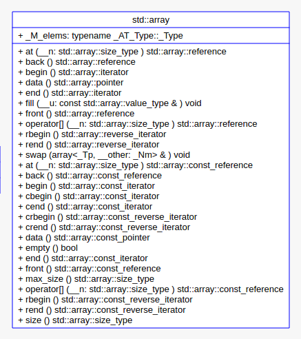

# STL

C++ 标准模板库（Standard Template Library，STL）是一套功能强大的 C++ 模板类和函数的集合，它提供了一系列通用的、可复用的算法和数据结构。

STL 的设计基于泛型编程，使用模板编写出的独立于任何特定数据类型的代码。STL 分为多个组件，包括容器（Containers）、迭代器（Iterators）、算法（Algorithms）、函数对象（Function Objects）和适配器（Adapters）等。

C++ 标准模板库的核心包括以下重要组件组件：

|组件|描述|
|---|---|
|容器（Containers）|容器是 STL 中最基本的组件之一，提供了各种数据结构，包括向量（vector）、链表（list）、队列（queue）、栈（stack）、集合（set）、映射（map）等。这些容器具有不同的特性和用途，可以根据实际需求选择合适的容器。|
|算法（Algorithms）|STL 提供了大量的算法，用于对容器中的元素进行各种操作，包括排序、搜索、复制、移动、变换等。这些算法在使用时不需要关心容器的具体类型，只需要指定要操作的范围即可。|
|迭代器（iterators）|迭代器用于遍历容器中的元素，允许以统一的方式访问容器中的元素，而不用关心容器的内部实现细节。STL 提供了多种类型的迭代器，包括随机访问迭代器、双向迭代器、前向迭代器和输入输出迭代器等。|
|函数对象（Function Objects）|函数对象是可以像函数一样调用的对象，可以用于算法中的各种操作。STL 提供了多种函数对象，包括一元函数对象、二元函数对象、谓词等，可以满足不同的需求。|
|适配器（Adapters）|适配器用于将一种容器或迭代器适配成另一种容器或迭代器，以满足特定的需求。STL 提供了多种适配器，包括栈适配器（stack adapter）、队列适配器（queue adapter）和优先队列适配器（priority queue adapter）等。|


**容器**

容器是用来存储数据的序列，它们提供了不同的存储方式和访问模式。

STL 中的容器可以分为三类：

* 序列容器：存储元素的序列，允许双向遍历。
    * `std::vector`, 动态数组，支持快速随机访问。
    * `std::deque`, 双端队列，支持快速插入和删除。
    * `std::list`, 链表，支持快速插入和删除，但不支持随机访问。

* 关联容器：存储键值对，每个元素都有一个键（key）和一个值（value），并且通过键来组织元素
    * `std::set`, 集合，不允许重复元素
    * `std::multiset`, 多重集合，允许多个元素具有相同的键。
    * `std::map`, 映射，每个键映射到一个值
    * `std::multimap`, 多重映射，存储了键值对（pair），其中键是唯一的，但值可以重复，允许一个键映射到多个值

* 无序容器（C++11 引入）：哈希表，支持快速的查找、插入和删除
    * `std::unordered_set`, 无序集合
    * `std::unordered_multiset`, 无序多重集合
    * `std::unordered_map`, 无序映射
    * `std::unordered_multimap`, 无序多重映射

```cpp
#include <iostream>
#include <vector>

using namespace std;

int main() {
    vector<int> vec;

    // 显示 vec 的原始大小
    cout << "vector size = " << vec.size() << endl;

    for (int i = 0; i < 5; i++) {
        vec.push_back(i);
    }

    // 显示 vec 扩展后的大小
    cout << "extended vector size = " << vec.size() << endl;

    // 访问向量中的 5 个值
   for(int i = 0; i < 5; i++) {
        cout << "value of vec [" << i << "] = " << vec[i] << endl;
   }

   // 使用迭代器 iterator 访问值
   vector<int>::iterator v = vec.begin();
   while (v != vec.end()) {
        cout << "Value of v: " << *v << endl;
        v++;
   }

    // 观察 vector 扩容过程
    vector<int> a;
    for(int i = 0; i < 20; i++) {
        std::cout << "Element number: " << a.size() << ", vector size: " << a.capacity() << endl;
        a.push_back(i);
    }

   return 0;
}
```

```bash
vector size = 0
extended vector size = 5
value of vec [0] = 0
value of vec [1] = 1
value of vec [2] = 2
value of vec [3] = 3
value of vec [4] = 4
Value of v: 0
Value of v: 1
Value of v: 2
Value of v: 3
Value of v: 4
Element number: 0, vector size: 0
Element number: 1, vector size: 1
Element number: 2, vector size: 2
Element number: 3, vector size: 4
Element number: 4, vector size: 4
Element number: 5, vector size: 8
Element number: 6, vector size: 8
Element number: 7, vector size: 8
Element number: 8, vector size: 8
Element number: 9, vector size: 16
Element number: 10, vector size: 16
Element number: 11, vector size: 16
Element number: 12, vector size: 16
Element number: 13, vector size: 16
Element number: 14, vector size: 16
Element number: 15, vector size: 16
Element number: 16, vector size: 16
Element number: 17, vector size: 32
Element number: 18, vector size: 32
Element number: 19, vector size: 32
```


说明：

* size( ) 函数显示向量的大小，即 vector 包含的元素的数量
* capacity() 函数显示为 vector 预分配的内存的大小（能够容纳的元素的数量）
* begin( ) 函数返回一个指向向量开头的迭代器。
* end( ) 函数返回一个指向向量末尾的迭代器

从上面的输出可以看出，vector 在预分配内存占满的时候，会自动扩容，这里的扩容策略是翻倍。


## 1 `tr1`与`std array`

本节内容基于 gcc-4.9.1。


### 1.1 `std::tr1::array`

C++ tr1 全称 Technical Report 1，是针对 C++ 标准库的第一次扩展。C++ 标准 c++0x 会包括它，以及一些语言本身的扩充。tr1 包括了 `smart pointer`，正则表达式以及其他一些支持范型编程的内容。新增的类和模板的名字空间是`std::tr1`。

`std::tr1::array` 使用：

```cpp
#include <tr1/array>
std::tr1::array<int, 10> a;
```

tr1中的array比较简单，模拟语言本身的数组，并且让其支持迭代器操作，使其同其他容器一样，能够调用算法。tr1中array没有构造与析构。迭代器是直接使用传递进来的类型定义指针。

静态数组`array`源码：

```cpp
template<typename _Tp, std::size_t _Nm>
struct array {
    typedef _Tp value_type;
    typedef value_type& reference;
    typedef const value_type const_reference;
    typedef value_type* iterator;
    typedef const value_type* const_iterator;
    typedef std::size_t size_type;
    typedef std::ptrdiff_t difference_type;
    typedef std::reverse_iterator<iterator> reverse_iterator;
    typedef std::reverse_iterator<const_iterator> const_reverse_iterator;
}
```

使用`reverse_iterator`作为`rbegin`与`rend`操作的迭代器。上面定义了一个 reverse_iterator，实际上还有一个iterator,这个直接使用传递进来的类型定义指针，作为迭代器。

在`tr1::array`中，支持传递数组大小为 0，

```cpp
std::tr1::array<int, 0> b;
```

对于这样的写法，会对下面的实现：

```cpp
// Support for zero-sized arrays mandatory.
value_type _M_instance[_Nm ? _Nm : 1];
```

根据传递进来的大小，如果不为0，就是传递进来的大小，否则为1。这里大小为 0  的数组的真实大小是1。


### 1.2 `std::array`

使用:

```cpp
std::array<int, 10> a;
```

std 中的 array 包含了:



std 的 array：

```cpp
template<typename _Tp, std::size_t _Nm>
struct array
{
    typedef _Tp 	    			      value_type;
    typedef value_type*			      pointer;
    typedef const value_type*                       const_pointer;
    typedef value_type&                   	      reference;
    typedef const value_type&             	      const_reference;
    typedef value_type*          		      iterator;
    typedef const value_type*			      const_iterator;
    typedef std::size_t                    	      size_type;
    typedef std::ptrdiff_t                   	      difference_type;
    typedef std::reverse_iterator<iterator>	      reverse_iterator;
    typedef std::reverse_iterator<const_iterator>   const_reverse_iterator;

    // Support for zero-sized arrays mandatory.
    typedef _GLIBCXX_STD_C::__array_traits<_Tp, _Nm> _AT_Type;    // # define _GLIBCXX_STD_C std
    typename _AT_Type::_Type                         _M_elems;
}
```

相比 tr1，std::array 里面的：

```cpp
// Support for zero-sized arrays mandatory.
typedef _GLIBCXX_STD_C::__array_traits<_Tp, _Nm> _AT_Type;    // # define _GLIBCXX_STD_C std
typename _AT_Type::_Type                         _M_elems;
```

在源码中找到`__array_traits`，

```cpp
template<typename _Tp, std::size_t _Nm>
struct __array_traits
{
    typedef _Tp _Type[_Nm];

    static constexpr _Tp&
    _S_ref(const _Type& __t, std::size_t __n) noexcept
    { return const_cast<_Tp&>(__t[__n]); }
};
```

那么相比 tr1，std::array 里面的那两行可以看做：

```cpp
typedef _Tp _Type[_Nm];
typedef _Type _M_elems;  // 一个含有 _Nm 个元素的数组
```

实际使用：

```cpp
int a[100];

// 或者
typedef int T[100];
typedef T a;
```


针对传进来的`size`，相比于 tr1，std::array 更加复杂，使用了模板偏特化来处理传递 size 为 0 情况。

```cpp
template<typename _Tp, std::size_t _Nm>
struct __array_traits
{
    typedef _Tp _Type[_Nm];

    static constexpr _Tp&
    _S_ref(const _Type& __t, std::size_t __n) noexcept
    { return const_cast<_Tp&>(__t[__n]); }
};

template<typename _Tp>
struct __array_traits<_Tp, 0>
{
    struct _Type { };

    static constexpr _Tp&
    _S_ref(const _Type&, std::size_t) noexcept
    { return *static_cast<_Tp*>(nullptr); }
};
```

